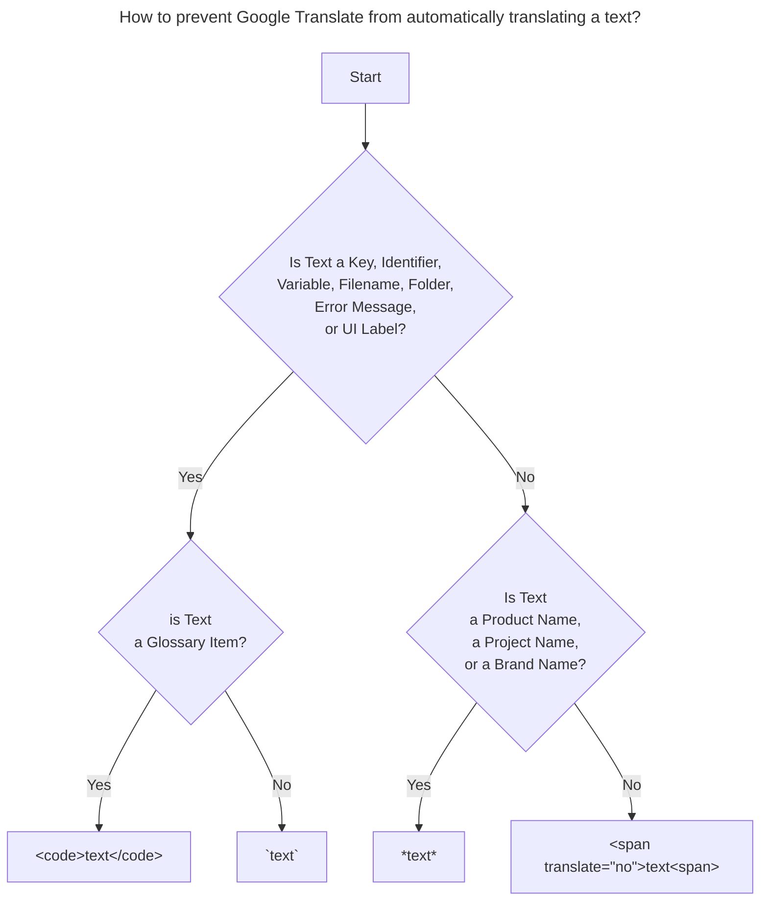
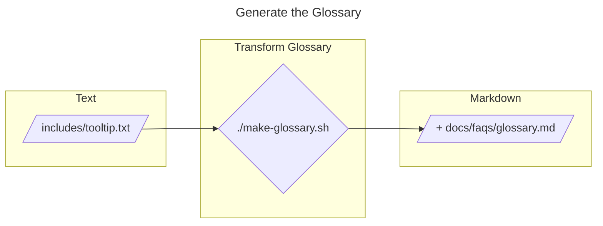

# Loop Docs

## Presentation

📚You can view the published version of [Loop Docs here](https://loopkit.github.io/loopdocs). 

This repository contains the source files for [Loop's](https://github.com/LoopKit/Loop) documentation.

*LoopDocs* focuses on documenting the latest release and the `dev` branch:
- [What is Loop?](https://loopkit.github.io/loopdocs/#what-is-loop)
    > The *Loop* iOS app is a Do-It-Yourself closed-loop algorithm.  
    > It works together with your CGM, Pump, (and Radio-link device) to manage your insulin delivery by predicting Blood Glucose outcomes.
- [Overview](https://loopkit.github.io/loopdocs/intro/overview-intro/)
- [**Requirements**](https://loopkit.github.io/loopdocs/intro/requirements/)
- [Build Loop](https://loopkit.github.io/loopdocs/intro/requirements/#two-loop-build-methods)
- [Configuration](https://loopkit.github.io/loopdocs/loop-3/loop-3-overview/)
- [Usage](https://loopkit.github.io/loopdocs/operation/loop/open-loop/)
- [Troubleshooting](https://loopkit.github.io/loopdocs/troubleshooting/overview/)
- Remote monitoring and commands with [*Nightscout*](https://loopkit.github.io/loopdocs/nightscout/overview/)
- [FAQs](https://loopkit.github.io/loopdocs/faqs/overview-faqs/)


## Contributing

The easy way:

* To suggest changes, please review [Issues](https://github.com/LoopKit/loopdocs/issues).  Add your comment if an Issue is already open, otherwise, add a new Issue.
* If it is a simple typo or wording change, follow the instructions in this video to submit a *pull request* the easy way.
  * [How to submit a LoopDocs Pull Request?](https://youtu.be/6qSppvgGxpg)

If it is a more substantive change and you want to [install LoopDocs locally](#install) and provide pull requests, please keep reading.


## Install

- [Clone](https://docs.github.com/en/repositories/creating-and-managing-repositories/cloning-a-repository) this project
- Install *Python*  3
  Review [Properly Installing Python](http://docs.python-guide.org/en/latest/starting/installation/) for help getting *Python* installed.
- Install Python Virtual Environment.  
  In this example, I use [`venv`](https://realpython.com/python-virtual-environments-a-primer/#how-can-you-work-with-a-python-virtual-environment), but use whichever you prefer.  
  ```shell
  cd loopdocs # cd into the folder where you cloned this repository
  
  # Creates a virtual environment using Python 3 in the venv folder  
  python3 -m venv venv 

  # Activate the virtual environment
  # Run the next line **each time** you start a new shell window/tab
  source venv/bin/activate
  ```
- Install the project's required *Python* packages
  ```shell
  cd loopdocs # Make sure you are in the folder where you cloned this repository

  python -m pip install -r requirements.txt  
  ```

## Run

Once [installed](#install), you can preview the doc locally as you edit.

### Preview Changes

#### Preview Changes Locally

To preview your work as you edit:

- Run **`mkdocs serve`** locally and keep it running:
  ```shell
  cd loopdocs # the folder where you cloned this repository
  mkdocs serve
  ```
    By default, this runs a local web server that hosts the documentation at http://127.0.0.1:8000/ .
* Preview docs in your Web browser.  
  Most changes will update automatically as you edit.  
  Configuration and navigation changes will require restarting `mkdocs serve`.

#### Preview Changes with GitHub Pages

In this section we use `deploy` or `publish` interchangeably.

**What** is GitHub Pages?  
> **GitHub Pages** is a static site hosting service provided by GitHub that allows users to publish web pages directly from their GitHub repositories.
> It utilizes the repository content to automatically generate and serve web pages.

It is disabled by default and can be enabled per repository.

**How** does it work?  
> Whenever `gh-pages`branch is pushed to your repository, *GitHub Pages* will automatically deploy it to your personal GitHub website:  
     `https://YOUR_GITHUB_USERNAME_HERE.github.io/loopdocs`

**Use** GitHub Pages to share a preview of `loopdocs`:   
You can share the preview with others by building the site from your working branch and uploading the result to the `gh-pages` branch of your GitHub repository. Here is how:

1. Configure [GitHub Pages](#configure-github-pages) **once** (See next section)
2. Jump on the branch you want to share for preview
    ```shell
    git switch my_branch
    ```
1. Deploy this branch to your personal GitHub website so that others can take a look at:
    ```shell
    mkdocs gh-deploy
    ```

**Issue:**  
ℹ️ If you have deployed your current branch with `mkdocs gh-deploy` and then pushed  `main` to the repository, this will automatically deploy `main` and override your previous deployment.
The reason is simple, *Loopdocs* also has a [*GitHub Action*](.github/workflows/publish.yml) that automatically builds and deploys the documentation every time the `main` branch is pushed to the repository.   
The workaround is to redeploy your branch for preview with `mkdocs gh-deploy`.

❗️ Remember to disable *GitHub Pages* in your repository settings when you are done sharing.

#### Configure GitHub Pages

Open **your** **`loopdocs` repository** on Github: `https://github.com/YOUR_GITHUB_USERNAME_HERE/loopdocs`

1. Click  the ⚙️ **`"Settings"`** tab (last one on the right)
2. Click **`Pages`** located under the `Code and Automation` section
3. In the **`Source`** field, select **`Deploy from a Branch`** 
4. **First** drop-down under the **`Branch`** section: Select  **`gh-pages`**
5. **Second** drop-down: Select **`"/(root)"`**
6. Click **`Save`** 

>    


### Find Broken Links

To list broken links, we use the [`mkdocs-htmlproofer-plugin`](https://github.com/manuzhang/mkdocs-htmlproofer-plugin):

```shell
CHECK_BROKEN_LINKS=true mkdocs build
```

### Find Unused Files

To find unused (orphaned) files in the project, we use the [`mkdocs-unused-files`](https://github.com/wilhelmer/mkdocs-unused-files) plugin:

```shell
CHECK_UNUSED_FILES=true mkdocs build
```

## Conventions

### Automatic Translation

We use *Google Translate* to automatically [translate the website](https://loopkit.github.io/loopdocs/translate/) into several foreign languages.  
For the translation to be as correct as possible we need to give *Google Translate*  as much **context** as possible.  
*Google Translate*'s automatic translation is not perfect although it does a pretty good job. 

There are still some **issues**, where text is translated whereas it should not, like for instance:
- **key**, **constant**, **identifier**, **filename**, **folder**
- user interface element like a **button label**, **field name**, **menu item**...
- **error message** that should remain in English and not be translated
- **brand name**, **project/product name**, 

To improve the automatic translation quality, please follow these rules when writing or updating the documentation. This will provide *Google Translate* with more context and enhance translation accuracy.

#### Suggestions

Updates to Eric's suggestions (from Marion)

Really - just saying the same thing in different words.

Revise the Nav labels (in mkdocs.yml) and the headers on the pages to remove words that require the no-translate tag wherever possible.

When you have to use "proper terminology" like `fork`, be sure to use a no-translate tag. When possible, substitute a word that will translate. For example, make a `copy` of the code. You can use app instead of *Loop* in many instances.

Don't get carried away with putting no-translate tags everywhere. The app itself has translations of strings included. Forcing `Dosing Strategy` to not be translated is not necessary. The google translate might not match what is in the app, but forcing the English is not helpful either.

To prevent translation without modification of the font for the word or phrase use `<span translate="no">` before and `</span>` after the word or phrase that should not be translated. Using `span` is preferred when you do not want to modify the appearance of the word or phrase. If there are spaces before or after the word or phrase, use `&nbsp;` instead of a space. The use of `span` or `code` or italics (by placing an underscore or asterisk before and after the word) prevents translation **and** enables tooltips to still be displayed. The use of back-ticks does not allow tooltips to be displayed.

* span: no font change, tooltips display
* italics: italic font, tooltips display
* code: highlighted display, tooltips display
* backticks: highlighted display, tooltips not seen
* bold: this does not force a no-translate and can be used in addition to the other marks

New trick for dealing with variables, where appropriate, is to use `$\mathit{variable-name}\$` which displays the variable-name in italics without translation and makes it clear that it is a variable.

When it is desired that the word or phrase stand out as highlighted on the page, then use back ticks or `<code> </code>` instead of `span`. You might want to add the `&nbsp;` see examples below, however, this may be less of an issue because the word or phrase is highlighted on the screen and clearly differentiated from words on either side.

If "jargon" must be used in a header, be sure to use some kind of no-translate tag or it is likely to be translated to something unexpected.

Example usage below for  `&nbsp;`:

```
<span translate="no">Word or Phrase</span>&nbsp;is in the beginning of this sentence.
```
```
This is in the middle of a sentence that includes&nbsp;<span translate="no">Word or Phrase</span>&nbsp;in it.
```
```
If the word is at the end of a line or has other punctuation, the `&nbsp;` can be skipped:

### All about&nbsp;<span translate="no">Word</span>

This ability to build&nbsp;<span translate="no">Loop</span> from either a browser or using a *Mac* is wonderful.
```

Be warned that if `&nbsp;` is part of the text in a header, the automatic link doesn't acknowledge the space. The link above would be `#all-aboutword`, not `#all-about-word`.

If you want italic font with `span`, I choose to use underscore instead of asterick to make the word show up as italic font because I think that helps with clarity (opinion only):
```
This ability to build&nbsp;_<span translate="no">Loop</span>_, from both a browser and with *Mac*, is wonderful.
```


These words / phrases **do not need** no-translate tags, however, they are typically rendered in italics (use astericks on either side):

* Xcode
* *Mac*
* *GitHub*
* *TestFlight*
* *Apple*

Look out for Loop showing up as buckle, at least in French and Spanish, in translations. That indicates `span` must be used, with the `&nbsp;` required if there is no punctuation mark. Once again, using underscore instead of asterisk in concert with `span` is a preference:

```
&nbsp;_<span translate="no">Loop</span>_&nbsp;
```

The no-translate tags can be avoided if used in a phrase:
* the *Loop* app

Common words like `Secrets` that will show up on `GitHub` for Building with Browser should be enclosed in `code` so tooltips will work and the word will be highlighted as important.

From Eric (his rules before Marion made comments above)

To prevent *Google Translate* from translating specific `text` items, we can mark them accordingly:
The conditional text transformation rules are expressed in two forms, pseudo-code first followed by a visual diagram.

Here is the **pseudo-code** version of the rules:
- If `text` is a key, identifier, variable name, filename, folder, UI element (like the label of a button, a menu item), or an error message
    - If `text` is a glossary item (with a tooltip)
        - Surround `text` with `<code>` HTML tag, like so: `<code>text</code>`
    - Else (not a glossary item, ie. no tooltip)
        - Surround `text` with back-ticks like so: `` `text` ``
- Else (not an Entity)
    - If `text` is a product name or project name or brand name
        - surround it with a single `*` or `_`, like so: `` *text* ``
    - Else (not a product/project/brand name)
        - surround it with: `<span translate="no">text</span>`
    
    👀 Now the **flowchart diagram** that illustrates the above pseudo-code:



If the automatic translation is still incorrect after applying these rules, [read this](#when-rules-fail).

Now let's break down each step.

#####  Entity

Enclose each of the following `text` types with a **backtick** `` ` ``:
- Key
- Identifier
- Variable
- UI Element (button label, menu item...)
- Filename
- Folder
- English-only Error Message

We denote these using the generic term *entity*.

**Examples**:

Text Type     | Markdown Input                  | Rendered Output
---           |---                              |---
Key           | Regenerate GitHub Token for `` `GH_PAT` ``<br/><br/> `<code>TEAMID</code>` is a glossary item  | Regenerate GitHub Token for `GH_PAT`<br/><br/> <code>TEAMID</code> is a glossary item 
Identifier    | `` `com.1234567890.loopkit.Loop` `` | `com.1234567890.loopkit.Loop`
Variable      | `` `timeSinceLastLoop` ``          | `timeSinceLastLoop` 
Button Label  | ``Press `Click` ``                | Press `Click`
Menu item     | ``Select `Dexcom G6` ``            | Select `Dexcom G6`
Field Name    | Paste it in the `` `Secret` `` field  | Paste it in the `Secret` field
Filename      |  `` `BolusViewController.swift` ``  |  `BolusViewController.swift`
Folder        | `` `Loop/View Controllers` ``      | `Loop/View Controllers`
Error Message | `` `invalid curve name` ``         | `invalid curve name`

⚠️ **Exceptions**: **Do not use single backticks** in the following cases :
1. If `text` already exists **in a code block** delimited by 3 backticks.
  ````
  ```
  let timeSinceLastLoop
  ```
  ````
2. If `text` is a **glossary item**, using backticks would prevent the glossary tooltip from appearing. 
    Instead, enclose it with a `<code>` tag, like so: `<code>text</code>`.  

If the `text` that you do not want to translate is not an [Entity](#entity), read on.

##### Name

To prevent a name from being automatically translated, such as a **product** name, **project** name, or **brand** name, use emphasis (aka. italic) by surrounding `name` with a star (`*`) or an underscore (`_`), like so: **`*name*`**.

**Examples**:

Name | Markdown Input | Rendered Output 
---          |---                               |---
Project Name | The `*Loop*` pill                 | The *Loop* pill
Product Name | require a `*RileyLink*` compatible device [...]<br/>Visit `*Nightscout*` documentation [...]<br/> using `*Omnipod DASH*` [...]<br/>the `*Tidepool Mobile*` uploader [...]| require a *RileyLink* compatible device [...]<br/>Visit *Nighscout* documentation [...]<br/>using *Omnipod DASH* [...]<br/>the *Tidepool Mobile* uploader [...]
Brand Name   | on some `*Medtronic*` pumps          | on some *Medtronic* pumps

If the `text` you do not want to translate is neither an [Entity](#entity) nor a [Name](#name), read on.

##### Generic

To prevent a `text` that is neither an [Entity](#entity) nor a [Name](#name) from being automatically translated by Google Translate, surround it with a `<span>` with  the `translate` attribute set to `no`, like so:

```markdown
<span translate="no">text</span>
```

⚠️ Do not apply this workaround without considering the above options (entity and name) first as it has a drawback. 
When using the `<span translate="no">` element, make sure to review the translated output to ensure it retains the correct context and formatting.  
You can also refer to the above flowchart diagram for a visual representation of the conditional text transformation rules.

#### When Rules Fail

Using `<span translate="no">text</span>`, backticks (`` `text` ``) or code (`<code>text</code>`) has a drawback and does not work every time.  
The automatic translation splits the sentence into 2 parts, one before and one after the non translated text, and can sometimes:
-  get confused by this and treat them as 2 separate sentences to be translated independently.  
- remove spaces around the untranslated `text`, (remember it no longer exists from *Google Translate* point of view)

💡Here are some possible **workarounds**:

- **Rewrite the sentence** slightly, such as moving the `text` to the left or right end of the sentence.   
    > ❌ **Incorrect Translation**:    "The graphic below has `Show Prediction` turned off for Timeline"  
    > ✅ **Improved Translation**: "`Show Prediction` for Timeline is turned off in the graphic below." 

  Moving the untranslated text `Show Prediction` to the beginning of the sentence improves the translation in this case.
- If the ***text* and surrounding words form a whole** that is not reflected in the automatic translation, wrap them in a `<span>` tag. This will prevent Google Translate from separating them (without preventing the translation).  
  If the sentence is too short or does not provide enough context, *Google Translate* may get "lost" and decide to move the untranslated text to a place that makes absolutely no sense, such as  the end of the sentence.  
  This is not a golden rule, of course.
  ⚠️ Do not apply this blindly and systematically, because all depends on the context, so first look at the translation to apply it only where needed.
  
  Here is an **example** where it proved to be useful. We are materializing the fact that the words `loop` and `runs` are related.
  > ❌ **Incorrect Translation**: `it is tied to *Loop* runs and *Nightscout* upload events`  
  > ✅ **Improved Translation**: `it is tied to <span>*Loop* runs</span>` and *Nightscout* upload events`
- **Break a complex  sentence into** several **simpler sentences**.  
  You can use this if the previous approaches did not work.
- Add an **unbreakable space** (`&nbsp;`) **before and/or after the `text`** to compensate for the missing spaces around the `text` that *Google Translate* removes from the translation.
  If the untranslated `text` is preceded and/or followed by other words, those spaces will be removed them from the translation. Remember, untranslated text is treated as  non-existent!
    > ❌ **Incorrect Translation**:  `*<span translate="no">Loop 3</span>* or newer`  
    > ✅ **Improved Translation** `*<span translate="no">Loop 3</span>*&nbsp; or newer`
- Replace **possessive apostrophe** (**`'s`**) with the equivalent HTML entity **(`&#39;s`)**.  
    For example, to prevent the automatic translation of `Tidepool` followed by a possessive apostrophe, as in this sentence, where `Tidepool` is not translated, but the rest of the text, including the possessive apostrophe, is.    
    > ❌ **Incorrect Translation**:  `To use Tidepool's services`  
    > ✅ **Improved Translation** `To use Tidepool&#39;s services`

Finding the best approach, the one that works, requires trial and error.

These rules to improve automatic translation with Google Translate comes with pluses and minuses:
- Drawbacks: 
    - Markdown is a bit less readable and more sprinkled with *HTML*.
    - Need to [deploy the branch](#preview-changes-with-github-pages) to a to a **public** website visible to [Google Translate](https://translate.google.com)
- Pluses: 
    - One single source and many potential translations

### Links

Links should be written like this:

```markdown
In the same directory: Click here for [Update FAQs](update-faqs.md)

In a directory below the current page: Click here for [Update FAQs](faqs/update-faqs.md)

In a directory "outside" the current directory: Click here for [Update FAQs](../faqs/update-faqs.md)

Like above, but linking directly to a heading/anchor in update-faqs.md:

Click here for [When Should You Update?](../faqs/update-faqs.md#when-should-you-update)

```

❗️Make **external links open in a new window** by appending the `{: target="_blank" }` suffix to the markdown link, like this

```markdown
[LoopTips](https://loopkit.github.io/looptips){: target="_blank" }
```

ℹ️ Note:
- There is **no space** in between the link and `{: target="_blank" }`. 
- An *external link* means a link to another website (i.e. not LoopDocs).

ℹ️ **Notice about mkdocs**

> Using absolute paths with links is not officially supported.  
> Relative paths are adjusted by MkDocs to ensure they are always relative to the page.
> Absolute paths are not modified at all.  
> This means that your links using absolute paths might work fine in your local environment but they might break once you deploy them to your production server.


```markdown
⛔️ Do NOT use a link that starts with a '/': Click here for [Update FAQs](/faqs/update-faqs.md)
```

### Images

The conventions for linking to images are the same as linking to pages as described above.

New images should be placed in the `img` directory just below the Markdown file.

An example of a correct link to an image is `[alt-text](relative_path_to/image_name)`.

```markdown

```

With images, it is possible to add extra attributes like `width` and `center`.

#### Image Width

```markdown
{width="300"}
```
ℹ️ Note that there is no space between the closing parenthesis (`)`) of the link and the opening curly brace (`{`).  This way, the width is applied to the element to which it is attached.

This will get rendered to this: 
```html

```

#### Center an Image

You can also center an image, by adding `{align="center"}` **on a new line**
just **below** the paragraph you want to center:

```markdown
{width="750"}
{align="center"}
```
ℹ️ Note that there is no empty/blank line between the image and `{align="center"}`.

This will get rendered to this:

```html
<p align="center">
    
</p>
```

#### Images in Tables

Use HTML on the first line that indicates the table.  
For example, in [displays-v3.md](https://loopkit.github.io/loopdocs/loop-3/displays-v3/#loop-cycle) there are many icons with descriptions to the right.
This format provides appropriate views on both desktop and mobile.

For **no header row**, replace `|||` with:

```markdown
| <div style="width:72px"></div> |                        |
|---                             |---                     |
|      | image description here |
```

To **add a header row**, use:
```markdown
| <div style="width:72px">Column 1 Header</div> | Column 2 Header |
```

### Admonitions

#### Definition

> **Admonitions**, also known as _call-outs_, are an excellent choice for including side content without significantly interrupting the document flow.

TLDR; An admonition is a colored box with a specific icon (and a  title) at the top and text content below.

[Admonition](https://python-markdown.github.io/extensions/admonition/) is a markdown extension that enables formatted blocks for visually calling out information.  

#### Admonition Types

Now using the standard set of [admonitions](https://squidfunk.github.io/mkdocs-material/reference/admonitions/) and CSS styles that come with the Material theme.

The following are the admonition **types** we use:
- [`info`](https://squidfunk.github.io/mkdocs-material/reference/admonitions/#+type:info)  (blue info icon)
- [`note`](https://squidfunk.github.io/mkdocs-material/reference/admonitions/#+type:note) (blue pencil icon)
- [`abstract`](https://squidfunk.github.io/mkdocs-material/reference/admonitions/#+type:abstract) (blue notepad icon)
- [`tip`](https://squidfunk.github.io/mkdocs-material/reference/admonitions/#+type:tip) (green flame)
- [`success`](https://squidfunk.github.io/mkdocs-material/reference/admonitions/#+type:success) (a green check mark)
- [`question`](https://squidfunk.github.io/mkdocs-material/reference/admonitions/#+type:question) (green question mark)
- [`warning`](https://squidfunk.github.io/mkdocs-material/reference/admonitions/#+type:warning) (warning triangle)
- [`danger`](https://squidfunk.github.io/mkdocs-material/reference/admonitions/#+type:danger) (red zag icon)
- [`bug`](https://squidfunk.github.io/mkdocs-material/reference/admonitions/#+type:bug) (red bug icon)
- [`example`](https://squidfunk.github.io/mkdocs-material/reference/admonitions/#+type:example) (a violet vial icon)
- [`quote`](https://squidfunk.github.io/mkdocs-material/reference/admonitions/#+type:quote) (a gray end quote icon)
- `important` (red exclamation sign)

👁️ To see what each type of admonition looks like when rendered, take a look at [this page](https://squidfunk.github.io/mkdocs-material/reference/admonitions/#supported-types).

#### Admonition Syntax

The **syntax** of an admonition is:
```markdown
!!! admonition_type "Title here"
    Content here...
    Every 4-space indented line is included in the "box" created by this admonition
```
where:
- `!!!` is a marker that denotes the start of the admonition.  
    It is followed by a space, then the admonition type (see above)
- `admonition_type` is a placeholder that should be replaced with one of the types listed above.
- `Title here` represents the title rendered in bold in the header
- All subsequent lines indented with 4 spaces are considered part of the admonition's body 

**Example**:  
```markdown
!!! info "New Loop Builders"
    This page contains build error help for people updating their Loop app as well as brand-new Loop app builders.
```

##### Admonition with Title

```
!!! admonition_type_here "Title String"
    If an explicit title string is provided, that is used as the title.
    The displayed title string matches the capitalization provided.

    Every indented line is included in the "box" created by this admonition
```

##### Admonition without Title

To remove the title, either remove the title completely or use an empty string within the double quotation marks, like so:
```markdown
!!! admonition_type ""
    If a blank or empty title is provided, no title is applied.
```


### Copy Button

The copy-to-clipboard button is built into the Material theme for every code block and displayed on the right side.  
When clicked it copies the content of the block into the clipboard.  
However, we chose to disable it by default for all code blocks and enable it on a case-by-case basis.

Here is how to **enable the copy-to-clipboard button** for a "code" block containing regular text.

````
``` { .txt .copy title="title of this code block" }
Content of the code block here
```
````

where:
- `.txt` denotes the language used in the content of the code block.  
  For instance, use `.txt` for regular text, `.sh` for a regular shell script, or `.bash` for a Bash script.  
  This is a **required** parameter.  
  Here is the list of [supported languages](https://pygments.org/languages/) (use one of the `Short Name`s).
- `.copy` shows the copy-to-clipboard button when present (hidden otherwise)
- `title=“title of this code block”` adds a title to the code (none when absent)

Do note that:
- There is a space before **and** after the opening curly brace ` { `.
- There is space before the closing curly brace `}`.


[Source](https://squidfunk.github.io/mkdocs-material/reference/code-blocks/?h=copy+clipboard#code-copy-button)

### Glossary

#### Definition

> LoopDocs' **[Glossary](https://loopkit.github.io/loopdocs/faqs/glossary/)** is like a dictionary for the acronyms and technical terms used in the documentation. It explains them in simple terms.
> It is kind of a personal translator for all the diabetes jargon you will find there.

The glossary is composed of a source file (text) and a generated Markdown file.
The website uses the Markdown version of the glossary.

#### Update the Glossary

Today creating the glossary in Markdown is a 2-step manual process.
First we modify the source file (`includes/tooltip-list.txt`) to add/update/remove entries.
Then we generate the Markdown version of the glossary (`docs/faqs/glossary.md`).



- Edit the text version of the glossary  [`includes/tooltip-list.txt`](https://github.com/LoopKit/loopdocs/blob/main/includes/tooltip-list.txt) to **add/update/remove glossary entries**
- **Create** the Markdown version of the glossary (`docs/faqs/glossary.md`).  
  This handy script does this for you:
  ```
  # Transform Glossary from text to Markdown
  ./make-glossary.sh
  ```
- **Commit** both the text and markdown versions of the glossary:
  ```shell
  git add includes/tooltip.txt docs/faqs/glossary.md
  git commit -m "Update Glossary: ..."
  ```
