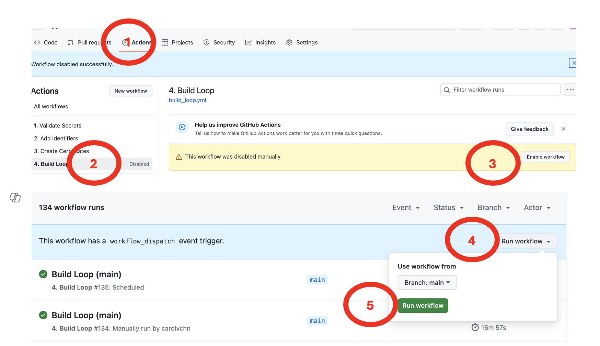

## Overview

The instructions provided for building with a browser include settings to automatically update and build for you.

## Manual Action for Automatic Build

!!! important "Automatic Build Requires Manual Action"
    *GitHub* automatically **disables actions** that run according to a schedule if the repository in question is **inactive**.

    What does that mean?

    * **inactive** means stable code (no new commit within the last 60 days)
    * **disables actions** means the Build Action shows up as disabled

### What Manual Action is Required?

For any repository that is stable, like the *Loop* app, you may need to take manual action to keep automatic builds flowing every month.

* Put a calendar reminder to check every month on the 2nd day of the month (or later)
    * Check that *TestFlight* has a new build of the *Loop* (or other) app
    * If not, go to your repository to see if the build action is disabled
* If necessary, enable the build action at your repository as shown in the graphic below and then launch a manual build

This keeps the most recent version of your app available in *TestFlight* for you to install when you are ready. This manual enable step should be required no more frequently than every 60 days, however, best to make it a monthly habit to check.

> Builds in *TestFlight* are good for 90 days before they [expire](../operation/features/notifications.md#loop-app-expiration-notification){: target="_blank" }.

## What is Automatic

These events are automatically scheduled:

* Once a week: Check for a new release of the *Loop* app:
    * If found, your fork is automatically updated and a new build created and uploaded to *TestFlight*
* Once a month: Build the app and upload the fresh build to *TestFlight*

!!! important "You Get No Warning if Repository Build Action is Disabled"
    These automatic actions happen on schedule, but if your build action is disabled, no build actually happens, no warning email is sent and a green checkmark (&#x2705;) appears beside a very short build action in which the actual build was skipped.

    * Refer to [What Manual Action is Required?](#what-manual-action-is-required)

If you do not want this automatic schedule, you can modify it.

Regardless of your choice, please [Disable Automatic Installation from *TestFlight*](phone-install.md#disable-automatic-install-from-testflight){: target="_blank" }. You should be alert any time your *Loop* app is updated. Check that all settings are maintained and pay attention to make sure the app behavior is nominal.

You still need to **take these actions** to ensure a recent build of the *Loop* app is available in *TestFlight* for you to install on your phone when you choose:

* Keep your *Apple Developer* account up to date with agreements signed
* Check your *GitHub* action if you ever get an email saying an automatic action failed
* Look at your *TestFlight* app on the second of every month to make sure a new build is available for you to install when you are ready

### Successful Weekly Action

Normally, you will see a successful `build action` once a week. This happens every Wednesday.

If there are no updates to the `main` branch, your actions show a very short, successful `build action` as shown in the graphic below. It only takes about a minute because the logic says - no update then skip the build. 

If there is an update, the `build action` updates your fork and creates a new build. 

In that case, you should check your favorite information site to find out what the update was and then, when you are ready, install the update using the *TestFlight* app on your phone.

### Successful Monthly Action

On the first day of every month, you will see a successful `build action`. The purpose of this build is to provide a recent version of the app in *TestFlight* so you are never in a situation where you have no app on your phone.

!!! important "You Get No Warning if Repository Build Action is Disabled"
    If your build action is disabled, no build actually happens, no warning email is sent and a green checkmark (&#x2705;) appears beside a very short build action in which the actual build was skipped.

    * Refer to [What Manual Action is Required?](#what-manual-action-is-required)

You start getting [Notifications](../operation/features/notifications.md#loop-app-expiration-notification){: target="_blank" } when there are fewer than 20 days until expiration. When you see the warning, install the newest build from your *TestFlight* app. You do not want to get the dreaded "Loop Beta is not available" message on your phone. (The warnings get very agressive when close to expiration.)

### What are the `alive branches`?

The automatic update and build feature is embedded in the build_loop.yml code and uses the GitHub scheduling feature to trigger actions to run automatically.

One or more branches are added to your repository that start with the name `alive`. Don't worry about these. They are automatically created so GitHub will keep building your app automatically.

* GitHub keeps track of repositories
* If there is no activity in a given repository in 60 days, GitHub disables Actions
* If your Actions are disabled, you don't get automatic builds
* Clever people developed a work around for this

You may see branches called `alive`, `alive-dev` or `alive-main` in your repository.

The `alive` branches are there so at least one commit per month is added to an `alive` branch in your repository. That keeps your repository active to allow the automatic update and build process.

The `alive` branches are only used for the keep-alive functions. Do not build using an `alive` branch. Most people will build using the default branch of `main`.

#### Automatic Creation of `alive branch`

The `alive` branch you need is created automatically when you run the `Build Loop` action.

!!! warning "I got an error regarding a branch with `alive` in the name"
    * Sometimes you get an error about an `alive` branch
    * If you do get an error, simply delete the branch and run the `Build Loop` action again
        * Use this [GitHub link](https://docs.github.com/en/pull-requests/collaborating-with-pull-requests/proposing-changes-to-your-work-with-pull-requests/creating-and-deleting-branches-within-your-repository#deleting-a-branch) or ask for help when deleting a branch
    * You can delete every branch that starts with the name `alive`
    * Leave the other branches alone unless a mentor directs you to take action

## Automatic Certificates

Automatic renewal of certificates is included in `Loop 3.6.0`.

### Requirements

You must have the `ENABLE_NUKE_CERTS` variable set to `true` for your *GitHub* organization, or when using a personal account to build, add it to each repository.

* Refer to [Add Variable](prepare-fork.md#add-variable){: target="_blank" }

??? question "Do you want to know more? (Click to open/close)"
    **Annual Renewal**

    Once a year, *Apple* automatically expires your `Distribution` Certificate.

    * When the *Apple* `Distribution` certificate expires, the saved credentials in your `Match-Secrets` private repository are invalid and need to be removed (<code>nuke</code>)
    * You need a new `Distribution` Certificate at *Apple*
    * You need to create new signing credentials for `Match-Secrets`

    For the `Loop` app, up through version 3.4.4, you had to do this [Renew Certificate](bb-update.md#renew-certificate){: target="_blank" } process manually. Now that version 3.6.0 is released, it is automatic.

### Automatic Certificate Renewal

Some Open-Source apps, in particular `Trio`, `LoopCaregiver`, `LoopFollow`, `Loop`  and `iAPS` have automatic certificate renewal.

* If your signing credentials for the app being built are invalid and `ENABLE_NUKE_CERTS` is `true`, then signing credentials will be cleared from your `Match-Secrets` repository, a new `Distribution` certificate will be created at *Apple* and signing credentials for the current app will be generated and stored in `Match-Secrets`.

* The next app you build using Browser Build, following a `nuke` action, will need certificates created because all signing credentials were cleared out of your `Match-Secrets` repository
    * If that app is configured for automatic certificate renewal, you only need to run the `Build Action`; it detects no signing credentials are available and creates them
    * If that app is not configured for automatic certificate renewal, you must first run the action  `Create Certificates` and then `Build`

### Open-Source App Schedule

The table below indicates **planned** time for the automatic build schedule.

| Open-Source App | AutoCerts? | Wed UTC | 1st of Month UTC |
|:--|:-:|:-:|:-:|
| Loop | &#x2705; | 09:33 | 07:33 |
| LoopCaregiver | &#x2705; | 13:33 | 11:33 |
| LoopFollow | &#x2705; | 12:17 | 10:17 |
| LoopFollow_Second | &#x2705; | 12:27 | 10:27 |
| LoopFollow_Third | &#x2705; | 12:40 | 10:40 |
| Trio | &#x2705; | 08:43 | 06:43 |
| xDrip4iOS | &#x274C; | 16:43 | 14:43 |
| iAPS | &#x2705; | 03:00 daily | n/a |

> The *iAPS* app uses a different system to trigger updates

> * daily check for updates
> * autobuild when updates detected (if user opts in)

!!! question "Why are the Hour and Minute staggered?"
    There are 2 reasons:

    1. You only want one action to `nuke` profiles and build credentials associated with an expired certificate
    2. The *GitHub* resources are more likely to be busy at the beginning of each hour

    ??? abstract "Do you want to know more? (Click to Open/Close)"

        This build schedule determines when the automatic check for certificate status happens. The times are shifted to make sure only one Open-Source app performs a `nuke` action. Any other app building later that same day will just create new signing credentials; it will not need to `nuke`. This only happens once a year, but we wanted to be sure there are no conflicts. 
        
        Starting in 2025 May, some people were getting messages that "no runners" were available to perform their build. (Remember, this is a **free** service we are using.) 
        Initially, all builds started at the "top of the hour" (HH:00), but it turns out that is when *GitHub* has the most activity. 
        In an attempt to minimize build failures due to resource limitations, the minute of the hour for all the apps is gradually being shifted.

Even if an app doesn't have automatic certificates implemented yet, they are added to the table as suggested values to use when this capability gets added. All times are UTC. If other apps decide to add this feature, please make a pull request to LoopDocs so we can add those times to the deconfliction table.

## Modify Automatic Building

For someone using [development code](build-dev-browser.md) for their own use, they could decide to choose when to update their `fork` to the most recent commit. They can still have the advantage of automatic building without automatic updates; in other words, they want a new build added to TestFlight every month. There may be other configurations someone would choose. These options are available starting with Loop 3.3.0 (`dev` branch) and later.

You can affect the default behavior:

1. [Modify Automatic Schedule](#modify-automatic-schedule)
1. [Disable Automatic Actions](#disable-automatic-actions)

### Modify Automatic Schedule

This is an optional step. If you are happy with the automatic sync and update, you are done with this page.

??? tip "Instructions to Modify the Automatic Actions (Click to Open/Close)"
    You can modify the automation by creating and using some variables.

    To configure the automated build more granularly involves creating up to two variables: `SCHEDULED_BUILD` and/or `SCHEDULED_SYNC`. See [How to configure a variable](#how-to-configure-a-variable).

    Note that the weekly and monthly `Build Loop` actions will continue, but the actions are modified if one or more of these variables is set to false. **A successful Action Log will still appear, even if no automatic activity happens**.

    * If you want to manually decide when to update your repository to the latest commit, but you want the monthly builds and keep-alive to continue:
        * create the variable `SCHEDULED_SYNC` and set it to false
        * either do not create the variable `SCHEDULED_BUILD` or set it to true
        * If you are building the `dev branch` at a time when there is a lot of activity in that branch, you may want this configuration
    * If you want to only build when an update has been found:
        * either do not create the variable `SCHEDULED_SYNC` or set it to true
        * create the variable `SCHEDULED_BUILD` and set it to false
        * **Warning**: if no updates to your default branch are detected within 90 days, your previous TestFlight build may expire, requiring a manual build
        * During a time when updates are not happening frequently, this is not a good choice

    | 
`SCHEDULED_SYNC`
 | 
`SCHEDULED_BUILD`
 | Automatic Actions |
    |---|---|---|
    | `true` (or N/A) | `true` (or N/A) | This is the default: keep-alive, weekly update check (auto update/build), monthly build with auto update|
    | `false` | `true` (or N/A) | keep-alive, monthly build, no auto update |
    | `true` (or N/A) | `false` | keep-alive, weekly update check with auto update, only builds if update detected |
    | `false` | `false` | no automatic activity, no keep-alive|

### How to configure a variable

1. Go to the "Settings" tab of your LoopWorkspace repository.
2. Click on `Secrets and Variables`.
3. Click on `Actions`
4. You will now see a page titled *Actions secrets and variables*. Click on the `Variables` tab
5. To disable ONLY scheduled building, do the following:
    - Click on the green `New repository variable` button (upper right)
    - Type `SCHEDULED_BUILD` in the "Name" field
    - Type `false` in the "Value" field
    - Click the green `Add variable` button to save.
7. To disable scheduled syncing, add a variable:
    - Click on the green `New repository variable` button (upper right)
    - - Type `SCHEDULED_SYNC` in the "Name" field
    - Type `false` in the "Value" field
    - Click the green `Add variable` button to save
  
Your build will run on the following conditions:

- Default behaviour:
    - Run weekly, every Wednesday at 08:00 UTC to check for changes; if there are changes, it will update your repository and build
    - Run monthly, every first of the month at 06:00 UTC, if there are changes, it will update your repository; regardless of changes, it will build
    - Each time the action runs, it makes a keep-alive commit to the `alive` branch if necessary
- If you disable any automation (both variables set to `false`), no updates, keep-alive or building happens when `Build Loop` runs
- If you disabled just scheduled synchronization (`SCHEDULED_SYNC` set to`false`), it will only run once a month, on the first of the month, no update will happen; keep-alive will run
- If you disabled just scheduled build (`SCHEDULED_BUILD` set to`false`), it will run once weekly, every Wednesday, to check for changes; if there are changes, it will update and build; keep-alive will run

### Disable Automatic Actions

To enable the scheduled build and sync, the `GH_PAT` must hold the `workflow` permission scopes. This permission serves as the enabler for automatic and scheduled builds with browser build. To disable this, follow these steps:

1. Go to your [FastLane Access Token](https://github.com/settings/tokens)
1. If it says `repo`, `workflow` next to the `FastLane Access Token` link, then automatic building is enabled
1. To disable automatic update and build, click on the link to open the token detail view
    * Click to uncheck the `workflow` box
    * Click to check the `repo` box
1. Scroll all the way down to and click the green `Update token` button
1. Your token now holds only the `repo` permission

If you choose not to have automatic building enabled, be sure the `GH_PAT` has `repo` scope or you won't be able to manually build.

## Stop Building

What if I decide I don't want the automatic building feature?

* If you are using the released version of Loop, please leave automatic building running
    * Please read [TestFlight Automatic Updates](phone-install.md#automatic-update-build-install) on how to configure TestFlight so you choose when the updated app gets installed on your phone
    * Otherwise, you may see the dreaded "Loop Beta has expired" message, have a Loop that won't open and not have a version ready to go in TestFlight that you can install within a few seconds

* If you are taking a break from Loop and want to stop monthly Build emails, consider disabling actions for the `Build Loop` action for your app.
    * [GitHub Directions to Disable and Enable a Workflow](https://docs.github.com/en/actions/using-workflows/disabling-and-enabling-a-workflow#disabling-a-workflow)
    * It is the Build action that kicks off the update and build steps, so simply disabling the one action is sufficient

* If you are done with Loop, you can delete the whole repository; but you should be sure about this because you'll need to start over with [Configure to use Browser](bb-overview.md#configure-to-use-browser) to restore ability to build Loop with GitHub.
