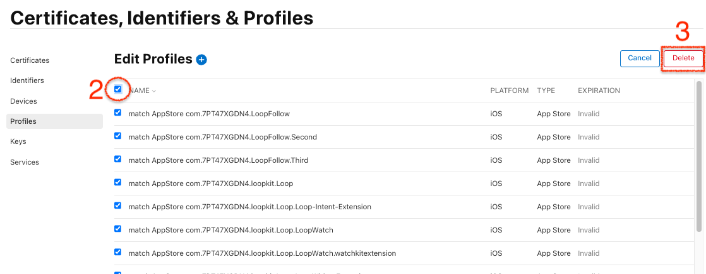

## Help with Errors

!!! important "Get Help, Not Frustrated"
    For first-time builders, there are a lot of one-time steps that all have to be correct and many screens look similar.

    If you are updating your build, the process can be confusing and some error messages can be misleading.

    You are not alone - please reach out.

If you are having trouble:

#### Please DO:

* Use the LoopDocs search feature
* Use the zulipchat or Facebook search feature
* [Ask a mentor for help](#where-to-get-help-with-browser-build)

#### Please do NOT:

* Search in a general internet browser to find your error
* Ask ChatGPT (or other AI) how to fix your error
* Spend hours in frustration
* Rename or delete a repository
* Delete your GitHub account
* Remove your App from App Store Connect

### Where to Get Help with Browser Build

These are two places to ask for help, but please choose only one. You may get a faster response from Facebook, but there are mentors on both sites:

* [LoopandLearn Facebook Group](https://www.facebook.com/groups/LOOPandLEARN)
* [Zulipchat: Loop: Build Help]( https://loop.zulipchat.com/#narrow/channel/148543-Loop/topic/Browser.20Build)

### What Information is Needed for Help

1. Your GitHub name used for building (required):

    * Best to provide a link to your repository, like the example, but substitute your information
    * If you are building an app other than Loop, replace LoopWorkspace with the app repository name

    ``` {.text .copy  title="If you use an organization" }
    https://github.com/my-name-org/LoopWorkspace
    ```

    ``` { .text .copy  title="If you do not use an organization" }
    https://github.com/my-name/LoopWorkspace
    ```

1. A brief summary of the step you are on and what isn't working.

That's all we need to get started.

Mentors can go to your public&nbsp;_<span translate="no">GitHub repository</span>_, make sure your code is up to date, examine your customizations (if any), then click on the Action tab and view your log files directly.

* Do not copy from the log file and post the words
* Do not take a screenshot of what you think is an error

!!! tip "GitHub URL, Not Pictures"
    If you've been around the DIY community for a while, you know the mantra about screenshots. Well, when using a browser to build, **screenshots are close to useless**.

    All that is needed to assist is your link to the *GitHub* repository where you are building.

## Quick Reference for Browser Build Errors

Please make this your first stop if you get any kind of an error with Browser Build.

### Link Styles

If you notice an arrow pointing up and to the right beside the link:

* This means a new tab or window (depending on your browser configuration) is opened when you click on the link
* Your original place in the docs is in the original tab, so you can return to your same position in the docs

If there is no upright arrow by a link, then the location is on the same page:

* Once you have read that section, hit the back arrow in your browser to return to your original location

### Look at the Annotation

If you get an error in an Action. Click on the link and scroll down to view the annotation. An example is shown below. Some errors have a clear annotation telling you what to do. If the annotation is not clear to your, please [ask a mentor for help](#where-to-get-help-with-browser-build).

> Changes at *Apple* led to a number of new errors - these do have have nice annotations.

{width="800"}
{align="center"}

### Rebuild or New Builder

* If you have successfully built before and this is a rebuild, skip ahead to [Rebuild Errors Quick Reference](#rebuild-errors-quick-reference)
* If you are a new builder, please continue reading

## New Builder: Quick Reference

### New Builder: Validate <code>Secrets</code> Error

This is the first step. If you have not succeeded (&#x2705;) with this action - STOP.

* No other action will work - because all the other actions repeat Validate <code>Secrets</code> as the first step of the action
* Be sure to [Look at the Annotation](#look-at-the-annotation)
* You can [ask a mentor for help](#where-to-get-help-with-browser-build)

If you want to try to solve it yourself, refer back to these section in the documentation:

* [Collect <code>Secrets</code>](secrets.md){: target="_blank" }
* [Enter the <code>Secrets</code>](prepare-fork.md#enter-the-secrets){: target="_blank" }

### New Builder: Add Identifiers Error

If you succeeded with Validate <code>Secrets</code>, this should also succeed. If it does not, please skip ahead to [Action: `Add Identifiers` Error`](#action-add-identifiers-errors).

Do not hesitate to [ask a mentor for help](#where-to-get-help-with-browser-build).

### New Builder: Create Certificates Error

This is one of the hardest ones to solve. If you are getting this, don't be afraid to [ask a mentor for help](#where-to-get-help-with-browser-build). If you want to solve it yourself, a link is coming your way but first read this:

#### This is NOT Your Error

When you start this action, GitHub starts a cloud computer to run your job for you. It doesn't have any information about you or your <code>Secrets</code> - yet.

Early in the log file you will see two phrases in red font:

> There are no local code signing identities found.

> security: SecItemCopyMatching: The specified item could not be found in the keychain.

This is normal. The next steps will set up a keychain for you using your Match-Secrets repository and your MATCH_PASSWORD passphrase.

#### Where to find the Certificate Solutions

Head over to [Action: Create Certificate Errors](#action-create-certificates-errors) and find your specific error.

### New Builder: Build Errors

The most likely reason to get errors here is a mistake in the [Prepare App](prepare-app.md){: target="_blank" } page. 

Common errors are:

* You skipped one of the Identifiers when adding the App Group to it
* The App Group was spelled wrong
* You unchecked a capability on one of the Identifiers (because you watched an old video)
* You did not select the correct identifier when creating your app
* You entered an incorrect TEAMID

All of these solutions are found in [Action: Build Loop Errors](#action-build-loop-errors). The mentors can pick out the exact solution quickly if you [ask a mentor for help](#where-to-get-help-with-browser-build).

An example annotation for skipping one of the Identifiers is shown in the graphic below. The App Group for `Loop-Intent-Extension` was deliberately removed to provoke that error.

{width="800"}
{align="center"}

Ignore the warnings - this does not affect the build.


## Rebuild Errors: Quick Reference

### `Check Upstream and Keep Alive` Error

!!! important "`Check Upstream and Keep Alive` Error"
    **Error**: Your Browser Build fails and when you click on the link, you see

    * **`Check Upstream and Keep Alive`** failed

    **Consequence**: any required sync of your fork is skipped and build is skipped

    **Solution**:

    * Manually sync your fork of the repository: [Update `Fork`](bb-update.md#update-fork){: target="_blank" }
    * Manually start your build: [Build](bb-update.md#build-the-app){: target="_blank" }

    **Details about what happened**:

    On 21 April 2025, *GitHub* removed one of the third-party repositories that we used to keep automatic building going without action on your part. The repository was removed because it was in violation of the *GitHub* terms of service. *GitHub* disables automatic actions for repositories that have been inactive (no commits added in 60 days). For stable apps, like the *Loop* app, this third-party repository enabled a workaround to keep the builds happening.

    This affected all the Open-Source apps in our community - Loop, LoopFollow, LoopCaregiver, Trio, iAPS and xDrip4iOS. The developers in our community have restored the ability to build using the Browser Build method. Stay tuned for updates to required actions in the documentation over the next few months, before we hit the 60 day limit.

### Manual Enable for Build Action May be Required

The automatic build actions continue to happen on schedule, but starting May 2025, you may find your build action disabled by *GitHub*. (This might happen every 60 days, but it might happen sooner.) In that case, no build actually happens, no warning email is sent and a green checkmark (&#x2705;) appears beside a very short build action in which the actual build was skipped.

If necessary, enable the build action at your repository as shown in the graphic below and then launch a manual build.


### Rebuild: Create Certificates Error

With `Loop 3.6.1` or newer, these should be a thing of the past - but you must first manually update (sync) your repository in order to get this feature added and you must do this new step [Add Variable](prepare-fork.md#add-variable){: target="_blank" }.

> Note - we used to say with `Loop 3.6.0`, this was no longer an issue. However, Apple changed part of their infrastructure in May 2025 and it took us a while to get this fixed.

> Caveat - your Apple Developer account must be in good standing with a valid credit card attached and all agreements signed.

### Rebuild: Build Error

After you update to `Loop 3.6.0`, the Create Certificates Action is incorporated into the Build Action. So for rebuilders, if you completed the manual sync and added the new variable, you should not get an error when building.

> Caveat - your Apple Developer account must be in good standing with a valid credit card attached and all agreements signed.

There are, however, a few intermittent errors that can happen when *GitHub* and *Apple* don't communicate for some reason or there is a problem with the *TestFlight* upload. Check out [Action: `Build Loop` Errors when Updating](#action-build-loop-errors-when-updating).

## Most Common Mistakes

If you get an error when building with a browser, you can use this page to figure out what to do - but don't be afraid to [ask for help](#help-with-errors).

!!! important "Build Credentials are Invalid"
    If you are a repeat builder and you get this build error message: `No code signing identity found and`. The phrase ends with `can not create a new one because you enabled readonly` but the `readonly` has backquotes around it. Sometimes, the phrase uses `cannot` and in other cases `can not`. 
    
    You need to delete a Distribution Certificate and try again. See [Revoke Distribution Certificate](bb-errors.md#revoke-distribution-certificate){: target="_blank" }.
    
    > A number of people who tried to update certificates after *Apple* changed things in May and before Loop 3.6.1 was released, may have Distribution Certificates that need to be deleted. If your credentials were valid during that time period, you won't see this error.

These are some of the most common errors to date.

1. You made a spelling error when adding <code>Secrets</code>
    * Each secret must be spelled exactly the way it is presented in the instructions
    * If you are using an automatic translation, please keep an original page open too and copy from it to make sure there are no spelling errors in the secret name
1. You made a spelling error in creating the `App Group Identifier` or did not add the `App Group Identifier` to all 4 of the required identifiers in this step: [Add `App Group` to `Identifiers`](prepare-app.md#add-app-group-to-identifiers){: target="_blank" }
    * See [Annotation without Clear Message (*Build*)](#annotation-without-clear-message-build) for an example of this kind of failure
1. You used a smart editor instead of a text-only editor to save your information
    * It only takes one letter to be changed from small to capital by your smart editor to ruin your day
    * The alpha-numeric values used for `GH_PAT`, `FASTLANE_ISSUER_ID` and `FASTLANE_KEY` contain both small and capital characters and all the values are case-sensitive
1. When saving `TEAMID`, you typed what you thought you saw instead of using copy and paste
1. You skipped running one of the actions
1. You need to sign a program license agreement or update a credit card at&nbsp;<span translate="no">Apple Developer</span>
    * Be sure to read [Misleading Error Message](#misleading-error-message)
1. You got an error regarding a branch with `alive` in the name
    * You can delete any branch that starts with the name `alive` and try again
    * See [Automatic Creation of `alive branch`](automatic.md#automatic-creation-of-alive-branch){: target="_blank" }

## Examine Annotation

If a&nbsp;<span translate="no">*GitHub* Action</span>&nbsp;fails, you will see a clear notification.

First consider the following results from the&nbsp;<span translate="no">*GitHub* Action: 1. Validate Secrets</span>.

### Annotation with Clear Message

Your screen may look similar to the graphic below. The name in parentheses refers to the branch used to develop these wonderful messages. Yours will almost always be the `main` branch.

{width="500"}
{align="center"}

But there are so many reasons why this could happen. The first step is to click on the link highlighted by the red rectangle in the graphic above. This opens a new detailed view. The GIF below shows two different error messages. The first frame shows the error in the Annotation box at the bottom (you may need to scroll down to see this), and you may need to click on "Show More" to see the full message as seen in the second frame. The third frame of the GIF shows a different message. Each one these messages is designed to make it easier for you to diagnose your own problem.

{width="800"}
{align="center"}

Notice that&nbsp;<span translate="no">*GitHub* Action: 1. Validate Secrets</span>&nbsp;is broken into three jobs each of which will either pass and show a green check or fail and show a red check. The secrets are validated with each action.

### Annotation without Clear Message (*Certificates*)

This section is left here for those who have an older version (3.4 or older) in their fork.

> If you have updated to 3.6.0 or newer, refer to [Rebuild Errors: Quick Reference](#rebuild-errors-quick-reference) and ignore this section.

Not all error messages had a clear annotation (up through version 3.4.x).

For example, the graphic below shows a failure of&nbsp;<span translate="no">*GitHub* Action: 3. Create Certificates</span>&nbsp;.

{width="800"}
{align="center"}

This is an example of a message that is not terribly descriptive - which is why it is shown here. In this case, you can click on just the one job that failed. There will be less to sort through to find your error. The most likely reason for this error is [Error: Could not Create](#error-could-not-create).

### Missing Certificates

> With `Loop 3.6.1` or newer, certificates are automatically renewed if your developer account is up to date, all agreements are signed and you completed the new [Add Variable](prepare-fork.md#add-variable){: target="_blank" } step.

If your certificates expired and you do not have the `ENABLE_NUKE_VARIABLE` configured, you might see this error when you try to build. It does not have a clear annotation. The error string starts with: `No code signing identity found and`. The phrase ends with `can not create a new one because you enabled readonly` but the `readonly` has backquotes around it. Sometimes, the phrase uses `cannot` and in other cases `can not`.

Please follow the directions in [Revoke Distribution Certificate](#revoke-distribution-certificate) and build again.

{width="800"}
{align="center"}

### Annotation without Clear Message (*Build*)

The GIF below shows a failure of&nbsp;_<span translate="no">*GitHub* Action: 4. Build Loop</span>_&nbsp;. The nice messages have not been added to this yet - you will have to follow the [Find the Error](#find-the-error) instructions, but now, you are automatically taken to the correct section so there is less of the log to deal with.

* Frame 1 shows the failure message - click on one of the build links highlighted with the red rectangle (it does not matter which link you click)
* Frame 2 shows the screen displayed after you click the link - you will see the display automatically move to the first item that failed
    * The area indicated by the orange rectangle near the top right is where you will paste the strings offered in [Action: `Build Loop` Errors](#action-build-loop-errors)
* Frame 3 shows what happens when you paste in the correct string
    * Note that if the string is not found, nothing happens
    * If the string is found, the display automatically moves to the section of the log with that string
    * The particular `Identifier`, which does not have the required `App Group` for this example, is the SmallStatusWidget
        * Note that with version 3.4, SmallStatusWidget is no longer used - perhaps an unfortunate choice for this GIF

{width="800"}
{align="center"}


## Find the Error

This section is required when you need to search for a string to diagnose and error that does not have a clear annotation.

### Misleading Error Message

If there are *Apple* Developer agreements you have not accepted, you may get errors when you try to Build that indicate your *Apple* <code>Secrets</code> are incorrect even if they are not.

* The misleading message tells you that one or more of these: <code>FASTLANE_ISSUER_ID</code>, <code>FASTLANE_KEY_ID</code> or <code>FASTLANE_KEY</code> is not correct
    * With `Loop 3.6.0` or newer, this should no longer appear unless you have a mistake in one of those
* Check your *Apple* Developer account for agreements first, before trying to fix those `Secrets`
* If you previously built successfully - it is almost certainly the agreement
* It can take 15 minutes to an hour after the agreement is signed before it can be used

If you need detailed instructions, click on this [<code>Apple Program License Agreement</code> Help Page](https://support.pushpay.com/s/article/Accepting-the-Apple-Program-License-Agreement).

You can also get this message if the credit card used to purchase the Developer account is not current, e.g., no longer valid or credit card expiration date, as entered at *Apple*, has passed.

### Find Your Error

At this point, it may be faster to [ask a mentor for help](#where-to-get-help-with-browser-build). But if you want to dig into the details of the log and find the error yourself, the information is here.

There is a separate section for each step in the process. First, you must follow the [Examine Annotation](#examine-annotation) instructions to view the record of the failed action. Then go to the section for the Action you were trying to complete to look for possible error strings to copy into the search box. For each section there are possible strings to paste to search the log.

* Paste in a possible error string (copy it exactly); repeat until you find a match
* If the possible error string is found - follow the directions for that error

Error annotations are available for the *Loop* app version 3.4 and later for some of the actions. We believe the first two actions have a complete set of error annotations.

1. [Action: `Validate Secrets`](#action-validate-secrets-errors)
1. [Action: `Add Identifiers` Errors](#action-add-identifiers-errors)
1. [Action: `Create Certificates` Errors](#action-create-certificates-errors)
1. [Action: `Build Loop` Errors](#action-build-loop-errors) before a successful build
1. [Action: `Build Loop` Errors when Updating](#action-build-loop-errors-when-updating) after a successful build

If you discover a new error, please reach out to help us update the documentation.

## Do Not Remove an App

Please do not remove an existing app if you have trouble building a different app. Your build error is not caused by any existing app.

!!! Important "Remove App Warning"
    If you remove an app and later want to restore that app, you might not be able to.

    Sad and Expensive Scenario:

    1. User removed app with name "My App" and unique bundle ID that includes their TEAMID
    1. User later decided to restore their app, but in the meantime, someone else has used the name "My App"
    1. When trying to restore your app, Apple doesn't allow you to change just the name of the app and will not allow you to restore it because someone else has that name, even though your bundle ID is different
    1. After spending time on the phone with Apple, user's only option was to purchase a new Apple Developer account so they can get a new TEAMID (see steps below) or doing a custom change to the Loop code to modify the bundle ID (no instructions are provided for this - easy to do it wrong)

## Instructions to Diagnose Your Errors

## Action: `Validate Secrets` Errors

For Version 3.4 and later - use [Examine Annotation](#examine-annotation) and read the annotation.

## Action: `Add Identifiers` Errors

We used to be able to say that if `Validate Secrets` worked then so did `Add Identifiers`. That is still typically true for new builders. But we are finding many experienced builders have to revoke their old `FastLane API Key` and generate a new one to be able to continue building. We don't know why, but it is happening a lot. If you are one of those experienced builders, head over to the [Handle the `FastLane API Key` Error](#handle-the-fastlane-api-key-error).

If you are new builder who gets an error at `Add Identifiers`, please [ask a mentor for help](#where-to-get-help-with-browser-build).

## Action: `Create Certificates` Errors

> Reminder - If it is not obvious to you what your error is, please [ask a mentor for help](#where-to-get-help-with-browser-build)

> * you might get to the answer sooner
> * you are less likely to do something that makes it harder for the mentor to help you later

Review [Find the Error](#find-the-error) for instructions on how to use the error strings.

List of certificate errors on this page:

* [Error: No profile for team](#error-no-profile-for-team)
* [Error: Error cloning certificates](#error-error-cloning-certificates)
* [Error: Could not decrypt](#error-could-not-decrypt)
* [Error: Could not create](#error-could-not-create)
 
### Error: No profile for team

This happens if you entered the wrong TEAMID in `Secrets`.

Copy the words on the line below and paste them into the search function for your action log.

> ``` { .text .copy }
> error: No profile for team '***' matching 'match AppStore
> ```

If that phrase is found, then:

* You probably do not have the correct `TEAMID` entered in your `Secrets`
* The rest of these instructions assume:
    * You have already created a *Loop* App in the *App Store* with that incorrect `TEAMID`
    * This is true if you completed the steps after running Action: `Add Identifiers` and before Action: `Create Certificates`

Click on this link to [Delete Identifiers](#delete-identifiers).

- Delete all the other identifiers first, then try to delete the *Loop* identifier with the wrong <code>TEAMID</code>
- It is fine to just ignore identifiers with the wrong <code>TEAMID</code>, but do not use them

#### Rerun Steps with correct TEAMID

1. Enter your `TEAMID` correctly in the repository `Secrets`
    - Make sure you use copy and paste from your [Apple Developer Membership](https://developer.apple.com/account/#!/membership) page for that `TEAMID`.
    - Follow the update instructions here (this example is for `GH_PAT`, you'll do the same but for `TEAMID`) [Update Secrets](bb-update.md#update-secrets)

1. Run Action: [Configure to Use Browser: `Add Identifiers`](identifiers.md#add-identifiers) again

1. Follow all the steps in this section with the **correct** `TEAMID` [Configure to Use Browser: Configure Identifiers for Loop](prepare-app.md#configure-identifiers-for-loop) but when you get to the [Configure to Use Browser: Create Loop App in App Store Connect](prepare-app.md#create-loop-app-in-app-store-connect), you need to return to this page and follow the instructions below to remove the app and add a new one.

The first time through, you created an app with a `Bundle ID` that does NOT include your `TEAMID`.

You will remove that app and create a new one.

#### Remove App with Incorrect `TEAMID`

Go to [`App Store Connect / Apps`](https://appstoreconnect.apple.com/apps) and follow the numbered steps in the graphic below.

1. Find the *Loop* app you created earlier and click on it
2. On the left side, under `General`, click on `App Information`
    * Confirm that the value listed under `Bundle ID` is the incorrect one
    * The `Bundle ID` says: `com.NOT_YOUR_TEAMID.loopkit.Loop`
3. Scroll to the bottom of the page and tap on `Remove App`
4. The dialog box, similar to the one in the graphic below, should appear and you tap `Remove`
    * After the *App* is removed, you'll see a very similar screen, where you can tap on `Restore App`
5. But since you want that *App* removed, tap on `Apps` at the very top of the screen and proceed to the next step

{width="700"}
{align="center"}

That *App* with the wrong `Bundle ID` remains in the *App store* but it is hidden so it won't confuse you.

#### Add App with Correct `TEAMID`

Now click on the `Add Apps` button or the :heavy_plus_sign: (plus sign) if you have other apps in the *App Store*.

Follow the [Configure to Use Browser: Create Loop App in App Store Connect](prepare-app.md#create-loop-app-in-app-store-connect) directions with these additions:

* You must come up with a new name for your *Loop* App
* Triple-check that the `Bundle ID` you choose is for *Loop* and contains your `TEAMID`, it should look like: `com.TEAMID.loopkit.Loop`
* You must come up with a new `SKU` for your *Loop* App (try `1234`, if you used `123` before)

#### Create Certificates

You should be able to continue with the [Configure to Use Browser Steps to `Create Certificates`](certs.md#create-certificates) and then proceed from there with `Build Loop` and keep going.

### Error: Error cloning certificates

This indicates you do not have the appropriate Repository access.

Copy the words on the line below and paste them into the search function for your action log.

> ``` { .text .copy }
> Error cloning certificates
> ```

The full error looks like this:

> Error cloning certificates repo, please make sure you have read access to the repository you want to use

or

> Error cloning certificates git repo, please make sure you have access to the repository - see instructions above

If you see this phrase, the `fastlane` package that is utilized during the `3. Create Certificates` action cannot access your repository to create certificates for your *Loop* app. This is due to insufficient repository access rights that were not granted during the creation of your `GH_PAT` token.

To fix this error:

- Open this link: [https://github.com/settings/tokens/](https://github.com/settings/tokens/)
  - Here you will see your personal access token (`Fastlane Access Token`) that was created during [Configure to Use Browser: Setup *GitHub*: Create `GitHub Personal Access Token`](../browser/secrets.md#create-github-personal-access-token)
  - Note that `Tokens (classic)` is highlighted in the menu on the left
  - Click on the token name (should be bold, blue **`Fastlane Access Token`** ) to open its detail page
  - None of the checkboxes under **`Select Scopes`** will be checked – this is what's causing the issue.
  - Add a check beside the `workflow` permission scope (the graphic does not match the words, you want to use `workflow` to get both `repo` and `workflow` scope)
  - Scroll all the way to the bottom and click `Update token` (it's a long way, ignore all other settings, do not check anything else)

{width=700}

After you have clicked `Update token` you should see the token overview again with the message `Some of the scopes you’ve selected are included in other scopes. Only the minimum set of necessary scopes has been saved. ` (You can dismiss the message using the `X` near the upper right side if it appears).

#### Create Certificates

You should be able to continue with the [Configure to Use Browser Steps to `Create Certificates`](certs.md#create-certificates) and then proceed from there with `Build Loop` and keep going.

### Error: Could not decrypt

Copy the words on the line below and paste them into the search function for your log file.

> ``` { .text .copy }
> decrypt the repo
> ```

The full error message is:

> `Couldn't decrypt the repo, please make sure you enter the right password`

If you know you entered the incorrect <code>MATCH_PASSWORD</code> in your repository <code>Secrets</code>, go and fix it now and try again.

Otherwise, you need to follow the steps to [Delete Match-Secrets](#delete-match-secrets).

### Error: Could not create

Copy the words on the line below and paste them into the search function for your log file.

> ``` { .text .copy }
> Could not create another Distribution certificate
> ```

The full error message is:

> `Could not create another Distribution certificate, reached the maximum number of available Distribution certificates`

These steps are required to make room for a `Certificate` if you have two Certificates or if you tried to create a new certificate in the May/Jun 2025 time frame when the Browser Build actions were "broken", before `Loop 3.6.1` was released.

* Follow the directions to [Revoke Distribution Certificate](#revoke-distribution-certificate)

## Action: `Build Loop` Errors

This section is for people who have not successfully built the *Loop* app one time. If you are a repeat builder, please skip ahead to [Action: `Build Loop` Errors when Updating](#action-build-loop-errors-when-updating).

!!! warning "Run `Create Certificates` First"
    When running a version earlier than `Loop 3.6.0`, you must run Action: `Create Certificates` before attempting to run Action: `Build Loop`

    If you had to step backward and fix an `Identifier`, you must run `Create Certificates` again.

Refer to [Annotation without Clear Message (*Build*)](#annotation-without-clear-message-build) for a detailed example of these steps:

* Click on the Action log on *GitHub*
* There will be a series of green items followed by a red one
* Click on the red item to view the error
* Use the search function in this log to locate your error using one of the strings below

For each section below, copy the phrase into the search function of the log. If you find it, solve that error. If not, move on to the next one.

List of build errors in this section:

* [`Error: Could not find an app on App Store Connect`](#error-could-not-find-an-app-on-app-store-connect)
* [`Error: Provisioning Profile`](#error-provisioning-profile)
* [`Error: A new one cannot be created because you enabled`](#error-a-new-one-cannot-be-created-because-you-enabled)


### `Error: Could not find an app on App Store Connect`

Copy the words on the line below and paste them into the search function for your action log.

> ``` { .text .copy }
> Could not find an app on App Store Connect
> ```

If that phrase is found, then:

* Make sure you completed the [Create Loop App in App Store Connect](prepare-app.md#create-loop-app-in-app-store-connect) Step
    * Once you've resolved that step, run `Build Loop` action again


* This can also be caused if you correctly created the *Loop* App but entered an incorrect value for the `TEAMID`.
    * If you have the incorrect `TEAMID`, check this link: [Certificates, Identifiers & Profiles](https://developer.apple.com/account/resources/identifiers/list) for entries with the incorrect `TEAMID` embedded
    * For example, if your `TEAMID` is `0123456789`, but you entered `000123`, you may see both of these in your identifiers list
        * `com.0123456789.loopkit.Loop`
        * `com.000123.loopkit.Loop`
    * Delete the "bogus" identifier version, fix your `TEAMID` and rerun all three steps:
        * `Add Identifier`
        * `Create Certificates`
        * `Build Loop`

### `Error: Provisioning Profile`

Copy the words on the line below and paste them into the search function for your action log.

> ``` { .text .copy }
> error: Provisioning profile "match AppStore
> ```

If that phrase is found one, or more times, it means you missed a step when configuring the Loop identifier or missed associating your *Loop* App Group with one or more identifiers.

For example, you might see:

* `error: Provisioning profile "match AppStore com.***.loopkit.Loop`
* `error: Provisioning profile "match AppStore com.***.loopkit.Loop.LoopWidgetExtension`
* `error: Provisioning profile "match AppStore com.***.loopkit.Loop.statuswidget`
* `error: Provisioning profile "match AppStore com.***.loopkit.Loop.Loop-Intent-Extension`

Return to [First-Time: Identifiers for the `Loop` app](prepare-app.md#identifiers-for-the-loop-app) and make sure you followed all the steps.

You can build *Loop*:

* Action: `Build Loop`

### `Error: A new one cannot be created because you enabled`

Copy the words on the line below and paste them into the search function for your action log.

> ``` { .text .copy }
> A new one cannot be created because you enabled
> ```

If that exact phrase is found with lines similar to those in [Bundle ID is wrong](#bundle-id-is-wrong) below and this is your first build, you have the `Bundle ID` problem.

However, this very similar phrase means you need to delete one or more Distribution Certificates and try again: `No code signing identity found and`. The phrase ends with `can not create a new one because you enabled readonly` but the `readonly` has backquotes around it. Sometimes, the phrase uses `cannot` and in other cases `can not`.

* Follow the directions to [Revoke Distribution Certificate](#revoke-distribution-certificate)

#### Bundle ID is wrong

This is not typical and will only be seen for the very first build if you entered an incorrect TEAMID.

```
[31mA new one cannot be created because you enabled `readonly`
[31mProvisioning profiles in your repo for type `appstore`:
[31m- 'AppStore_com.NOT_YOUR_TEAMID.loopkit.Loop.statuswidget.mobileprovision'
[31m- 'AppStore_com.NOT_YOUR_TEAMID.loopkit.Loop.SmallStatusWidget.mobileprovision'
[31m- 'AppStore_com.NOT_YOUR_TEAMID.loopkit.Loop.mobileprovision'
[31m- 'AppStore_com.NOT_YOUR_TEAMID.loopkit.Loop.LoopWatch.mobileprovision'
[31m- 'AppStore_com.NOT_YOUR_TEAMID.loopkit.Loop.Loop-Intent-Extension.mobileprovision'
[31m- 'AppStore_com.NOT_YOUR_TEAMID.loopkit.Loop.LoopWatch.watchkitextension.mobileprovision'
```

This tells you, the `Bundle ID` you selected in [First-Time: Create Loop App in App Store Connect](prepare-app.md#create-loop-app-in-app-store-connect) does NOT have your `TEAMID` embedded in the name.

Once you have created an app in the *App Store* that is not based on your `TEAMID`, you cannot delete it, but you can Remove it (i.e. hide it so that it is no longer visible on this page and you don't accidentally click on it).

1. Open this link: [App Store Connect / Apps](https://appstoreconnect.apple.com/apps) to view your apps; log in if needed.
1. Find the App with the wrong `Bundle ID` and click on it
1. On the left-hand side, click on `App Information` (under `General`)
    * Confirm the `Bundle ID` listed does not include your `TEAMID`
    * Scroll all the way to the bottom
    * Tap on `Remove App`
    * New dialog window appears, select `Remove`

At this point, get your correct `TEAMID`, fix your Secrets file to have the correct `TEAMID` and then return to [First-Time: Configure Secrets](prepare-fork.md#configure-secrets). This time you will be updating `TEAMID` in the secret list.

## Action: `Build Loop` Errors when Updating

This section is only for people who have successfully built using *GitHub Build Actions*.

Use the [Examine Annotation](#examine-annotation) instructions to find your error message.

### `ERROR: Asset validation failed`

This error indicates your fork needs to be updated. As of 24 April 2025, you are required to use Xcode 16 to build the app. This is provided with `Loop 3.6.0` and newer versions.

There are serveral phrases you can check for. All of them have the same solution.

Copy the words on the line below and paste them into the search function for your action log.

> ``` { .text .copy }
> ERROR: Asset validation failed
> ```

> ``` { .text .copy }
> Could not download/upload from App Store Connect
> ```

Solution: Update your fork. See instructions on the Update page: [Update `Fork`](bb-update.md#update-fork){: target="_blank" }

### Intermittent TestFlight Upload Number Error

!!! warning "This is an intermittent error"
    Looking into history, we see that this error has been reported intermittently over the last few years.

Copy the words on the line below and paste them into the search function for your action log.

> ``` { .text .copy }
> Error: The provided entity includes an attribute
> ```

The full error looks like this: `Error: The provided entity includes an attribute with a value that has already been used The bundle version must be higher than the previously uploaded version: #`

Examine the number that is there. If it is 3, you need to use 4 in the Solution step. If it is 53, you use 54.

**Solution:** You must force Apple to update to a build number higher than the one it has on record.

Summary of what you will do (don't do it yet); there are detailed steps and graphics below:

1. You will edit the Fastfile in your `fork` and save the changes to a new `patch` branch
3. Perform the Action to `Build Loop` and select the `patch` branch when you build

> There is no reason to expect subsequent builds to fail with this same error, but if it does, repeat this section.

#### Prepare your `fork`

The graphic below shows the steps to make sure your `fork` is up to date and to locate the `fastfile` folder:

1. Select the `branch` that you plan to build
2. Check the `fork` for that `branch` is up to date
    * If it is behind, `sync` the fork
3. Scroll down to locate the folder `fastlane` and click on it (next graphic)

    {width="750"}
    {align="center"}

#### Prepare to Edit your Fastfile

1. After clicking on the `fastlane` folder, 3 files are visible; click on `Fastfile`
3. When the `Fastfile` file opens click on the pencil icon so you can edit the file

{width="750"}
{align="center"}

#### Edit your Fastfile

1. Type either ++command+"F"++ (Mac) or ++control+"F"++ (PC) to reveal the find and replace dialog shown in the graphic below
    * Copy the phrase indicated below and paste it into the find buffer, and then type into the replace buffer the build number you want to require (one more than indicated by your last error)

    ``` { .txt .copy }
    previous_build_number + 1
    ```

2. Tap on the `Find` button and the `Replace` button to make 2 changes to the file
3. After modifying the two lines, click on the `Commit changes` button at upper right

{width="750"}
{align="center"}

#### Save to a Patch Branch

Refer to the graphic below. The number `3` by the `Commit changes` button indicates the selection made in the previous step; it is shown for reference.

1. Tap on indicator that you will save to a new branch - *GitHub* will automatically name it for you
2. Tap on `Propose changes` button and then STOP; do not click on `Open pull request` - you are done with this step

{width="750"}
{align="center"}

#### Build using Patch Branch

Select `Action: Build Loop`

Refer to the first graphic below:

* Tap on Run Workflow (on the right side)
* Tap on the dropdown arrow to the right of the default `branch`
* Choose the `branch` you just created
    * Start to type `patch` in the `branch` selection dropdown
    * Only `branches` with that phrase will be displayed
* After you have the correct `branch` selected, tap on run workflow

{width="400"}
{align="center"}

There is not a lot of indication that the build started - be patient - or refresh the screen - do NOT start another build. Your build status should be similar to the next graphic.

{width="700"}
{align="center"}

Once you get a successful build, you return to using your normal `branch` for future builds.

> There is no reason to expect subsequent builds to fail with this same error, but if it does, repeat this section.

### `Could not install WWDR certificate`

Assuming you have successfully built using the Browser-Build / *GitHub* method before:

* If the details show this message, `Could not install WWDR certificate`, make sure your [*Apple developer* account](https://developer.apple.com) is in good standing and that there are no agreements that need to be accepted and that your `Distribution Certificates` did not expire
* Sometimes this is a sign that *Apple* did not respond to a request, this failure happens in the first few minutes
    * Repeat the build and it should be fine the next time

{width="500"}
{align="center"}

- - -

## Handle the `FastLane API Key` Error

This was never an actual error - but a procedure that worked briefly. There is no need to revoke and generate a new `FastLane API Key`.

!!! important "Browser Build Temporary Issue is Fixed with `Loop 3.6.2`"
    *Apple* made a modification in May 2025 that impacted Browser Build for builders who needed to renew their certificates or generate Identifiers. With the release of `Loop 3.6.2`, these issues are resolved.
    
    It took several weeks for the change at *Apple* to propagate through all the `API Keys`. Thus an adhoc fix worked initially but then stopped working. An update to fastlane (the code that communicates between *Apple* and *GitHub*) is now in the released Loop code (3.6.1 and newer).

We have removed the section on getting a new Fastlane API Key - that is not the solution to what turned out to be a change made by *Apple*.

The rest of this section has some steps that may be needed in the future. Do not follow any of these steps at this time unless a mentor has suggested it or you have a specific error case where one of these steps is recommended.

## Other Help Steps

These help steps might be needed so the documentation is here.

### Revoke Distribution Certificate

Make sure you have the `ENABLE_NUKE_CERTS` variable added and set to `true`. See [Add Variable](prepare-fork.md#add-variable){: target="_blank" } for instructions.

This step is done at the *Apple* Developer site; click on this [link](https://developer.apple.com/account/resources/certificates/list).

> 

If you have two Certificates that have the `Distribution` type, most people should delete both.

* Carefully examine the Type column - do not delete a Development Certificate
    * Click on a Distribution Certificate, select Revoke and confirm
    * If you have two, revoke both (unless you are a developer who needs two)
    * Other certificates (ignore these):
        * Development Type certificates are associated with an Xcode build for your app; an app on a phone built with Xcode will stop working if you delete that
        * Managed Distribution certificates are generated when you use another method to distribute an app, such as Diawi or uploading an Xcode build from a Mac to TestFlight


You will get an email informing you the certificate was revoked.

Run the Build action and a new Distribution Certificate will be created along with the profiles and build credentials needed.

* This is true for Loop, LoopCaregiver, LoopFollow and Trio if you have the ENABLE_NUKE_CERTS variable set to true

!!! question "But what about *TestFlight* builds?"
    Previous builds using this method that are already in *TestFlight* are not affected by deleting the `Distribution Certificate`.

Do not continue to later sections on this page unless directed or for the following special case:

!!! important "Building xDrip4iOS?"
    For xDrip4iOS, the nuke certs capabality is not available (as of 2025-June).
    
    For that case, or if you choose not to add the `ENABLE_NUKE_CERTS` variable, please take these additional steps:

    1. Revoke Distribution Certificate (this section)
    2. [Delete Invalid Profiles](#delete-invalid-profiles)
    3. [Delete Match-Secrets](#delete-match-secrets)
    4. Run the action Create Certificates
    5. Run the action Build

### Navigate with Menu

Once you open the *Apple* Developer site for Certificates: [link](https://developer.apple.com/account/resources/certificates/list), you can move around in the menu to get to Certificates, Identifiers, Keys and Profiles. 

You can navigate between these items by clicking on the links.

* Certificates (previous section)
* Identifiers (you used those when adding the App Group)
* Keys
    * Access to the *Apple* Push Notification Keys used by people to enable remote control using Nightscout, LoopCaregiver or LoopFollow
    * The `FastLane API Key` is at the App Store Connect site - not at this site
* Profiles (next section)

### Delete Invalid Profiles

You should not need to delete invalid profiles for Loop, LoopCaregiver, LoopFollow and Trio when you have the `ENABLE_NUKE_CERTS` variable set to true. If a mentor suggests you do this, follow these instructions.

This step is done at the *Apple* Developer site; click on this [link](https://developer.apple.com/account/resources/profiles/list).

Your profiles will be displayed. Under the `Expiration` column, you might see an expiration date, even if some of these are invalid because you just revoked a certificate, or you might see `Invalid`.

1. Click on the `Edit` button to open a new window

    > {width="500"}

   
2. Select invalid profiles - if all are invalid, click all profiles at upper left
3. Click on the `Delete` button to revoke selected profiles

    > {width="500"}

4. Review the profiles - note that in this view, the full name of each profile is visible - and then click on the `Delete` button

    > {width="500"}

### Delete `Match-Secrets`

Make sure you really need to do this - please [ask a mentor for help](#where-to-get-help-with-browser-build).

Make sure you only delete `Match-Secrets`. Do NOT delete the repository of the app you are trying to build.

When building Loop, LoopCaregiver, LoopFollow or Trio:

* If you just revoked a [Distrbution Certificate](#revoke-extra-distribution-certificate) - please do not delete your `Match-Secrets`
* Make sure you have `ENABLE_NUKE_CERTS` set to true
* The next time you try to build, the information in Match-Secrets is used to remove invalid profiles
    * A new Distribution Certificate and new profiles will be generated and your Match-Secrets will be updated

When building apps that do not use `ENABLE_NUKE_CERTS`, like xDrip4iOS, you may need to manually delete your profiles and your Match-Secrets repository before trying to run Create Certs followed by Build.

Open the *GitHub* website for your organization or personal account.

``` {.text .copy  title="If you use an organization" }
https://github.com/my-name-org/Match-Secrets
```

``` { .text .copy  title="If you do not use an organization" }
https://github.com/my-name/Match-Secrets
```

1. Delete your `Match-Secrets` `Repository`
    * Click on Settings
    * Scroll to the bottom (into the Danger Zone)
    * Choose `Delete this repository`
    * Read and follow directions to delete
2. The next action you run will automatically create a new Match-Secrets repository for you

### Delete Identifiers

These instructions are useful if:

* You messed up your TEAMID when initially setting up your app and you want to remove identifiers that may be confusing
* You built an app but no longer want it, and want to clean up the list of identifiers so it is shorter

The `Identifier` that is associated with the `Loop` identifier cannot be deleted if it is already in the *App Store* but all others can. If you attempt to delete the `XC` *Loop* identifier, you may be told it cannot be deleted because it is in use in the app store. That's OK. If a `Bundle ID` has ever been associated with an app in the *App Store*, you cannot delete the `Identifier`.

* Open this link: [Certificates, Identifiers & Profiles: Identifiers List](https://developer.apple.com/account/resources/identifiers/list) on the *Apple Developer* site.
* Use the graphic below as a guide to removing identifiers
* Keep repeating the steps until you've removed all the identifiers you can (or want to) delete
* It is OK to delete an identifier even if it does have your correct `TEAMID`
    * If you try to delete the `Loop` identifier with your `TEAMID`, it will refuse, don't worry, just keep going
* Note - this graphic indicates where on this page you can find your `TEAMID`
    * If you notice an identifier with a value embedded in it that does not have your `TEAMID`, then delete it if you can and [Update <code>Secrets</code>](bb-update.md#update-secrets){: target="_blank"} with your correct `TEAMID`
    * If you try to delete a Loop identifier that does not have your `TEAMID`, but you already added to the *App Store*, it will refuse, don't worry, just keep going
    * Delete all the other identifiers first that have the same incorrect `TEAMID` and then try to delete the Loop identifier with the incorrect `TEAMID`

{width="700"}
{align="center"}

If coming here because you entered the wrong `TEAMID` in <code>Secrets</code> - return to [Rerun Steps with Correct TEAMID](#rerun-steps-with-correct-teamid) when you've deleted as many identifiers as you can.

After you delete identifiers, you must add them back before you can build a given app. Configure them and build again.

### New Developer ID with Same GitHub Account

You can use the same GitHub account with a new developer ID. This is an uncommon scenario, but if you lost access to the developer ID you used to use, you can modify your *GitHub* account to use a new one. Remember - this will be a new app, requiring you to enter your settings fresh and add your pump again. (New pod required if using Omnipod.)

Here are the steps:

1. Update the 4 <code>Secrets</code> that are associated with the Apple Account for each repository on the GitHub used for browser build:
    * TEAMID
    * FASTLANE_ISSUER_ID
    * FASTLANE_KEY_ID
    * FASTLANE_KEY
1. Once the <code>Secrets</code> are updated, start at the [Identifiers](identifiers.md){:target="_blank"} page and work through the process for each app
