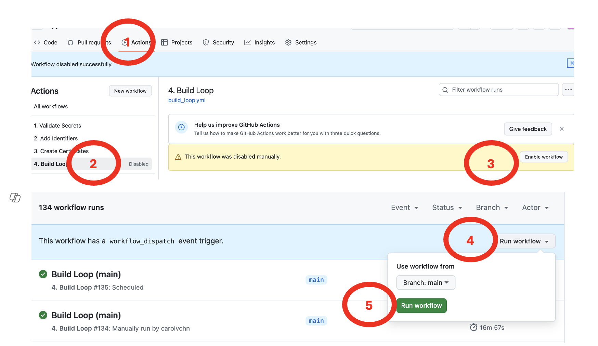

## Overview

**This page is only relevant when building with a browser.**

**For *Mac*, please see: [Update/Rebuild with *Mac*](../build/updating.md){: target="_blank" }**

> Regardless of build method, this is an **update** and will install over your existing app; your **settings are maintained including your current CGM and Pump.**

**For most, the *Loop* app is configured for automatic build, so you only need to come to this page if the automatic build failed.**

**WARNING: starting May 2025, [Manual Action for Automatic Build](automatic.md#manual-action-for-automatic-build){: target="_blank" } may be required - be sure to check monthly to see if you need to start a build manually.**

???+ info "Time Estimate (click to open/close)"
    Manually update and build the *Loop* App

    - 5 min: Check *Apple* account status
    - 5 min: Update version if a new one is available
    - 5 min: Start the Build
    - 1 hour: Wait for the build to complete and appear in the *TestFlight* app on your phone
        * depends on *GitHub*, *Apple* and *TestFlight*
    - 5 min: Install from *TestFlight* onto your phone

    Once a Year certificates must be renewed

    * With `Loop 3.6.0` and newer, certificate renewal is automatic once you [Add Variable](prepare-fork.md#add-variable){: target="_blank" }

    One Time: Complete the information for the Digital Service Act Compliance

    * This is a new requirement that must be completed one time
    * See [Digital Service Act Compliance](prepare-app.md#digital-service-act-compliance){: target="_blank" } for instructions

???+ abstract "Page Summary (click to open/close)"
    **The *Loop* app must be built at least every 90 days when you build with a browser - this is *TestFlight* requirement.**

    Most users will start at [How to Update or Rebuild](#how-to-update-or-rebuild):

    * If currently using verion 3.4.0 or newer, builds are automatic but you still need to do some actions:
        * Your *Apple Developer* account must be active
        * All agreements must be signed for your *Apple Developer* account
        * Once a year, you need to update renew certificates, but this is automatic with `Loop 3.6.0` and newer versions

    If you are running `Loop-dev`, be sure to review these instructions but modify for the branch you are using: refer to [Build Loop dev with Browser](build-dev-browser.md)

???+ question "FAQs (click to open/close)"
    - **"What is an update?"** Anytime you want to change versions or if your *TestFlight* build is about to expire, follow the instructions on this page.
    - **"Do I delete my old Loop app first?"** Definitely **not**! If you keep your Loop app on your phone, your Loop settings (and existing pod) will continue to work the same after the update. Seamless.
    - **"Do I need to start a new pod when I update?"** No. Your existing pod session will continue seamlessly if you are using the same Developer Account as the last time you built.
    - **"What if I'm using a new/different developer account?"** If you aren't building with the same developer account used when your existing app was built, then you will be installing a brand new (second) Loop app on your phone. Your existing pod won't work with the new app, so you might want to time this transition when you are due to change pods. Delete the old app once you get the new one all set up.
    - **Do I need a computer?** No.
    - **Can I do this on my phone?** Yes, especially after you update your *GitHub* token to `No Expiration`.
    - **How do I set my *GitHub* `Personal Access Token` to never expire and to support the automatic rebuild feature?** See this section [Regenerate Token](#regenerate-token).
    - **What happens to my existing builds when I change my *GitHub* Personal Access Token?** Nothing. The <code>GH_PAT</code> only affect future builds. Previous build are available for the full 90 days.

### When to Update or Rebuild

Under ordinary circumstances, you do not *have to* rebuild or update your *Loop* app until *TestFlight* forces you to (90 days). However, there is no harm in building more frequently.

* You control when the new app is installed on your phone, refer to: [Install on Phone: Disable Automatic Install from *TestFlight*](phone-install.md#disable-automatic-install-from-testflight){: target="_blank" }
* You always want a build available in the *TestFlight* app
    * You can use *TestFlight* to quickly install the app if you loose or break your phone and need to replace it
    * You can use *TestFlight* to quickly install the app if someone accidentally deletes the app from your phone

### How to Update or Rebuild

!!! abstract "Summary of Update Steps"
    1. [Accept Agreements](#accept-agreements)
    2. [Update `Fork`](#update-fork)
    3. [Build the *Loop* App](#build-the-loop-app)
    4. [Wait for *TestFlight*](#wait-for-testflight)
    5. [Install on Phone](#install-the-loop-app-on-the-phone)

    Ignore the email that says you need to fix "issues" in your app. You are not selling the app in the app store; so no action is required. The app you built is for personal use for you or a family member.

    There is also a helpful video for updating:

    * [How to Update and Rebuild DIY Loop with a Web Browser](https://www.youtube.com/watch?v=0ipTsiqbbrQ)

!!! important "How to Ask for Help"
    Updating with Browser Build should be pretty fast and often automatic.

    If you are having trouble:

    * [Click here to find help](bb-errors.md#help-with-errors){: target="_blank" }.

## Accept Agreements

> This is Step 1 of 5 - it may not always be necessary, but please check every time.

!!! warning "Wait After You Agree"
    It typically takes 15 minutes before your updated agreement is available so you can complete your build.

    If your build with browser fails, wait longer. An hour wait was reported by one person.

Sign in to your [Apple Developer account](https://developer.apple.com/account). If there are agreements you have not accepted, you will get errors when you try to Build that indicate your *Apple* <code>Secrets</code> are incorrect - that is very unlikely. You may also need to update your credit card information if it has changed, for example, if there is a new expiration date.

* For an update, you do not need to modify the <code>FASTLANE_ISSUER_ID</code>, <code>FASTLANE_KEY_ID</code> or <code>FASTLANE_KEY</code>
* Check your *Apple* Developer account for agreements, then continue

If you need detailed instructions, click on this [<code>Apple Program License Agreement</code> Help Page](https://support.pushpay.com/s/article/Accepting-the-Apple-Program-License-Agreement).

* Accept the `Apple Program License Agreement` (only)
    * You do NOT need to accept anything related to the `Paid Applications Schedule Agreement`
    * You do not need to provide banking or tax information
    * That is only required when you sell an app through the `App Store`

Digital Service Act Compliance

* Configure yourself as a non-trader
    * This is a new requirement that must be completed one time
    * See [Digital Service Act Compliance](prepare-app.md#digital-service-act-compliance){: target="_blank" } for instructions

## Update `Fork`

> This is Step 2 of 5 - it may not always be necessary, but please check every time.

Open your *GitHub* account and select your <code>LoopWorkspace repository</code> from your repositories list.

### Update from 3.2.x to 3.4

This should only be necessary if you are changing from an older, Mac-Xcode build of version 3.2.x to a Browser Build of 3.6.x. Most people are updating from 3.4.x to 3.6.x and should skip ahead to [Special Instructions for 3.6.0](#special-instructions-for-360).

For the update from 3.2.x to 3.6, you must do more than "just" build. If you skip this step - the build will fail.

* The `Identifier` for the "`widget`" changed from "`SmallStatusWidget`" to the more descriptive "`LoopWidgetExtension`"

> If you built version 3.3.0 (the `dev branch` before release of version 3.4) or newer, you can skip ahead to [Special Instructions for 3.6.0](#special-instructions-for-360).

You will (1) run [`Add Identifiers`](#add-identifiers), (2) [add the `App Group`](#add-app-group-to-new-identifier) to the new identifier, (3) run [`Create Certificates`](#create-certificates) and then (4) run [`Build Loop`](#build-the-app).

#### Add Identifiers

In your fork of LoopWorkspace:

* Run the Action: `Add Identifier`
* Wait for it to succeed

??? tip "Detailed instructions for `Add Identifier` (Click to open/close)"
    Refer to the graphic below for the numbered steps:

    1. Click on the `Actions` tab of your <code>LoopWorkspace</code> repository
    1. On the left side, click on 2. <code>Add Identifiers</code>
    1. On the right side, click `Run Workflow` to show a dropdown menu
        * You will see your default branch (typically this is `main`)
    1. Tap the green button that says `Run workflow`.

        {width="700"}
        {align="center"}

    The `Add Identifiers` &nbsp;Action&nbsp; should succeed or fail in a few minutes. Do not continue to the next step until this one succeeds.

    * If you see the green check (:octicons-check-circle-fill-16:{: .passed })  continue to the next section
    * If you see the red `X` (:octicons-x-circle-fill-16:{: .failed }):
        * [Action: Add Identifiers Errors](bb-errors.md#action-add-identifiers-errors){: target="_blank" } tells you what to search for in the file
        * Resolve the error and repeat `Add Identifiers`

#### Add `App Group` to New `Identifier`

Open the [Certificates, Identifiers & Profiles: Identifiers List](https://developer.apple.com/account/resources/identifiers/list){: target="_blank" } page.

Click on the "`LoopWidgetExtension`" identifier to open the `Edit Your App ID Configuration` screen.

| `NAME` | `IDENTIFIER` |
|-------|------------|
| `Loop Widget Extension` | `com.TEAMID.loopkit.Loop.LoopWidgetExtension` |

The graphic below has numbered steps that match these directions:

1. Looking at the `App Services` column, scroll down to the `App Groups` row and ensure the check box (under the `Capabilities column`) for `App Groups` is checked
2. If the word `Configure` shows up, tap on it
    * This opens the `App Group Assignment` screen
    * If it said `Edit` instead of `Configure` - you can click to confirm you have the correct App Group but won't need to continue or save if it is correct
3. Check the box by `Loop App Group` that uses your `TEAMID` in `group.com.TEAMID.loopkit.LoopGroup`
    * Note that if you previously built with Xcode, the name may be different, i.e., `XC group com TEAMID loopkit LoopGroup`
4. Tap `Continue`
5. Tap `Save`

{width="700"}
{align="center"}

If you did not need to make changes, the `Save` button will not be active.

* Tap on the `< All Identifiers` link at the top left

The full list of Identifiers should be displayed again.

!!! note "Other Identifiers"
    All other identifiers should be already set up.

    * If they are not, refer to [Configure to Use Browser: Add App Group to Identifiers](prepare-app.md#add-app-group-to-identifiers){: target="_blank" }

#### Create Certificates

You must run the action `Create Certificates` again because the `Identifiers` were updated. Wait for this to succeed before trying to build.

???+ tip "Detailed instructions (Click to open/close)"
    Refer to the graphic below for the numbered steps:

    1. Click on the "<code>Actions</code>" tab of your <code>LoopWorkspace</code> repository
    1. On the left side, click on "`Create Certificates`"
    1. On the right side, click "`Run Workflow`" to show a dropdown menu
        * You will see your default branch (typically `main`)
    1. Tap the green button that says "`Run workflow`".

        {width="700"}
        {align="center"}

    1. Wait a minute or two for the action to finish

### Special Instructions for 3.6.0

When updating to version 3.6.0, there are two "extra" things to do.

* [Add Variable](prepare-fork.md#add-variable){: target="_blank" } to enable automatic renewal of certificates
* Manually update (sync) the fork - as described in this section
    * With automatic build, you typically let the automatic process update the fork for you
    * In this case, a third-party repository was removed by *GitHub* at the same time version 3.6.0 was released - this change prevented any builds from working - including the automatic sync that normally happens

### Up to Date or Behind

The bullets below show typical messages when you are building the `main` branch. If you are building a different `branch`, the messages show that `branch name` instead of `main`.

* If your `fork` is up to date with LoopKit, you will see the message `This branch is up to date with LoopKit/LoopWorkspace:main` - there is no need to build again unless your Loop app in *TestFlight* is about to expire - in which case, proceed to [Build the *Loop* App](#build-the-loop-app)

* If your `fork` shows a message such as `This branch is 2 commits behind LoopKit/LoopWorkspace:main` and you want to update and build, then click `Sync Fork` by tapping where the red rectangle is shown in the graphic below, then in the pop-up window, tap on `Update branch` and if it succeeds, move on to [Build the *Loop* App](#build-the-loop-app)

{width="700"}
{align="center"}

### Ahead and Behind

* If your `fork` shows a message such as `This branch is 2 commits ahead, 16 commits behind LoopKit/LoopWorkspace:main`; you might need to manually resolve a conflict.
    * This can happen if you customized your build
    * Sometimes GitHub lets you keep your customizations while updating the `fork`
    * The GIF below is an example for the **LoopFollow** app
        * Frame 1 shows the repository is both ahead and behind
        * Frame 2 shows the `Sync Fork` option was selected
        * Frame 3 shows that GitHub was able to merge the new branch with existing customization
    * Tap on `Sync Fork` and then `Update branch` and if it succeeds, move on to [Build the *Loop* App](#build-the-loop-app)
    * Sometimes GitHub cannot figure out how to combine the incoming changes with the customizations, so you have to choose to `discard changes`; you can always customize again after the update

{width="700"}
{align="center"}

!!! question "Building a different branch"
    Do I need to do anything special to build a different branch?

    Yes: the update steps are the same, but review information on this page: [Build Loop dev with Browser](build-dev-browser.md){: target="_blank" }

## Build the *Loop* App

> This is Step 3 of 5 - this is always required.

#### Build the App

Refer to graphic below as you follow the steps to build the *Loop* app. The numbers highlighted in the graphic correspond to numbers in parentheses in the bullet list below:

* (1) Click on the `Actions` tab
* (2) Select the `4. Build Loop` workflow on the left
    * If using a mobile browser, be sure to use landscape mode to more closely match how *GitHub* looks on a computer.
* If you notice your build action is disabled, you must (3) click on `Enable workflow`
* (4) Look on the right and click `Run workflow` to  see the dropdown
* (5) Click on the green `Run workflow` button in the dropdown
* Wait ~25 min for the build to complete successfully
* It is then processed by *Apple* and sent to *TestFlight* (be patient)

{width="700"}
{align="center"}

#### What if the Build Fails

If a new release is announced at [Current Release](../version/releases.md#current-release){: target="_blank" }, look to see if there are instructions about extra steps required with the release. 

> When `Loop 3.6.0` is released, if you customized your Loop app, you may need to discard your customization and manually sync your `fork`. Check out the [Ahead and Behind](#ahead-and-behind) instructions.

If you are using the dev branch, the update steps are the same, but review information on this page: [Build Loop dev with Browser](build-dev-browser.md){: target="_blank" }.

Otherwise, head over to [Errors with Browser](bb-errors.md).

#### *Apple* Email to Ignore

You can ignore an email from *Apple* that there are things you must fix in your app:

*  There is no action you need to take - the developers will handle any updates that are required before it affects your ability to build the app
* Other warnings only address issues if you were selling the app in the app store, but it is for your own personal use

## Wait for *TestFlight*

> This is Step 4 of 5.

You'll receive an App Store Connect email confirming that the build has completed processing, and a *TestFlight* email confirming the new app is ready to test.

* If you get an email that the action failed, then return to your repository and look for Build Action error messages
    * Click on the most recent Build job with the red x by it
    * If the details show this message, [`Could not install WWDR certificate`](bb-errors.md#could-not-install-wwdr-certificate)
         * This means *Apple* did not reply to *GitHub* as fast as *GitHub* expected
         * Make sure your developer account is in good standing and that there are no agreements that need to be accepted
        * Repeat the build (previous step)

## Install the *Loop* app on the phone

> This is Step 5 of 5 - once you finish this, you are done and your app will last 90 days.

Open the *TestFlight* app on the Loopers phone and install the most recent version of the *Loop* app. Most Loopers have automatic update disabled on their phones, so this is a manual process. **Don't forget.**

The updated app will show up in your *TestFlight* app.

* Your new app will have "Expires in 90 days"
    * It takes time for the update to show up in the *TestFlight* app
    * There may be older builds that are still in *TestFlight*
    * Wait for the one that expires in about 90 days
* You will also see a build number in parentheses, that number increments each build

### *TestFlight* Automatic Update Disabled

Option 1: If you chose to [Disable Automatic Install from *TestFlight*](../browser/phone-install.md#disable-automatic-install-from-testflight), you control when to install the app on the phone.

* **This is the recommended option**
* Open *TestFlight* on your phone and click `Install` as shown in the GIF below
* If you are building for a child, follow the [*TestFlight* for a Child](phone-install.md#testflight-for-a-child) instructions again

{width="300"}
{align="center"}

### *TestFlight* Automatic Update Enabled

> We strongly recommend you toggle off Automatic Updates to allow you to be in full control over when the app is updated. This is even more important if you're using automatic builds from GitHub for version 3.3 or later.

Option 2: If you chose to enable Automatic Updates from *TestFlight* for the *Loop* app, the updated build will be installed over your existing app as soon as it uploaded to *TestFlight*.

* In this case, when you look at the *TestFlight* app on your phone, the app should have installed automatically
* Refer to the GIF above, the message will say `Open` instead of `Install`

## Other Information

### Choose Previous Build

If you are a typical user who just builds a single version for yourself or your child, you do not need to read this section.

This section provides detailed instructions if you want to choose a previous build to install on your phone. Typically, the most recent build is selected but there may be special cases:

* You are supporting multiple family members and may build different versions for each
* You want to test a different `branch` or set of customizations; you can install a previous build once you are done with the test

First open the *TestFlight* app on your phone and select the *Loop* app.

Near the bottom of the screen is a row labeled previous builds.

* Tap on the previous builds row
* The available builds are grouped by app version number, choose your desired version
* Typically you choose the most recent build for that version and click Install and then Open after installation completes
* All your settings should remain

The following graphic shows the view seen in the *TestFlight* app on the phone. If you choose to [Add Test Details to *TestFlight*](#add-test-details-to-testflight), you can have notes show up to help you decide which version to load.

{width="300"}
{align="center"}

### Modify `Personal Access Token`

If your `Personal Access Token` has not expired but does not have the correct permission, you should modify it. Do not regenerate it.

Click on the link to view your token and compare it to the graphic below.

* [Link to access your *GitHub* `Personal Access Token`](https://github.com/settings/tokens){: target="_blank" }

{width="600"}
{align="center"}

The graphic above has a blue rectangle added to indicate where you should see your token. If yours does not look like this, click on the link (`FastLane Access Token`) to open a new display. Watch the GIF below - there are 4 frames, the last one has the Update token button.

1. Click on the link (`FastLane Access Token`) to open a new display
1. This example has no workflow or repo checks in it
1. Add a check to the workflow box
1. Scroll all the way to the bottom of the screen and click on the green `Update token` button

{width="600"}
{align="center"}

After you click on the `Update token` button, your `FastLane Access Token` should now show `repo, workflow` and look like the earlier graphic above.

The only reason to regenerate a token is if it is set to expire. Do not do the next section unless you have to.

### Regenerate Token

If your `Personal Access Token` has expired or has an expiration date, you can regenerate the new one at any time.

!!! tip "Update new GH_PAT to <code>Secrets</code>"
    After you get your new token, immediately add it to your <code>Secrets</code> for any app you build with this method. You don't have to rebuild the app, but it's a good idea to at least run `Action 1. Validate Secrets` for each repository to make sure you did not make a mistake.

    This might be a good time to [Switch to a GitHub Organization](prepare-fork.md#switch-to-a-github-organization){: target="_blank" }.

You can regenerate your *GitHub* `Personal Access Token` at any time by clicking on the link below. (it will open in a new browser tab.)

* [Link to access your *GitHub* Personal Access Token](https://github.com/settings/tokens)

The `FastLane Access Token` is a clickable link.

{width="600"}
{align="center"}

After you click on `FastLane Access Token` your screen should be similar to the graphic below.

Note - selecting the `workflow` check box below is new. If yours does not show that selection, add it before you click on Regenerate token (red highlight in graphic below).

{width="600"}
{align="center"}

Click on Regenerate token (red highlight in previous graphic) to see screen similar to next graphic. 

* Most Loopers will have classic personal access tokens
    * If you are a developer who needs to use the fine-grained (by repository) option, that's fine

Be sure to change the Expiration from `30 days` to `No Expiration`. When you select `No Expiration`, a *GitHub* warning appears. Click on the green `Regenerate Token` button (red highlight in following graphic).

{width="600"}
{align="center"}

The next screen shows your new token. Copy the token using the copy icon and save it along with your other secret settings.

{width="600"}
{align="center"}

The next step is to update GH_PAT in your <code>Secrets</code>. (If you build other apps with this method - update the GH_PAT for all of them right now - do not forget.)

### Update <code>Secrets</code>

This example is for updating GH_PAT in the <code>Secrets</code> for your `repository`, but the same method can be applied when changing any of the <code>Secrets</code>. It uses a personal account, instead of an organization. So it shows changing the `Secret` for a specific repository and would need to be repeated for every repository you use. This might be a good time to [Switch to a GitHub Organization](prepare-fork.md#switch-to-a-github-organization){: target="_blank" }.

Open the `repository` for which you will update <code>Secrets</code>. On the far right is a Settings selection. If you don't see Settings (if last item on row is Insights), then you are **not** on your `fork` or you need to sign in to your *GitHub* account. You should see `username/LoopWorkspace` with `forked` from `LoopKit/LoopWorkspace` underneath.

Refer to the GIF for help. There are 3 frames.

{width="500"}
{align="center"}

1. Tap on Settings, then scroll down until you see `Secrets and variables` on the left side and click on the drop down indicator to display `Actions`.
1. Keep scrolling on the same screen, past the `Action secrets / New secret` row, until you see the list of your current <code>Secrets</code>.
1. Click on the GH_PAT, tap on the pencil and enter the new token in the form. Click on Update Secret to complete the action.

Scroll all the way to the top of the screen and tap on your LoopWorkspace link. Then follow the [How to Update or Rebuild](#how-to-update-or-rebuild) instructions to start a new build.

### Add Test Details to *TestFlight*

About half an hour after the build action completes, the new build will appear in the TestFlight screen at this link: [App Store Connect / Apps](https://appstoreconnect.apple.com/apps)

* Log in if needed
* Select your *Loop* app
* Click on the `TestFlight` tab to see a screen similar to the graphic below

{width="700"}
{align="center"}

Select the build to which you wish to add testing notes. When you tap on that icon, it opens a screen similar to that in the next graphic.

{width="700"}
{align="center"}

Click inside the box under **Test Details**. Insert the text you want to see on the phone before you install this version of the app. Tap the <code>Save</code> button at upper right and then <code>< iOS Builds</code> at upper left.

In this example, the branch and commit number are included followed by an indication that this version includes the customizations preferred by this person. Your test details can be as simple as "Use this for Charlie".

!!! tip "Commit Number"
    If your build includes customizations, your commit number will not match what the developer expects to see if you need to ask for help.

    Use this section [Customization and SHA-1](edit-browser.md#customization-and-sha-1) to determine the SHA-1 before customization.

## No Longer Needed

This section contains the old directions to manually renew certificates. It is no longer needed with the automatic certificate renewal method found in `Loop 3.6.0` and newer versions.

## Renew Certificate

Manual certificate renewal is not longer required if you added the `Variable` `ENABLE_NUKE_CERTS`. See [Add Variable](prepare-fork.md#add-variable){: target="_blank" }.

**Apps in TestFlight are not affected when a certificate expires or is revoked.**

* Apps installed on the phone continue to run
* Apps can be installed from TestFlight onto a phone up through the TestFlight expiration date
* You just cannot build a new app until a new Certificate is generated

??? question "Do you want to know more? (Click to open/close)"
    This is only a summary - please follow the detailed steps below carefully.

    * Delete all your certificates that say the type is `Distribution`. Apple only allows you to have 2 of these. So get rid of the old ones so you will be able to create a new one that will last a full year. (Step 1 below.)

    * Some people have `Distribution Managed` types listed. These are cloud-managed. An internet search finds this quote: "My general approach to cloud-managed certificates is to ignore them and let Apple’s infrastructure do its thing."

    * The Certificate in question is embedded in your `Match-Secrets repository`. In order to proceed, you need to remove the old certificate from `Match-Secrets`.

    * Finally, for every app that you build with this method, you need to run `Create Certificates` for that app. (Step 4 below.)

### Manual Steps to Renew Your `Distribution Certificate`

> If you are coming here because you build an app, like *xDrip4iOS*, without automatic renewal, these steps will work for you.

Manual certificate renewal is no longer required if you added the `Variable` `ENABLE_NUKE_CERTS`. See [Add Variable](prepare-fork.md#add-variable){: target="_blank" }.

1. Use this link to view your [Apple Developer Certificates](https://developer.apple.com/account/resources/certificates/list)
    * If your screen shows no Certificates and you see a message "Getting Started with Certificates", your certificate already expired and was removed by *Apple*; so skip ahead to Step 2: Navigate to your `Match-Secrets` Repository
    * Carefully examine the `Type` column - do **not** delete a certificate with type of `Development`
        * If you do not have any rows that say the type is `Distribution`, your certificate already expired and was removed by *Apple*; so skip ahead to Step 2
        * If your certificate has an expiration date several months in the future - you can wait and renew your certificate later; skip ahead to [Update `Fork`](#update-fork)
    * Click each row that has a type of `Distribution` and revoke it
    * You will get an email informing you the certificate was revoked
    * You can ignore rows with a type of `Distribution Managed`
1. Navigate to your `Match-Secrets` Repository
    * You can do this several ways, but one method is demonstrated by the GIF below
    * Open the URL for your *GitHub* account (address is `https://github.com/username` where `username` is replaced by your *GitHub* username
    * Click on the Repositories Tab
    * Select Match-Secrets

    {width="650"}
    {align="center"}

1. Delete the `certs/distribution` folder of your `Match-Secrets` `repository` using these instructions. The GIF below indicates the places to click with numbered red rectangles:
    * Frame 1: Click 1 on the folder called `certs/distribution`
    * Frame 2: Click 2 and 3 on the three dots in the upper right and then `Delete directory`
    * Frame 3: Click 4 and 5 on `Commit changes` in the upper right and then accept the suggested choice by clicking on `Commit changes` in the lower right

    {width="650"}
    {align="center"}

    !!! question "Deleting the certs/distribution folder did not work for me"
        Some people reported trouble with this step. The other option is to delete and create a new `Match-Secrets` repository: see [Delete `Match-Secrets`](bb-errors.md#delete-match-secrets){: target="_blank" }

1. While still within your *Github* account, navigate to your fork of LoopWorkspace.
    * You can do this several ways, but one method is demonstrated by the GIF below
    * Click on your username and then `Repositories` and select `LoopWorkspace`
    * Once you are on your LoopWorkspace repository, click on the link below and follow the instructions provided to create your certificates.
    * Run the [`Action`: `Create Certificates`](certs.md#create-certificates){: target="_blank" }

    {width="650"}
    {align="center"}
