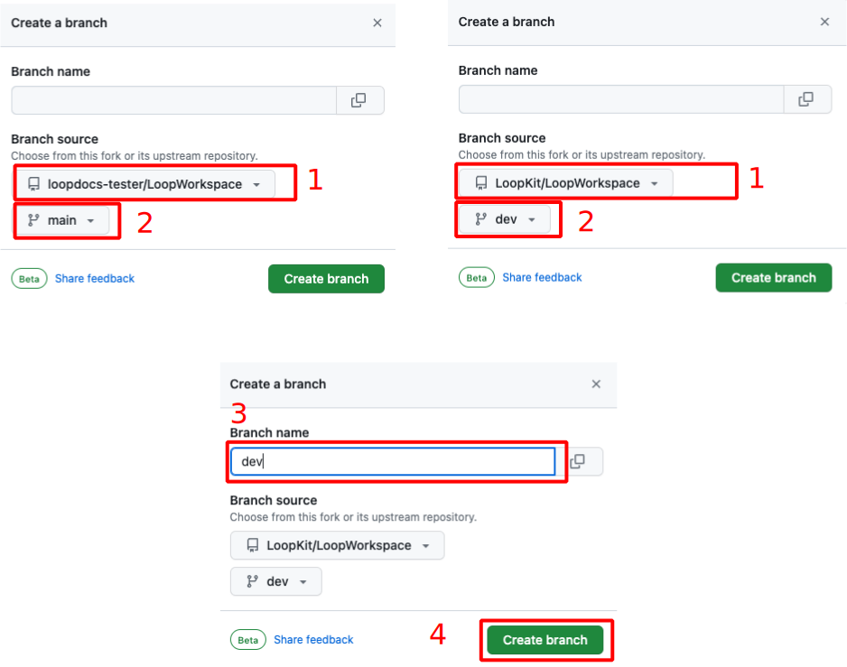
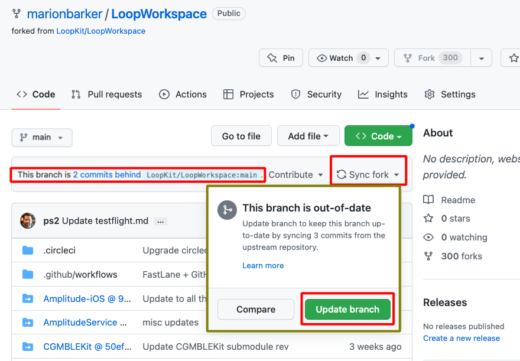
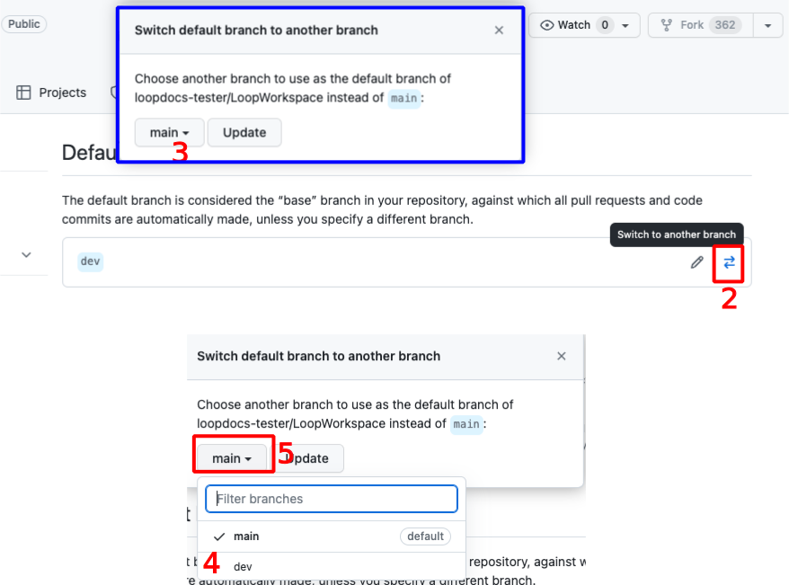
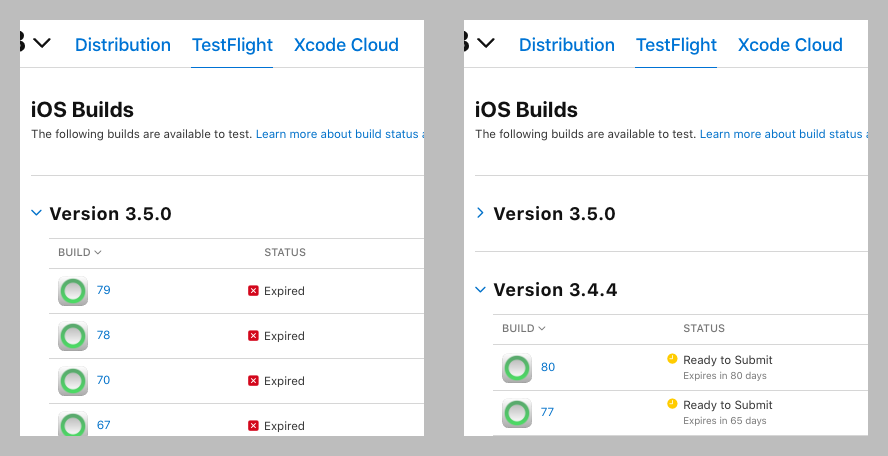

## Overview

**This page is only relevant when building the `dev` branch with a browser.**

**For *Mac*, please see: [Build Loop `dev` with *Mac*](../build/build-dev-mac.md)**

**No matter the method used to build Loop-dev, you are testing development code. Please read this link now before continuing.**

* **[What's going on in the `dev` branch](../version/development.md#whats-going-on-in-the-dev-branch)**

## Build Development Version

!!! warning "For Experienced Builders"
    Building the development (`dev` branch) is not typically used for your first attempt at building the *Loop* app.

    The instructions on this page assume you are familiar with building the *Loop* app using a browser as detailed on [Configure to use Browser](intro-summary.md)

    * You should be following along with zulipchat when using the `dev branch`
    * Summary build updates can be found under the [One-Time Changes](#one-time-changes) section

You can build any desired branch (available at LoopKit/LoopWorkspace) using the *GitHub* Browser build method. This section is suitable if you have already built either `dev` or main branch using the [GitHub First-Time](intro-summary.md){: target="_blank" } instructions.

The graphics on this page show the `dev` branch. If you want a different branch, just substitute that branch name for `dev`.

!!! tip "Overview of what you will do"
    1. Your `LoopWorkspace fork` must have the `branch` you want
        * You will either add it or make sure it is up to date
        * You cannot just rename your existing branch to `dev` - you must get the `dev` branch from LoopKit
    1. When you select the action `4. Build Loop` and then click on the `Run Workflow` dropdown, you must select `dev` there before clicking the green `Run workflow` button - see [Build `Branch`](#build-branch)

### Check Current `Branch`

Your `LoopWorkspace fork` is at `https://github.com/username/LoopWorkspace` where you substitute your actual *GitHub* `username`. You need to be logged into *GitHub*. Review the graphic below as you go through the steps.

1. Click on the `branch` icon to display the `branches` as shown in the lower half of the graphic below:
    * If the `branch` you want is not listed, then continue with Step 2
    * Otherwise, skip ahead to [Update `Branch`](#update-branch)
1. Click on the `New branch` button and follow the [Add `Branch`](#add-branch) steps

{width="700"}
{align="center"}

### Add `Branch`

Each step in the list below matches with the number in the graphic. In the top half of the graphic, the left side shows the initial display and the right side shows the display after making the indicated selections:

1. Click on the drop down menu labeled 1 in the graphic and choose LoopKit/LoopWorkspace as show in the top right graphic
2. Click on the drop down menu labeled 2 in the graphic and choose `dev`
3. Click on the `Branch` name box labeled 3 in the graphic and type `dev`
    * The branch name in your `fork` should always match the branch name you are adding; check that you type it correctly
4. Review the dialog items to make sure everything is correct and then tap on Create branch

{width="700"}
{align="center"}

### Update `Branch`

> **If you normally build released code, but decided to build the `dev branch` because you want the features and bug fixes found there, please do not update the fork for the `dev branch` without first finding out what has changed since your last build.**

Tap the `Code` button (upper left) and ensure this branch in your `fork` is up to date.

* Select the desired branch in the dropdown menu (this graphic shows `dev` branch)
* If the message indicates this branch is "behind", tap on the sync `fork` button and then the Update branch button

{width="700"}
{align="center"}

### One-Time Changes

Look in this section for one-time changes for building `dev` with a browser that require special, one-time actions.

No one-time changes are required. This assumes you built main after the release of 3.6.

### Build `Branch`

> **We recommend most users leave their default branch as `main`.**

If you have one branch as default, for example `main`, and choose to build a different branch, there is an extra step when you `Build Loop`. In addition to the normal steps 1, 2 and 3 in the graphic below, you must also do the (optional) step. Select the `dev branch` in the `branch dropdown` menu before continuing to step 4 and tapping on the green Run workflow button.

{width="700"}
{align="center"}

#### Refresh, Do Not Repeat

!!! tip "Hit Refresh"
    After you tap the green Run workflow button, *GitHub* can be slow to update.

    * Refresh the browser if you are unsure if the action started
    * Do not start a new action until the first one completes

## Automatic Update & Build

The [Automatic Update & Build](automatic.md){: target="_blank" } features are applied to the default branch of your repository. Normally this is the `main` branch. If you are a developer or tester who wants the `dev` branch to be built automatically, you must configure it as your default branch. Be aware that for this situation, you will not get automatic updates of released code.

Most people should keep `main` as default and make a considered decision when to launch a manual build of the `dev` branch. At that time, it will automatically update to the latest `dev` commit unless you have modified your settings with special `Variables`: [Modify Automatic Building](automatic.md#modify-automatic-building){: target="_blank" }.

## Change Default `Branch`

> **We recommend most users leave their default branch as `main`.**

There can be several reasons why you would change your default branch.

* It can be convenient to have the branch you build most be configured as the default branch
* The branch you want to build has a different workflow than your default branch (not typical)
    * In this case, you **must** modify the default branch
    * Check the zulipchat conversation about the branch you are testing to see if it is necessary to make it default

These are the steps to modify the default branch.

For this example, we show how to change from a default branch of `main` to a default branch of `dev`. Note - only the owner of the repository can take this action and they must be logged in. Otherwise the Settings tab does not appear.

For the numbered steps below, refer to the graphic found under each group of steps.

1. Click on the Settings Icon near the top right of your LoopWorkspace
    * You may need to scroll down to see the `Default Branch` as shown in the graphic
    * Do not tap on the Branches tab to the left under Code and Automation, that is not the correct menu

    {width="700"}
    {align="center"}

1. To the right of the default branch name there is a pencil and a left-right arrow icon
    * Tap on the left-right arrow icon to bring up the `Switch default branch to another branch` dialog
1. Click on the dropdown next to the current default branch, in this example, `main`
1. Select the desired default branch, in this example, `dev`
1. Click on the `Update` button

    {width="700"}
    {align="center"}

1. You will be presented with an are-you-sure question.
    * Click on the red `I understand, update the default branch.` button

    {width="400"}
    {align="center"}

Your default branch has been changed.

## Automatic Update & Build

The automatic update and build features are available for both the released (`main`) and development (`dev`) branch, but only for your default branch. For any other branch name set as your default branch, there is no automatic update available but the automatic build will run monthly.

Be sure to read this page: [Automatic Update & Build](automatic.md){: target="_blank" }.

## What Happens in TestFlight

As soon as you build one version of the app from the `dev` branch, that version number (which is higher than the `main` branch) will show up at the top of the available builds in TestFlight.

Suppose you then return to using the `main` branch after your excursion to the `dev` branch.

> *For this example, version 3.6.x is the released version from the `main` branch and version 3.7.x is the development version you evaluated.*

Every time you open TestFlight on your phone and select the *Loop* app, it will offer the most recent 3.7.x version to be installed if you just tap **Install**. You might be in a situation where that build is about to expire or you decide you don't want to test this on your looping phone.

You have your choice:

* You can manually go into TestFlight on your phone each time `main` is automatically built, Select Previous Builds, then choose 3.6.x and install the top listing
* You can log in at: [App Store Connect: Apps](https://appstoreconnect.apple.com/apps)
    * Select your *Loop* app
    * Click on the TestFlight tab
    * For each 3.7 build, click on the row for a build
        * Select Expire Build on upper right
    * This leaves only the released version, 3.6.x for this example, available in TestFlight on your phone

> The example graphic below was created when 3.4.4 was the released version

{width="700"}
{align="center"}

