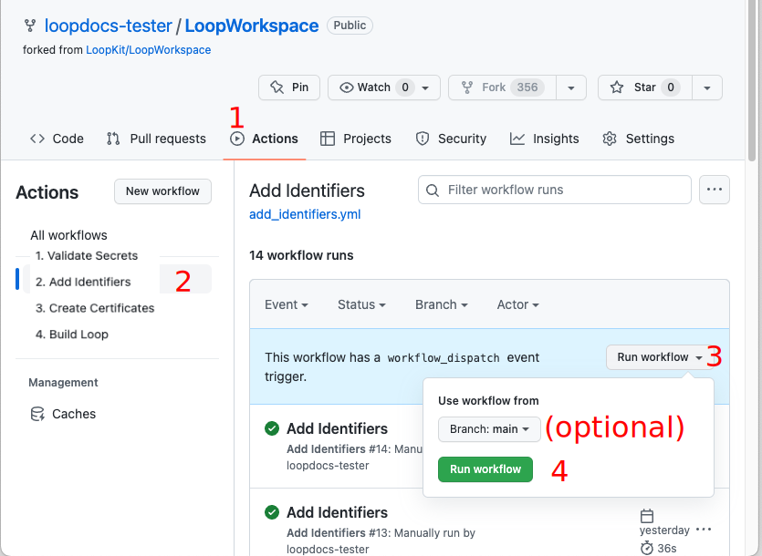
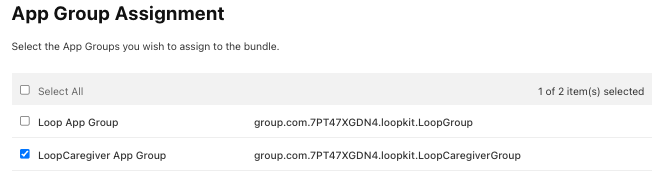
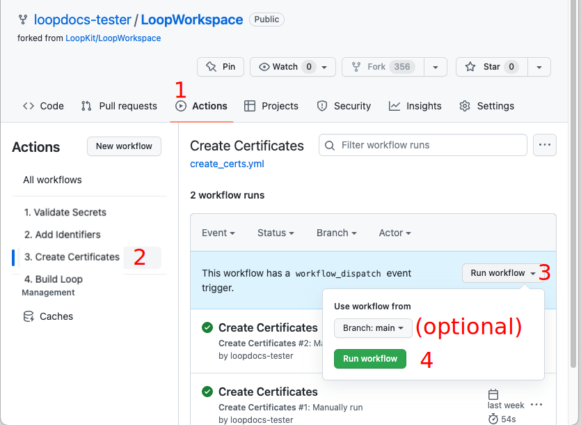

## Build Other Apps using a Browser

Once Loop 3 was released with the ability to build using a browser, a lot of other apps in the DIY universe added the same feature.

**Only apps that are companions to&nbsp;_Loop_&nbsp;are included on this page.**

* _LoopCaregiver_
* _LoopFollow_

If you want to build another DIY app that is not included here, look for the file `fastlane/testflight.md` in the *GitHub* repository associated with that app and open it in a browser. The instructions for that app should be located in that file.

The same technique is used and the same six <code>Secrets</code> are used for many Open-Source apps. Over time, it is expected that more apps will use the `variable` ENABLE_NUKE_CERTS to allow automatic creation and update of the required certificates.

* Did you start building with your personal account and want to switch to the recommended organization account for buiding?: [Switch to a GitHub Organization Account](#switch-to-a-github-organization-account)

### Updating / Rebuilding Other Apps

If you are coming to this page to update one of the other apps, follow the [How to Update or Rebuild](bb-update.md#how-to-update-or-rebuild){: target="_blank" } instructions provided for the *Loop* app, but substitute the repository name for the app you want to rebuild for all references to&nbsp;*LoopWorkspace*.

> If you have not added the `Variable` `ENABLE_NUKE_CERTS`, do it now. See [Add Variable](prepare-fork.md#add-variable){: target="_blank" }.

**WARNING: starting May 2025, [Manual Action for Automatic Build](automatic.md#manual-action-for-automatic-build){: target="_blank" } may be required - be sure to check monthly to see if you need to start a build manually.**

### Multiple Copies of `LoopFollow`

For the convenience of caregivers who use `LoopFollow` to monitor multiple people, updates were added in v2.1.2 to make this more convenient. This works regardless of the build method. (Build with Browser or [Build with *Mac*](https://www.loopandlearn.org/loop-follow#lf-script){: target="_blank" }).

* Build up to three instances of `LoopFollow`
* Customize the name of the app that appears on your phone
* Display the custom name in the main `LoopFollow` screen

### Prerequisites

* If you have already built using the Browser Build method, it is easy to build other apps which use the same method. Skip ahead to [Fork and Add Secrets](#fork-and-add-secrets).

* If this is the first repository you have built with the Browser Build method

    * Begin reading at [Configure to Use Browser: Introduction and Summary](intro-summary.md){: target="_blank" }
    * Follow all the instructions on the [Collect Secrets](secrets.md){: target="_blank" } page
    * After all your secrets are collected, continue on this page with [Fork and Add Secrets](#fork-and-add-secrets).

## Fork and Add Secrets

> If you are not using an organization, stop and reconsider. This page assumes an organization and that you have added your `Secrets` and your `Variable` to your organization. If not, then for every app you `fork` you must individually add those to the repository in your personal account.

You will return to this page after reviewing (but not doing) this step [Configure to Use Browser: Fork LoopWorkspace](prepare-fork.md#fork-loopworkspace){: target="_blank" }

* Use the same method as that section, but `fork` the `repository` for the app you plan to build to your *GitHub* organization
* _LoopCaregiver_, expect the `dev branch`
* _LoopFollow_, expect the `main branch`

### Table of App `Repositories`

| App | Fork from this Address | Documentation |
|---|---|---|
| LoopCaregiver | [https://github.com/LoopKit/LoopCaregiver](https://github.com/LoopKit/LoopCaregiver) | [LoopDocs: LoopCaregiver](../nightscout/loop-caregiver.md) |
| LoopFollow | [https://github.com/loopandlearn/LoopFollow](https://github.com/loopandlearn/LoopFollow) | [LoopFollow](https://www.loopandlearn.org/loop-follow)|

??? tips "LoopFollow Builders: Display Name (Click to Open/Close)"
    * Would you like the name of your LoopFollow app to be personalized?
    * Do you have more than one Looper, so you are using LoopFollow_Second or LoopFollow_Third?
    * The 3 LoopFollow repositories enable you to customize the name shown on your phone

    After you `fork` your *LoopFollow* repository, find the file named: `LoopFollowDisplayNameConfig.xcconfig`

    * Open it in your browser
    * Follow the directions to change `display_name`
        * "Save the file" means commit the change to your `main` branch
        * It is recommended that you use LF_name, where name is the customized name - that way you can find it in an alphabetic list of apps

The two repositories below are only if you need to follow a second or third looper. All others should use just the table above. The instructions for the second and third looper are otherwise identical to the first looper. Note that `LoopCaregiver` can follow multiple Loopers; you select the person inside the app.

| Special Case | Fork from this Address |
|---|---|
| LoopFollow for a Second Looper | [https://github.com/loopandlearn/LoopFollow_Second](https://github.com/loopandlearn/LoopFollow_Second) |
| LoopFollow for a Third Looper | [https://github.com/loopandlearn/LoopFollow_Third](https://github.com/loopandlearn/LoopFollow_Third) |

## Configure <code>Secrets</code> for this App

**When using a *GitHub* organization, you skip this section**:

* All `repositories` in your *GitHub* organization use the organization <code>Secrets and Variables</code>
* If you have not already completed [Add <code>Secrets</code> to your *GitHub* Organization](#add-secrets-to-your-github-organization), do it now
* Skip ahead to [Add Identifiers](#add-identifiers)

### Using a Personal *GitHub* Account

After successfully creating your fork of the repository for this app:

* If you have already built Loop using the Browser Build method, skip ahead to [Add Existing <code>Secrets</code>](#add-existing-secrets)

* If this is the first repository you have built with *GitHub*
    * You should follow the detailed steps at [Configure to Use Browser: Configure <code>Secrets</code>](../browser/prepare-fork.md#configure-secrets){: target="_blank" }, except you will apply the <code>Secrets</code> to the repository for the app you are planning to build
    * Once your 6 secrets have been added, return to this page and skip ahead to [Validate <code>Secrets</code>](#validate-secrets) on this page.

#### Add Existing <code>Secrets</code>

Open the text file in which you maintain a copy of your 6 <code>Secrets</code> so you can copy each value into the <code>Secrets</code> for this repository.

1. Click on the repository for your app
1. Click on the Settings Icon near the top right of your repository
    * On the left side, tap on `Secrets and variables` dropdown and choose Actions
    * After you select Actions, your screen should look like the graphic below

    {width="700"}
    {align="center"}

1. Tap on `New secret` and add each of the 6 <code>Secrets</code>
    * You will notices the New secret dialog looks a little different
    * As soon as you click on the Name* Box, the 6 Secret Names may show up as a dropdown as shown in the graphic below
    * Select each one in turn and paste the secret value into the Secret* box and hit Add secret
    * If they do not appear in a dropdown, enter them exactly as shown (suggest copy / paste from your text file)

    {width="500"}
    {align="center"}

Be sure to [Add Variable](prepare-fork.md#add-variable){: target="_blank" } to the repository as well as `Secrets` to enable automatic certificate creation.

Once the <code>Secrets</code> and `Variable` are added, proceed to the first Action to validate your secrets.

## Validate <code>Secrets</code>

The first action step is to Validate <code>Secrets</code>. Near the top middle of your Repository fork, click on the `Actions` tab.

* The first time you click on `Actions` with this repository you'll be informed that `Workflows aren't being run on this forked repository`
* Tap on the green button that says: `I understand my workflows, go ahead and enable them`

The workflows are now displayed: look at the list on the left side similar to that shown in the graphic below. (You can dismiss the Actions Enabled message using the X near the upper right side if it appears).

* The graphic below is an example from Loop, your screen will show your app and associated repository

This step validates most of your six <code>Secrets</code> and provides error messages if it detects an issue with one or more.

1. Click on the "Actions" tab of your  *LoopFollow*  or  *LoopCaregiver* repository and enable workflows if needed
1. On the left side, click on 1. <code>Validate Secrets</code>
1. On the right side, click `Run Workflow` to show a dropdown menu
    * You will see your default branch (`main` for LoopFollow, `dev` for LoopCaregiver)
    * You can select a different branch, but typically, you run the default
1. Tap the green button that says `Run workflow`.

{width="700"}
{align="center"}

The `Validate Secrets` &nbsp;Action&nbsp; should succeed or fail in a few minutes. Do not continue to the next step until this one succeeds.

* If you see the green check (:octicons-check-circle-fill-16:{: .passed })  continue to the next section
* If you see the red `X` (:octicons-x-circle-fill-16:{: .failed }):
    * Use the Browser Build Errors page to resolve the error, then repeat the Action
    * [Quick Reference for Browser Build Errors](bb-errors.md#quick-reference-for-browser-build-errors){: target="_blank" }

## Add Identifiers

!!! important "Add Identifiers were Temporarily Unavailable"
    The Add Identifiers action stopped working for a time. The timing for the release of the fix for LoopCaregiver may be delayed slightly. It is fixed for dev branch of LoopFollow and will be released to LoopFollow main soon.

    If you are a new builder and Add Identifiers does not work - please wait a day or two and try again.

Near the top middle of your Repository fork, click on the "Actions" tab.

* If this is the first `Action` you run with this repository you'll be informed that `Workflows aren't being run on this forked repository`
    * Tap on the green button that says: `I understand my workflows, go ahead and enable them`
* The graphic below is an example from Loop, your screen will show your app and associated repository

Refer to the graphic below for the numbered steps:

1. Click on the "Actions" tab of your repository
1. On the left side, click on "Add Identifiers"
1. On the right side, click "Run Workflow" to show a dropdown menu
    * You will see your default branch (`main` for LoopFollow, `dev` for LoopCaregiver)
    * You can select a different branch, but typically, you run the default
1. Tap the green button that says "Run workflow"

    {width="700"}
    {align="center"}

The `Add Identifier` &nbsp;Action&nbsp; should succeed or fail in a few minutes.

* If you see the green check (:octicons-check-circle-fill-16:{: .passed })  continue to the next section
* If you see the red `X` (:octicons-x-circle-fill-16:{: .failed }):
    * Use the Browser Build Errors page to resolve the error, then repeat the Action
    * [Quick Reference for Browser Build Errors](bb-errors.md#quick-reference-for-browser-build-errors){: target="_blank" }

## Review App Identifier

Open this link: [Certificates, Identifiers & Profiles: Identifiers List](https://developer.apple.com/account/resources/identifiers/list){: target="_blank" } on the apple developer site.

After successfully performing the `Add Identifiers Action`, you will see the identifier for your app with a Name and Bundle ID matching that in the table below. You will see your unique TEAMID embedded in the identifier. (If you previously built this App with Xcode, the name may start with XC but the ending should match.)

| App Name | Name | Bundle ID |
| --- | --- | --- |
| LoopCaregiver | LoopCaregiver | com.TEAMID.loopkit.LoopCaregiver |
| LoopFollow | LoopFollow | com.TEAMID.LoopFollow |

> If you build from a second or third `repository` for `LoopFollow`, the Name will end in `Second` or `Third` and Bundle ID will have `.Second` or `.Third` at the end.

The *LoopCaregiver* app requires updates to the `Identifiers` after they are generated.

The *LoopFollow* app does not require this extra step. You can skip ahead to [Create App in App Store Connect](#create-app-in-app-store-connect). The *LoopFollow* app does not require any special capabilities.

## Add `App Group` to `LoopCaregiver`

The *LoopCaregiver* app requires the addition of an `App Group` to each of its list of `Identifiers`. Follow these steps one time to be able to build the *LoopCaregiver* app.

### Check if `App Group` Exists

Open this link to view your `applicationGroup` `Identifiers`: [`App Group Identifiers`](https://developer.apple.com/account/resources/identifiers/list/applicationGroup){: target="_blank" }

* No action is required if there is already an identifier with the `NAME` of `LoopCaregiver App Group` and the `IDENTIFIER` contains your `TEAMID` in this format: `group.com.TEAMID.loopkit.LoopCaregiverGroup`
* In that case, you can skip ahead to [Add `App Group` to `Identifiers`](#add-app-group-to-identifiers)

### Create `App Group` for the *LoopCaregiver* App

Open this link: [Register an App Group](https://developer.apple.com/account/resources/identifiers/applicationGroup/add/){: target="_blank" } on the *Apple Developer* site.

1. For **`Description`**, use `LoopCaregiver App Group`
1. For **`Identifier`**, enter `group.com.TEAMID.loopkit.LoopCaregiverGroup`, substituting your team id for `TEAMID`.
1. Double-check the spelling - your `TEAMID` must be correct and the `LoopCaregiverGroup` *App Group* must match the format shown above
    * A mistake here means you will not be able to build the *LoopCaregiver* app until you fix it
1. Click `Continue` and then `Register`.

### Add `App Group` to `Identifiers`

Click to open this link in a new tab: [`Certificates, Identifiers & Profiles: Identifiers List`](https://developer.apple.com/account/resources/identifiers/list){: target="_blank" } on the *Apple Developer* site.

#### Table with Name and Identifier for `LoopCaregiver`

All five of these identifiers should be found after running the `Add Identifier` action on *GitHub*.

If you do not see them, please sync your `LoopCaregiver` repository and then run the [`Add Identifier` action](identifiers.md#add-identifiers). The **`NAME`** might begin with an `XC` if you previously built with Xcode. However, the **`IDENTIFIER`** column value should match.

| `NAME` | `IDENTIFIER` |
|-------|------------|
| `LoopCaregiver` | `com.TEAMID.loopkit.LoopCaregiver` |
| `LoopCaregiverIntentExtension` | `com.TEAMID.loopkit.LoopCaregiver.IntentExtension` |
| `LoopCaregiverWatch` | `com.TEAMID.loopkit.LoopCaregiver.watchkitapp` |
| `LoopCaregiverWatchWidgetExtension` | `com.TEAMID.loopkit.LoopCaregiver.watchkitapp.WidgetExtension` |
| `LoopCaregiverWidgetExtension` | `com.TEAMID.loopkit.LoopCaregiver.WidgetExtension` |

The *LoopCaregiver* app requires capabilities be associated with the Identifiers. When Add Identifiers is working, this is handled for you. The annotation box below is only for the special case where you must configure Identifiers manually.

??? abstract "Capabilities for Each LoopCaregiver Identifier (Click to open/close)"
    When <code>Action: Add Identifiers</code> is working, you do not need this information. If you ever need to manually create the Identiers, the table below lists the required capabilities. For the App Group, you must first add that capability and update the Identifier and then modify the Identifier a second time to add the LoopCaregiver App Group as directed in the next section.

    | NAME | IDENTIFIER | Capabilities |
    |:--|:--|:--|
    | `LoopCaregiver` | `com.TEAMID.loopkit.LoopCaregiver` | App Groups  |
    | `LoopCaregiverIntentExtension` | `com.TEAMID.loopkit.LoopCaregiver.IntentExtension` | App Groups  |
    | `LoopCaregiverWatch` | `com.TEAMID.loopkit.LoopCaregiver.watchkitapp` | App Groups  |
    | `LoopCaregiverWatchWidgetExtension` | `com.TEAMID.loopkit.LoopCaregiver.watchkitapp.WidgetExtension` | App Groups  |
    | `LoopCaregiverWidgetExtension` | `com.TEAMID.loopkit.LoopCaregiver.WidgetExtension` | App Groups  |

### Add `LoopCaregiverGroup` to each Identifier

Find and click on the row for the `LoopCaregiver` on the [Certificates, Identifiers & Profiles: Identifiers List](https://developer.apple.com/account/resources/identifiers/list){: target="_blank" } page. Look in the **`IDENTIFIER`** column to find `com.TEAMID.loopkit.LoopCaregiver`. The **`NAME`** might begin with an `XC` if you previously built with Xcode. However, the **`IDENTIFIER`** column value should match.

| `NAME` | `IDENTIFIER` |
|-------|------------|
| `LoopCaregiver` | `com.TEAMID.loopkit.LoopCaregiver` |

The `Edit Your App ID Configuration` screen will open.

1. In the `App Services` column, scroll down to the `App Groups` row
    * Ensure the check box (under the `Capabilities` column) for `App Groups` is checked
    * Tap on the word `Edit` or `Configure`, whichever shows up
        * This opens the `App Group Assignment` screen
        * Check the box by `LoopCaregiver` *App Group* that uses your `TEAMID` in `group.com.TEAMID.loopkit.LoopCaregiver`
        * If the box by `Loop App Group` is checked, you should uncheck it
        * Your screen should be similar to the graphic below
        * If you made any changes, tap `Continue`, otherwise, tap `Cancel`

    {width="600"}
    {align="center"}

2. If you modified settings for an *identifier*, the `Save` button at the top right will become active. Click on `Save` before leaving this page - otherwise, the change does not take effect.

    * Tap on `Save`
    * This opens the `Modify App Capabilities` confirmation screen
    * Click on `Confirm`

3. If you did not need to make changes, the `Save` button will not be active.

    * Tap on the `< All Identifiers` link at the top left

4. The full list of Identifiers should be displayed again.

5. Continue down the list until every identifier in the table below has the `App Group` for `LoopCaregiver App Group` added to it. (DO NOT SELECT the `Loop App Group`) If you miss any, the *GitHub* action to `3. Create Certificates` will succeed but the *GitHub* action to `4. Build LoopCaregiver` will fail.

| `NAME` | `IDENTIFIER` |
|-------|------------|
| `LoopCaregiver` | `com.TEAMID.loopkit.LoopCaregiver` |
| `LoopCaregiverIntentExtension` | `com.TEAMID.loopkit.LoopCaregiver.IntentExtension` |
| `LoopCaregiverWatch` | `com.TEAMID.loopkit.LoopCaregiver.watchkitapp` |
| `LoopCaregiverWatchWidgetExtension` | `com.TEAMID.loopkit.LoopCaregiver.watchkitapp.WidgetExtension` |
| `LoopCaregiverWidgetExtension` | `com.TEAMID.loopkit.LoopCaregiver.WidgetExtension` |

## Create App in App Store Connect

!!! abstract "Same procedure as for the *Loop* app"
    You will follow the same procedure as you did with the *Loop* app.

You will be following the directions below to create an App in App Store Connect if you don't already have one.

This requires you to provide some information. Examine the table below for the bundle ID associated with your app.

| App Name | Bundle ID |
| --- | --- |
| LoopCaregiver | com.TEAMID.loopkit.LoopCaregiver |
| LoopFollow | com.TEAMID.LoopFollow |

> If you build from a second or third `repository` for `LoopFollow`, the Bundle ID will have `.Second` or `.Third` at the end.

1. Open this link: [App Store Connect / Apps](https://appstoreconnect.apple.com/apps) to view your apps; log in if needed.

1. If this App already exists, you can continue to [Create Certificates](#create-certificates)
1. Click the Add Apps button or the blue "plus" icon and select New App as shown in the graphic below

    {width="300"}
    {align="center"}

1. The New App dialog box opens and should appear similar to the graphic below. Before you fill anything out, make sure your Bundle ID is available in the dropdown menu. If you do not see the Bundle ID for your app; back out of this screen and follow the directions in [Configure to Use Browser: Find My Loop](prepare-app.md#find-my-loop), where you'll be finding App Name instead of Loop.
    * Select "iOS". For LoopFollow you can also select "macOS" if you own a Mac with macOS 11 or later.
    * Enter a name: this will have to be unique
        * You could start with "App Name ABC" where ABC are your initials
        * If that is already taken, you can add a number, for example, "App Name ABC 123"
        * This name is what you see on the App Store Connect list and in the *TestFlight* app
        * Once installed on your phone, you will see the actual app name
        * You can [Change the App Store Connect Name](../browser/phone-install.md#change-the-app-store-connect-name) later if you want
    * Select your primary language.
    * Choose the bundle ID for your app
    * SKU can be anything; for example "123" but must be unique across all your apps, so try 1234 or 12345 depending on how many apps you build with this method
    * Select "Full Access".

    {width="600"}
    {align="center"}

1. Click Create but do not fill out the next form. That is for submitting to the app store and you will not be doing that.

You are done with the create app step. 

**You will use this same browser location to complete the next step. Tap on the *TestFlight* tab at the top of the page.**

## Add Users to *TestFlight* for App

> If you are not already on your app page because you just created it, use this link to get there: [App Store Connect / Apps](https://appstoreconnect.apple.com/apps). Find your app and click on it and then select the *TestFlight* tab at the top of the page.

You need to configure a *TestFlight* Internal Testing Group for each app you build and invite the users (including yourself).

* Each person added to the Internal Testing Group gets an invitation to join the group for this app
* Then after each successful build of the app, group members will get a notification when the new build is transferred to *TestFlight* and is available for use
* They open the *TestFlight* app on their phone to install the new build

If you need detailed instruction, visit [Configure to Use Browser: *TestFlight* Users Overview](tf-users.md#testflight-overview){: target="_blank" }.

## Create Certificates

* The graphic below is an example from Loop. Your screen will show your app and associated repository.

Refer to the graphic below for the numbered steps:

1. Click on the "Actions" tab of your Repository repository
1. On the left side, click on "Create Certificates"
1. On the right side, click "Run Workflow" to show a dropdown menu
    * You will see your default branch (`main` for LoopFollow, `dev` for LoopCaregiver)
    * You can select a different branch, but typically, you run the default
1. Tap the green button that says "Run workflow".

    {width="700"}
    {align="center"}

1. Wait a minute or two for the action to finish
    * If you see the green check (:octicons-check-circle-fill-16:{: .passed })  continue to the next section
    * If you see the red `X` (:octicons-x-circle-fill-16:{: .failed }):
        * Use the Browser Build Errors page to resolve the error, then repeat the Action
        * [Quick Reference for Browser Build Errors](bb-errors.md#quick-reference-for-browser-build-errors){: target="_blank" }

## Build App

The graphic below is an example from Loop, your screen will show your app and associated repository

If you are building the *LoopCaregiver* app, skip ahead to [Build Action](#build-action).

### Display Name Customization for `LoopFollow`

> If you build `LoopFollow` for one, two or three loopers, you may choose to customize your `fork` or `forks` to insert a custom display name.

> * Find and click on the file `LoopFollowDisplayNameConfig.xcconfig`
> * Tap the pencil icon so you can edit the file
> * The last line says `display_name = LoopFollow` (or `LoopFollow_Second` or `LoopFollow_Third`)
> * Insert your custom name so the last line says `display_name = LF custom name`
> * Click on commit changes and chose to commit directly into the `main` branch

> Continue to build as instructed below. After you install the app on your phone, iPad or Mac via *TestFlight*, that custom name is what is displayed. The prefix LF is suggested to make it easier to find the custom named `LoopFollow` app in the list of apps, but is not required.

### Build Action

Refer to the graphic below for the first four steps:

1. Click on the "Actions" tab of your Repository repository.
1. On the left side, click on "Build *App Name*".
1. On the right side, click "Run Workflow" to show a dropdown menu
    * You will see your default branch (`main` for LoopFollow, `dev` for LoopCaregiver)
    * You can select a different branch, but typically, you run the default
1. Tap the green button that says "Run workflow".

    {width="700"}
    {align="center"}

1. Wait a few minutes to make sure there is not an early failure
    * If you see the red `X` (:octicons-x-circle-fill-16:{: .failed }):
        * Use the Browser Build Errors page (which uses LoopWorkspace repository) to resolve the error, substituting the repository name for the app you are building, then repeat the Action
        * [Quick Reference for Browser Build Errors](bb-errors.md#quick-reference-for-browser-build-errors){: target="_blank" }
1. If the process appears to be happening without an error, go do something else for a while. The build should take less than half an hour (these tend to build faster than the *Loop* app.
    * When you see the green check (:octicons-check-circle-fill-16:{: .passed }) continue
    * If there is a late-appearing error, then use [Quick Reference for Browser Build Errors](bb-errors.md#quick-reference-for-browser-build-errors){: target="_blank" }
1. Your app should eventually appear on [App Store Connect](https://appstoreconnect.apple.com/apps).

### Build Errors

Refer to the [Browser Build: Build Errors](bb-errors.md){: target="_blank" } to find your error.

Please do not remove an existing app if you have trouble building a new one. Your build error is not cause by any existing app.

!!! Important "Removing App Warning"
    If you remove an app and later want to restore that app, you might not be able to.

    For more information, see [Do Not Remove an App](bb-errors.md#do-not-remove-an-app){: target="_blank" }.

## Install on Phone

The [Install on Phone](phone-install.md) walks you through the steps to install the app to a phone. When going through those steps, replace your App Name for&nbsp;_Loop_. Everything else is the same.

## Switch to a *GitHub* Organization Account

If you are already using an Organization account for building, no need to read this section - you are done with this page.

There are a number of folks who started using the Browser Build method when only the Personal account method was documented. This section is meant to assist them in switching to an Organization account.

### Set up a Free *GitHub* Organization

Detailed instructions for creating an organization are found at [Create a Free *GitHub* Organization](secrets.md#create-a-free-github-organization){: target="_blank" }.

The directions below summarize that detailed section. Use your *GitHub* username instead of `my-name`.

> Prerequisite: You need a personal *GitHub* account. If you do not already have a personal *GitHub* account, click on [New *GitHub* Account](secrets.md#new-github-account){: target="_blank" }.

1. You will create a new *GitHub* organization account with a username of `my-name-org` (of course naming is up to you)
    * Log into your *GitHub* account (username `my-name`) and click on your icon (at upper right) and choose Settings
    * On the left side-bar, click on Organizations
    * In the new view, click on New Organization and choose Free for the plan by clicking on  `Create a free organization`.
    * In the `Set up your organization` screen:
        * Enter `my-name-org` into the `Organization name` box
        * Enter the same email you use for `my-name` account
        * Select this organization belongs to `My personal account`
        * Check the box to accept the terms of service
        * Tap on the next button
2. You now see a Welcome screen
    * Unless you plan to collaborate with others, just tap `Complete setup`
    * You can always add others at a later time
3. Confirm access by entering the same password as you use for `my-name`

### Use the Free *GitHub* Organization

There are two steps to using this account moving forward:

1. One-time only: You need to add your 6 <code>Secrets</code> and 1 `Variable` to this organization account (instructions are in next section)

1. For each repository: you need to `fork` for each app you wish to build to the new `my-name-org` account

    * When you do the fork, there will be a dropdown menu under Owner for you to select the account for the `fork`
        * For detailed directions with a GIF, see [Create the Fork](prepare-fork.md#create-the-fork){: target="_blank" }
    * Choose the organization account
    * Refer to the [Table of App `Repositories`](#table-of-app-repositories) when building apps other than the *Loop* app

### Add <code>Secrets</code> to your *GitHub* Organization

You use the same `Secrets` and `Variable` that you have saved in your [Secrets Reference File](intro-summary.md#make-a-secrets-reference-file){: target="_blank" }.

Detailed instructions for adding these to an organization are found at [Configure Secrets](prepare-fork.md#configure-secrets){: target="_blank" }.

The directions below may be sufficient for some.

* Make sure the URL is `github.com/my-name-org`
* Click on Settings
* In the left pane, scroll down to find `Secrets and variables` and click on the dropdown symbol and choose `Actions`
* At this point, tap on `New organization secret` and add your 6 secrets
* Then tap on the `Variable` tab and enter your Variable
    * For details on adding the variable, see [Add Variable](prepare-fork.md#add-variable){: target="_blank" }

### Build with Organization

For every build, you will use the repository in your organization account. Your personal account is maintained to give you access to *GitHub* and holds your *GitHub* personal access token.

If you previously built with your personal account, all the Identifiers and the App are already configured over at *Apple*. You simply Create Certificates and Build the app.

* If this is your first build of an app, then yes - you must do all the steps
* If this is switching from personal account for building to organization account for building, then you are using your already configured Identifiers and App
* New certificates must be created because those tie a particular *GitHub* username to the particular *Apple* developer ID and your organization username differs from your personal username

> WARNING - If you have `forks` of DIY apps in your original `my-name` account that are configured to build automatically, you want to disable building and have only the `my-name-org` account be configured for automatic building. Refer to [Disable Building for Personal *GitHub* account](#disable-building-for-personal-github-account).

### Disable Building for Personal *GitHub* account

Once you have your apps building as you expected from the `my-name-org` organization account, you should configure your personal account to stop any automatic building that may be taking place.

#### Option 1: Disable Build Action

You can disable the build actions from the repositories in your personal account

* Pro: You leave any work you previously did alone in your personal account
* Con: You might get confused and try to build in your personal account instead of your organization account
* Here are the instructions to disable the build actions:
    * Click on your icon at upper right of *GitHub* browser
    * Select `Your Repositories`
    * Notice the github address now says `my-name` instead of `my-name-org`
    * Select the repository you wish to disable build actions for and follow these instructions
    * It is the Build action that kicks off the update and build steps, so simply disabling the one action is sufficient
        * [GitHub Directions to Disable and Enable a Workflow](https://docs.github.com/en/actions/using-workflows/disabling-and-enabling-a-workflow#disabling-a-workflow)

#### Option 2: Delete `repository`

You can delete the DIY repositories from your personal account

* Pro: You can't get confused about where you should be building
* Cons:
    * If you have already generated some customizations there, it is safest to not delete the repository
    * If you have pull requests open from your personal account, DO NOT DELETE that repository - that would automatically close those open PR
* Here are the instructions if you decide to delete the repositories
    * Click on your icon at upper right of *GitHub* browser
    * Select `Your Repositories`
    * Notice the github address now says `my-name` instead of `my-name-org`
    * Select the repository you wish to delete and follow these instructions
    * [GitHub Docs: Delete a repository](https://docs.github.com/en/repositories/creating-and-managing-repositories/deleting-a-repository)
