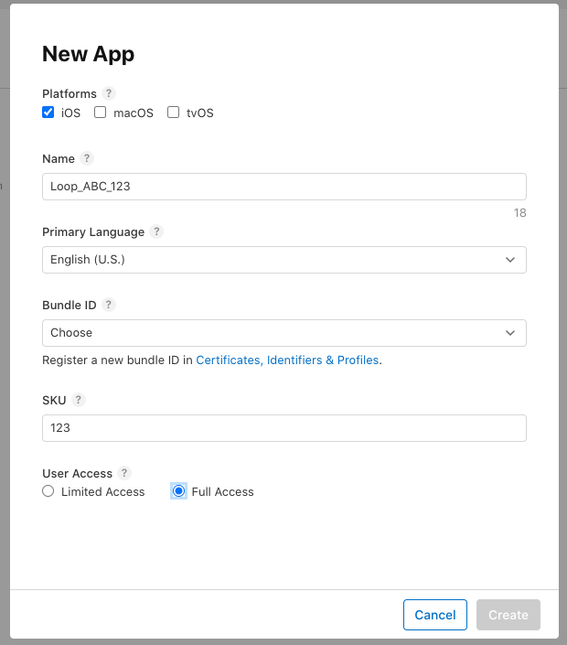
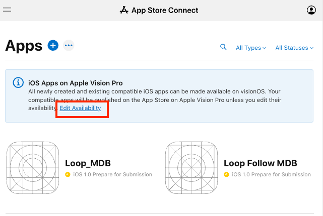
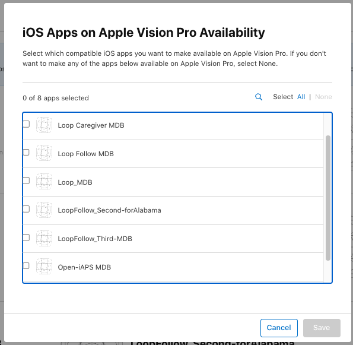

## Prepare the App

After creating the identifiers, you will need to

1. [Configure](#configure-identifiers-for-loop){: target="_blank" } them to associate the correct App Group with specific identifiers 
2. [Create](#create-loop-app-in-app-store-connect){: target="_blank" } the *Loop* App.

Some people get confused on this page. Many of the links look similar but are actually different pages at *Apple*.

!!! important "Ask For Help Early"
    Please if you are having trouble - [ask for help early by clicking on this link](bb-errors.md#help-with-errors){: target="_blank" }.

## Configure Identifiers for Loop

???+ tip "Background Information (Click to open/close)"
    * One of the identifiers just created is used as the `Bundle ID` for building your app
        * This can be a little confusing and a lot of pages over at Apple look the same
        * Make sure you follow the links given for each section.
    * Terms that may help:
        * App Group: associates different identifiers so the app works correctly - you will do this step under your Apple Developer ID account.
        * App: associates a particular identier as the main Loop code - you will do this step under the App Connect site which is associated with your developer ID but is a different URL.

> This should only be needed one time.

Some steps can be skipped if you previously built the *Loop* app with a *Mac* using *Xcode*.

Please read carefully to avoid confusion.

### Create `App Group`

??? abstract "Section Summary (click to open/close)"
    [:material-skip-forward:](#optional-app-group-description-modification) If you have already built the *Loop* app via Xcode using this *Apple* ID, skip ahead to [Optional: App Group Description Modification](#optional-app-group-description-modification).

    1. Go to [Register an `App Group`](https://developer.apple.com/account/resources/identifiers/applicationGroup/add/) on the *Apple Developer* site.
    1. For Description, use "Loop App Group".
    1. For Identifier, enter "group.com.TEAMID.loopkit.LoopGroup", substituting your team id for `TEAMID`.
    1. Click "Continue" and then "Register".

    [:material-skip-forward:](#add-app-group) To skip the detailed instructions, click on [Add `App Group`](#add-app-group)

The `Loop` *App Group* already exists if you previously built the *Loop* app using *Xcode* with this *Apple Developer ID*. In that case, skip ahead to [Optional: App Group Description Modification](#optional-app-group-description-modification) to update the description.

If you have never built the *Loop* app with *Xcode* using your `TEAMID`, you need to create an *App Group* associated with your `TEAMID`.

1. Open this link: [Register an App Group](https://developer.apple.com/account/resources/identifiers/applicationGroup/add/) on the *Apple Developer* site.
1. For **`Description`**, use `Loop App Group`.
1. For **`Identifier`**, enter `group.com.TEAMID.loopkit.LoopGroup`, substituting your team id for `TEAMID`.
1. Double-check the spelling - your `TEAMID` must be correct and the `Loop` *App Group* must match the format shown in the previous step
    * A mistake here means you will not be able to build the *Loop* app until you fix it
1. Click `Continue` and then `Register`.

If this is successful, then [:material-skip-forward:](#add-app-group) skip ahead to [Add `App Group`](#add-app-group)

If you get an error saying `An Application Group with Identifier 'group.com.TEAMID.loopkit.LoopGroup' is not available. Please enter a different string`, that means you already have the `Loop App Group` assigned to your account. Continue with the next section.

#### Optional: App Group Description Modification

> This step is not required, but if you previously built using a Mac with Xcode, it is a good idea to update the Name associated with the Identifier for the Loop App Group. Then what you see on your display will match the directions as you continue.

??? tip "Optional Rename Step (click to open/close)"
    Click to display the [App Group List](https://developer.apple.com/account/resources/identifiers/list/applicationGroup)
    
    Tap on the Identifier that shows `group.com.TEAMID.loopkit.LoopGroup` where TEAMID is your Developer ID.

    * This opens the `Edit your Identifier Configuration` screen
    * In the Description box in the upper left, edit the Description to match the **NAME**
    * Tap Save in the upper right and confirm the the change for that identifier._

    Notice in the table below that the XCode version of the **NAME** for the `App Group` is the same as the **IDENTIFIER** but with the `.` replaced with a space.

    | NAME | XCode version | IDENTIFIER |
    |:--|:--|:--|
    | Loop App Group | group com TEAMID loopkit LoopGroup| group.com.TEAMID.loopkit.LoopGroup |

### Add `App Group`

First, review the Identifiers and then [Add `App Group` to Identifiers](#add-app-group-to-identifiers).

### Identifiers for the *Loop* app

[:material-skip-forward:](#previous-xcode-builders) If you ever built the *Loop* app using *Mac*, skip ahead to [Previous Xcode Builders](#previous-xcode-builders).

#### New Builders

Click this link: [`Certificates, Identifiers & Profiles: Identifiers List`](https://developer.apple.com/account/resources/identifiers/list) on the *Apple Developer* site.

If you never built using *Xcode*, then after the <code>Add Identifiers</code> *Action*, you will see the six items under **`NAME`**, in the [table](#table-with-name-and-identifier) below, with the associated **`IDENTIFIER`** information. Your `Developer ID` replaces the `TEAMID` in the identifier.

[:material-skip-forward:](#table-with-name-and-identifier) Skip ahead to [Table with Name and Identifier](#table-with-name-and-identifier).

#### Previous Xcode Builders

If you built previously using a Mac with Xcode, you may see the XCode version in your **NAME** column of the table below.

- The name starts with XC and then the **IDENTIFIER** is appended where the `.` is replaced with a space, the example for `Loop` is shown in detail

> If you want your **NAME** column to match the documentation, follow this optional step.

??? tip "Optional Rename Step (click to open/close)"
    Referring to the table below, tap on each **IDENTIFIER** that has a different **NAME**
    
    * This opens the `Edit your App ID Configuration` screen
    * In the Description box in the upper left, edit the Description to match the **NAME**
    * Tap Save in the upper right and confirm the the change for that identifier._

    Only the Identifer Bundle ID matters and that is not something you can edit.
    
    The Description or Name can be whatever you want.

#### Table with Name and Identifier

| NAME | XCode version | IDENTIFIER |
|:--|:--|:--|
| `Loop` | `XC com TEAMID loopkit Loop`| `com.TEAMID.loopkit.Loop` |
| `Loop Intent Extension` | XC Identifier | `com.TEAMID.loopkit.Loop.Loop-Intent-Extension` |
| `Loop Status Extension` | XC Identifier | `com.TEAMID.loopkit.Loop.statuswidget` |
| `Loop Widget Extension` | XC Identifier | `com.TEAMID.loopkit.Loop.LoopWidgetExtension` |
| `WatchApp` | XC Identifier | `com.TEAMID.loopkit.Loop.LoopWatch` |
| `WatchAppExtension` | XC Identifier | `com.TEAMID.loopkit.Loop.LoopWatch.watchkitextension` |

### Add `App Group` to Identifiers

??? abstract "Section Summary (click to open/close)"
    Note 1 - If you previously built with Xcode, the `Names` listed below may be different, but the `Identifiers` will match. The Add Identifier Action that you completed above generates 6 identifiers, but only 4 need to be modified as indicated in this step. A table, provided above, lists both `Names` and `Identifiers` for all 6 if you are interested.

    Note 2 - Depending on your build history, you may find some of the Identifiers already have your "App Group" and you are just verifying the status.

    1. Go to [Certificates, Identifiers & Profiles](https://developer.apple.com/account/resources/identifiers/list) on the *Apple Developer* site.
    1. For each of the following identifier names (be sure to look in Identifier column if names do not match):
        * `Loop`
        * `Loop Intent Extension`
        * `Loop Status Extension`
        * `Loop Widget Extension`
    1. Click on the identifier's name.
    1. In the `App Services` column, scroll down to the `App Groups` row
        * Ensure the check box (under the `Capabilities` column) for `App Groups` is checked
        * If the word `Edit` shows up under `NOTES`, the App Group is already selected
        * If the word `Configure` shows up, tap on it
            * This opens the `App Group Assignment` screen
            * Check the box by `Loop` *App Group* that uses your `TEAMID` in `group.com.TEAMID.loopkit.LoopGroup` and then `Continue` and `Save`
    1. Remember to do this for each of the 4 identifiers listed in item 2 above.

    [:material-skip-forward:](#create-loop-app-in-app-store-connect) To skip the detailed instructions, click on [Create Loop App in App Store Connect](#create-loop-app-in-app-store-connect)

Click to open the [Certificates, Identifiers & Profiles: Identifiers List](https://developer.apple.com/account/resources/identifiers/list) page. 

Look in the **`IDENTIFIER`** column to locate each Identifer. The name in the **`NAME`** column may be different if you previously [built with a Mac using Xcode](#previous-xcode-builders).

| `NAME` | `IDENTIFIER` |
|-------|------------|
| `Loop` | `com.TEAMID.loopkit.Loop` |
| `Loop Intent Extension` | `com.TEAMID.loopkit.Loop.Loop-Intent-Extension` |
| `Loop Status Extension` | `com.TEAMID.loopkit.Loop.statuswidget` |
| `Loop Widget Extension` | `com.TEAMID.loopkit.Loop.LoopWidgetExtension` |

Click on each **`IDENTIFIER`** in turn and the `Edit Your App ID Configuration` screen will open.

The example graphic below has numbered steps that match these directions:

1. Looking at the `App Services` column, scroll down to the `App Groups` row and ensure the check box (under the `Capabilities column`) for `App Groups` is checked
2. If the word `Configure` shows up, tap on it
    * This opens the `App Group Assignment` screen
    * If it said `Edit` instead of `Configure` - you can click to confirm you have the correct App Group but won't need to continue or save if it is correct
3. Check the box by `Loop App Group` that uses your `TEAMID` in `group.com.TEAMID.loopkit.LoopGroup`
    * Note that if you previously built with Xcode, the name may be different, i.e., `XC group com TEAMID loopkit LoopGroup`
4. Tap `Continue`
5. Tap `Save`

{width="700"}
{align="center"}

If you did not need to make changes, the `Save` button will not be active.

* Tap on the `< All Identifiers` link at the top left

The full list of Identifiers should be displayed again.

Repeat until the 4 Identifiers have the `Loop App Group` configured.

* If you miss an identifier, the `Create Certificates` step will succeed but `Build Loop` will fail.

## Digital Service Act Compliance

In order to create an app you need to indicate whether you are a trader or a non-trader. You are a non-trader unless you use the same Developer ID to submit apps for sale.

Even if the graphic below does not match what you see exactly, it should assist in guiding you through the steps.

Open this link: [`App Store Connect / Apps`](https://appstoreconnect.apple.com/apps); log in if needed.

If you do not see the banner, shown in the top of the graphic below, asking you to Complete Compliance Requirements, you can skip ahead to [Create Loop App in App Store Connect](#create-loop-app-in-app-store-connect).

If you do see the banner, follow the numbered steps in the graphic below:

1. Click on the link that says "Complete Compliance Requirements" to open a new screen shown in the middle of the graphic below

2. Tap on the "Complete Compliance Requirements for Your Name" link to bring up a pop-up shown in the bottom of the graphic below

3. Select the "This is a non-trader provider account" radio button

4. Click Save

{width="800"}
{align="center"}

You do not need to add a bank account or fill out tax forms if you are only using the App Store to get your own app into TestFlight. You only need to have a paid account with a valid license agreement and have completed this compliance form. Ignore other requests from Apple.

## Create Loop App in App Store Connect

??? abstract "Section Summary (click to open/close)"
    If you have created a Loop app in App Store Connect before, make sure you [Remove Apple Vision Pro](#remove-apple-vision-pro) and then skip ahead to [Create Certificates](certs.md#create-certificates).

    1. Click on the link [apps list](https://appstoreconnect.apple.com/apps) to open App Store Connect and click the blue "plus" icon to create a New App.
        * Select "iOS".
        * Select a name: this will have to be unique, so you may have to try a few different names here, but it will not be the name you see on your phone, so it's not that important.
        * Select your primary language.
        * Choose the bundle ID that matches `com.TEAMID.loopkit.Loop`, with TEAMID matching your team id.
        * SKU can be anything; e.g. "123".
        * Select "Full Access".
    1. Click Create

    You do not need to fill out the next form. That is for submitting to the app store.

    [Remove Apple Vision Pro](#remove-apple-vision-pro) from the app you just created.

    [:material-skip-forward:](certs.md#create-certificates) To skip the detailed instructions, click on [Create Certificates](certs.md#create-certificates).

If you have created a `Loop app` in *App Store Connect* before, skip ahead to [Create Certificates](certs.md#create-certificates).

If you have previously used some kind of remote build, like `diawi` or `TestFlight`, you may have your Loop in the *App Store* but can't see it. Don't worry - there are instructions for this case.

1. Open this link: [`App Store Connect / Apps`](https://appstoreconnect.apple.com/apps) to view your apps; log in if needed.
    * If you have never added an app to *App Store Connect*, you will not see the icons inside the red rectangle and should keep going, although some people report the search icon shows up for them
    *  If you have an app that is not shown, you will see a search icon and the `All Statuses` dropdown. If you get to step 3 and cannot find your `com.TEAMID.loopkit.Loop` in the *Bundle ID* dropdown, this means you need to follow [Find My Loop](#find-my-loop).

    {width="600"}
    {align="center"}

1. There might be a blue banner present at this time. If not, it will show up after you have at least one app.
    * The information banner refers to "iOS Apps on Apple Vision Pro"
    * You must wait until you have an app before you can edit the capabilities for the app - this will happen after the next step

1. Click the `Add Apps` button or the blue "plus" icon (:material-plus-circle:{: .appstoreconnect } ) and select `New App` as shown in the graphic below

    {width="300"}
    {align="center"}

1. The `New App` dialog box opens and should appear similar to the graphic below. Before you fill anything out, make sure your `Bundle ID` is available in the dropdown menu (it shows as `Choose` in the graphic below). If you do not see `com.TEAMID.loopkit.Loop`, with **`TEAMID`** matching your `TEAMID` in the dropdown menu; back out of this screen and follow the directions in [Find My Loop](#find-my-loop) instead.
    * Select `iOS`.
    * Enter a name: this will have to be unique
        * You could start with `Loop_ABC` where `ABC` are your initials
        * If that is already taken, you can add a number, for example, `Loop_ABC_123`
        * This name is what you see on the *App Store Connect* list and in the *TestFlight* app
        * Once installed on your phone, you will see the *Loop* app with the standard `Loop Logo`
        * You can [Change the App Store Connect Name](../browser/phone-install.md#change-the-app-store-connect-name) later if you want
    * Select your primary language.
    * Choose the **`Bundle ID`** that matches `com.TEAMID.loopkit.Loop`
    * **`SKU`** can be anything; for example `123`.
    * Select "`Full Access`".

    {width="600"}
    {align="center"}

1. One last check - if the `Bundle ID` has a number other than your actual 10-digit `TEAMID` embedded in it, you will be creating an App in the App Store that you cannot use
    * In this case, do **NOT** select `Create`
    * Instead, go back and put the correct value into the `TEAMID`  *Secret*  and follow the steps in [Errors with Browser: Delete Identifiers](bb-errors.md#delete-identifiers)
1. Click `Create` but do not fill out the next form. That is for submitting to the app store and you will not be doing that.

### Remove Apple Vision Pro

> This might not be displayed anymore. Leaving it here in case you see this.

It is now time to edit the availability of your app on Apple Vision Pro. If you skip this step, you will get an annoying email telling you Apple Vision Pro is not supported by your app.

* First click to return to the main [App Store Connect](https://appstoreconnect.apple.com/apps). In the message section labeled **iOS Apps on Apple Vision Pro**, click on "Edit Availability", highlighted by the red rectangle in the graphic below.

    {width="600"}
    {align="center"}

* This opens a new screen. By default, all your apps have Apple Vision Pro selected. Tap on the None button and then save to remove this.
* If you later create a new app, you might need to perform the same task for the new app  

    {width="600"}
    {align="center"}

You are done with this activity and can close the browser tab. It's time to head back to your *GitHub* account and [Create Certificates](certs.md#create-certificates)

### Find My Loop

This section is for people who were not able to follow the instructions in the last section because `com.TEAMID.loopkit.Loop`, with **`TEAMID`** matching your `TEAMID`, was not in the dropdown menu for `Bundle ID`.

There are two possible reasons:

1. You did not complete [Add `App Group` to Identifiers](#add-app-group-to-identifiers) or one of the predecessor steps; review those steps
1. Your app is already in *App Store Connect*, but you cannot see it

You may have no memory of ever setting up `Loop` in *App Store Connect*. If you previously used some kind of remote build, like `diawi`, your `Loop` may be there as a *Removed App*.

* Open this link: [App Store Connect / Apps](https://appstoreconnect.apple.com/apps), look for the `All Statuses` dropdown indicator, and select `Removed Apps`

    {width="600"}
    {align="center"}

* Click on the App name:

    {width="600"}
    {align="center"}

* Ensure this is the app you want by selecting `App Information`, highlighted on the left side in the graphic below.
    * Examine its `Bundle ID` (not in view in this graphic) - confirm it is correct.
    * The format should be: `com.TEAMID.loopkit.Loop` with your *TEAMID* included
* Then scroll down to the bottom and choose `Restore App`.

    {width="800"}
    {align="center"}

* Make sure **`User Access`** is set to `Full Access` and click on `Restore`.

    {width="800"}
    {align="center"}

## Next Step

The next step is to configure your [TestFlight Group](tf-users.md) for this app.