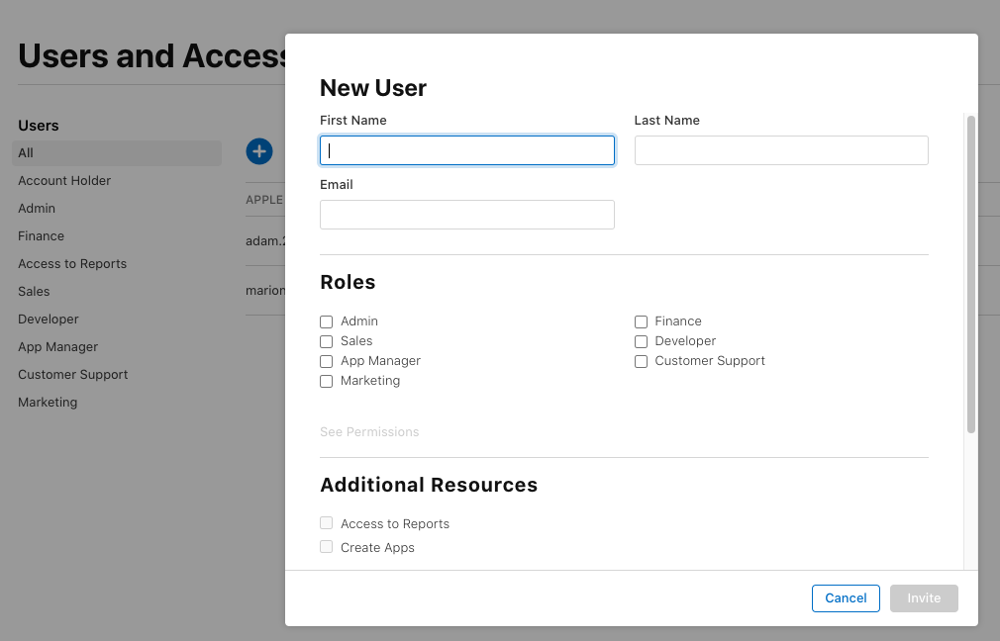

## *TestFlight* Overview

There are two parts to this. Step 1 is only done one time. Step 2 is done for each new app.

1. A user must be registered under your [Your App Store Connect User List](#your-app-store-connect-user-list) before they can be added to a *TestFlight* internal test group for any app
    * As a developer, you are already included as a user with the Role of Account Holder, Admin
    * You can skip this step for yourself and only need it to add another adult to your test group
2. For each new app, you must also create a [*TestFlight* Internal Testing Group](#configure-testflight-group-for-the-app) for that app
    * You must add yourself to the *TestFlight* Internal Testing Group for each app

Most builders can skip ahead to creating the [*TestFlight* Internal Testing Group](#configure-testflight-group-for-the-app).

## Your App Store Connect User List

!!! tip "Step 1: add user for access for any of your apps"
    Before you can select someone for the *TestFlight* Internal Testing group for any app, you must first add them to your App Store Connect User list.

    As a developer, you are already included as a user with the Role of Account Holder, Admin.

You are configuring a private capability for your family using an Internal Testing group. You need the *Apple ID* email address for each adult installing from your build. When building for a child, you will use an adult's *Apple ID*, not theirs. See [*TestFlight* for a Child](phone-install.md#testflight-for-a-child).

First you need to add the email address(es) to your *App Store Connect* Access Users list:

* Open this link: [Users and Access](https://appstoreconnect.apple.com/access/users)
    * You must provide a role for each person - `Customer Support` is a good choice
    * Once you have added them here, you'll be able to select them in the `TestFlight` internal test group for each of your apps

{width="700"}
{align="center"}

## Configure *TestFlight* Group for the App

!!! tip "Add user for each app"
    Once you add a user to have access to your TestFlight internal test group for an app, you don't need to do it again - it remains available to them across rebuilds and different versions for that app.

1. Open this link: [App Store Connect / Apps](https://appstoreconnect.apple.com/apps) to view your apps; log in if needed.

    * Select your *Loop* app
    * Click on the `TestFlight` tab
    * **If you already have an Internal Testing Group for this app, skip to Step 4**
    
1. Click the blue plus button (:material-plus-circle:) next to `Internal Testing` to add a group.

    {width="700"}
    {align="center"}

1. Fill out the name you want for the `Internal Testing` group
    * Be sure to check the box `Enable automatic distribution`
    * Click `Create` when done

    {width="700"}
    {align="center"}

1. You can add or remove emails to the Internal Test Group as any time
    * Click in the box beside each person you want to include
    * Each person in this group will get an email each time you update (build again) using the <code>*GitHub* Browser Build</code> method
    * Click `Add` when you are done
    * If building for a minor child, you will send the invitation to yourself or another person because a minor child is not authorized to use *TestFlight*: See [TestFlight for a Child](phone-install.md#testflight-for-a-child)

    {width="700"}
    {align="center"}

## Next Step

[Create Certificates](certs.md) for your app.