## Summary

!!! info "Time Estimate"
    - 60-80 minutes for first time builders
    - 10-15 minutes for repeat builders

!!! abstract "Summary"
    You will:

    * Run the [Build Select Script](#build-select-script) to download Loop code
    * Follow the step-by-step instructions in the script
    * Press the Xcode Build Button to build Loop
    * Watch in awe as you build your very own Loop app

!!! question "FAQs"
    * **Why does Xcode show a colorful spinning icon and not respond to me?** Unfortunately, sometimes Xcode gets confused and you need to force quit the application. See [Xcode Not Responding](../build/build-errors.md#xcode-not-responding) for instructions.
    * Many more FAQs for building Loop are in-line with the steps that trigger the questions.

## Build Video

The Loop and Learn team prepared this [YouTube video](https://youtu.be/gddhljzsNkM) showing how to build Loop 2.2.x including the steps required to update if you previously built. The steps are different now. The video may be worth watching, but once you've reviewed it, work through the new build process described on this page.

If you do watch this video, please note that you no longer are required to delete provisioning profiles as a separate step and the overall building process is streamlined.

## Build with Browser

If you previously used [Build with Browser](../browser/bb-overview.md) to install Loop on this phone, you should [Disable Automatic Install from *TestFlight*](../browser/phone-install.md#disable-automatic-install-from-testflight) to be sure the version of the app on the phone is the one you build with Xcode.

## <code>Developer Mode</code>

If you are running iOS 15/watchOS 8, you do not have <code>Developer Mode</code> and can skip ahead to [Download Loop](#download-loop).

### Upgrade from iOS 15 to newer version

**If you upgrade an iOS 15 phone to iOS 16 or newer, the *Loop* app will not open until you enable <code>Developer Mode</code> on that phone.**

You will see a message similar to the next graphic.

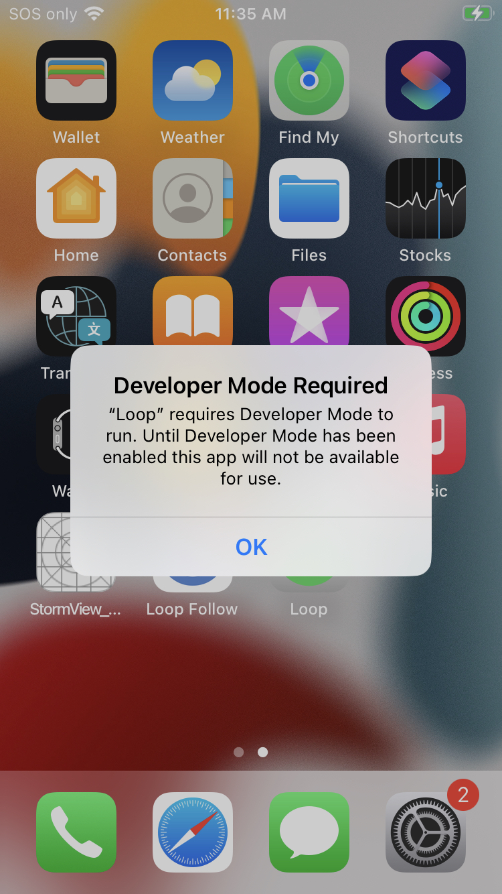{width="300"}
{align="center"}

If you are running iOS 16 or newer with watchOS 9 or newer, you must enable <code>Developer Mode</code> to run or build Loop directly from Xcode. (This is true for any app created by Xcode directly on your device.) If you want to know more, click on this [Apple Link about <code>Developer Mode</code>](https://developer.apple.com/documentation/xcode/enabling-developer-mode-on-a-device).

### Prepare your Phone and Watch

**If you have never built an app with Xcode on a particular phone, <code>Developer Mode</code> will not show up in the iOS Settings, Privacy & Security menu until you connect that phone to Xcode.**

* If you are building to a new Apple Watch - you must first pair that watch to the phone, build the app to the phone and then enable <code>Developer Mode</code> on the watch and then **build** to the phone **again** while watch is paired and on your wrist.

To keep all the steps in one place, the instructions for configuring phone and watch are kept in this one section. If you have never built with Xcode to this phone, skip ahead to [Download Loop](#download-loop) for now and return at the appropriate part of the script instructions below. A clear message with a link will bring you back here.

When Xcode is open and you plug in your phone, you will not be able to select the phone until you have enabled <code>Developer Mode</code>. The phone will show up, but be an "Unavailable Device" as shown in the graphic below.

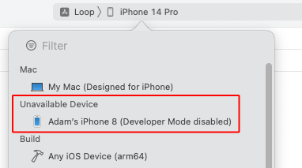{width="450"}
{align="center"}

### <code>Developer Mode</code> on iPhone

Once your phone has been plugged in to the computer while Xcode is opened and you accepted have the Trust this Computer option, you will be able to enable <code>Developer Mode</code>.

1. Open your phone settings, choose Privacy & Security
2. Scroll to the bottom of the screen and examine the <code>Developer Mode</code> row
    * If it says On - no further action is required
    * If it says Off, then tap on the row
3. Slide the slider to the green (enabled) position
4. Choose Restart
5. After reboot, choose to Turn on <code>Developer Mode</code>
6. You are now ready to begin building from Xcode onto this phone

If you are in the middle of building on a new phone, return to [Initial Xcode Screens](#initial-xcode-screens) to continue.

### <code>Developer Mode</code> on Watch

!!! warning "Build, Enable, Build"
    Reports from users indicate that when you are building to a new Apple Watch - you must first build the app with Xcode before the developer mode will be available. So plan to build with Watch paired, and then enable <code>Developer Mode</code> and build again.

This must be configured on the watch itself (not the watch app on the iPhone). To determine if <code>Developer Mode</code> is enabled, look at the watch face icons and find the Settings icon. Tap on it and scroll to and tap the Privacy & Security icon. Then scroll to the bottom and tap on <code>Developer Mode</code>. If you don't see the <code>Developer Mode</code> row under Privacy & Security, see the [Extra Watch Instructions](#extra-watch-instructions).

* If <code>Developer Mode</code> is enabled, the slider will be green and no further action is required
* If <code>Developer Mode</code> is not enabled, the slider will be blank
    * Move the slider so it is green
    * Reboot the device when asked
    * After the reboot, you are asked if you want to turn on Developer mode
    * Tap on the `Turn On` option

### Enable Watch WidgetKit <code>Developer Mode</code>

With the latest watchOS, there are now options that show up after you enable <code>Developer Mode</code>. Go on and configure those now. Select the Settings icon on the watch, but instead of tapping on Privacy & Security, scroll all the way to the bottom and there is now a Developer row at the very bottom of the watch Settings. If you don't see this row, reboot the watch again.

* Tap on Developer
* Scroll down to WidgetKit Developer Mode and enable that
* This might enable faster updates of complications on your watch

### Extra Watch Instructions

There have been a lot of reports of trouble getting <code>Developer Mode</code> to show up on a new Apple watch and then having further trouble getting the *Loop* app to show up on the watch. Previously, just having the watch paired to the phone when you build once followed, by enabling <code>Developer Mode</code> on the watch and building again, was enough. If you have problems, here are extra steps to try.

These steps have been reported on Facebook and have not been tested in a controlled environment. They may not all be necessary.

1. Restart watch, phone and computer
1. Watch should be paired to your phone and on your wrist
2. Go to Privacy & Security on watch and enable developer mode (didn’t see prior to restart)
3. Plug phone into computer and open Xcode
4. Select Window (top menu) and choose Devices & Simulators
    * The watch should appear as a Disconnected device
    * Click on the watch and if it connects - you are done
5. Otherwise manually add the UDID to your Developer Account
    * Copy UDID (right-click or control-click and choose Copy Identifier)
7. Go to the [Apple developer website, devices page](https://developer.apple.com/account/resources/devices/list) and manually add the watch (using the UDID)
8. With phone plugged into computer and watch on wrist, follow these steps on the build errors page: [Apple Watch Loop App not running on Watch](build-errors.md#apple-watch-loop-app-not-running-on-watch) to build the watch app directly.

At this point, be sure to reboot the watch.

## Download Loop

This page has the detailed steps to run the Build Select Script to download the Loop code, prepare your computer and build Loop.

Every attempt was made to put messages directly in the script for each step. The next few sections of this page walk you through what you will see when you run the script.

### Open Terminal

Go to the Finder app, click on Applications, then open the Utilities folder.  Locate the Terminal app and double-click Terminal to open a terminal window. The terminal window is very plain looking when you open it. That is normal.

### Build Select Script

With the release of Loop 3, the build process is different and simpler

* Please read each step as if you are a new builder
* Don't assume you know what you are doing

These instructions show each step needed to download Loop using the Build Select Script.

Copy the line below that starts with `/bin/bash` by hovering the mouse near the bottom right side of the text and clicking the copy icon (should say `Copy to Clipboard` when you hover over it). When you click the icon, a message that says `Copied to Clipboard` will appear on your screen.

``` { .bash .copy title="Copy and Paste to start the Build Select Script" }
/bin/bash -c "$(curl -fsSL \
  https://raw.githubusercontent.com/loopandlearn/lnl-scripts/main/BuildSelectScript.sh)"
```

Paste the line of text into Terminal. Be sure to click anywhere in the terminal before trying to paste. (Ways to paste: ++command+"V"++ ; or ++control++ click and select from menu or `Edit`-`Paste` at top of Mac screen.)

* Please read what is on the screen as you progress
* You can increase font size by holding down ++command++ and hitting &plus;

You will be informed of the menu options as shown in the graphic below. You will choose Option `1` to Build Loop.

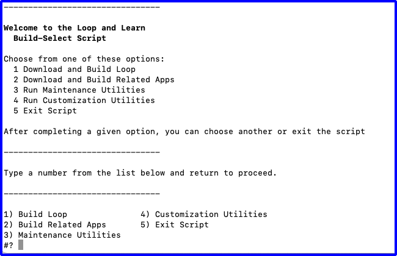{width="700"}
{align="center"}

You will be informed that you are downloading open source software. Type `1` and return if you understand the warning and agree.

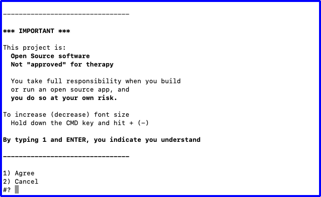{width="700"}
{align="center"}

The next screen asks you to choose to build either Loop `main` or Loop `dev`, with `main` recommended. Type `1` to choose `main` and return to begin the download.

> You can choose `dev` by typing 2 and return. Or return to the BuildSelect Menu by typing 3 and return.

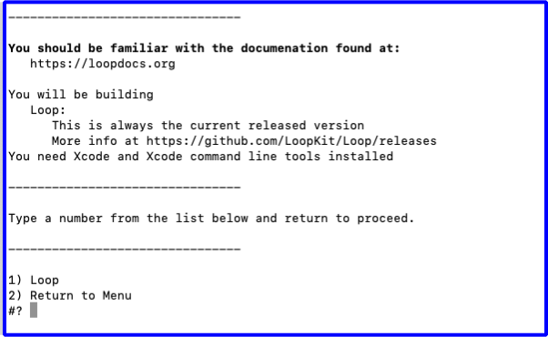{width="700"}
{align="center"}

### Wait for Download to Complete

This download can take from 3 minutes to 30 minutes depending on your download speed.  You can leave the room and return later to check on progress. When you read the words in the terminal, as the script runs, you may see terminology you do not understand - don't worry - you do not need to understand enumeration or submodule or cloning.  You only need to review the display to look for any error messages. 

!!! tip "Watch for messages"
    The Build-Script automatically reports when the download is successful.

The next graphic shows terminal messages for the beginning of a successful download.

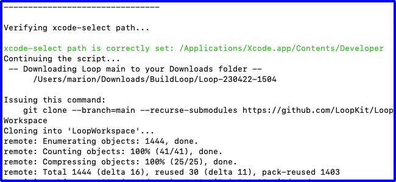{width="700"}
{align="center"}

If the download was successful, your terminal will be similar to the following graphic. Continue with the [Download was Successful](#download-was-successful) section.

{width="700"}
{align="center"}

If you see a failure message, scroll up in the terminal to find the error message(s) and go to [Xcode Errors with Build-Select](#xcode-errors-with-build-select).

{width="700"}
{align="center"}

### Download was Successful

If there are no errors, hit return to continue. The next step involves signing the targets.

## Sign Targets

!!! question "What does Sign Targets Mean?"
    "Sign Targets" in Xcode identifies who built the app. You cannot deploy an app to a phone if you do not sign each target associated with that app.

!!! tip "Experienced Builders"
    This replaces several of the steps that used to be required to build Loop.

If you have never built an Xcode app using your developer ID on this computer, then the first time you use the script, you will be asked how you want to sign the targets.

!!! question "I did not get this question"
    The script searches for your developer ID for you and skips this question if it finds it.
    
    * You have previously built an app on this computer with your developer ID
    * You have previously run this script
    
    Skip ahead to [Review LoopConfigOverride.xcconfig](#review-loopconfigoverridexcconfig).

The next question, as shown in graphic below, is whether you will (1) Sign Automatically or (2) Sign Manually.

* If you are building with a paid developers account, choose option 1, and continue on this page
* If you are building with a Free option or plan to build to a simulator on your computer, choose option 2 and click on [Build Free Loop](build-free-loop.md) to move to the page with those instructions

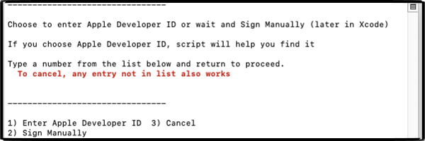{width="700"}
{align="center"}

### Paid Developer Account

Continue with this page only if you have a paid developer account.

* You need to switch to the [Loop Free Build](build-free-loop.md) page for a free account.

### Create Permanent LoopConfigOverride.xcconfig

The following graphics show the terminal display after selecting option 1 to use Apple Developer ID.

* Graphic below:
    - User is presented with instructions for getting Team ID from the Membership page
        - After review, the user hits return

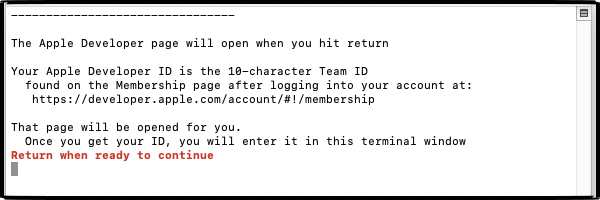{width="700"}
{align="center"}

* Graphic below:
    - The instructions remain on the screen for reference
    - The developer.apple.com web page (not shown) opened automatically in the browser after user hit return
        - User obtains ID
    - User enters ID in terminal and then hits return

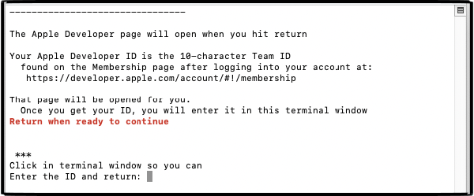{width="700"}
{align="center"}

After hitting return, the user can verify the entry.

### Review LoopConfigOverride.xcconfig

Once the permanent signing file is configured, the review step is the same each time.

* Graphic below:
    - The developer ID stored in the permanent file is displayed for review
    - After review, enter 1 to continue
    - OR - enter 2 to modify the ID in the file, see [Problem with the ID?](#problem-with-the-id)

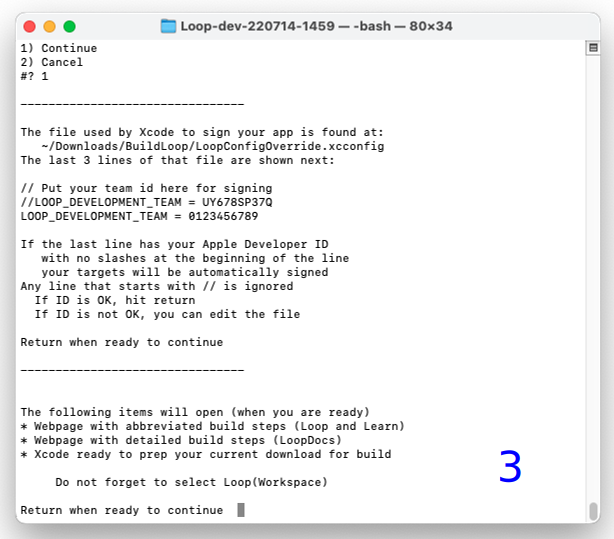{width="700"}
{align="center"}

#### Problem with the ID?

If there is a problem with the ID that is stored on your computer, you can modify it before continuing.  The instructions, shown in the terminal message if you select option 2, Editing Instructions, are repeated here:

To edit the LoopConfigOverride.xcconfig file with a different developer ID:

1. Open finder, navigate to Downloads/BuildLoop
1. Locate and double click on LoopConfigOverride.xcconfig
    * This will open that file in Xcode
1. Edit in Xcode and save file

You can now return to the terminal and hit return for the next step.

### Ensure a Year

The next question asks if you want to ensure a year with your new app. Unless you have a good reason, you should enter 1 and continue.

{width="700"}
{align="center"}

## Build Loop

!!! tip "Build to Simulator"
    If you are an experienced builder and plan to build to a simulator on your Mac before building to your phone, you do not need to plug in your phone yet. You will need to select a simulator manually once Xcode opens.
    
    For first time builders - go on and build to your phone.

### Plug in Your Phone

Refer to the graphic below. The messages in the terminal instruct you to:

* Unlock your phone
* Plug Phone into the computer
    * (Optional) If you have an Apple Watch that has never had Loop on it
        * Make sure watch is paired, unlocked and on your wrist
    * If you have never "Trusted" this computer with these device(s), do so now
        * A screen will pop up on your phone (and watch) asking if you trust the computer
        * Select "Trust"
        * After trusting phone and watch, phone should remain plugged in, but watch does not need to stay in proximity of the phone
* Now you are ready to hit return in the terminal window

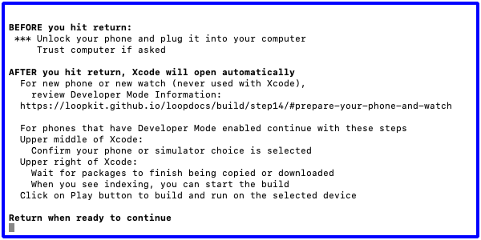{width="700"}
{align="center"}

The next action of the script is to 

* Open Xcode

If this is a new phone that has never had an app built from Xcode, return to [Prepare your Phone and Watch](#prepare-your-phone-and-watch). After you get developer mode turned on for the phone continue with the build instructions. If you also want to set up the watch, you'll need to build one time, follow directions in [Developer Mode on Watch](#developer-mode-on-watch) and then build again.

It is suggested that you wait until you've successfully built the app before closing the terminal.

### Initial Xcode Screens

Refer to the graphic below. Your intial Xcode screen should be similar.

* Wait for packages to download (see messages upper right - blue dashed rectangle)
    * You might see the words downloading or copying
    * Package download is complete when you see the words Indexing or Ready (upper right)
* Make sure your phone (or simulator if you prefer) is selected in the upper middle


{width="750"}
{align="center"}

### Start Build

If there is a red x in the dashed-blue rectange region on your Xcode screen you need to click over to the [Build Error](build-errors.md) page.

#### First Time

The first time you build, there will be steps that will not be required for subsequent builds. These are clearly marked in the intructions with the word **First-Time**. Do not get confused when you are asked to enter your password multiple times, see [Codesign / Keychain Access](#codesign-keychain-access). Be sure to enter your Mac login password and select `Always Allow` every time it is requested.

#### All Builds

!!! tip "Be Patient"
    You should see messages on the Xcode screen (upper right) after you start the build - wait for the app to open on your phone and display the main screen before unplugging your phone.

    1. Building
    2. Installing
    3. Running
        * Wait for app to open on your phone
    
    With *iOS* 17 and newer, it takes longer for the app to open on your phone after you see the "Running" message than with earlier iOS versions. Wait for it.
 
Refer to the GIF below:

* Frame 1: Packages are downloaded
    * Xcode is Indexing as seen in dashed-green rectangle region
        * Indexing makes searching faster; it does not need to complete before building
    * Click the "Play" button highlighted by red rectangle to start the build
    * **First-Time for this Phone:** A Device isn't registered screen appears, as shown in the graphic below the GIF
        * This happens for any phone not registered to the selected Developer ID
        * You must be connected to the internet so the device can be registered
        * Click register and then the build will continue (as shown in the GIF)
* Frame 2: Build has started
    * Xcode is Building as seen in dashed-green rectangle region
    * **First-Time on This Computer:** 
        * Follow the [Always Allow Instructions](#codesign-keychain-access) the first time this Developer ID is used on this computer
        * Never hit Deny
* Frame 3: Build succeeded
    * App is running as seen in dashed-green rectangle region
    * If your phone locked during the build process, you will see a message to unlock your phone, as shown in the graphic below the GIF
        * Simply unlock your phone and Xcode does the rest
        * If you tapped on `Cancel Running`, just hit the build button again
    * **First-Time for this Phone:** You may also see a "Could Not Launch Loop" message
        * Follow the [Update Settings for Developer](#update-settings-for-developer)

{width="750"}
{align="center"}

{width="200"}
{width="300"}

If the app opened on your phone, the next two sections for first-time builders are not needed.  Skip ahead to [Successful Build](#successful-build).

If you got red error messages, skip ahead to [Build Failed?](#build-failed)

#### Codesign / Keychain Access

!!! abstract "First Time Using Developer ID on Computer"

    During your first build with a given Developer ID on your computer, you will see a codesign/keychain access prompt, as shown in the graphic below. Enter the same password you use to log in to the mac, select "Always Allow" and then do it again each time you are asked.

    {width="350"}
    {align="center"}

    It is normal for this prompt to come up repeatedly even after you enter the correct password (once for each target Loop needs to sign).

    In frustration, people think the prompt must be broken because it keeps reappearing and press deny or cancel. **Don't press deny.** Keep entering your computer password and pressing the "Always Allow" button as many times as it takes. The build will then continue.

    **FYI:** _codesign is for code sign - nothing to do with design._

#### Update Settings for Developer

!!! abstract "First Time Building on a New Device?"

    If this is the first time you have installed an app on your iPhone using a free account, you will see warnings in both Xcode and on your phone after a successful build and install on your phone.

    Don't worry, dismiss the messages and do this extra step on the phone. These instructions are valid for iOS 15:

    * Open Phone Settings
    * Select General
    * Select VPN & Device Management
    * Under the Developer App section, tap on icon
    * Tap on Trust
    * You should now be able to open the app

    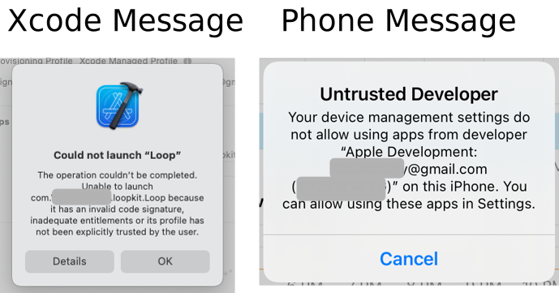{width="400"}

    {width="200"}

### What if the Automatic Signing Failed?

Sometimes, something goes wrong with the automatic signing. Just the fact that you clicked on a few places in Xcode can change a particular file required to enable automatic signing. It is possible to reset that file, but it is easier to sign manually.

* The instructions to sign manually are found at [Build Free Loop](build-free-loop.md)
    * As you go through that page, ignore the steps that remove capabilities which require a paid `Apple Developer` account
    * Make sure you sign all 5 targets
    * Each signed target shows a `Bundle Identifier` with your 10-digit `Apple Developer Membership ID` embedded after `com.`
    * If you don't know how to find that number, there are very clear directions in the [Build with Browser: Find `TEAMID`](../browser/secrets.md#find-teamid)

### Build Failed?

No red error messages? Skip ahead to [Successful Build](#successful-build).

!!! bug "Red Errors"
    If you get a message that your build failed and see **RED ERROR** messages:

    * Go to the [Build Errors](build-errors.md) page to find the steps to fix your build error
    * (Optional) Follow the [Clear the Error Message](#clear-the-error-message) process
    * Return to [Start Build](#start-build) to try again

!!! question "FAQ: But what about those yellow or purple warnings that remain in Xcode? Should I worry about them?"

    If you see yellow or purple warnings after your build is done...those are not an issue. Don't try to resolve them or fret about them. They mean nothing to the successful use of your Loop app.

    NOTE: **purple warnings** are still warnings and can be ignored.

    {width="600"}
    {align="center"}


#### Clear the Error Message

Once you've resolved a build error and start the build process again, Xcode will continue to show a red indicator on the top line from the previous failure.  If you don't like seeing that, clean the build folder to clear the error.  Otherwise, as long as the steps of the build are showing across the top line, Xcode is still working on the build.  When the build succeeds, the red circle will disappear.

!!! abstract "Clean Build Folder"

    * In Xcode menu, select Product, then Clean Build Folder
    * Wait for cleaning to complete: you'll see a "Clean Finished" message

### Successful Build

After you see the Loop app open on your phone, you can unplug your phone and acknowledge the Xcode message: `Lost connection to the debugger on . . .`.  The square icon next to the play button goes away as soon as you unplug your phone from Xcode.

The Loop app on your phone closes (but does not quit) when you unplug the phone. Open the Loop app on your phone just to be sure.

!!! success "Congratulations!"
    
    


If you plan to build again on a backup phone, or want to try a customization, easiest for you to leave Xcode open. Otherwise, you can quit out of Xcode now.

But wait - there's more.

* Caregivers who help manage a loved-ones diabetes often use other open-source apps that can be built the same way
* When you are done building and installing the *Loop* app, there are instructions on the *Loop and Learn* website to [Download and Build Related Apps](https://www.loopandlearn.org/build-select/#build-other-apps)

## Protect that App

!!! danger "Protect Against Deletion"
    Prevent your Loop app from being deleted accidentally.

    If you, or a child, deletes the app from the home screen, it is gone - you have to rebuild and reenter all settings and start a new pod or add back in your Medtronic pump.

    The steps vary depending on iOS. With iOS 15 and 16, it is under Screen Time, Content & Privacy Restrictions, iTunes & App Store Purchases, Deleting Apps. Choose Don't Allow. If those steps don't help, do an internet search like this, where you use your current phone iOS version number:

    * "turn off app deletion iOS ##"
    * "iOS ## prevent app deletion"

    Follow the instructions to prevent deletion of what is now a critical medical app.

## IMPORTANT SAFETY REMINDER

* **STAY IN OPEN LOOP UNTIL YOU UNDERSTAND THE SYSTEM**
* Do NOT skip the Set Up and Operate material; at least skim it.
* Keep reviewing LoopDocs - some material will be more impactful once you have the app in your hands.
* Ask [questions](../intro/loopdocs-how-to.md#how-to-find-help) if you are confused.
* Learn to use the [LoopDocs search feature](../intro/loopdocs-how-to.md#website-search)

### New to Loop 3

If this is your first build with Loop 3, head to the Set Up tab starting here: [Loop 3 Overview](../loop-3/loop-3-overview.md).

!!! tip "Pro Tip: Read Along in LoopDocs as you Onboard"
    One of the goals for Loop 3 is to make the app robust even if you don't read the documentation, but a lot of questions may be resolved if you read along in LoopDocs as you onboard.

    All those mentors who answer questions are volunteers.

Even if you don't read all the pages under the Set Up tab now, these links are important.

* New Looper: [Onboarding](../loop-3/onboarding.md)
* Building Loop 3 over Loop 2.2.x: [Experienced Looper Onboarding](../loop-3/onboarding.md#experienced-loopers)

!!! info "Add a Calendar Reminder"

    - It is good practice to add a reminder to your calendar when the app will expire
    - Be sure to add an alert to that reminder so you have enough time to do all the [Loop Updating](updating.md) steps to build the app again before it expires
    - Even better, practice building every 3 to 6 months so you don't forget and keep that expiration date far in the future

## Optional Steps

### Code Customizations

**New Loop users**: Customizations are not a required part of any Loop build. As you gain experience using your Loop app, you may want to customize some of the features. First time builders are encouraged to build with the standard, default code. You can always update your Loop app to add customizations at a later time, using the same download. Subsequent build time is much faster than the initial build for a given download.

!!! tip "Pro Tip"
    With a fresh download of code, it's always best to build to a simulator without customization to ensure the build works without errors. Then add the customizations and check the build again. Now you are ready to build to your phone to update your existing app.

To add custom configurations to your Loop or Loop Apple Watch apps, follow the step-by-step instructions on the [Code Customizations](custom-mac.md) page and then build the app again.


### Apple Watch

**Existing Apple Watch users**: Please update your watchOS prior to building the Loop app. The minimum iOS for Loop 3 is iOS 15.1, which means watchOS 8.1. When running iOS 16.x, you will need a watchOS of 9.x.

**New Apple Watch users**: If you have an Apple watch and want to use it with Loop, first pair the watch with the iPhone before continuing to the next steps.  If you get a new watch after building the Loop app, you'll need to redo your Loop build.

For more information, please see [Operate: Apple Watch](../operation/features/watch.md)

### Build Again with this Download

Follow the [Find My Downloaded Loop Code](edit-mac.md#find-my-downloaded-loop-code) instructions if you later wish to build with this same dowload. Plug in an unlocked phone and start at the [Start Build](#start-build) section of this page. You may need to select the phone you just plugged in. Everything else should be ready for you the start the build process.

!!! warning "Don't use a really old download"
    Do not use a really old download.

    Check the date of your download against the latest [Current Release](..//version/releases.md#current-release) date and decide whether to get a fresh download instead.

### Xcode Errors with Build-Select

The errors shown below should be prevented - the script will attempt to correct them automatically - follow the directions in the script.

If this is not successful, the script told you the download failed and exited. Scroll up in the terminal to find the error message(s):

* Read the error message
* Try to figure out the problem
* If you need help, reach out to your favorite [Loop Social Media](../intro/loopdocs-how-to.md#how-to-find-help) site


!!! warning "WARNINGS"

    If you see errors like these . . .

    * `xcrun: error: invalid active developer path (/Library/Developer/CommandLineTools), missing xcrun at: /Library/Developer/CommandLineTools/usr/bin/xcrun`
    * `xcode-select: Failed to locate 'git', requesting installation of command line developer tools`
    * `xcode-select: error: tool 'xed' requires Xcode`

    You missed one of these steps:

    * [Install Xcode](xcode-version.md)
    * [Xcode command line tools](xcode-settings.md#command-line-tools)
