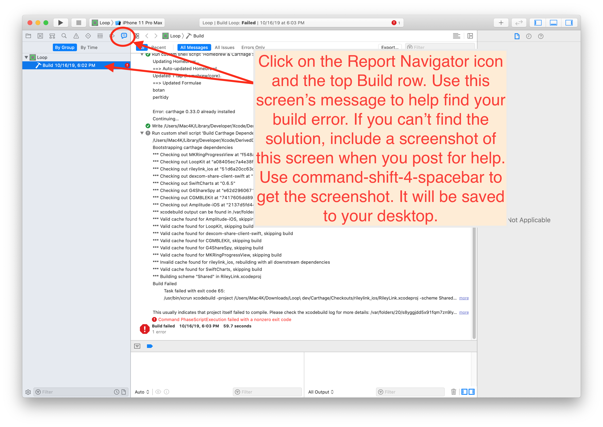
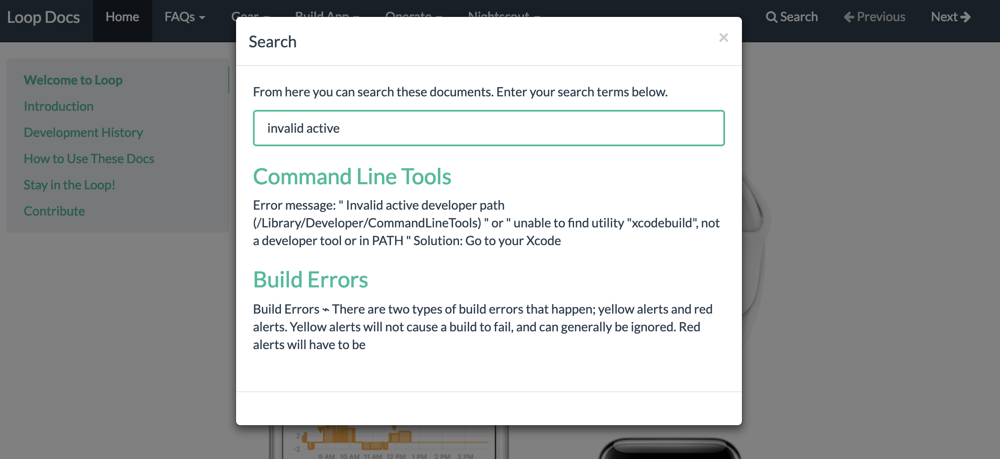
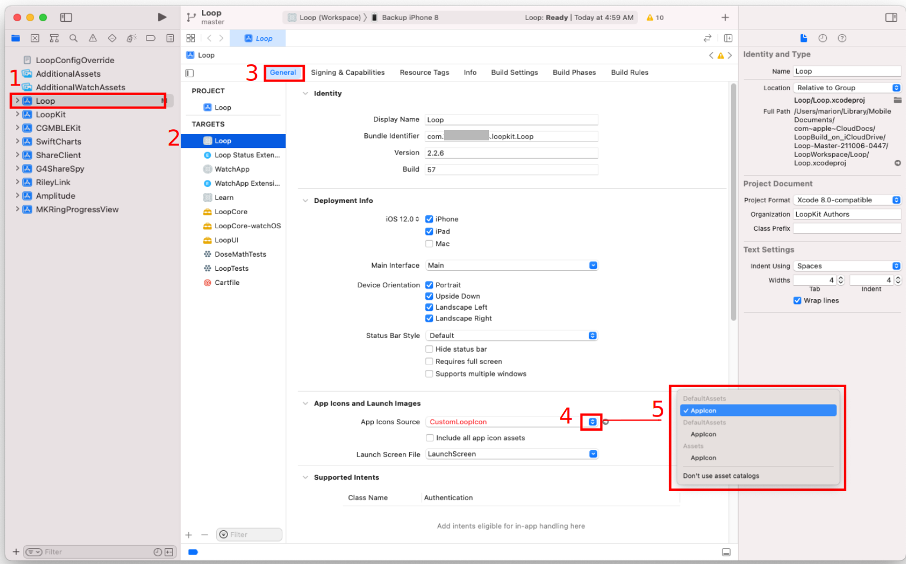
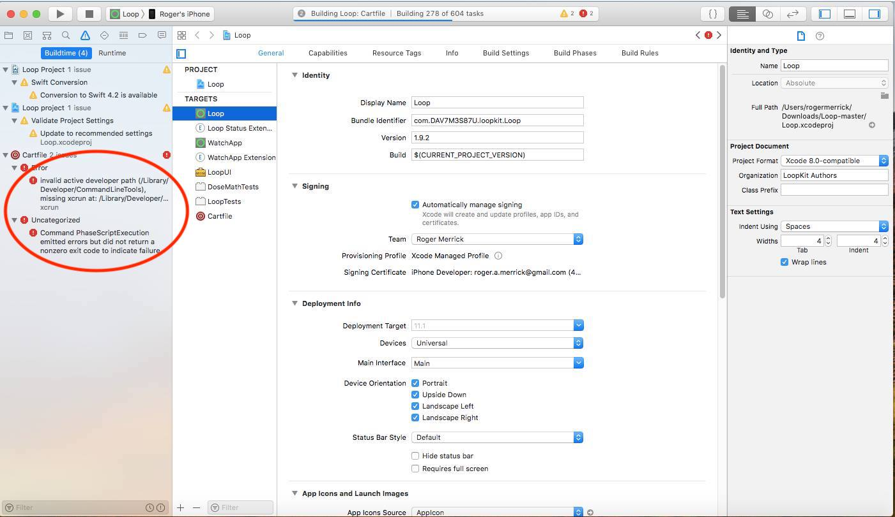
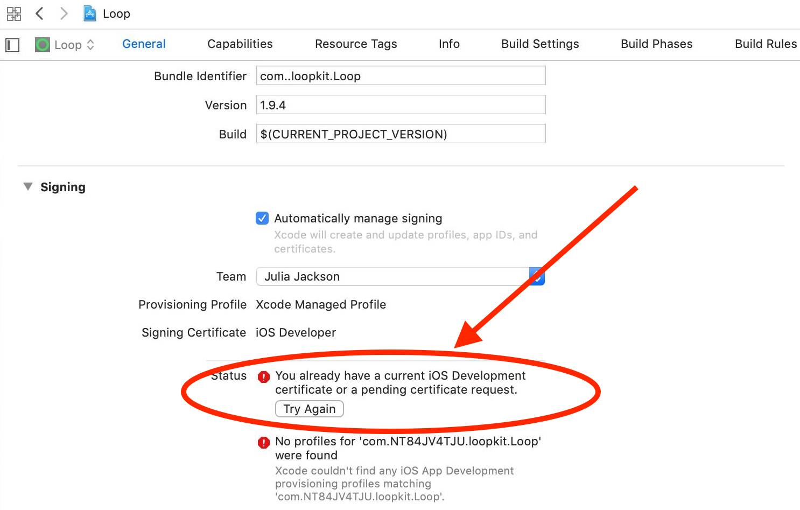
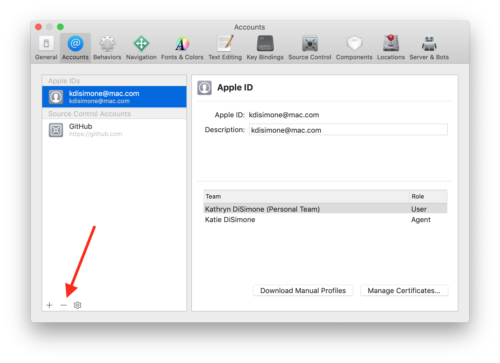
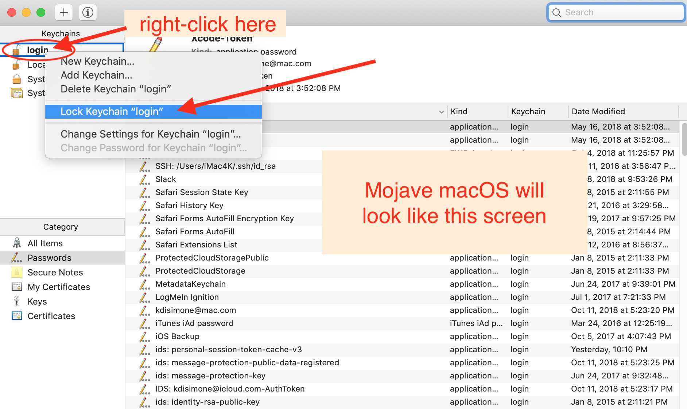
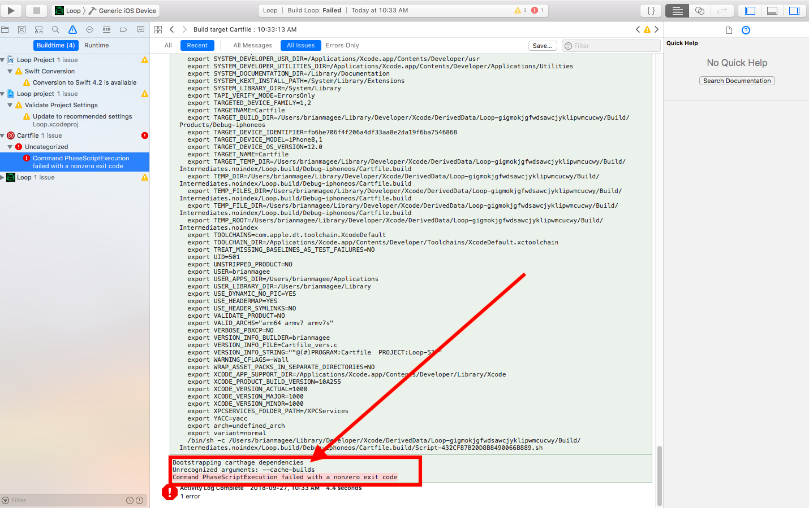
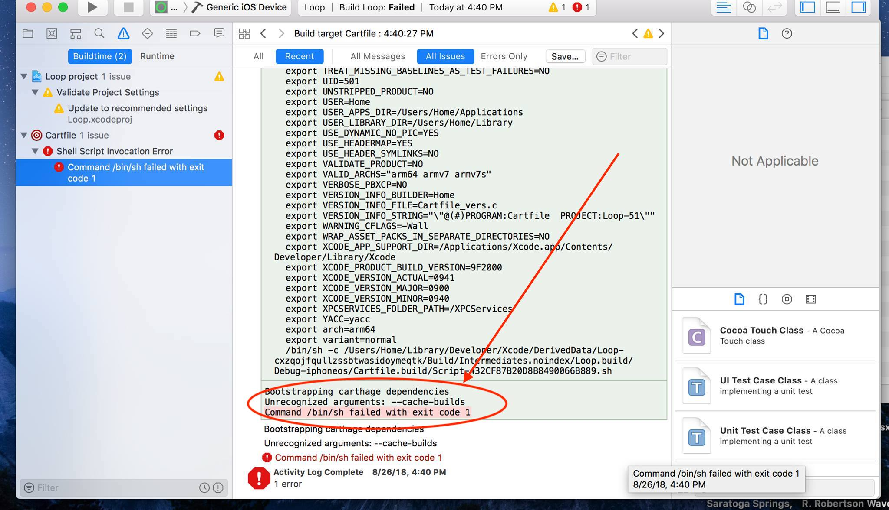
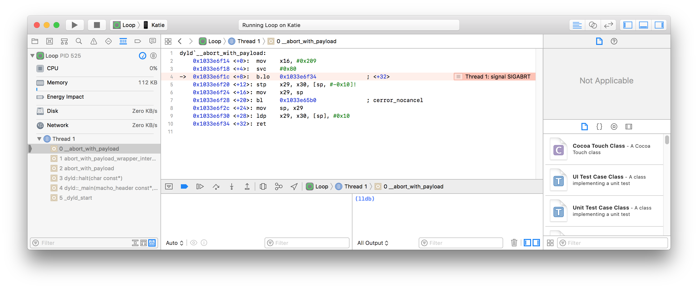

## Build Errors

!!! important
    **These are only relevant when building with a Mac and Xcode.**  
    **For Building with Browser Build errors, please see: [Errors with Browser](../browser/bb-errors.md)**

There are two types of build indications that may be seen: they are warnings (yellow or purple icons) and red errors. You'll see the warnings and errors in the left-hand column of the Xcode window.

**<font color="orange">:fontawesome-solid-triangle-exclamation: Yellow</font> and <font color="purple">:fontawesome-solid-triangle-exclamation: Purple</font> warnings** do not cause the build to fail, those are just warnings.  You will often see yellow and purple icons. **Ignore those**. Do not try to do anything to fix those.

**<font color="red">:octicons-x-circle-fill-16: Red errors</font>** will **have to be resolved** before you can successfully build the app. The steps below explain how to resolve them based on the messages you are seeing.

### Xcode Not Responding

Sometimes, Xcode stops responding. You have to fix this before any of the other steps on this page will help.  The signature is that Xcode shows a colorful spinning icon and does not respond to anything you do.

This can happen sometimes. You just need to force quit Xcode. Sometimes rebooting the Mac may be required, but start with force quit. Then just open up Xcode again and keep going.

* Hold down these 3 keys ++option+command+escape++ (or ++alt+command+escape++),  until the `Force Quit` menu appears (should be fast)
* Select `Xcode` and tap on the `Force Quit` button

{width="300"}
{align="center"}

## Start with The Obvious Error Causes

!!! info "New Loop Builders"
    This page contains build error help for people updating their Loop app as well as brand new Loop app builders. Review the "obvious" errors causes first. If that doesn't help, then, skim the page until you reach [Find Your Error Message](build-errors.md#find-your-error-messages) or search the page (++command+"F"++) or search LoopDocs for your error. Once you've identified your error message, try to resolve it.  Still stuck? Read [Posting for Help](build-errors.md#posting-for-help)

Before you start trying to resolve your red errors, start with the most obvious things that can cause a red error message:

1. **For older builds, before 3.2.0, you had to select Loop(WorkSpace)** The first time you build after downloading new code, you had to manually select Loop (Workspace) instead of Loop in Xcode.
    * Starting with Loop 3.2.0 and newer versions, the target name and xcworkspace file names are now automatically LoopWorkspace - no special action needed when building.

1. **Did you check that you have the minumum Xcode version for your iOS?** This is critical. If you are updating your Loop app, please review the iOS driven requirements for minimum version of [macOS and Xcode](xcode-version.md#how-do-all-the-minimum-versions-relate-to-each-other).

1. **Did you check your Apple developer account for new license agreement?** Periodically, Apple will release a new developer license agreement that you need to sign before you can build new apps. You will get a build failure if there is a pending license agreement to sign. [Login to your Apple developer account](https://developer.apple.com/account){: target="_blank" } to check if there's a new license agreement.

1. **Do you have a new computer, never used to build Loop?** Did you [Add Apple ID](xcode-settings.md#add-apple-id) to Xcode?

1. **Did you reboot, i.e., restart, your computer after updating Xcode?** You should reboot following Xcode installation or update and you must make sure your command line tools match the version of Xcode you just installed. [Xcode Command Line Tools](xcode-settings.md#command-line-tools)

1. **Did you get a fresh download of Loop code?** If you tried to build with an old download that you used a long time ago, that old version may not be compatible with the new iOS and Xcode versions. Check also, that you are actually using the new download in Xcode.  When you use the Build Select Script, it automatically opens Xcode using the new download.

    If you want to build using a recent download, this section tells you how to [Find My Downloaded Loop Code](edit-mac.md#find-my-downloaded-loop-code).

1. **Are you are using a free developer account?** Make sure you finished the removal of Siri and Push Notification capabilities described in the [Free Account](build-free-loop.md#free-account) link.

1. **DO NOT USE BETA VERSIONS**  If you are using an iOS beta version or an Xcode beta version, Loop might not build. Deleting iOS beta from a phone is a pain...so don't install it unless you know what you are doing.

## Fix 95% of errors

If you have checked all those steps above and think you have a true build error, here's a tip that resolves 95% of all build errors when updating Loop code.

1. Open your project in Xcode as normal. Then go to the menu bar at the top of the screen and find the `Product` menu item. Use the drop down selection for `Clean Build Folder` or press ++shift+command+k++. Either will work the same. Wait for the clean to finish before trying to build again.
1. On the far right, next to the name Full Path is the folder name that Xcode will be using to build. Make sure it is the new code you just downloaded and not an older folder.
1. If you are updating Loop and did not [Delete Old Provisioning Profiles](updating.md#delete-provisioning-profiles), do it now
1. Return to Xcode and try building your app again.
1. Still failing for phone or watch or both? Try the [Unpair and Reboot](#unpair-and-reboot) procedure.

### Unpair and Reboot

This is reported to fix a variety of watch building errors and `cannot prepare phone for development` errors:

1. Open Xcode (if not already open)
1. Plug phone into computer and make sure it is unlocked
1. Using the Xcode menu, select
    * Windows
    * Devices and Simulators
    * On left side, Right-Click (or Control-Click) on your phone
    * Choose Unpair Device

It may not be necessary, but the suggestion is to reboot phone, (watch) and Mac - in other words, you can try to build without rebooting, but if that fails, repeat the steps and reboot before trying again.

{width="400"}
{align=center}

The next time you plug this phone into your computer, you will be asked to trust the computer on the phone (and watch).  Note this is unpairing the device from Xcode and your computer, not the same as, and much faster than, unpairing your watch from your phone.

If the build fails again, look through the list below and see if you can match your error message with one of the error messages listed later in this page. If you really can't find your solution, then post for help. But help us help you.

- Ignore yellow and purple warning messages - those are not errors - do **not** try to fix them
- Confirm it really is an error not already on this page; read this page carefully, including all the circled bits in the images in the Specific Error Messages section
- Follow the steps in the Posting for Help section
- WE CANNOT HELP without version numbers and [screenshots](#screenshots)
- Do not take pictures of your computer screen with your phone, use [screenshots](#screenshots)

## New with Xcode 15

### Cycle inside Loop

If you build any older version of Loop with Xcode 15, you will see this error: `Cycle inside Loop: building could produce unreliable results`.

Solution: Build Loop 3.2.3 or later

!!! tips "What about other forks"
    Other forks are not being maintained.

    If you are using FreeAPS or Loop with Patches (from the loopnlearn GitHub username), it is time to switch to released code.

## New with Xcode 14

This may change, but for now, the watchOS simulator is not automatically included with the Xcode 14.x download and install. Some version of the watchOS simulator is required to build Loop, independent of whether you use a watch.

You will be asked if you want to download & install.   ==Make sure `watchOS` is selected.==

{width="500"}
{align=center}

If you are getting watch errors or having trouble with your watch, try this:

Tap on the Xcode name on the menu bar and select Settings.

Choose the Platform tab. If there is a missing watchOS simulator that you think might help, then download it using the `GET` button. Use the minus icon (bottom left) to remove simulators that are no longer being used. (The watchOS 9.0 is required to build with Xcode 14.0.1. The watchOS 9.1 was downloaded with a release candidate for Xcode 14.1 - your screens may look different.)

{width="750"}
{align=center}


## Posting for help

!!! important "STOP!!  Read this section! Important!"
    
    Before you post in a [Loop Social Media](../intro/loopdocs-how-to.md#how-to-find-help) site asking for help with build errors, do your work first.   
    The build errors listed below (and the checks listed above) will fix most of the problems you may encounter.  
    
    ***PLEASE READ THIS PAGE***. The volunteers answering questions online would love to spend more time helping people use Loop and less time answering questions that can be addressed by using this page.

Therefore, try to resolve your build error yourself. Then, if you need to post for help, please include enough information with the post so the volunteers know where you are in your troubleshooting attempts.

!!! warning "Your Post Must Include:"
    * The version of Xcode you are using
    * The version of Loop you are building with
    * The version of iOS on your Loop iPhone
    * Free or paid account, and if free, confirmation that you deleted Siri and Push Notification capabilities
    * Confirmation that you are not using an Xcode beta or iOS beta version (so we don't have to ask, please actually type "I am not using beta versions")
    * Screenshots of your WHOLE Xcode window and/or Terminal window showing your error and any messages you've seen while working through the build errors/solutions.  Do NOT use phone photographs of your computer screen.  See below for instructions on how to capture a screenshot.
    * State which fixes from the list below you have already tried AND post the screenshots of the results of those fix attempts.

## Screenshots

Please take screenshots of your issue and use them in your posts. On an Apple computer, press ++shift+command+"4"++ keys at the same time followed by pressing the space bar ++space++ and then click on the window of interest. The screenshot will be saved to your desktop with a file name starting with the name "Screen Shot". Use screenshots instead of cell phone images or words whenever possible. Screenshots are higher resolution and easier to read.

Use the whole Xcode window screenshot when posting for build help.

## Find Your Error Message(s)

To begin fixing the error, use the Report Navigator view to find your error message.

{width="750"}
{align="center"}

The key is to (1) **READ THE ERROR MESSAGE** and then (2) **FIND YOUR MESSAGE IN ONE OF THE TOPICS BELOW**.

Here's a super tip: Merely seeing the "exit code" in Xcode is not enough information to discern what error is causing your build to fail; some exit codes have multiple causes. Look at the detailed message to guide your search for the matching solution.

Notice the screenshots below have red circles highlighting certain error messages.  Read your error message(s) from your screen, being guided by the red circles in the screenshots. Once you find your error message (hint: not "exit code"), you can either:

* Take the error message from your Xcode screen and use LoopDoc's search function to enter in some of that phrase to bring up the appropriate solution topic, or

* Take the error message from your Xcode screen and read through EACH OF THE TOPICS BELOW. Check each of the red circles to see if you have a match. Kind of like a matching puzzle.

For example, if you see "Invalid active developer path (/Library/Developer/CommandLineTools)" in your error message, use the search tool in LoopDocs with "invalid active". You will get a couple of links and one is the Command Line Tools fix for that error message. Click on the link and you'll find the solution.

{width="650"}

## Specific Error Messages

### Unable to read included file `LoopConfigOverride.xcconfig`

**Error Message:**
This error occurs inside *Xcode* with the build halting at the line that reads the `LoopConfigOverride.xcconfig` file.

{width="650"}
{align="center"}

**Solution:**

Modify the permissions for *Xcode* in your macOS.

The graphic below has steps labeled 1 through 4 to guide you to the setting that must be enabled for you to build the app with *Xcode*.

1. Open the macOS settings (*Apple* icon) and navigate to Privacy & Security
1. Select Files and Folders
1. Select *Xcode*
1. Ensure that Downloads Folder is enabled

{width="750"}
{align="center"}

### The File Could not be Unlocked

**Error Message:**
This error occurs inside *Xcode* with a modal alert that says:

> The file "contents.xcworkspacedata" could not be unlocked

The solution is the same as in the previous section, [Unable to read included file](#unable-to-read-included-file-loopconfigoverridexcconfig).

### No devices from which to generate a provisioning profile

**Error Message:**  
This error occurs during the `Build target WatchApp` or `Build target WatchApp Extension`.

> `Communication with Apple failed: Your team has no devices from which to generate a provisioning profile. Connect a device to use or manually add device IDs in Certificates, Identifiers & Profiles. https://developer.apple.com/account/`
>
>  `No profiles for 'com.XXX.loopkit. Loop. LoopWatch' were found: Xcode couldn't find any iOS App Development provisioning profiles matching 'com.XXX.loopkit.Loop.LoopWatch'.`

{width="600"}
{align=center}

**Solution:**

- Close *Xcode* 
- Reopen *Xcode*
- Press the *build* button (`▶️`) again

### Run Destination is Not Valid; Failed to Prepare the Device

**Error Message:**

_The run destination for name's phone is not valid for running the scheme "Loop (Workspace)"_

{width="300"}
{align=center}

**Solution:**

First make sure your Xcode version is new enough to work with your phone iOS version and make sure developer mode is turned on for iOS 16 or newer. If so, then try this procedure:

* Follow the link for the [Unpair and Reboot](#unpair-and-reboot) procedure.

### Package.resolved file corrupted or malformed

**Error Message:**

_Package.resolved file is corrupted or malformed; fix or delete the file to continue: unsupported schema version 2_

{width="600"}


This error is new with Loop 3, which uses Package Dependencies.

There are 2 problems shown here

1. The version of Xcode is out of date
1. The graphic was acquired using a camera instead of a [screenshot](#screenshots), and yes - that was a joke - using a camera does not cause a build error

**Solution:**

Update Xcode, which may require you to update macOS.

### Couldn't Get Revision for Package Dependency

### Many Search 1.4.3 for this Error

This error is new with Loop 3, which uses Package Dependencies.

* If you notice a red x in Xcode (as circled in the graphic below)
    - Click on the red x to show the error in the left pane
    - Alternatively, you can click on the icon shown with the red square to see the same information

**Error Message:**

{width="600"}

Text in error:

* _Uncategorized_
    - _Couldn't get revision . . ._

**Solution:**

Refer to the graphic below

1. Click on the folder icon (indicated by red square)
1. Hold down the Control-Key and click the `Package Dependencies` row to display the dropdown menu (shown in the inset)
1. Select Reset Package Caches from the dropdown menu and wait for Xcode to finish the reset process
1. Once the package reset completes (updates in upper right of xcode will stop or say indexing), the red x should vanish
1. You can start the build as soon as the Indexing message appears

{width="600"}

### Unable To Read Included File

This error has been seen with Loop 3. The permanent xcconfig file, created by the build script and used to sign targets, is written to a folder where the user does not have read permission.

**Error Message:**

{width="750"}

Text in error:

* _unable to read included file `path inserted here`_

**Solution:**

No need to quit Xcode. If your build script terminal is still open, use it. Otherwise, open a new terminal window.

Copy the lines below that start with `ls -l` by hovering the mouse near the right side of the text and clicking the copy icon (should say `Copy to Clipboard` when you hover over it). When you click the icon, a message that says `Copied to Clipboard` will appear on your screen.

``` { .sh .copy title="Copy and Paste to add read permissions to xcconfig file" }
ls -l ~/Downloads/BuildLoop/LoopConfigOverride.xcconfig
chmod +r ~/Downloads/BuildLoop/LoopConfigOverride.xcconfig
ls -l ~/Downloads/BuildLoop/LoopConfigOverride.xcconfig
```

Paste the lines into the terminal. The response to the first line will be something like this:

    --w-------  1 marion  staff  490 Nov  8 04:58 /Users/marion/Downloads/BuildLoop/LoopConfigOverride.xcconfig

There will be no response after the second line - although if an error is reported, please grab a screenshot.

The response to the last line will be something like this:

    -rw-r--r--  1 marion  staff  490 Nov  8 04:58 /Users/marion/Downloads/BuildLoop/LoopConfigOverride.xcconfig

The addition of `r` where there used to be `-` on the left side, means you now have permission to read that file.

Final step is to return to Xcode and clean the build folder. Otherwise Xcode remembers it could not read the file and it won't try again.

1. From the `Product` menu (of Xcode), select `Clean Build Folder`
1. Press the Build Button (play icon)


### Cycle Dependency

This error is new with Xcode 13.3 (late Sep 2021) which has a new requirement

* For those who care: the new requirement is that for a certain type of instruction file, the line with the `Headers` keyword must be located before the line with the `Sources` keyword
* There used to be many <code>repositories</code> that did not have lines in that order
* If you are seeing this error, you are building with an older copy and should consider updating

**Error Message:**

{width="600"}

Text in error:

* Left window (the exact target names are not important):

    * _Cycle in dependencies between targets . . ._

* Middle window:

    * _Target build order preserved because "Build Order" is set to "Manual Order" in the scheme settings_

**Solution:**

No need to quit Xcode - follow these steps using the Xcode Menu bar. (It's possible that only Step 1 is required, but sometimes all steps are needed.)

1. From the `Product` menu (of Xcode), select `Clean Build Folder`
1. From the `File` menu, select `Close Workspace`
1. From the `File` menu, select `Open Recent` and choose the top line
1. Press the Build Button (play icon)


### Entitlements Error

**Error Message:**

{width="250"}

Text in error message can be either of these:

_Entitlements file "WatchApp Extension.entitlements" was modified . . ._

or

_Entitlements file "Loop.entitlements" was modified . . ._

**Solution:**

No need to quit Xcode - follow these numbered steps as indicated in the graphic below.

1. Click on the Loop icon under PROJECT
1. From the `Product` menu (of Xcode), select `Clean Build Folder`
1. Press the Build Button (play icon)


{width="900"}

It turns out that

* You can start building before indexing completes - just make sure it has started
* The behavior causing this in Xcode has been reported to Apple

### CompileAssetCatalog Error

This error is found when there is a space embedded in the path name to your LoopWorspace folder. The good news is that LoopWorkspace seems to be able to build from an iCloud or Dropbox drive.


{width="900"}

Text in error message:

_Command CompileAssetCatalog failed with a nonzero exit code. . ._

**Solution:**

This is very similar to the steps for the WatchApp Entitlements Error but you need to repeat it for 2 targets: `Loop` and `WatchApp` - the graphic below matches the step numbers in the list.

1. Click on `Loop` folder
1. Click on `Loop` target
1. Click on the `General` tab
1. Click on the `App Icons Source` dropdown menu
1. Click on the item already selected (the line will change from red to blank)


{width="900"}

- Repeat the `App Icons Source` dropdown menu selection for the `WatchApp` target
- (Optional) Clear the Build Error (Menu at top of Xcode: Select Product->Clean Build Folder)
- Press build


### Carthage Error

For older builds only. With Loop 3.2.0 and newer, the default selection is already LoopWorkspace.

You should not see carthage errors, but if you do, you probably did not select Loop (Workspace) at the top of the Xcode window. Review the graphic from the [Prepare to Build](build-app.md#initial-xcode-screens) Instructions.

Or maybe you are trying to build using an old download; some older versions did require carthage. Best practice is to download new code.

**Error Message:**

!!! warning "Wrong Version of Carthage Error"
    Applications/Xcode.app/Contents/Developer/Toolchains/XcodeDefault.xctoolchain/usr/bin/lipo: one of -create, -thin <arch_type>, -extract <arch_type>, -remove <arch_type>, -replace <arch_type> <file_name>, -verify_arch <arch_type> … , -archs, -info, or -detailed_info must be specified.

**Solution:** Download fresh code with [Build Select Script](build-app.md#build-select-script).

### Could Not Locate Device Support Files

**Error Message:** "Could not locate device support files." That message is telling you that your iOS on the Loop phone requires you to get a newer version of Xcode to be able to build Loop onto that phone.

**Solution:** Update your Xcode version; this may also require a macOS update. Please review the phone iOS driven requirements for [Xcode and macOS](xcode-version.md#how-do-all-the-minimum-versions-relate-to-each-other).

{width="750"}
{align="center"}


### No Such Module 'LoopKit' or Similar Message

**Error Message:** If you see a **Cartfile failure** and several other red errors (in particular saying there is "no such module 'LoopKit'").

**Solution**: Read the [Carthage Error](build-errors.md#carthage-error) section above.

### Developer License Update (PLA Update)

**Error message:** `The Apple Developer Program License Agreement has been updated,  In order to access certain membership resources, you must accept the latest license agreement`.  
Or you may see `Unable to process request - PLA Update available. You currently don't have access to this membership resource. To resolve this issue, agree to the latest Program License Agreement in your developer account.`

**Solution:** You'll need to log onto your Apple Developer account at [developer.apple.com](https://developer.apple.com/account/){: target="_blank" } and accept the latest license agreement.

{width="750"}
{align="center"}

### Could Not Get a Container Directory URL

**Error message:** "Could not get a container directory URL. Please ensure App Groups are set up correctly in entitlements."

{width="750"}
{align="center"}

**Solution**: To resolve this error, you will need to click on the Loop target's signing area and then the plus-sign in the App Groups area under the signing. Copy and paste the bundle indentifier into the new container that starts with `group.` and then add `Group` to the end of the name. Click OK to save. Note, the line will start with small letter `group.` followed by your bundle identifier and a capital letter `Group` added to the end of the bundle identifier.

{width="750"}
{align="center"}

The final App Group should now have a blue check box, the name should start with `group` and end with `LoopGroup`. See the screenshot as an example. Click the build button after your App Group is setup similarly and you should be good.

{width="750"}
{align="center"}

### Missing Command Line Tools

**Error message:**  "Invalid active developer path (/Library/Developer/CommandLineTools)"

{width="550"}
{align="center"}

**Solution:** Go to your Xcode -> Settings and under the Locations tab, select your Xcode version (the figure shows 14.0.1 - yours should match your Xcode version) in the dropdown menu for Command Line Tools.

{width="550"}
{align="center"}

### Device Management Could Not Launch Loop

**Error message:** "Could not launch "Loop". Verify the Developer App certificate for your account is trusted on your device. Open Settings and navigate to General -> Device Management, then select your Developer App certificate to trust it."

{width="750"}
{align="center"}

**New Solution** First try the [Unpair and Reboot](#unpair-and-reboot) process above. If that doesn't work, then try the solution listed below.

**Solution:** If you get this message and are unable to find the Device Management option in your phone settings, then we need to do a little extra step to clear out some old info.

1. Plug the phone into the computer and open Xcode
2. Click the "Window" menu item in Xcode and then choose "Devices and Simulators"
3. Right click your phone on the left and pick "Show Provisioning Profiles"
4. Delete all of the items in the list that have Loop in the name
5. Go to your four signing targets and change the signing team back to "None" for a quick bit, and then change back to your regular signing team name again.
6. Rebuild Loop

That should clear the out, problematic profiles and allow a successful build.

If your problem persists after that, then you might need to do total reset of your phone to clear out the pesky problem. Before you do this, you may want to [Post for Help](build-errors.md#posting-for-help) to make sure it is really necessary:

1. Wipe the iPhone clean and set it up as a new device
    - FIRST - write down or screenshot all your settings
    - Pod users - you will have to start a fresh pod after this
    - If you want your old pod to continue giving you basal rate, don't replace the pod before wiping your phone.  Once the phone is reset and a new Loop app is added, you must start a new pod.  The old pod should have the [sound connection broken](../faqs/omnipod-faqs.md#what-do-you-do-to-stop-a-screaming-pod) before being discarded because you won't be able to deactivate the pod.
2. Delete all certificates from your Developer account (you'll need to login to your Developer account to do that)
3. Delete your old Loop code download and get a new one.
4. Rebuild Loop on the phone with the new download of Loop code.
1. Start a new pod with the new Loop app on the reset phone.

### Pending Certificate Request

**Error message:** "You already have a current iOS Development certificate or a pending certificate request."

{width="750"}
{align="center"}

**Solution:** This error message has recently started to appear for some new Loop builders. To resolve the issue, please log in to your Developer account at [developer.apple.com](https://developer.apple.com){: target="_blank" } and then click on "Certificates, Identifiers & Profiles".  Under that screen, you will see "Development" under the "Certificates" section in the column on the left.  You will need to click on the certificates, and choose "revoke" from the options that show after you click on the certificate. Confirm the warning message that will appear asking "Do you want to revoke the certificate?"

{width="750"}
{align="center"}

After you do that, return to Xcode and open up Xcode -> Settings and choose the Accounts tab. Highlight your Apple ID and click on the minus sign to delete your Apple ID.

{width="650"}
{align="center"}

Re-enter your Apple ID (yes...add that account right back that you literally just deleted), return to your Loop's target signing areas in Xcode and your error message should have resolved as a new certificate will have been issued and a provisioning profile should have been created automatically.

You can verify the iOS development certificates are working by clicking on "Manage Certificates" in Xcode -> Settings, Accounts tab and viewing the iOS Development Certificates.  You should have one for your account that has a clean status similar to the screenshot below.

{width="650"}
{align="center"}

### Command CodeSign Failed

**Error message:** "errSecInternalComponent,  Command CodeSign failed with a nonzero exit code"

{width="850"}
{align="center"}

**Solution:**  This error message is likely due to inadvertently saying "no" to allowing Keychain Access or changing your computer or AppleID password. Regardless, the solution is as follows:

1. Close Xcode
2. Open your Keychain Access application (found in Applications within the Utilities folder)
3. In the upper left corner of keychain access, make sure you have the keychain `login` highlighted and then right-click the lock next to the `login`.  Click the lock closed, and then click the lock to open it again. You will be prompted for a password.  Enter your computer admin password.  Close Keychain Access app.

{width="450"}
{align="center"}

4. Open your Loop project again in Xcode.
5. In the main Xcode menu (grey menu bar at the very top of your Apple display area), select `Product` and then select the option for `Clean`.  (Keyboard shortcut is ++shift+command+"K"++)
6. Now try rebuilding your Loop app.  If you ever get prompted again to allow Xcode access to Keychain, make sure to click on the option to Always Allow.

### Unrecognized Arguments

**Error message:** "Unrecognized arguments: --cache-builds"

{width="850"}
{align="center"}

{width="850"}
{align="center"}

**Solution:** This is a homebrew / carthage error, so I don't think you'll see this. If you do, download a fresh copy of Loop code and try again. If it repeats, it is time to request assistance. Please read [Posting for Help](build-errors.md#posting-for-help).

### Abort with Payload

**Error message:** "**Abort with payload**"  Your app will only open briefly with a white screen and then close, if you build with this error.

{width="750"}
{align="center"}

**Solution:** This error message is caused by having the Loop download folder in an iCloud mapped drive when doing the zip download.  Move your Loop download folder back to the Downloads folder, then rebuild. LoopWorkspace builds with Xcode 13 appear to work fine with an iCloud drive.  You may run into the spaces in your path name problem - which has a different solution.


## Apple Watch Issues

### Apple Watch: Loop App Not Appearing

**Error:** Apple watch app is not appearing.

**Solution:** This error usually appears because you have not updated the watchOS prior to building Loop, or you didn't have your Apple watch paired at the time of building Loop.

Don't forget to open the iPhone's Watch app, select My Watch tab on the bottom left, scroll all the way down, and click `Install` for the Loop app listed at the very bottom under "available apps".


### Apple Watch: Loop App Not Installing

Before trying this solution, see if the [Unpair and Reboot](#unpair-and-reboot) procedure works.

**Error:** The Loop app appears on the list of apps available to install on the watch, but when you press "install", and it goes through the animation of filling in the circle while it's installing, but then at the end it just toggles back to saying "INSTALL".

**Solution:**  Plug your iPhone into the computer and start Xcode.  On your watch, look for a prompt that says "Trust this computer".  Scroll down on the watch face and select the "Trust" button. In Xcode, go to the top menu bar and select "Clean Build Folder" from the Product menu option, and then rebuild your Loop app.

If the watch app still fails to install properly, the next section should work.

### Apple Watch: Loop App Not Running on Watch

**Error:** Tapping the Loop app icon on the watch results in flash of the watch screen and then return to the Loop app icon or a brief display of the watch interface and then return to the Loop app icon.

**Solution:** Plug in your iPhone, with the watch already paired, into the computer and start Xcode with your current build folder.  In Xcode, from the list of schemes where you normally choose Loop (Workspace) (with Loop 3.2.x and newer, LoopWorkspace is the default), choose the WatchApp scheme (near the bottom of the list) and then select your watch (not a simulator) from the device list, see the graphics below. Press the play button to build and deploy the WatchApp directly to your watch. It will launch correctly and will not crash when you subsequently launch it from the complication or your watch Home Screen..

{width="650"}
{align="center"}

{width="650"}
{align="center"}


**Warning:** Make sure your watchOS is up to date with respect to your phone iOS. If not, you may need to update to be successful. On pressing clicking build/play, some people report receiving an error stating “iPhone/Apple Watch are ineligible because the OS on the watch doesn’t support WatchKit App Products” or similar wording. This is a known issue with some Mac USB ports. Fixes in preference order are: 1) swap which USB port is in use;  2) unplug and replug the USB cable from both the iPhone and Mac; or 3) as a last resort, reboot the iPhone and Mac.

Don't forget to select Loop(Workspace) after building to the watch before trying to build to a phone.

