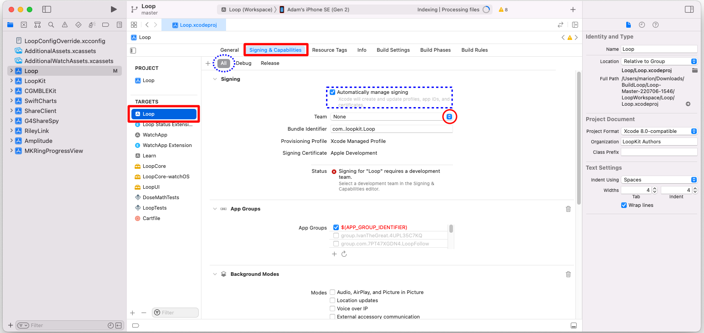

# Build Free Loop

## Prepare to Sign

This page is not stand-alone. You typically get here after choosing to Sign Manually after a successful download using the Build Select script.

Normally this option is chosen by people building the app with the Free option or if you want to build to a simulator on your computer.

If you have a paid developer account and are building Loop 3, you are far better off choosing to configure the permanent override file with your Apple Developer ID. Refer to [Sign Targets](build-app.md#sign-targets).

The instructions found on this page are for the first build.  With the Free version, you need to build every week. Refer to [Build Again with this Download](build-app.md#build-again-with-this-download).

### Select the Loop Folder

!!! danger "Don't touch that button!"
    You will be told exactly where on each screen you should click. Please only click in the designated places.

Follow the directions and compare your Xcode screen to the graphics as you walk through the steps.

As shown in the GIF below:

* Frame 1: This is what the Xcode screen looks the very first time it is opened after a fresh download
    * You need to click on the indicated Loop folder icon two times
* Frame 2: After the 2 clicks, the middle pane of the Xcode window should be similar (except you will see LoopWorkspace, not Loop)

{width="750"}
{align="center"}

### Select Your Phone

Select your phone in the dropdown in Xcode. Be sure to select your actual phone - not a phone simulator.

* If this is the **First Time** your phone or watch has been connected to Xcode, you will need to tell the phone and watch to "Trust this Computer".

{width="650"}
{align="center"}

!!! warning "I don't see my phone"
    * If you don't see your phone in the Devices section, unplug and plug in again
    * Still don't see your phone - reboot the phone - and if that doesn't work - reboot the computer
    * Still don't see your phone - try a different cable or USB slot

### Build to a Simulator

Skip this section if building to a phone and proceed to [Select Signing & Capabilities Tab](#select-signing-capabilities-tab).

If you want to build to a simulator, follow the directions in this section and skip the rest of this page.

* Simply choose one of the iOS Simulators instead of a phone and build to it
    * The iOS simulator you choose does not need to be the same model as your phone
* With a simulator, you do not need to sign targets:
* After a successful build, a simulated phone will appear on your computer and you can interact with the app on that simulated phone
* Follow this link to [Start Build](build-app.md#start-build)

### Select Signing & Capabilities Tab

!!! question "What does Signing Targets Mean?"
    "Signing Targets" in Xcode identifies who built the app. You cannot deploy an app to a phone without signing each target associated with that app.

The graphic below indicates in red the three places you need to click in order to begin signing targets.

* First, click on the tab labeled `Signing & Capabilities`
* Second, click on the icon labeled `Loop` under the word `TARGETS`
* Third, click on the dropdown menu (red circle) by the word `Team`

!!! tip "Click Only where Instructed"
    * Make sure `All`, indicated by dashed blue oval, is selected
        * If `Debug` or `Release` is accidentally tapped, you will not be able to build
    * Make sure `Automatically manage signing`, indicated by dashed blue rectangle, is checked

{width="750"}
{align="center"}

## Sign the Targets

It is time to Sign the Targets with your [Apple ID](xcode-settings.md#add-apple-id).

If you chose to sign manually but have a paid account, you can skip the Free Account steps below.

You will be building multiple targets to make a complete app and must sign each one. With Loop 2.2.x, there are 4 targets. With Loop 3, there are 5 targets.

Start with the Loop target, the first one on the target list. Choose your Apple ID.

{width="400"}
{align="center"}

### Free Account

This section is required if you are using the free account.

Some features of Loop are not available with the Free option, so as you sign, you will need to remove features that are not supported.

1. You must remove unsupported capabilities from 2 targets, this is best done as you sign each target:
    * **Loop Target:** Push Notification, Siri, Time Sensitive Notifications and Near Field Communication Tag Reading
    * **Watch App Extension Target:** Siri
1. Add the keyword `SIRI_DISABLED` to the LoopConfigOverride.xcconfig file
    * Click on the filename in the left pane of Xcode and view it in the Xcode editor
    * Examine the file and find the line that starts with  `SWIFT_ACTIVE_COMPILATION_CONDITIONS = $(inherited)`
    * Insert the new keyword (separated by a space) anywhere after `$(inherited)` and before the slashes near the end of the line
    * When done, that line should be similar to: `SWIFT_ACTIVE_COMPILATION_CONDITIONS = $(inherited) SIRI_DISABLED`

Details about removing unsupported capabilities:

- You must disable Push Notification, Siri, Time Sensitive Notifications and Near Field Communication Tag Reading
    * If the target you are signing does not use one of these attributes, no error message will appear when you select (personal team) for that target
    * If the target you are signing does use one of these attributes, an error message will appear when you select (personal team) for that target
- The Xcode error message starts with "Cannot create . . ." with a list of all the attributes not supported.
    - Scroll down and click on the little trash can icon next to each unsupported attribute
- Scroll up and both the "Cannot create . . ." and "No profiles for . . ." error messages are gone
- You are done with this target
- Proceed to the next target

### End of Free Account Steps

Click on each of the three remaining targets shown in the red box below, and repeat the signing steps by choosing the same team name as you selected in the first target. The targets that must be signed prior to building are **Loop**, **Loop Status Extension**, **Watch App**, **WatchApp Extension**, **Loop Widget Extension** and **Loop Intent Extension**.

> The graphic below is from an older version of `Loop`. You must sign all 6 targets listed above.

{width="750"}
{align="center"}

After signing the targets, click on the Loop icon under the `PROJECTS` heading. (Refer to the bright blue box in graphic above - click on that Loop icon.)

- If you skip this step, you may get an "Entitlements" Build Error for either Loop or WatchApp
    - Follow this procedure to fix the error: [Entitlements Error](build-errors.md#entitlements-error)
    - Much easier to just click on Loop under `Projects`

## Signing Complete

Now that you have signed your app, return to the Build Loop page at [Start Build](build-app.md#start-build).
