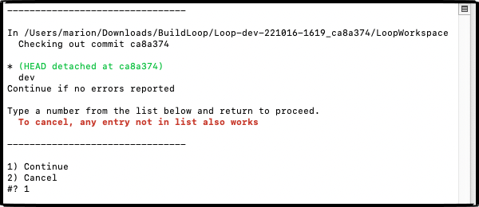
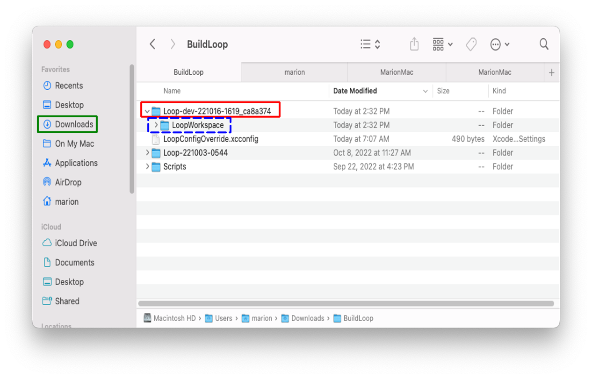

# Building Development Code

The method on this page is for Loopers who want to build the development code to get the latest features, but do not feel comfortable fetching and pulling the latest revisions. This page provides instructions for a lightly tested version of the dev branch. It is not always at the tip of the dev branch; think of it as a snapshot along the development path for dev.

**No matter the method used, script or git commands, you are testing development code. Please read this link now before continuing.**

* **[What's going on in the dev branch](../version/development.md#whats-going-on-in-the-dev-branch)**

For those who feel comfortable composing and issuing git commands to the terminal, refer to the instructions on the [LoopWorkspace](../version/loopworkspace.md) page.

## Loop Dev Script

!!! question "Loop dev before release of Loop 3"
    Before Loop dev branch is released as Loop 3, there is a special page on building what will be Loop 3. Please head over to that page to download and build [Loop-dev](step13.md).

    After the release of Loop 3, that page will be removed. This page will remain.

If you have not previously built the released version of the app using the Build-Select (BuildLoop) script as documented on the [Build the Loop App](step14.md) page, review that page first and then return.

This section provides instructions to use the BuildLoopFixedDev script. It will download a "Fixed" version of the development branch for Loop or FreeAPS and then assist with the build process.

* The BuildLoopFixedDev script downloads the development branch and then selects a specific version that has been lightly tested
* When you use this script, you accept that this is not released code
    * The developer may need to make changes that require you to delete your app and start over
* You are expected to use the [zulipchat, development stream](https://loop.zulipchat.com/#narrow/stream/144182-development)
    * Pay attention to announcemnts
    * Monitor for reports of problems other people are having
    * Report any issue you experience
* The advantage of the script is:
    * Experienced testers have gone before you to test new changes
    * The script issues the `git` commands required to download this version
    * The script assists you in configuring and building after download

The lightly tested version is identified by the commit, a 7-digit alphanumeric code. That code is appended to the folder name of the downloaded code under Downloads/BuildLoop. You can use finder to view the folder name after the script completes.

### Loop-dev Version

The version of code that shows up under the Loop Settings screen does not change when the dev branch is modified.

If you need help with your app, the mentors need more information. Please issue a Loop Report when asking for help. Refer to [Support](../loop-3/settings.md#support) for how to issue a Loop Report. If you want to keep track yourself, refer to [Identify Loop-dev Version](#identify-loop-dev-version)

### Start the BuildLoopFixedDev Script

Copy the line below that starts with `/bin/bash` by hovering the mouse near the bottom right side of the text and clicking the copy icon (should say Copy to Clipboard when you hover over it). When you click the icon, a message that says “Copied to Clipboard” will appear on your screen.

```title="Copy and Paste to start the BuildLoopFixedDev.sh script"
/bin/bash -c "$(curl -fsSL https://raw.githubusercontent.com/loopnlearn/LoopBuildScripts/main/BuildLoopFixedDev.sh)"
```

Paste the line into a Terminal window. Be sure to click anywhere in the terminal before trying to paste. (Ways to paste: CMD-V; or CNTL-click and select from menu or Edit-Paste at top of Mac screen.)

Read the screen (shown below). Type 1 and return if you understand the warning and agree.

* Please read what is on the screen as you progress.
* Adjust font size as directed if you have difficulty seeing the directions.

{width="700"}
{align="center"}

The next graphic warns you about building a development branch. The date and commit number in the script might not match the graphic below. The values in the script will be updated at appropriate times. The date indicates when that commit was added to the branch.

Enter your choice for app and hit return. Loop-dev is strongly recommended.

{width="700"}
{align="center"}

If you get errors when attempting to download, [review this section](step14.md#xcode-errors-with-build-select) of LoopDocs. (It is in the directions for building the released code.) Resolve the errors, if possible, then return to this page.

### Wait for Download to Complete

This download can take from 3 minutes to 30 minutes depending on your download speed.  You can leave the room and return later to check on progress. When you read the words in the terminal, as the script runs, you may see terminology you do not understand - don't worry - you do not need to understand enumeration or submodule or cloning.  You only need to review the display to look for any error messages.

When the download completes, the "Check for successful download" message is displayed. You will need to scroll up in the terminal window to look through all the messages output to the terminal from the beginning of the download. (Your messages that start with "Submodule path" may differ.)

{width="700"}
{align="center"}

If you do not find the word error in your terminal window, continue with [Download was Successful](#download-was-successful).

If you see the word "error" in your terminal window:

* Read the error message
* Try to figure out the problem
* If you need help, reach out to your favorite [Loop Social Media](../intro/loopdocs-how-to.md#how-to-find-help) site
* Tap any key other than 1, followed by return to cancel

### Download was Successful

After the download step, the specific, lightly tested version of Loop-dev, indicated by the commit number, will be "checked out". You will see that commit number indicated by the line that includes "HEAD detached at".  Remember, the specific number shown in your terminal may not match the graphic below.

{width="700"}
{align="center"}

Verify the word "error" is not shown in the terminal and proceed by typing 1 and hitting return.

## Sign and Build

The sign and build instructions are found at [Sign Targets](step13.md#sign-targets).

## Update Loop-dev

While Loop-dev is under active development, you should update frequently.

When building frequently, it is optional to update your provisioning profile with every new build. If you want to always ensure one year, copy and paste the following command into the terminal before building. This forces Xcode to create a new provisioning profile instead of reusing one with an older expiration date.

```title="Copy and Paste to remove Provisioning Profiles"
rm ~/Library/MobileDevice/Provisioning\ Profiles/*.mobileprovision
```


Checking for updates every week is a good idea. Also - subscribe to all the streams on [Loop Zulipchat](https://loop.zulipchat.com) to make sure you don't miss critical information.

You may choose to run the script each time you update. You can discard older versions of the download by using Finder and navigating to Downloads/BuildLoop. Only the most recent copy is required to build loop. Do not discard the Downloads/BuildLoop/LoopConfigOverride.xcconfig file - that is used to automatically sign your app so you can build.

You may prefer to use commands to fetch and pull the latest code without making a new clone.

!!! tip "Folder Name"
    If you decide to update code in the same folder, you should edit the folder name to remove the specific build commit appended by the script.

    This is not required but may avoid confusion.

### Open a Terminal in LoopWorkspace Folder

Refer to the graphic below.  The Downloads folder in Finder is highlighted by the green rectangle on the upper left. The folder containing the code downloaded by the BuildLoopFixedDev script is highlighted by the red rectangle.  Note the folder name indicates the app name and branch: Loop-dev, the date: 221016, the local time 1619 and the commit number: ca8a374. The LoopWorkspace folder below that (dashed blue rectangle) is the folder that needs to be opened in the terminal app.

* Open Finder
* Navigate to Downloads/BuildLoop and look for your download (highlighted by red rectangle) by name and date
* Open the folder to view LoopWorkspace (dashed blue rectangle)
* Hold down the CTRL key and click (or right-click) LoopWorkspace
* A menu appears - select `New Terminal at Folder` (near the bottom of the list)

This new terminal window opens in the LoopWorkspace folder needed to perform `git` commands to update your downloaded copy (clone) when new updates are made to the repository.

{width="750"}
{align="center"}

* Some users like to use [GitKraken](https://support.gitkraken.com/) to assist them (link takes you to a tutorial video).
* Some are comfortable with the command line git commands described on [here](../version/loopworkspace.md#updating-loop-using-loopworkspace).

### Identify Loop-dev Version

The version of code that shows up under the Loop Settings screen will remain fixed until Loop-dev is released. In order to identify which version of dev you have on your phone, you need the commit.

The commit is identified by a 7-digit alphanumeric code.  That code was also appended to the folder name of the downloaded code under Downloads/BuildLoop as shown in the graphic above.  You can use finder to view the folder name after the script completes. It also appears in the Loop Report, refer to [Support](../loop-3/settings.md#support) for instructions on issuing a Loop Report. After you issue the Loop Report, look at the workspaceGitRevision number near the beginning of the report.

When you ran the BuildLoopFixedDev script, the instructions informed you of the commit.
