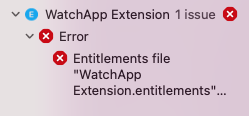
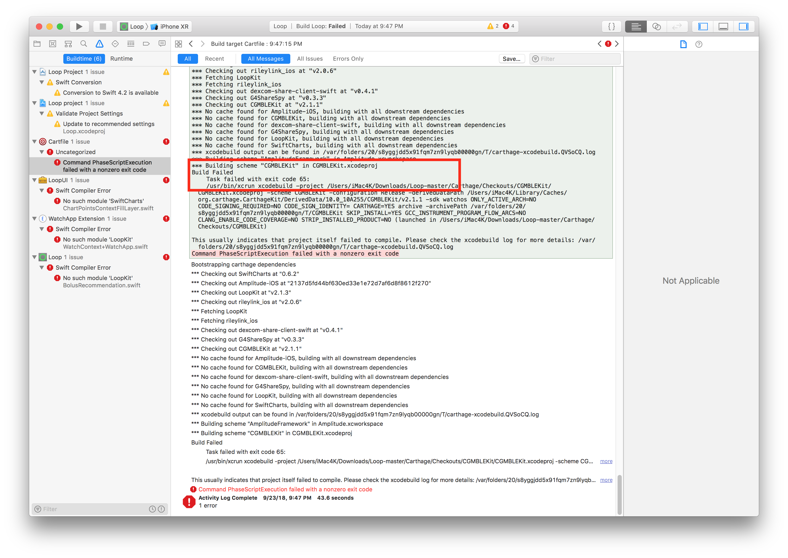
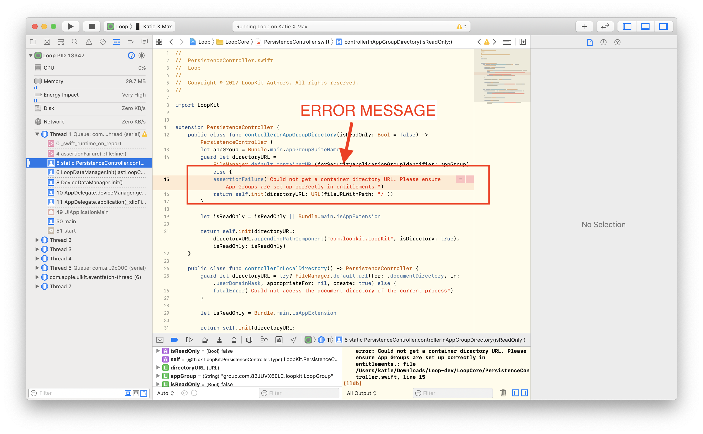
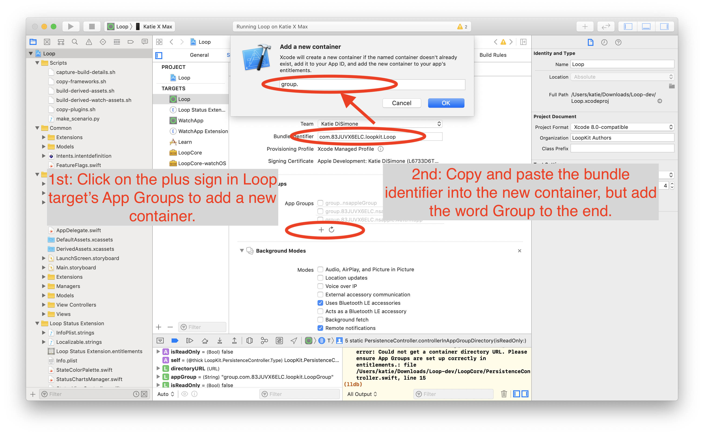
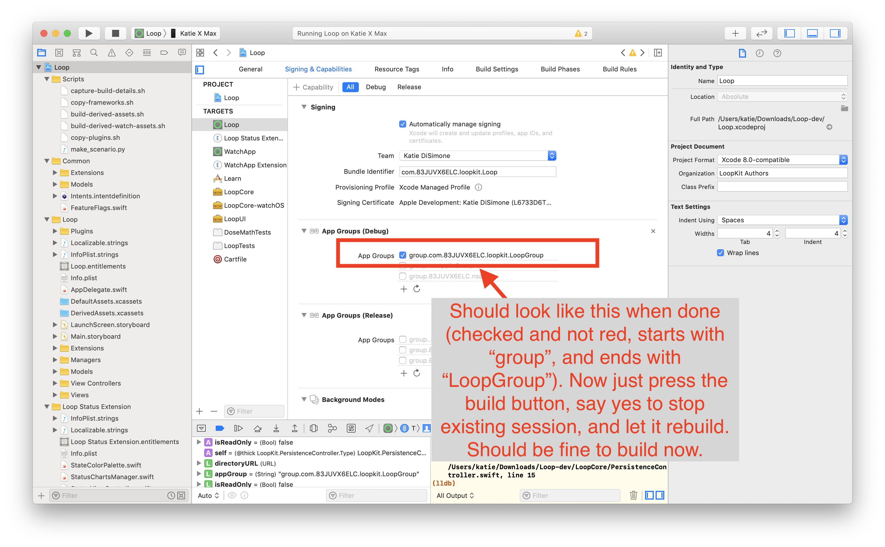
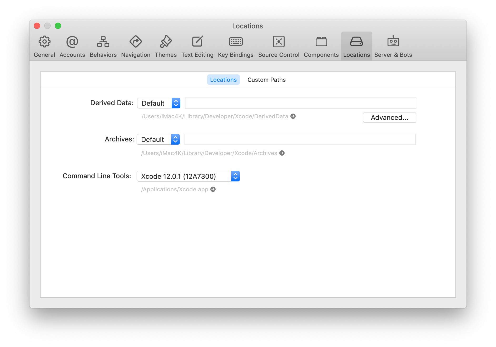

# Build Errors

There are two types of build errors that happen: they are yellow warnings and red alerts. You'll see the warnings and alerts in the left-hand column of the Xcode window.

<font color="orange">**Yellow warnings**</font> do not cause the build to fail, those are just warnings.  You will often see yellow alerts. Ignore those. Do not try to do anything to fix those.

<font color="red">**Red error alerts** </font> will have to be resolved before you can successfully build the Loop app. The steps below explain how to resolve them based on the messages you are seeing.

## Start with The Obvious Error Causes

!!! info "New Loop Builders"
    This page contains build error help for people updating their Loop app as well as brand new Loop app builders. Some of the "obvious" errors causes aren't relevant for brand new builders. Check out items 4, 6 and 7 in the list below. Then, skim the page until your reach [Find Your Error Message](build_errors.md#find-your-error-messages). Once you've identified your error message, try to resolve it.  Still stuck? Read [Posting for Help](build_errors.md#posting-for-help)


Before you start trying to resolve your red errors, start with the most obvious things that can cause a red error message:

1. **DO NOT USE BETA VERSIONS**  If you are using an iOS beta version or an Xcode beta version, your Loop will not build. If you have Xcode beta, uninstall it and get regular Xcode. If you have iOS beta on your iPhone, you will need to restore your iPhone entirely. You can restore to either (1) the last non-beta backup version you saved or (2) restore as a new iPhone (default settings). Yes, deleting iOS beta is a pain...so don't install it in the first place.

2. **Did you check for Xcode updates?** This is critical. If you are updating your Loop app, please review the iOS driven requirements for [Xcode and macOS](updating.md#step-1-install-macos-and-xcode-updates).

3. **Did you check your Apple developer account for new license agreement?** Periodically, Apple will release a new developer license agreement that you need to sign before you can build new apps. You will get a build failure if there is a pending license agreement to sign. [Login to your Apple developer account](https://developer.apple.com/account) to check if there's a new license agreement.

4. **Did you reboot, i.e., restart, your computer after updating Xcode?** You must reboot following Xcode installation or update and you must make sure your command line tools match the version of Xcode you just installed. [Xcode Command Line Tools](step9.md#command-line-tools)

5. **Did you get a fresh download of Loop code?** If you tried to build with an old download that you used a long time ago, that old version may not be compatible with the new iOS and Xcode versions. Check also, that you are actually using the new download in Xcode.  Xcode remembers the project you last opened, you need to tell Xcode about the new download.

6. **Are you are using a free developer account?** Make sure you finished the [removal of Siri and Push Notification capabilities](../build/step14.md#free-account).

1. **Are you doing a WorkSpace build?** Make sure you selected Loop (Workspace) instead of Loop.

## Fix 95% of errors

If you have checked all those steps above and think you have a true build error, here's a tip that resolves 95% of all build errors when updating Loop code.

1. Open your project in Xcode as normal. Then go to the Xcode menu at the top of the screen and find the "Product" menu item. Use the drop down selection for "Clean Build Folder" or press shift-command-K. Either will work the same.
1. On the far right, next to the name Full Path is the folder name that Xcode will be using to build. Make sure it is the new code you just downloaded and not an older folder.
1. If you are updating Loop and did not do [Steps 4a and 4b](updating.md#step-4a-delete-old-provisioning-profiles), do it now
1. Return to Xcode and try building your app again.

If the build fails again, look through the list below and see if you can match your error message with one of the error messages listed later in this page. If you really can't find your solution, then post for help. But help us help you.

- Ignore yellow warning messages - those are not errors - do **not** try to fix them
- Confirm it really is an error not already on this page; read this page carefully, including all the circled bits in the images in the Specific Error Messages section
- Follow the steps in the Posting for Help section
- WE CANNOT HELP without version numbers and screenshots
- Do not take pictures of your computer screen with your phone


## Posting for help

STOP!!  Read this section! Important!

Before you post in a [Loop Social Media](../index.md#stay-in-the-loop) site asking for help with build errors, do your work first. The build errors listed below (and the checks listed above) will fix most of problems you may encounter. ***PLEASE READ THIS PAGE***. The volunteers answering questions online would love to spend more time helping people use Loop and less time answering questions that can be addressed by using this page.

Therefore, try to resolve your build error yourself. Then, if you need to post for help, please include enough information with the post so the volunteers know where you are in your troubleshooting attempts.

!!! warning "Your Post Must Include:"
    * The version of Xcode you are using
    * The version of Loop you are building with
    * The version of iOS on your Loop iPhone
    * Free or paid account, and if free, confirmation that you deleted Siri and Push Notification capabilities
    * Confirmation that you are not using an Xcode beta or iOS beta version (so we don't have to ask, please actually type "I am not using beta versions")
    * Screenshots of your WHOLE Xcode window and/or Terminal window showing your error and any messages you've seen while working through the build errors/solutions.  Do NOT use phone photographs of your computer screen.  See below for instructions on how to capture a screenshot.
    * State which fixes from the list below you have already tried AND post the screenshots of the results of those fix attempts.

## Screenshots

Please take screenshots of your issue and use them in your posts. On an Apple computer, press `shift-command-4` keys at the same time followed by pressing the space bar and then click on the window of interest. The screenshot will be saved to your desktop with a file name starting with the name "Screen Shot". Use screenshots instead of cell phone images or words whenever possible. Screenshots are higher resolution and easier to read.

Use the whole Xcode window screenshot when posting for build help.

## Find Your Error Message(s)

To begin fixing the error, use the Report Navigator view to find your error message.

{width="750"}
{align="center"}

The key is to (1) **READ THE ERROR MESSAGE** and then (2) **FIND YOUR MESSAGE IN ONE OF THE TOPICS BELOW**.

Here's a super tip: Merely seeing the "exit code" in Xcode is not enough information to discern what error is causing your build to fail; some exit codes have multiple causes. Look at the detailed message to guide your search for the matching solution.

Notice the screenshots below have red circles highlighting certain error messages.  Read your error message(s) from your screen, being guided by the red circles in the screenshots. Once you find your error message (hint: not "exit code"), you can either:

* Take the error message from your Xcode screen and use LoopDoc's search function to enter in some of that phrase to bring up the appropriate solution topic, or

* Take the error message from your Xcode screen and read through EACH OF THE TOPICS BELOW. Check each of the red circles to see if you have a match. Kind of like a matching puzzle.

For example, if you see "Invalid active developer path (/Library/Developer/CommandLineTools)" in your error message, use the search tool in LoopDocs with "invalid active". You will get a couple of links and one is the Command Line Tools fix for that error message. Click on the link and you'll find the solution.

{width="650"}
{align="center"}

## Specific Error Messages

### Package.resolved file corrupted or malformed

**Error Message:**

_Package.resolved file is corrupted or malformed; fix or delete the file to continue: unsupported schema version 2_

{width="600"}


This error is new with Loop-dev, which uses Package Dependencies.

There are 2 problems shown here

1. The graphic was acquired using a camera instead of following these [screenshot directions](#screenshots)
2. The version of Xcode is out of date

**Solution:**

Update Xcode, which may require you to update macOS.

### Couldn't Get Revision for Package Dependency

This error is new with Loop-dev, which uses Package Dependencies.

* If you notice a red x in Xcode (as circled in the graphic below)
    - Click on the red x to show the error in the left pane
    - Alternatively, you can click on the icon shown with the red square to see the same information

**Error Message:**

{width="600"}

Text in error:

* _Uncategorized_
    - _Couldn't get revision . . ._

**Solution:**

Refer to the graphic below

1. Click on the folder icon (indicated by red square)
1. Hold down the Control-Key and click the `Package Dependency` row to display the dropdown menu (shown in the inset)
1. Select Resolve Package Versions from the dropdown menu
1. Once that completes, the red x should resolve and you can build as soon as the Indexing message appears

{width="600"}


### Cycle Dependency

This error is new with Xcode 13.3 (late Sep 2021) which has a new requirement

* For those who care: the new requirement is that for a certain type of instruction file, the line with the `Headers` keyword must be located before the line with the `Sources` keyword
* There used to be many repositories that did not have lines in that order
* All of these instruction files have been updated for Loop Master, Loop dev and FreeAPS
* If you are building with an older copy of the code, you may see this error

**Error Message:**

{width="600"}

Text in error:

* Left window (the exact target names are not important):

    * _Cycle in dependencies between targets . . ._ 

* Middle window:

    * _Target build order preserved because "Build Order" is set to "Manual Order" in the scheme settings_

**Solution:**

No need to quit Xcode - follow these steps using the Xcode Menu bar. (It's possible that only Step 1 is required, but sometimes all steps are needed.)

1. From the `Product` menu (of Xcode), select `Clean Build Folder` 
1. From the `File` menu, select `Close Workspace` 
1. From the `File` menu, select `Open Recent` and choose the top line 
1. Press the Build Button (play icon)


### Entitlements Error

**Error Message:**

The solution for this error has been updated with a new, simpler method.

{width="250"}

Text in error message can be either of these:

_Entitlements file "WatchApp Extension.entitlements" was modified . . ._

or 

_Entitlements file "Loop.entitlements" was modified . . ._

**Solution:**

No need to quit Xcode - follow these numbered steps as indicated in the graphic below. 

1. Click on the Loop icon under PROJECT
1. From the `Product` menu (of Xcode), select `Clean Build Folder` 
1. Press the Build Button (play icon)


{width="900"}

It turns out that

* You can start building before indexing completes - just make sure it has started
* The behavior causing this in Xcode has been reported to Apple

### CompileAssetCatalog Error

This error is found when there is a space embedded in the path name to your LoopWorspace folder. The good news is that LoopWorkspace seems to be able to build from an iCloud or Dropbox drive.


{width="900"}

Text in error message:

_Command CompileAssetCatalog failed with a nonzero exit code. . ._

**Solution:**

This is very similar to the steps for the WatchApp Entitlements Error but you need to repeat it for 2 targets: `Loop` and `WatchApp` - the graphic below matches the step numbers in the list.

1. Click on `Loop` folder
1. Click on `Loop` target
1. Click on the `General` tab
1. Click on the `App Icons Source` dropdown menu
1. Click on the item already selected (the line will change from red to blank)


{width="900"}

- Repeat the `App Icons Source` dropdown menu selection for the `WatchApp` target
- (Optional) Clear the Build Error (Menu at top of Xcode: Select Product->Clean Build Folder)
- Press build


### Carthage Error

With the new LoopWorkspace download and build method - you should not see carthage errors. If you do see carthage errors - you probably did not select Loop (Workspace) at the top of the Xcode window.  This is a new step and easy to forget. Review the graphic from the new [Build Instructions](step14.md#wait-for-xcode-to-start-indexing)

Or maybe you are a repeat builder who did not read the updated information and tried to use the old zip-download method. That is no longer supported.  Please read all of the [Updating](updating.md) page.


!!! info ""
    Advanced builders using dev may need carthage but they should have followed the directions for [Advanced Users Only](step13.md#advanced-users-only)

If you previously installed carthage (used to build Loop before mid-January 2021) and it was updated to a version newer than 0.36.0, you may get a carthage error.

If you are using a Loop fork or a Workspace build with the dev branch, you may still require carthage. This [external link](https://www.loopandlearn.org/carthage-0-36-0/) explains how to install the correct version of carthage on your computer.

**Error Message:**

!!! warning "Wrong Version of Carthage Error"
    Applications/Xcode.app/Contents/Developer/Toolchains/XcodeDefault.xctoolchain/usr/bin/lipo: one of -create, -thin <arch_type>, -extract <arch_type>, -remove <arch_type>, -replace <arch_type> <file_name>, -verify_arch <arch_type> … , -archs, -info, or -detailed_info must be specified.

**Solution:** Manually uninstall carthage.

- Open a Terminal
- Copy and paste this command into the terminal and hit enter

```
rm -rf /usr/local/bin/carthage
```

- Copy and paste this command into the terminal and hit enter

```
sudo rm -rf /Library/Frameworks/CarthageKit.framework
```

- You will be prompted for a password when you hit enter on the second command
- It is the same password you use to log into the computer; you must have admin privileges to do this step
- The password will not display on the screen as you type it

### Could Not Locate Device Support Files

**Error Message:** "Could not locate device support files." That message is telling you that your iOS on the Loop phone requires you to get a newer version of Xcode to be able to build Loop onto that phone.

**Solution:** Update your Xcode version; this may also require a macOS update. Please review the phone iOS driven requirements for [Xcode and macOS](step8.md#how-do-all-the-minimum-versions-relate-to-each-other).

{width="750"}
{align="center"}


With Xcode 12, the simulators are no longer being downloaded automatically. If you are missing a simulator, follow the steps under Step 9 [Simulator Download](step9.md#simulator-download).

### No Such Module 'LoopKit' or Similar Message

**Solution**: You probably forgot to select LoopWorkspace. Review the graphic from the new [Build Instructions](step14.md#wait-for-xcode-to-start-indexing)

**Error Message:** If you see a **Cartfile failure** and several other red errors (in particular saying there is "no such module 'LoopKit'"), double click on the Cartfile error message.  If it says the build failed in one of the schemes, as shown in the screenshot below, then re-run the [Carthage Error](build_errors.md#carthage-error) fix listed above.

**Solution**: For zip-download (not advised): Make sure to download a fresh version of code!  <span style="text-decoration: underline">Anything downloaded before Jan 21, 2021 will not work.</span>  That's when the need for carthage was removed.

{width="850"}
{align="center"}

### Developer License Update (PLA Update)

**Error message:** "The Apple Developer Program License Agreement has been updated,  In order to access certain membership resources, you must accept the latest license agreement". Or you may see "Unable to process request - PLA Update available. You currently don't have access to this membership resource. To resolve this issue, agree to the latest Program License Agreement in your developer account."

**Solution:** You'll need to log onto your developer account at [developer.apple.com](https://developer.apple.com/account/) and accept the latest license agreement.

{width="750"}
{align="center"}

### Could Not Get a Container Directory URL

**Error message:** "Could not get a container directory URL. Please ensure App Groups are set up correctly in entitlements."

{width="750"}
{align="center"}

**Solution**: To resolve this error, you will need to click on the Loop target's signing area and then the plus-sign in the App Groups area under the signing. Copy and paste the bundle indentifier into the new container that starts with `group.` and then add `Group` to the end of the name. Click OK to save. Note, the line will start with lower case `group.` followed by your bundle identifier and an upper case `Group` added to the end of the bundle identifier.

{width="750"}
{align="center"}

The final App Group should now have a blue check box, the name should start with `group` and end with `LoopGroup`. See the screenshot as an example. Click the build button after your App Group is setup similarly and you should be good.

{width="750"}
{align="center"}

### Missing Command Line Tools

**Error message:**  "Invalid active developer path (/Library/Developer/CommandLineTools)" or "unable to find utility "xcodebuild", not a developer tool or in PATH"

{width="550"}
{align="center"}

{width="550"}
{align="center"}

**Solution:** Go to your Xcode preferences and under the Locations tab, select your Xcode version (the figure shows 12.0.1 - yours should match your Xcode version) in the dropdown menu for Command Line Tools.

{width="550"}
{align="center"}

### Device Management Could Not Launch Loop

**Error message:** "Could not launch "Loop". Verify the Developer App certificate for your account is trusted on your device. Open Settings and navigate to General -> Device Management, then select your Developer App certificate to trust it."

{width="750"}
{align="center"}

**Solution:** If you get this message and are unable to find the Device Management option in your phone settings, then we need to do a little extra step to clear out some old info.

1. Plug the phone into the computer and open Xcode
2. Click the "Window" menu item in Xcode and then choose "Devices and Simulators"
3. Right click your phone on the left and pick "Show Provisioning Profiles"
4. Delete all of the items in the list that have Loop in the name
5. Go to your four signing targets and change the signing team back to "None" for a quick bit, and then change back to your regular signing team name again.
6. Rebuild Loop

That should clear the out, problematic profiles and allow a successful build.

If your problem persists after that, then you might need to do total reset of your phone to clear out the pesky problem. Before you do this, you may want to [Post for Help](build_errors.md#posting-for-help) to make sure it is really necessary:

1. Wipe the iPhone clean and set it up as a new device
    - FIRST - write down or screenshot all your settings
    - Pod users - you will have to start a fresh pod after this
    - If you want your old pod to continue giving you basal rate, don't replace the pod before wiping your phone.  Once the phone is reset and a new Loop app is added, you must start a new pod.  The old pod should have the [sound connection broken](../faqs/omnipod-faqs.md#what-do-you-do-to-stop-a-screaming-pod) before being discarded because you won't be able to deactivate the pod.
2. Delete all certificates from your Developer account (you'll need to login to your Developer account to do that)
3. Delete your old Loop code download and get a new one.
4. Rebuild Loop on the phone with the new download of Loop code.
1. Start a new pod with the new Loop app on the reset phone.

### Pending Certificate Request

**Error message:** "You already have a current iOS Development certificate or a pending certificate request."

{width="750"}
{align="center"}

**Solution:** This error message has recently started to appear for some new Loop builders. To resolve the issue, please log in to your Developer account at [developer.apple.com](https://developer.apple.com) and then click on "Certificates, Identifiers & Profiles".  Under that screen, you will see "Development" under the "Certificates" section in the column on the left.  You will need to click on the certificates, and choose "revoke" from the options that show after you click on the certificate. Confirm the warning message that will appear asking "Do you want to revoke the certificate?"

{width="750"}
{align="center"}

After you do that, return to Xcode and open up Xcode preferences.  Under the Accounts section of Preferences, click on the minus sign to delete your Apple ID.

{width="650"}
{align="center"}

Re-enter your Apple ID (yes...add that account right back that you literally just deleted), return to your Loop's target signing areas in Xcode and your error message should have resolved as a new certificate will have been issued and a provisioning profile should have been created automatically.

You can verify the iOS development certificates are working by clicking on "Manage Certificates" in Xcode Preferences, Accounts and viewing the iOS Development Certificates.  You should have one for your account that has a clean status similar to the screenshot below.

{width="650"}
{align="center"}

### Command CodeSign Failed

**Error message:** "errSecInternalComponent,  Command CodeSign failed with a nonzero exit code"

{width="850"}
{align="center"}

**Solution:**  This error message is likely due to inadvertently saying "no" to allowing Keychain Access or changing your computer or AppleID password. Regardless, the solution is as follows:

1. Close Xcode
2. Open your Keychain Access application (found in Applications within the Utilities folder)
3. In the upper left corner of keychain access, make sure you have the keychain `login` highlighted and then right-click the lock next to the `login`.  Click the lock closed, and then click the lock to open it again. You will be prompted for a password.  Enter your computer admin password.  Close Keychain Access app.

{width="450"}
{align="center"}

4. Open your Loop project again in Xcode.
5. In the main Xcode menu (grey menu bar at the very top of your Apple display area), select `Product` and then select the option for `Clean`. (Keyboard shortcut is shift-command-k)
6. Now try rebuilding your Loop app.  If you ever get prompted again to allow Xcode access to Keychain, make sure to click on the option to Always Allow.

### Unrecognized Arguments

**Error message:** "Unrecognized arguments: --cache-builds"

{width="850"}
{align="center"}

{width="850"}
{align="center"}

**Solution:** This is a homebrew / carthage error, so I don't think you'll see this. If you do, download a fresh copy of Loop code and try again. If it repeats, it is time to request assistance. Please read [Posting for Help](build_errors.md#posting-for-help).

### Abort with Payload

**Error message:** "**Abort with payload**"  Your app will only open briefly with a white screen and then close, if you build with this error.

{width="750"}
{align="center"}

**Solution:** This error message is caused by having the Loop download folder in an iCloud mapped drive when doing the zip download.  Move your Loop download folder back to the Downloads folder, then rebuild. LoopWorkspace builds with Xcode 13 appear to work fine with an iCloud drive.  You may run into the spaces in your path name problem - which has a different solution.


## Apple Watch Issues


### Apple Watch: Loop App Not Appearing

**Error:** Apple watch app is not appearing.

**Solution:** This error usually appears because you have not updated the watchOS prior to building Loop, or you didn't have your Apple watch paired at the time of building Loop.  

Don't forget to open the iPhone's Watch app, select My Watch tab on the bottom left, scroll all the way down, and click `Install` for the Loop app listed at the very bottom under "available apps".


### Apple Watch: Loop App Not Installing

**Error:** The Loop app appears on the list of apps available to install on the watch, but when you press "install", and it goes through the animation of filling in the circle while it's installing, but then at the end it just toggles back to saying "INSTALL".

**Solution:**  Plug your iPhone into the computer and start Xcode.  On your watch, look for a prompt that says "Trust this computer".  Scroll down on the watch face and select the "Trust" button. In Xcode, go to the top menu bar and select "Clean Build Folder" from the Product menu option, and then rebuild your Loop app.

For an unknown reason, the watch app can still fail to install properly. If the "Clean Build Folder" step above, is insufficient, you may need to unpair your watch and then pair as new.  After this, rebuild Loop on your phone while wearing your watch and "Trust this computer" when prompted.  This typically configures the Loop app to install properly on your watch.
