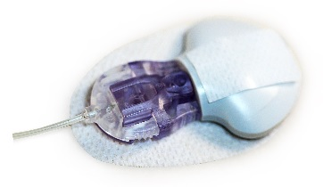

## Compatible CGM

!!! info "Time Estimate"

    - 10 minutes to read this page

!!! abstract "Summary"

    The *Loop* app is compatible with:

    - *Dexcom* G4 Share, G5, G6 or ONE CGM systems
        * *Dexcom* ONE (based off G6 sensor) is available in some countries, but will be discontinued soon
    - *Dexcom* G7
        * *Dexcom* ONE (based off G7 sensor) is available in some countries
        * At the current time, this version of *Dexcom* ONE **cannot** be used with Loop but pay attention to social media - an early indication is that a simple patch will allow this to work, but that patch is not available - more testing is needed
    - Medtronic sensors connected to a Loop-compatible Medtronic pumps
    - Some Libre sensors: dev branch only

!!! question "FAQs"

    - **"What about Libre sensors?"**
        1. Libre support is available in the [Loop-dev branch](../version/build-dev.md) - be sure to read information at that link about running the dev branch
    - **"What about Eversense?"** Refer to [CGMs Not Supported in the *Loop* App](#cgms-not-supported-in-the-loop-app)

## Continuous Glucose Monitor (CGM)

The *Loop* app uses your CGM glucose readings, carbohydrate input and therapy settings, to model your current glucose trend, predict future glucose and automatically adjust insulin dosing. A compatible CGM is essential to operation of the *Loop* app.

## *Dexcom* G5, G6 and ONE CGM {width="150"}

The *Dexcom* G5, G6 and ONE CGM transmits data directly to the *Dexcom* app on your iPhone via Bluetooth.

The *Dexcom* ONE, available in some countries, acts just like the G6 as far as the *Loop* app is concerned. The *Dexcom* ONE app does not provide some features, such as *Dexcom* Share, that come with the G6. When you set up the *Loop* app, select *Dexcom* G6 as your CGM to use *Dexcom* ONE CGM with the *Dexcom* ONE app installed on your phone.

!!! warning "G7-like ONE is not compatible"
    There are reports that *Dexcom* is transitioning the ONE to the G7 platform. These device cannot be used with the *Loop* app at this time.

If the *Dexcom* app is on the same device as the *Loop* app, your system can function without an internet connection. See Offline Use below.

!!! warning "*Dexcom* G5 Support"

    [*Dexcom* has stopped supporting the G5 system in the US](https://www.dexcom.com/obsolescence){: target="_blank" }. In the US, and some other countries, the G5 is not available for download from the Apple Store. There are countries in which *Dexcom* does supply and support G5. The G5 capability will continue to be supported in Loop.

    There are third party apps, which interface with G4 and G5 transmitters, supported by some forks of Loop. The version of the *Loop* app supported by these documents only works with the *Dexcom* apps.

## *Dexcom* G7 CGM

*Dexcom* G7 is supported with version 3 or greater of the *Loop* app.

## Medtronic CGM {width="150"}

The Minimed Enlite CGM, available with the Medtronic 522/722, 523/723, and 554/754, wirelessly sends glucose readings to the pump. The *Loop* app can read the Medtronic CGM data directly from the pump using a RileyLink compatible device.

## Offline Use

"Offline Use" means using the *Loop* app when there is no cell data or internet available. The *Loop* app does not require any special setup to operate offline.

For offline use, the iPhone's Bluetooth still needs to be active; and for *Dexcom* users, the G5, G6 or G7 app also needs to be running on the same phone as the *Loop* app. If you put your iPhone into Airplane mode, remember to turn Bluetooth back on to keep both the CGM and the *Loop* app running. If your offline use is failing, chances are you have forgotten to update your transmitter ID in the *Loop* app settings when you changed transmitters.

## *Dexcom* Share

The *Loop* app can download *Dexcom* Share data for use in modeling glucose. However, this is not a typical configuration and requires internet connection for both the phone with the *Dexcom* app and the phone with the *Loop* app.  The steps for adding a CGM explain that you usually enter the *Dexcom* transmitter ID and leave the *Dexcom* Share setting blank.

!!! warning "*Dexcom* ONE"
    The *Dexcom* ONE app does not support Share.

## Nightscout as a Remote CGM

Version 3 or later of the *Loop* app can use Nightscout as a remote source for CGM data. This requires cell or WiFi connection.

## CGMs Not Supported in  the *Loop* App 

Libre Support (for some Libre sensors) is available with Loop-dev or by adding customizations.

* [Loop dev](../version/build-dev.md) adds [LibreTransmitter](https://github.com/dabear/LibreTransmitter#libretransmitter-for-loop){: target="_blank" }
* [`Loop and Learn: Loop Customization`](https://www.loopandlearn.org/custom-code/){: target="_blank" } 

Currently, there are no solutions for *Eversense*, *Guardian* or *Libre 3* CGM to be used directly with the *Loop* app, but some [Uploaders](https://nightscout.github.io/uploader/uploaders/){: target="_blank" } to Nightscout are available using an Android phone. Version 3 or later of the *Loop* app allows the use of Nightscout as a CGM source.

## Next Step

If your compatible pump is Medtronic or Omnipod (not DASH)

* Next step is to [Order a RileyLink Compatible Device](rileylink.md)

If your compatible pump is Omnipod DASH

* Next step is to enroll in the [Apple Developer Program](apple-developer.md).
