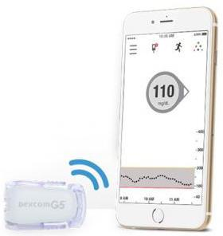

## Compatible CGM

!!! info "Time Estimate"

    - 10 minutes to read this page

!!! abstract "Summary"

    Loop is compatible (on the same phone) with:

    - Dexcom [G5, G6 or ONE](#dexcom-g5-g6-and-one-cgm) and [G7](#dexcom-g7-cgm)
    - Some [Libre](#libre-cgm) (Loop 3.4 or newer)
    - [Medtronic](#medtronic-cgm) Enlite connected to a Loop-compatible Medtronic pumps

    Other methods:

    * Internet connections to Nightscout or Dexcom Share

!!! question "FAQs"

    - **"What about other Libre sensors?"**
        1. Only some Libre sensors have methods to read them directly on an iPhone
        2. There are more methods for Android
    - **"What about Eversense?"** Refer to [CGMs Not Supported in Loop](#cgms-not-supported-in-loop)

## Continuous Glucose Monitor (CGM)

Loop uses your CGM glucose readings, carbohydrate input and therapy settings, to model your current glucose trend, predict future glucose and automatically adjust insulin dosing. A compatible CGM is essential to operation of the Loop app.

## Dexcom G5, G6 and ONE CGM
{width="150"}

The Dexcom G5, G6 and ONE CGM transmits data directly to the Dexcom app on your iPhone via Bluetooth.

The Dexcom ONE, available in some countries, acts just like the G6 as far as Loop is concerned. The Dexcom ONE app does not provide some features, such as Dexcom Share, that come with the G6. When you set up Loop, select Dexcom G6 as your CGM to use Dexcom ONE CGM with the Dexcom ONE app installed on your phone.

If the Dexcom app is on the same device as Loop, Loop can function without an internet connection. See Offline Use below.

!!! warning "Dexcom G5 and G6 Support"

    [Dexcom has stopped supporting the G5 system in the US](https://www.dexcom.com/obsolescence). In the US, and some other countries, the G5 is not available for download from the Apple Store. There are countries in which Dexcom does supply and support G5. The G5 capability will continue to be supported in Loop.

    In the US, Dexcom has announced support for G6 continues for sensors but not receivers. They will continue to supply sensors so long as pump partners require it.

    The version of Loop supported by these documents only works with the Dexcom apps.

## Dexcom G7 CGM

Dexcom G7 is supported with Loop 3.

## Libre CGM

With Loop 3.4 and newer versions, some Libre CGM are supported.

* Libre 1 are supported but must use a third-party transmitters (miaomiao and bubble transmitters are supported)
* European Libre 2 can be used directly or via transmitter
* American Libre 2 is not supported
* Libre 3 is not supported

## Medtronic CGM
{width="150"}

The Minimed Enlite CGM, available with the Medtronic 522/722, 523/723, and 554/754, wirelessly sends glucose readings to the pump. Loop can read the Medtronic CGM data directly from the pump using a RileyLink compatible device.

## Offline Use

"Offline Use" means using Loop when there is no cell data or internet available. Loop does not require any special setup to operate offline.

For offline Loop use, the iPhone's Bluetooth still needs to be active; and for Dexcom users, the G5, G6 or G7 app also needs to be running on your Loop phone. If you put your iPhone into Airplane mode, remember to turn Bluetooth back on to keep your Loop running. If your offline use is failing, chances are you have forgotten to update your transmitter ID in Loop settings when you changed transmitters.

## Dexcom Share

Loop can download Dexcom Share data for use in modeling glucose. However, this is not a typical configuration and requires internet connection for both the phone with the Dexcom app and the phone with the Loop app.  The Loop Set Up Steps for adding a CGM explain that you usually enter the Dexcom transmitter ID and leave the Dexcom Share setting blank.

!!! warning "Dexcom ONE"
    The Dexcom ONE app does not support Share.

## Nightscout as a Remote CGM

Loop 3 can use Nightscout as a remote source for CGM data. This requires cell or WiFi connection.

## CGMs Not Supported in Loop

Currently, there are no solutions for Eversense or Guardian CGM to be used directly with Loop, but some [Uploaders](https://nightscout.github.io/uploader/uploaders/) to Nightscout are available using an Android phone. Loop 3.0 and later allows the use of Nightscout as a CGM source but this requires internet access for closed-loop.

## Next Step

If your compatible pump is Medtronic or Omnipod (not DASH)

* Next step is to [Order a RileyLink Compatible Device](rileylink.md)

If your compatible pump is Omnipod DASH

* Next step is to enroll in the [Apple Developer Program](apple-developer.md).
