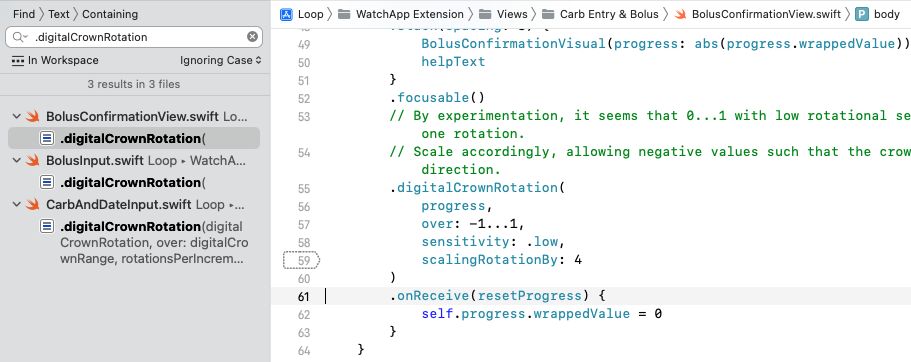

## Build then Customize

For new Loopers, please build the code before you make any changes. Start with Open Loop and familiarize yourself with the interface.  Later, you can make the customization(s) you desire and build again.  The second build will be much easier than your first build.

These customizations require you to build the Loop app onto your iPhone, they cannot be done from within the app itself.

## Customization Options

Read about the customizations on this page before applying them.

!!! warning "You take responsibility"
    You are responsible when you decide to use customizations.

    Be sure to report what changes you made if you need to ask for assistance with your app.

Some customizations are the same for everyone and have been prepared for easy use. 

* Mac-Xcode builders can use the [Loop and Learn: Loop Customizations](https://www.loopandlearn.org/custom-code) script
    * This script automatically finds the most recent download and when you are done selecting customizations, opens Xcode to that download
    * Even if you don't want to apply customizations, you can use this script as a easy way to find and open your download
* Browser builders can use [Loop and Learn: Customization: Prepared Customizations](https://www.loopandlearn.org/custom-code#prepared-custom-list)

Other customizations require that you create your own personalized version.

* Mac-Xcode builders: all the information required is on this page
* Browser builders: read this page and use [LoopDocs: Customization with Browser](../gh-actions/gh-customize.md#prepare-the-patches)

For Build with Browser, you can skip over the Mac-Xcode specific section and skip ahead to [Build-Time Features](#build-time-features).

When applying a customization using Mac-Xcode, the downloaded code should be fairly recent. If you are not sure, get a fresh download. If you know your downloaded code is the [Current Release](../version/releases.md#current-release), you can skip the download and use the same folder as last time.

### Find My Downloaded Loop Code

Refer to the graphic below.  The Downloads folder in Finder is highlighted on the upper left. The full path to Loop.xcworkspace is highlighted along the bottom.

!!! success "Loop to LoopWorkspace"
    Note that the directory `Loop.xcworkspace` has been renamed to `LoopWorkspace.xcworkspace` in the released code. For experienced builders - you realize this is good because the build process is easier.

    The words were updated, but it will take time for the graphics to be updated.

* Open Finder
* Navigate to Downloads/BuildLoop and look for your download by name and date
* Open that folder, for example, Downloads/BuildLoop/Loop-220803-1145, and inside that folder open the LoopWorkspace folder
* Inside the Downloads/BuildLoop/Loop-220803-1145/LoopWorkspace folder, double-click on LoopWorkspace.xcworkspace (graphic not updated yet)
* Xcode automatically opens to that particular download
* You can then make the customizations and build to your phone

{width="750"}
{align="center"}

!!! tip "Experienced Builders"
    Experienced builders will often build a fresh download to a simulator for their phone iOS (not their phone) to ensure download is good and is compatible with macOS, Xcode and phone iOS. Once the build is successful, they apply their customizations and build again to the simulator. Last step is to build the customized version to their real phone.

Be sure to read the [Instructions for Finding the Lines](code-customization.md#instructions-for-finding-the-lines).

!!! info "Line numbers may change"
    Every effort will be made to update the line numbers as the code is updated, but there may be times where the screenshots and line numbers differ from the current version of Loop code.

    * You may notice some customizations list line numbers for different branches

    * If you cannot identify a line that looks exactly like the example - do not guess - go to your favorite social media group and ask for help

!!! abstract "Loop 2.2.x vs Loop 3"

    * Loop 3 has been released but there are some people using older code.
    * The labels below indicate Loop 2.2.x or Loop 3, if they are different
    * Users of Loop 2.2.9 (or earlier) or FreeAPS should refer to the Loop 2.2.x examples.
    * Some 2.2.x customizations will be removed as time goes on
    * Users of Loop 3 should refer to the Loop 3 examples.
        * Note that some changes are in a different file for Loop 3 (part of the architecture upgrade for the app).

## Build-Time Features

Build-time features are not available with Loop 2.2.x.

With Loop 3, some features are enabled or disabled by default but can be modified by adding a "flag" in the LoopConfigOverride.xcconfig file.

If you use Build with Browser, these build-time features can be added to your copy of the LoopConfigOverride.xcconfig file. Use the pencil icon in that file on your copy of LoopWorkspace and then commit the change.

If you use the Mac-Xcode Build Method, this is the same file used to automatically sign all your targets. You can edit the version in your LoopWorkspace folder (it shows up as the top item in the Xcode folder view) - or - if you use the build script, you can edit the copy found in ~/Downloads/BuildLoop after the first time you use the script. For that second case, the "flags" you add in ~/Downloads/BuildLoop/LoopConfigOverride.xcconfig are applied to all downloads created with the script.

These flags are always upper case with underscore separating words for clarity, for example `MY_EXAMPLE_FLAG`. If you have more than one flag, they are separated by a space. Do not enter a line break between selections; in other words, do not hit return or enter. Xcode will automatically word-wrap the line for clarity. All values need to be on a single line.

!!! question "New Instructions"
    The instructions are more robust than earlier instructions that had you editing a line instead of adding new ones.

Copy the text below, add it to the end of your LoopConfigOverride.xcconfig file and then insert the desired flags in place of `MY_EXAMPLE_FLAG`. If you want more than one flag, separate them by a space.

``` { .txt .copy title="Lines to add to end of file" }

// Add Build-Time features to compilation conditions
SWIFT_ACTIVE_COMPILATION_CONDITIONS = $(SWIFT_ACTIVE_COMPILATION_CONDITIONS) MY_EXAMPLE_FLAG
```

_Code Before Modification_

```
// Put your team id here for signing
//LOOP_DEVELOPMENT_TEAM = UY678SP37Q
```

The example below is for someone who is using a Free Developer ID - which does not support Siri.

_Code After Modification_

```
// Put your team id here for signing
//LOOP_DEVELOPMENT_TEAM = UY678SP37Q

// Add Build-Time features to compilation conditions
SWIFT_ACTIVE_COMPILATION_CONDITIONS = $(SWIFT_ACTIVE_COMPILATION_CONDITIONS) SIRI_DISABLED
```

List of some flags and what they do:

|FLAG|PURPOSE|
|---------|---------|
|SIRI_DISABLED|Required to build Loop from Xcode with a free developer account|
|ADULT_CHILD_INSULIN_MODEL_SELECTION_ENABLED|The choice for Child Model is enabled in Therapy Settings. Please read [Enable Child Model](#enable-child-model).|
|REMOTE_OVERRIDES_DISABLED|Remote commands: override, carbs or boluses will not be accepted even if all the [Remote Command](../nightscout/remote-overview.md) requirements are configured<br><br>If you do configure this and later try to set up remote commands, they will not work and there is **no error** message. [Remote Errors: Loop REMOTE_OVERRIDES_DISABLED](../nightscout/remote-errors.md#loop-remote_overrides_disabled)|
|OBSERVE_HEALTH_KIT_CARB_SAMPLES_FROM_OTHER_APPS_ENABLED|Turns on ability for Loop to read third party carb entries. You must also make sure Health permissions allow Loop to read carbs from Health. Be vigilant if you select this; added carbs lead to added insulin dosing when closed loop is enabled|
|SHOW_EVENTUAL_BLOOD_GLUCOSE_ON_WATCH_DISABLED|The Apple Watch screens show current glucose, trend arrow and eventual glucose by default. This flag disables the display of eventual glucose on the watch if you find the display distracting.|
|PREDICTED_GLUCOSE_CHART_CLAMP_ENABLED|[Chart Clamp](#chart-clamp)|
|ALLOW_ALGORITHM_EXPERIMENTS|**dev branch only**<br><br>This is enabled by default to show Algorithm Experiments below the Therapy Settings row. This enables the user to separately enable or disable Glucose Based Partial Application and Integral Retrospective Correction|

### Chart Clamp

What the heck is a chart clamp? It means the range displayed will not be smaller than the clamp but it can be bigger.

Loop automatically scales the glucose charts based on the history shown. Some people don't like to see the vertical axis changing, so they turn on the "clamp".

When the `PREDICTED_GLUCOSE_CHART_CLAMP_ENABLED` build time flag is added:

* the range shown is never smaller than `glucoseChartDefaultDisplayBoundClamped`
* 80 to 240 mg/dL (4.4 to 13.3 mmol/L)

When you do not add that build time flag:

* the range shown is never smaller than `glucoseChartDefaultDisplayBound`
* 100 to 175 mg/dL (5.6 to 9.7 mmol/L)

If glucose within the display history is outside of the bound, the graph range expands to include that glucose level. This prevents glucose readings from being "hidden".

You can customize chart display settings if you want. The original lines of code are shown below. You will need to read the rest of this page to figure out how to modify these to meet what you prefer. If you can't figure this out - reach out for help.

* Module: Loop
* Loop 3
    * Folder: Loop/Models
    * File: LoopConstants.swift
    * Lines: 32 to 45

```
    // MARK - Display settings

    static let minimumChartWidthPerHour: CGFloat = 50

    static let statusChartMinimumHistoryDisplay: TimeInterval = .hours(1)

    static let glucoseChartDefaultDisplayBound =
        HKQuantity(unit: .milligramsPerDeciliter, doubleValue: 100)...HKQuantity(unit: .milligramsPerDeciliter, doubleValue: 175)

    static let glucoseChartDefaultDisplayRangeWide =
        HKQuantity(unit: .milligramsPerDeciliter, doubleValue: 60)...HKQuantity(unit: .milligramsPerDeciliter, doubleValue: 200)

    static let glucoseChartDefaultDisplayBoundClamped =
        HKQuantity(unit: .milligramsPerDeciliter, doubleValue: 80)...HKQuantity(unit: .milligramsPerDeciliter, doubleValue: 240)
```

## Instructions for Finding the Lines

The instructions on this page were originally prepared for the Mac-Xcode method. 

The Build with Browser method instructions are similar, but each one is used edit a file using a browser in your *GitHub* account as instructed on the [Customize with Browser](../gh-actions/gh-customize.md) page.

For each customization, you will be given landmarks to find the correct location in the code. You can choose to search using the `Key_Phrase` or navigate to the file in the folder structure and look for ( ++cmd+l++ # ) the line number. 

Some customizations are the same for all users, and do not require personalization. See [Loop and Learn: Customization: Single Customization List](https://www.loopandlearn.org/custom-code#custom-list).

For Mac-Xcode builders:

* Either [Key_Phrase](#key_phrase) or [Module, Folder, File](#module-folder-file)
 can be used to find the lines
* Be sure to save the file when you make a change - otherwise the modification does not get built into your app
* Some folder icons show different names in Xcode, see [Folders and Icons](#folders-and-icons)

For Build with Browser:

* Some customizations can be copied from the [Loop and Learn: Customization: Single Customization List](https://www.loopandlearn.org/custom-code#custom-list)
* Otherwise, create your own customization for the Module identified under [Module, Folder, File](#module-folder-file) as instructed on the [Customize with Browser](../gh-actions/gh-customize.md) page

### Key_Phrase

``` { .txt .copy title="Example of a Key_Phrase" }
use the copy button at right, paste into search
The copy button for this exampe is just for practice
Do not paste the result anywhere
```

To search using the `Key_Phrase` (see graphic below for clarification):

* A copy button is available when you hover your mouse in the right-hand side of the block below the title `Key_Phrase`;  click on it to copy the phrase
* In Xcode, tap the Find menu item and select `Find in Workspace`
* Paste the text into the Find search-box that opens on upper left of Xcode screen and hit enter
    * **If you don't see the phrase in the box, hit backspace - your system copied an extra return**
* You should see a message `1 result in 1 file` (for most cases)
    * Some customizations will show more than one result, but that will be explained in the directions for that customization
* The file in which the line is located is reported showing the line in that file containing the `Key_Phrase`
* Click on the one you think is correct and it will display in the main middle window of Xcode with the Keyword highlighted on the line you selected
    * The `Key_Phrase` was selected to limit the search to just the relevant line (if possible)
    * In some cases, the `Key_Phrase` gets you close but not exactly on the line where you need to make the modifications - please read carefully

{width="750"}
{align="center"}

### Module, Folder, File

Each customization will also show Module, Folder and File bullet below the key phrase.

  * Module: Loop
  * Folder: Loop/subfolder1/subfolder2/etc.
  * File: filename.swift, line number(s)


## Customizations:

The customizations below show the original line of code that you will be changing.

There may be a figure illustrating the change.

Below the figure, the original, and in some cases, the modified code will be displayed as text.

* Sometimes that line is long and you may need to use the scroll bar to see the entire line in LoopDocs
* In most cases, an example customization is shown to assist you in deciding how to edit the line to meet your needs


## Disable Authentication for Bolusing

Depending on your iPhone Settings and model, you may have Face ID or Touch ID enabled.  Those security features will also be used to authenticate bolus delivery in Loop.  You can choose to disable authentication (i.e., not require Face ID, Touch ID, or passcode for bolusing) through the following code customization.

!!! warning "Safety Measure"
    If you disable this, you are removing an important safety feature.

    In addition to authenticating every manual bolus, this helps to protect against sleep bolusing and pocket bolusing.

    For Loop 3, this controls the authorization requirement to modify Therapy Settings as well as to confirm bolus delivery.

``` { .txt .copy title="Key_Phrase" }
canEvaluatePolicy(.deviceOwnerAuthentication
```

* Module: LoopKit
* Loop 3
    * Folder: LoopKit/LoopKitUI/Extensions/
    * File: Environment+Authenticate.swift, Line 20

#### Loop 3

_Code Before Modification_

    if context.canEvaluatePolicy(.deviceOwnerAuthentication, error: &error) {

_Code After Modification_

    if false && context.canEvaluatePolicy(.deviceOwnerAuthentication, error: &error) {

#### Loop 2.2.x

* Loop 2.2.x
    * Folder: Loop/View Controllers
    * File: BolusViewController.swift, Line 529

 The screenshot below was taken with Loop v2.0 when the line number was 201; with Loop 2.2.x versions, that same code is found at line 529. Add the `false &&` as shown in the screenshot below:

{width="750"}
{align="center"}

_Code Before Modification_

    if context.canEvaluatePolicy(.deviceOwnerAuthentication, error: nil) {

_Code After Modification_

    if false && context.canEvaluatePolicy(.deviceOwnerAuthentication, error: nil) {

## Default Carb Absorption Times

{width="200"}
{align="center"}

Loop’s default carb absorption times are based on the high, medium, and low glycemic index absorption curves presented in *Think Like A Pancreas* by Gary Scheiner.  With Loop 2.2.x, the lollipop (fast) icon is set for 2 hours, taco (medium) icon for 3 hours, and pizza (slow) icon for 4 hours. This is modified for Loop 3 to 30 minutes, 3 hours and 5 hours respectively.

``` { .txt .copy title="Key_Phrase" }
defaultCarbAbsorptionTimes: CarbStore.DefaultAbsorptionTimes
```

* Module: Loop
* Loop 3
    * Folder: Loop/LoopCore
    * File: LoopCoreConstants.swift
    * Line: 16

* Loop 2.2.x
    * Folder: Loop/LoopCore
    * File: LoopSettings.swift
    * Line: 16 (2.2.4 master), 41 (2.2.4 AB), 50 (2.2.5 and later)


For example, if you wanted to modify Loop 2.2.9 so that lollipop represents a 30 minute absorption and pizza a 5 hour absorption, the edit would be as follows:


_Code Before Modification for Loop 2.2.x_

    public static let defaultCarbAbsorptionTimes: CarbStore.DefaultAbsorptionTimes = (fast: .hours(2), medium: .hours(3), slow: .hours(4))

_Code After Modification or default for Loop 3_

    public static let defaultCarbAbsorptionTimes: CarbStore.DefaultAbsorptionTimes = (fast: .minutes(30), medium: .hours(3), slow: .hours(5))

Note that if you change from 2 hours to 30 minutes, you must also change the indication before the parentheses.

## Adjust Maximum IOB for Automatic Dosing

With version 3.2.0, a new safety feature was added. This limits automatic dosing so IOB is no more than two times the $\mathit{maximumBolus}$ set in your Delivery Limits. (The term automatic dosing refers to insulin the app automatically delivers above your scheduled basal rate.) Manual Bolus, where you initiate the bolus yourself, is not subject to this limit. Please read [How do Delivery Limits Affect Automatic Dosing?](../faqs/algorithm-faqs.md#how-do-delivery-limits-affect-automatic-dosing) for detailed information on how this safety feature works.

The default value ($\mathit{2*maximumBolus}$) used for this feature is good for the majority of people who use the app. However, there are some individuals who might need to limit the size of any single bolus independent from the maximum IOB they want to set for their app. This is particularly true for those who find large boluses give rise to tunneling and the insulin leaks out along the cannula.

``` { .txt .copy title="Key_Phrase" }
automaticDosingIOBLimit = maxBolus
```

* Module: Loop
* Folder: Loop/Managers
* File: LoopDataManager.swift, line: 1690 (main), 1796 (dev)

The following example is for someone who limits a single bolus to 5 U but frequently needs to achieve an IOB of 15 U for meals. They want that level of IOB to be reached with automatic bolusing. In that case, they may want to modify the factor used to calculate $\mathit{automaticDosingIOBLimit}$.

Original Code:
```
let automaticDosingIOBLimit = maxBolus! * 2.0
```

Modified Code Example:
```
let automaticDosingIOBLimit = maxBolus! * 3.0
```

Because the automatic bolus amount is also limited by the partial application factor, it still takes a few cycles to reach the higher IOB of $\mathit{3*maximumBolus}$; but they can get there without manual intervention.

## Adjust Percent Bolus for Automatic Bolus

If you are mostly happy with the Dosing Strategy of Automatic Bolus but wish it delivered more or less insulin during every Loop interval, then this customization is for you.

This customization changes the percent of the recommended bolus used for automatic delivery. The method for calculating that recommendation is not changed by this modification.  The default value is 40% (0.4).  It is recommended you take small changes of 0.1 at a time.  Once you modify it once and try it out for a while, it’s easy to go back and change it again.

**Change just the number and double check that the value is less than 1.**

``` { .txt .copy title="Key_Phrase" }
let bolusPartialApplicationFactor
```

* Module: Loop
* Loop 3
    * Folder: Loop/Loop/Models
    * File: LoopConstants.swift
    * Line: 53

_Code Before Modification_

    static let bolusPartialApplicationFactor = 0.4

_Code After Modification to 50% of recommended insulin_

    static let bolusPartialApplicationFactor = 0.5

!!! warning "Do not exceed 1.0"
    This number should never be bigger than 1 (you’d be getting more than Loop recommends). If you think you need more than 1, consider your settings and meal entries.

## Modify Override Insulin Needs Picker

Some people want finer settings on the override insulin needs picker (5% instead of 10%) and may want to limit the overall range for overrides – especially for children.

!!! tip "1% Settings Available without Customization"
    With the advent of Loop 3, the Override Insulin Needs values are not limited by the default picker values of 10%.

    * Not available in Loop 2.2.x
    * Not available in FreeAPS (based off Loop 2.2.x)
    * [Select 1% Insulin Needs](../operation/features/overrides.md#select-1-insulin-needs)

Any override more than a factor of 2 from 100% can cause Loop predictions to be wrong – especially if a carb count is entered. (An [override](../operation/features/overrides.md) is NOT the same as a manual temp basal - it changes insulin sensitivity factor and carb ratio in addition to the basal rate needed for zero change in IOB for the duration of the override.)

!!! danger "A Sensitivity of 0% is NOT Valid"
    Do not set the lower level of the sensitivity range to be 0%.

    If you configure to allow that and someone chooses it, they will be telling Loop to divide by zero in some of the calculations. They will see NaN (not a number) in Loop predictions until that override is removed and will continue to see that for the full duration of insulin action (6 hours).

This example customization changes the lower bound for sensitivity to 50% (factor of 2 smaller than 100%) and provides 5% steps.

``` { .txt .copy title="Key_Phrase" }
let allScaleFactorPercentages
```

* Module: LoopKit
* Folder: LoopKit/LoopKitUI/Views
* File: InsulinSensitivityScalingTableViewCell.swift, Line 19

_Code Before Modification_

    private let allScaleFactorPercentages = Array(stride(from: 10, through: 200, by: 10))

_Code After Modification to 50% to 200% by steps of 5%_

    private let allScaleFactorPercentages = Array(stride(from: 50, through: 200, by: 5))


## Modify Maximum and Warning Carb Entry

### Loop 3 Carb Entry Variables

Loop 3 has both a maxCarbEntryQuantity and a warningCarbEntryQuantity, found adjacent to each other in the code. The warning value is the level at which you are asked if you really meant to enter that amount:

``` { .txt .copy title="Key_Phrase" }
let maxCarbEntryQuantity =
```

* Module: Loop
* Folder: Loop/Loop/Models
* File: LoopConstants.swift, line 18

_Code Before Modification_

    static let maxCarbEntryQuantity = HKQuantity(unit: .gram(), doubleValue: 250) // cannot exceed this value

    static let warningCarbEntryQuantity = HKQuantity(unit: .gram(), doubleValue: 99) // user is warned above this value

This first example might be used by a parent for a child with very small carb entries.

_Code After Modification to enable the warning at lower levels and limit maximum_

    static let maxCarbEntryQuantity = HKQuantity(unit: .gram(), doubleValue: 99) // cannot exceed this value

    static let warningCarbEntryQuantity = HKQuantity(unit: .gram(), doubleValue: 49) // user is warned above this value

This second example might be used by a person who routinely enters large meals and does not want to be warned with every meal.

_Code After Modification to warn if entry is between 201 and 300g_

    static let maxCarbEntryQuantity = HKQuantity(unit: .gram(), doubleValue: 300) // cannot exceed this value

    static let warningCarbEntryQuantity = HKQuantity(unit: .gram(), doubleValue: 200) // user is warned above this value

### Loop 2.2.x Max Carb Entry

Users of Loop 2.2.9 and earlier or FreeAPS must use the following method for modifying maximum carb entry:

Some people want to limit the maximum number of carbs that can be entered in one entry – especially for children or folks who eat lower carb. This helps prevent accidental typos, e.g., entry of 115 g instead of 15 g for a meal.

``` { .txt .copy title="Key_Phrase" }
maxQuantity =
```

As shown in the graphic below, this phrase shows up in 2 places, only the first one should be modified.

{width="700"}
{align="center"}


* Loop 2.2.x
    * Folder: Loop/Loop/View Controllers
    * File: CarbEntryViewController.swift, Line 33 (Loop 2.2.x)

_Code Before Modification_

    var maxQuantity = HKQuantity(unit: .gram(), doubleValue: 250)

_Code After Modification to limit carb entry to 99 g_

    var maxQuantity = HKQuantity(unit: .gram(), doubleValue: 99)

## Pods: Add Extra Insulin on Insertion

The default value is 0.0 U of extra insulin.  If you use this customization, start with a small number and work your way up. If you are coming from manual podding and routinely gave yourself an extra bolus with your PDM at pod change time, you may not need nearly as much with Loop - be conservative.

Note that Loop does not include the amount of insulin in the prime or insertion steps in your IOB. The pod reports every pulse that it delivers to Loop. If you look in the Pod Settings insulin delivered row, that is the total delivered by the pod minus the (prime plus insertion) amounts. The only way to know that you successfully made this change is to count the clicks.  Normal insertion is 0.5 U (0.5 U / 0.05 U per click = 10 clicks). So if you add 0.35 U to the "extra" value, you should get 0.35 / 0.05 = 7 extra clicks. In other words, 17 total clicks after you press insert.

This code change is found in one location for Eros Pods (called Omnipod throughout the app) and DASH Pods (called Omnipod Dash throughout the app). I tend to change both files, but if you're only using one kind of pod, that is really not necessary.

``` { .txt .copy title="Key_Phrase" }
let cannulaInsertionUnitsExtra
```

* Module: OmniBLE (DASH) or OmniKit (Eros)
* DASH or Eros Pod (Loop 3 only)
    * Folder: OmniBLE/OmniBLE/OmnipodCommon (DASH)
    * Folder: OmniKit/OmniKit/OmnipodCommon (Eros)
    * File: Pod.swift, Line 82 (DASH); Line 87 (Eros); 
* Loop 2.2.x: Eros Pod (still configured in rileylink_ios - use Key_Phrase)

_Code Before Modification_

    public static let cannulaInsertionUnitsExtra = 0.0 // edit to add a fixed additional amount of insulin during cannula insertion

_Code After Modification to add 0.35 U_

    public static let cannulaInsertionUnitsExtra = 0.35 // edit to add a fixed additional amount of insulin during cannula insertion

## Modify the Guardrails

The [Therapy Setting Guardrails](../loop-3/therapy-settings.md#guardrails-for-settings) are for Loop 3 only.

### Glucose Guardrails

If you build Loop 3 over a version of Loop 2.2.x or FreeAPS where the Correction Range is lower than the default value of 87 mg/dL (4.8 mmol/L), your app requires you to satisfy the new guardrail before you can save that Therapy Setting when you onboard.

``` { .txt .copy title="Key_Phrase" }
Guardrail(absoluteBounds:
```

* Module: LoopKit
* Folder: LoopKit/Extensions
* File: Guardrail+Settings.swift
* Line: 12 for suspendThreshold
* Line: 26 for correctionRange

_Code Before Modification_

    static let suspendThreshold = Guardrail(absoluteBounds: 67...110, recommendedBounds: 74...80, unit: .milligramsPerDeciliter, startingSuggestion: 80)

and

    static let correctionRange = Guardrail(absoluteBounds: 87...180, recommendedBounds: 100...115, unit: .milligramsPerDeciliter, startingSuggestion: 100)

Modify the 67 for suspendThreshold or 87 for correctionRange to the desired value.  Loop automatically converts from mg/dL. So you must enter values reasonable for mg/dL (18 times higher than for mmol/L).

### Modify Guardrails for Insulin Sensitivity Factor (ISF)

Similar to the instructions for glucose guardrails above, but use this `Key_Phrase` and modify the absoluteBounds row, next line.

``` { .txt .copy title="Key_Phrase" }
static let insulinSensitivity = Guardrail(
```

* Module: LoopKit
* Folder: LoopKit/Extensions
* File: Guardrail+Settings.swift, line: 81

### Modify Guardrails for Carb Ratio (CR)

Similar to the instructions for glucose guardrails above, but use this `Key_Phrase` and modify the absoluteBounds row, next line.

``` { .txt .copy title="Key_Phrase" }
static let carbRatio = Guardrail(
```

* Module: LoopKit
* Folder: LoopKit/Extensions
* File: Guardrail+Settings.swift, line: 88


## Adjust Future Carbs Time Interval

Loop 3 limits the future time change allowed to 1 hour.

``` { .txt .copy title="Key_Phrase" }
cell.datePicker.maximumDate = date.addingTimeInterval
```

* Module: Loop
* Folder: Loop/Loop/View Controllers
* File:CarbEntryViewController.swift, Line 438

Default shown below (for maximum and minimum):

_Code Before Modification_

    cell.datePicker.maximumDate = date.addingTimeInterval(.hours(1))
    cell.datePicker.minimumDate = date.addingTimeInterval(.hours(-12))

Change the maximumDate to the number of hours in the future you desire. Remember that Loop may increase insulin dosing for future carbs - make sure that they actually arrive. 

The minimumDate is how far back in the past you can modify time.  The default is 12 hours in the past.

## Adjust the Watch Crown Sensitivity

The rate of change of the carb and bolus entry pickers when using the digital crown can be altered as can the rotation required to confirm a bolus on the watch. If you are running an older series watch - you may want to make these customizations. When I switched from Series 3 to Series 7 watch - it was amazing. I got a graph on the main watch screen I didn't even know existed and the bolus acceptance was a breeze!

There are a number of places where you need to make changes (2 for sensitivity and 2 for bolus confirmation for Loop 2.2.x), so walk though them one at a time. For the `Watch Crown Sensitivity`, the 1/24 value is the ratio of rotations of the crown to the amount of change in the value. Changing it to 1/12 would mean that half as many turns would be needed for the same amount of carb or bolus entry.

* The Loop 2.2.x customizations are throughly tested by many users.
* The Loop 3 customization is provided from code inspection and one test - use with care.

### Loop 2.2.x Sensitivity


``` { .txt .copy title="Key_Phrase" }
let rotationsPerIncrement
```

* Folder: Loop/WatchApp Extension/Controllers
* File: AddCarbsInterfaceController.swift, Line: 249
* Initial Value: 1/24; try 1/12 to increase change in picker value for a given motion

{width="800"}
{align="center"}

``` { .txt .copy title="Key_Phrase" }
let rotationsPerValue
```

* Folder: Loop/WatchApp Extension/Controllers
* File: BolusInterfaceController.swift, Line: 191
* Initial Value: 1/24; try 1/12 to increase change in picker value for a given motion

{width="800"}
{align="center"}

### Loop 2.2.x Bolus Confirmation

In order to reduce the amount the user has to spin the watch crown to confirm a bolus, there are 3 numbers on 2 lines that must be modified. You will be working in the same file you just used to modify the watch sensitivity to adjusting the bolus amount, BolusInterfaceController.swift.

For example to change rotation required to 70% of the default, change 1.0 to 0.7 in 3 places on those 2 lines. This `Key_Phrase` returns 3 lines, the second 2 of which are the ones in that file where the change is required:


``` { .txt .copy title="Key_Phrase" }
abs(accumulatedRotation)
```

* Folder: Loop/WatchApp Extension/Controllers
* File: BolusInterfaceController.swift, Lines: 311 and 360
* Initial Value: 1.0; try 0.7 to decrease how much is needed to confirm bolus

### Loop 3 Digital Crown Adjustments

These are new instructions and the user should take care - and please [report back](../intro/loopdocs-how-to.md#how-to-find-help) if you have problems.

First - try it with no customization. Then make small changes.

This key phrase will indicate three different files in the same folder as shown in the graphic below - you can adjust each in turn as you desire. When you click on the line, the quantity you change is a few lines below where you find the `Key_Phrase`, except for the CarbAndDateInput file.

``` { .txt .copy title="Key_Phrase" }
.digitalCrownRotation
```

* Module: Loop
* Folder: Loop/WatchApp Extension/Views/Carb Entry & Bolus

{width="800"}
{align="center"}

#### Modify Bolus Confirmation Motion

* File: BolusConfirmationView.swift, line 59
* Initial Value for `scalingRotationBy` is 4
* Decrease to require less motion to confirm bolus (use whole numbers only), start with 3

#### Modify Bolus Picker Sensitivity

* File: BolusInput.swift, line 53
* Initial Value for `rotationsPerIncrement` is 1/24
* A change to 1/12 increases the change in picker value for a given motion

#### Modify Carb and Time Picker Sensitivity

* File: CarbAndDateInput.swift, line 68
* Initial Value for `rotationsPerIncrement` is 1/24
* A change to 1/12 increases the change in picker value for a given motion


## Expiration Notification Customization

An expiration notification feature has been added to Loop. You get a notification when you open the Loop app to alert you that the expiration is approaching. (Not available with version v2.2.4 and earlier.)

* Read [Loop App Expiration Notification](../operation/features/notifications.md#loop-app-expiration-notification) to see the expiration reminder
* Read [Loop App Expiration Date](../operation/features/notifications.md#loop-app-expiration-date) if you have an older version of Loop

If you prefer a different notification time and frequency, there are two lines you can modify:

* Module: Loop
* Folder: Loop/Managers
* File: ProfileExpirationAlerter.swift
    * Line 16: modify how long before expiration you get the FIRST notification
    * Line 28: modify how frequently you will be notified

``` { .txt .copy title="Key_Phrase" }
expirationAlertWindow: TimeInterval
```

``` { .txt .copy title="Key_Phrase" }
 minimumTimeBetweenAlerts: TimeInterval
```

{width="600"}
{align="center"}

Default code for line 16:
```
    static let expirationAlertWindow: TimeInterval = .days(20)
```

Example modifications to First Notification:

* 30 days: change `.days(20)` to `.days(30)`
* 12 hours: change `.days(20)` to `.hours(12)`

Default code for line 28:

```
    let minimumTimeBetweenAlerts: TimeInterval = timeUntilExpiration > .hours(24) ? .days(2) : .hours(1)
```


Modify Frequency of Repeated Notifications (Three Values):

* This phrase: ```> .hours(24) ? .days(2) : .hours(1)```
* Rewritten as: ```> Time_A ? Frequency_A : Frequency_B```, means:
    * Use Frequency_A if there is more time between now and the expiration date than Time_A
    * Use Frequency_B if there is less time between now and the expiration date than Time_A

You can enter Time or Frequency as ```.days(value)```, ```.hours(value)``` or ```.minutes(value)```.

Free App Users:

An example change that a Free Loop App user (who has to build once a week) might choose is:

```
     > .hours(4) ? .days(10) : .hours(2)
```
Combined with an ```.hours(12)``` on line 16, they would get notified at 12 hours, 4 hours and 2 hours before expiration on the day of expiration and only when the app is opened. Since you'll be building once a week, you can play around with these values until you are happy.

## Exponential Insulin Curve

### Enable Child Model

Loop 3, by default, does not include the concept of child versus adult for rapid-acting insulin, i.e., Humalog, Novalog and Apidra.

* The child model can be enabled following the directions in [Build-Time Features](#build-time-features), adding ADULT_CHILD_INSULIN_MODEL_SELECTION_ENABLED to the LoopConfigOverride.xcconfig file and rebuilding
* Insulin Model is then found in the Therapy Setting section of Loop 3 with Adult selected by default
* Insulin Type continues to be associated with the pump and can be modified in the Pump Settings screen

### Insulin Model Customization

Each exponential model has 3 parameters that can be adjusted:

* actionDuration: Duration of insulin activity (minutes)
* peakActivity: Peak of insulin activity (minutes)
* delay: Delay before insulin begins to acts after delivery starts (minutes)

Please read the nitty-gritty discussion that went into the development of the "exponential insulin models" in this [Comment](https://github.com/LoopKit/Loop/issues/388#issuecomment-317938473).

If you wish to customize these values, please make sure you know what you are doing.  This is not a modification recommended for Loop novices.

``` { .txt .copy title="Key_Phrase" }
MARK: - Model generation
```

* Module: LoopKit
* Loop 3
    * Folder: LoopKit/LoopKit/Insulin/ << NOTE new location
    * File: ExponentialInsulinModelPreset.swift
    * Lines:
        * actionDuration (19 to 32)
        * peakActivity (34 to 47)
        * delay (49 to 62)
* Loop 2.2.x
    * Folder: Loop/LoopCore/Insulin
    * File: ExponentialInsulinModelPreset.swift
    * Lines:
        * actionDuration (20 to 29)
        * peakActivity (31 to 40)
        * effectDelay (42 to 51)

{width="750"}
{align="center"}

This Loop 3 table of default values is provided for convenience. The times are all in minutes.

|Model|DIA|Peak|Delay|
|---------|---------|---------|---------|
|rapidActingAdult|360|75|10|
|rapidActingChild|360|65|10|
|fiasp|360|55|10|
|lyumjev|360|55|10|
|afrezza|300|29|10|


## Loop Logo

!!! warning "Mac-Xcode Instructions"
    This can be done with Build with Browser but the instructions might need to be adjusted for that case.

If you want an app logo other than the default green circle for your Loop app, you can easily customize this.  To make it easy to generate the correct sizes of icons, you can use a site like [appicon.build](http://www.appicon.build/) or [appicon.co](https://appicon.co/) and just drag and drop your source image. The source image needs to be 1024 pixels x 1024 pixels.  The site will email you a zip file or automatically download a set of files.  Highlight and copy the contents of the Appicon.appiconset that you are sent, including the Contents.json file

Use Finder to Navigate to the LoopWorkspace folder. These instructions assume you used the Build Select Script - if your files are in a different folder, make the appropriate adjustment.

For Loop 2.2.x:

1. Use Finder to navigate to Downloads / BuildLoop and open the folder with the most recent date (e.g., Loop-Master-211006-0524)
1. Double-click on the LoopWorkspace folder
1. Double-click on the AdditionaAssets.xcassets folder
1. Double-click on the CustomLoopIcon.appiconset folder
1. Delete the contents of the CustomLoopIcon.appiconset folder and copy/paste your new images and Contents.json file.
1. Rebuild your app

For Loop 3:

1. Make sure Xcode is closed
1. Use Finder to navigate to Downloads / BuildLoop and open the folder with the most recent date (e.g., Loop-230114-1153)
1. Double-click on the LoopWorkspace folder
1. Double-click on the OverrideAssetsLoop.xcassets folder
1. Double-click on the AppIcon.appiconset folder
1. Delete the contents of the Appicon.appiconset and copy/paste your new images and Contents.json file.
1. Rebuild your app

You may see a yellow warning that there are “unassigned children” depending on the images the app icon generator tool produced. The unassigned children alert will not prevent your app from building, it’s simply because there are more sizes of images than Loop app uses.  You can just leave the unassigned children alone (wow...how often do you get to say that phrase?).

And now you'll be the proud new owner of a custom Loop icon.

## Open a Terminal in LoopWorkspace Folder

If you use the [Loop and Learn: Customization Select Script](https://www.loopandlearn.org/custom-code), it automatically locates your most recent download, makes the customization you select in that download and then opens Xcode for you.

But sometimes, you need to find your downloaded code and make your own changes in Xcode. This section tells you how to do this.

Refer to the graphic below.  The Downloads folder in Finder is highlighted on the upper left. The full path to Loop.xcworkspace is highlighted along the bottom. Double clicking on that file opens Xcode; but to apply customizations, you need to type commands in the terminal.

* Open Finder
* Navigate to Downloads/BuildLoop and look for your download by name and date
* Open that folder, for example, Downloads/BuildLoop/Loop-220803-1145
* Find the LoopWorkspace folder icon (dashed-blue rectangle)
* Hold down the CTRL key and click (or right-click) LoopWorkspace
* A menu appears - select `New Terminal at Folder` (near the bottom of the list)

This new terminal window is ready to accept commands as needed when the instructions say to start a terminal in the LoopWorkspace folder.

To confirm you are in the correct location, type `pwd` and return in the terminal. The response must end in LoopWorkspace. For example, using the graphic below, the response to `pwd` should be similar to:

`
/Users/marion/Downloads/BuildLoop/Loop-20220803-1145/LoopWorkspace
`

{width="750"}
{align="center"}

## Additional Customizations for Loop 3

Some customizations on this page add support for&nbsp;<span translate="no">Libre CGM</span>. If you are willing to build a dev branch, then&nbsp;<span translate="no">Libre CGM</span>&nbsp;support is already added to that version. Please read [Support for Libre Sensors](../version/development.md#support-for-libre-sensors).

### Custom Type One LoopPatches

**If you do not already use this set of customizations, please do not start. These will not be available for the next release of code.**

Several items were consolidated into a set of patches known as [CustomTypeOne LoopPatches](https://www.loopandlearn.org/custom-type-one-loop-patches). The easiest way to get CustomTypeOne LoopPatches is to use the [Loop and Learn: Customization Select Script](https://www.loopandlearn.org/custom-code#custom). This script can be used with either Mac-Xcode or Build with Browser methods and is compatible up through Loop 3.2.x and dev; but will be not be offered with the next release.

Please read the documentation and test any patch that you enable. These patches don't have the nice guardrails found in Loop 3 and must be configured at the iOS Settings, Loop interface. They cannot be adjusted inside the Loop app.

## Libre Support for Loop 3.2.x Code

!!! tip "Libre included in dev branch"
    Libre support is now included in dev branch, which will soon be released as Loop 3.4.

    If you are willing to [build Loop-dev](../version/build-dev.md), you do not need any of these customizations to use a compatible Libre sensor.

### Add Libre App to Loop Phone

LibreTransmitter for Loop is already included in the dev branch. [README file for LibreTransmitter](https://github.com/dabear/LibreTransmitter#libretransmitter-for-loop). If you [Build Loop-dev](../version/build-dev.md), you do not need to add a Libre app to your phone.

You must do your own research to decide which code to use. Be aware that you must perform careful calibrations to maintain accurate glucose estimates.

These are Libre iOS app options that work with Loop 3.2.x. In other words, you install one of these CGM apps on your phone **and** modify Loop 3.2.x to interface with the CGM app using a shared App Group.

* xDrip4iOS: [Documentation](https://xdrip4ios.readthedocs.io/en/latest/)
    * Check to see if your sensor is [compatible](https://xdrip4ios.readthedocs.io/en/latest/#compatible-sensors)
    * To use this code with Loop, you must "build it yourself" with the same developer ID as you use with Loop
        * You can use the [Loop and Learn: Build Select Script](https://www.loopandlearn.org/build-select/) and choose Option 2: Build Related Apps and then select xDrip4iOS
    * If you use the TestFlight installation method with someone else's apple developer id, you will need an internet connection to Loop
* GlucoseDirect: [README file for GlucoseDirect](https://github.com/creepymonster/GlucoseDirect#glucose-direct)
    * To use this code with Loop, you must "build it yourself" with the same developer ID as you use with Loop
        * You can use the [Loop and Learn: Build Select Script](https://www.loopandlearn.org/build-select/) and choose Option 2: Build Related Apps and then select GlucoseDirect
    * If you use the TestFlight installation method with someone else's apple developer id, you will need an internet connection to Loop

### Modify Loop to use Libre

There are some commands to use with Build with Browser or with Mac-Xcode that add an interface to these CGM inside Loop. But this is valid only up through version 3.2.x.

* [Add CGM Clients: Build with Browser](https://www.loopandlearn.org/custom-code/#add-lnl-patches)
* [Add CGM Clients: Mac-Xcode](https://www.loopandlearn.org/custom-code/#add-cgm-323)

These customizations are only for Loop 3.2.x. They do not work for the dev branch, soon to be released as Loop 3.4.

### LibreTransmitter

LibreTransmitter is included in Loop dev and will be in Loop 3.4 when it is released:

* LibreTransmitter for Loop: [README file for LibreTransmitter](https://github.com/dabear/LibreTransmitter#libretransmitter-for-loop)
    * LibreTransmitter is incorporated into Loop directly, so there not a separate app to be installed
    * See [BuildLoopDev Script](../version/build-dev.md#buildloopdev-script)

## Limit Loop for Faster CGM

The released code of Loop 3 (3.0.0 through 3.2.3) allows Loop to run at higher rates of CGM updates. One consequence of this can be increased usage of pump batteries. This can contribute to pod faults with Eros pods or even DASH pods when using a Libre sensor with 1-minute CGM updates. Medtronic pumps are very unhappy with faster Loop cycles and should not be subjected to this.

This modification limits the period for Loop cycles to 4.2 minutes or longer. See also [Loop and Learn: Customization List](https://www.loopandlearn.org/custom-code#custom-list).

!!! important "If your CGM updates at 1-minute rates, please add this customization"
    This customization is consistent with the code currently in the dev branch, soon to be released as Loop 3.4.

    This is only needed for Loop 3.2.2 and earlier versions.

* When using Build with Browser, please refer to [Loop and Learn: Code Customization: Prepared Customizations](https://www.loopandlearn.org/custom-code#prepared-custom-list)

* When building with Mac-Xcode, copy the command (below), paste into a terminal window on the Mac and choose `Limit CGM driven Loop Cycle to 5 minutes`:

``` { .txt .copy title="Customization Select script" }
/bin/bash -c "$(curl -fsSL https://raw.githubusercontent.com/loopandlearn/lnl-scripts/main/CustomizationSelect.sh)"
```

## Folders and Icons

The folders listed in the code customization steps are the actual directory names as stored on your computer.  However, a shortened name is used for some folders when being displayed as icons in Xcode. Some people prefer to search through the folder icons to find a file instead of using the `Find in Workspace` feature.

In the graphic below, the user searched for an item found for both Eros and DASH pods (in two different files).  The top part of the graphic shows the result of the search with user clicking on one instance.  On the right side of the top graphic (highlighted by red rectangle) is the name of the selected file on the computer with the full directory name.

* Inset 1: User clicked on the folder icon (highlighted by red square) to see the list of icons for folders included in the LoopWorkspace
* Inset 2: User opens folders under RileyLink icon to open OmniKit, then OmnipodCommon to find the Pod.swift file (NOTE - the Eros information is in a different Module now, OmniKit, but the graphic has not been updated.)

{width="750"}
{align="center"}

These folder icon names are different from the directory names on the computer:

|  Folder Icon Name |  Directory Name | |
|:--|:--||
| ShareClient | dexcom-share-client-swift | 
| RileyLink | rileylink_ios | 
| Amplitude | Amplitude-iOS | 

All other icons and directory names match.

