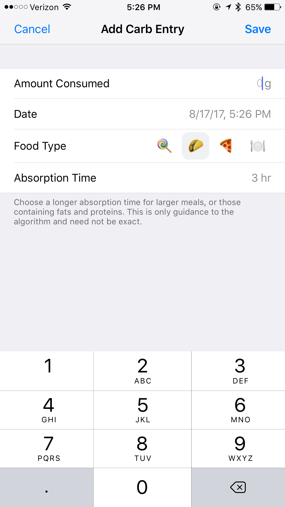
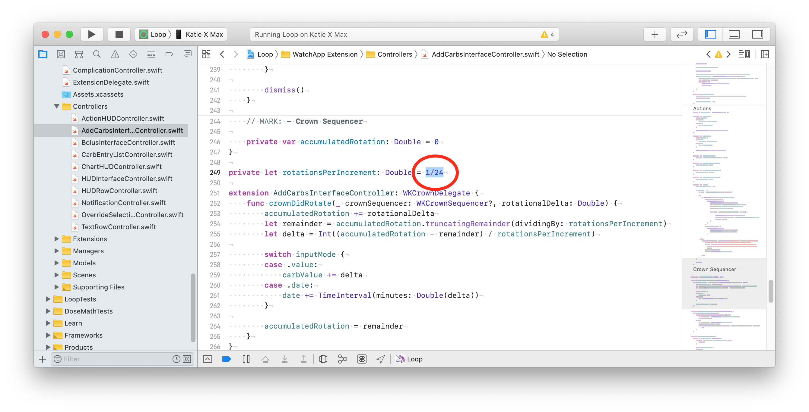
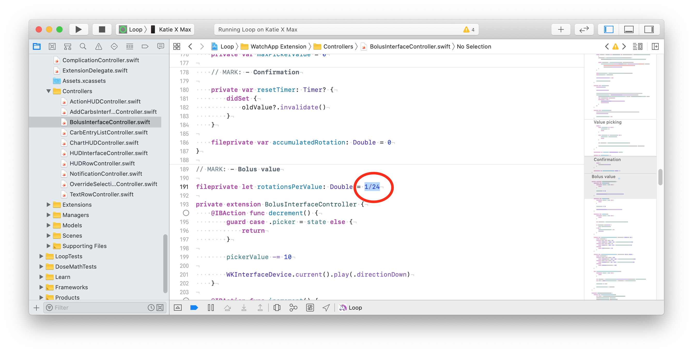

# Code Customizations

Based on Loop users’ experience, there are some customizations that you may want to incorporate ahead of building your Loop app and Apple Watch app.  These customizations must be done prior to building the Loop app onto your iPhone, they cannot be done from within the app itself. If you are an experienced builder - you know what to do.

For new builders, please build the code before you make any changes. Start with Open Loop and familiarize yourself with the interface.  Later, you can make the customization(s) you desire (using Xcode as your editor) on the same download as the original build and then build again to the phone.  The second build will be much faster than the first build.  The downloaded code should be fairly recent - don't try to use code you downloaded a year ago - in that case, get a fresh download.  And be sure to read the [Instructions for Finding the Lines](code_customization.md#instructions-for-finding-the-lines).

!!! info "Line numbers may change"
    Every effort will be made to update the line numbers as the code is updated, but there may be times where the screenshots and line numbers differ from the current version of Loop code.

    * You may notice some customizations list line numbers for different branches

    * If you cannot identify a line that looks exactly like the example - do not guess - go to your favorite social media group and ask for help

!!! abstract "Loop 2.2.x vs Loop 3 (Loop-dev)"

    * Loop-dev is still being tested - but when it is released it will be Loop 3.
    * To simplify the amount of changes required after the release, the labels indicate Loop 2.2.x or Loop 3, if needed.
    * Users of Loop Master refer to the Loop 2.2.x examples.
    * Users of Loop-dev refer to the Loop 3 examples.
        * Note that some changes are in a different file for Loop-dev (part of the architecture upgrade for the app).
        

## Instructions for Finding the Lines

For each customization, you will be given landmarks to find the correct location in the code. You can choose to search using the `Key_Phrase` or navigate to the file in the folder structure and look for (cmd-L #) the line number. Note that the folder is listed with respect to the LoopWorkspace directory. 

**For each change you make in Xcode - be sure to save the file - otherwise the modification does not get built into your app.**

``` title="Key_Phrase"
use the copy button at right, paste into search
```

  * Folder: Loop/subfolder1/subfolder2/etc.
  * File: filename.swift, line number(s)

There may be a figure illustrating the change.

Below the figure, the original, and in some cases, the modified code will be displayed as text.

To search using the `Key_Phrase` (see graphic below for clarification):

* A copy button is available when you hover your mouse in the right-hand side of the block below the title `Key_Phrase`,  click on it to copy the phrase
* In Xcode, tap the Find menu item and select Find in Workspace
* Paste the text into the find search-box that opens on upper left of Xcode screen and hit enter
* A series of options show up underneath the find search-box
* The file in which the line is located is reported and then one or more lines in that file with that word or phrase are listed
* Click on the one you think is correct and it will display in the main middle window of Xcode with the Keyword highlighted on the line you selected
    * The `Key_Phrase` was selected to limit the search to just the relevant line (if possible)
    * In some cases, the `Key_Phrase` gets you close but not exactly on the line where you need to make the modifications - please read carefully

{width="750"}
{align="center"}

<br>

## Disable Authentication for Bolusing

Depending on your iPhone preferences and model, you may have Face ID or Touch ID enabled.  Those security features will also be used to authenticate bolus delivery in Loop.  You can choose to disable authentication (i.e., not require Face ID, Touch ID, or passcode for bolusing) through the following code customization.

!!! warning "Loop 3"
    For Loop 3 (under test as Loop-dev), this controls the authorization requirement to modify Therapy Settings as well as to confirm bolus delivery.

``` title="Key_Phrase"
canEvaluatePolicy(.deviceOwnerAuthentication
```

* Loop 2.2.x
    * Folder: Loop/View Controllers
    * File: BolusViewController.swift, Line 529
* Loop 3
    * Folder: LoopKit/LoopKitUI/Extensions/
    * File: Environment+Authenticate.swift, Line 20

 The screenshot below was taken with Loop v2.0 when the line number was 201; with Loop 2.2.x versions, that same code is found at line 529. Add the `false &&` as shown in the screenshot below:

{width="750"}
{align="center"}

#### Loop 2.2.x

_Code Before Modification_

    if context.canEvaluatePolicy(.deviceOwnerAuthentication, error: nil) {

_Code After Modification_

    if false && context.canEvaluatePolicy(.deviceOwnerAuthentication, error: nil) {

#### Loop 3

_Code Before Modification_

    if context.canEvaluatePolicy(.deviceOwnerAuthentication, error: &error) {

_Code After Modification_

    if false && context.canEvaluatePolicy(.deviceOwnerAuthentication, error: &error) {

## Default Carb Absorption Times

{width="200"}
{align="center"}

Loop’s default carb absorption times are based on the high, medium, and low glycemic index absorption curves presented in *Think Like A Pancreas* by Gary Scheiner.  With Loop 2.2.x, the lollipop (fast) icon is set for 2 hours, taco (medium) icon for 3 hours, and pizza (slow) icon for 4 hours. This is modified for Loop 3 to 30 minutes, 3 hours and 5 hours respectively.

``` title="Key_Phrase"
defaultCarbAbsorptionTimes: CarbStore.DefaultAbsorptionTimes
```

* Loop 2.2.x
    * Folder: Loop/LoopCore
    * File: LoopSettings.swift
    * Line: 16 (2.2.4 master), 41 (2.2.4 AB), 50 (2.2.5 and later)

* Loop 3
    * Folder: Loop/LoopCore
    * File: LoopCoreConstants.swift
    * Line: 16


For example, if you wanted to modify Loop 2.2.9 so that lollipop represents a 30 minute absorption and pizza a 5 hour absorption, the edit would be as follows:


_Code Before Modification for Loop 2.2.x_

    public static let defaultCarbAbsorptionTimes: CarbStore.DefaultAbsorptionTimes = (fast: .hours(2), medium: .hours(3), slow: .hours(4))

_Code After Modification or default for Loop 3_

    public static let defaultCarbAbsorptionTimes: CarbStore.DefaultAbsorptionTimes = (fast: .minutes(30), medium: .hours(3), slow: .hours(5))
    
Note that if you change from 2 hours to 30 minutes, you must also change the indication before the parentheses.

## Exponential Insulin Curve

The Exponential Insulin Curve Models (Rapid-Acting Adult, Rapid-Acting Child, and Fiasp) default to an insulin duration of 360 minutes...but the peak activity of the various curves differs, as follows:

* Rapid-acting adult curve peaks at 75 minutes
* Rapid-acting child curve peaks at 65 minutes
* Fiasp peaks curve peaks at 55 minutes

If you wish to customize these values, please make sure you know what you are doing.  This is not a modification recommended for Loop novices. For Loop 3 users, the file is in a different submodule and includes more models.

``` title="Key_Phrase"
MARK: - Model generation
```

* Loop 2.2.x
    * Folder: Loop/LoopCore/Insulin
    * File: ExponentialInsulinModelPreset.swift
    * Lines:
        * actionDuration (20 to 29)
        * peakActivity (31 to 40)
        * effectDelay (42 to 51)
* Loop 3 << NOTE more models
    * Folder: LoopKit/LoopKit/Insulin/ << NOTE new location
    * File: ExponentialInsulinModelPreset.swift
    * Lines:
        * actionDuration (19 to 32)
        * peakActivity (34 to 47)
        * effectDelay (49 to 62)

{width="750"}
{align="center"}

## Loop Logo

If you want an app logo other than the default green circle for your Loop app, you can easily customize this.  To make it easy to generate the correct sizes of icons, you can use a site like [appicon.build](http://www.appicon.build/) or [appicon.co](https://appicon.co/) and just drag and drop your source image. The source image needs to be 1024 pixels x 1024 pixels.  The site will email you a zip file or automatically download a set of files.  Highlight and copy the contents of the Appicon.appiconset that you are sent, including the Contents.json file

Use Finder to Navigate to the LoopWorkspace folder. These instructions assume you used the Build-Select Script - if your files are in a different folder, make the appropriate adjustment.

1. Use Finder to navigate to Downloads / BuildLoop and open the folder with the most recent date (e.g., Loop-Master-211006-0524)
1. Double-click on the LoopWorkspace folder
1. Double-click on the AdditionaAssets.xcassets folder
1. Double-click on the CustomLoopIcon.appiconset folder
1. Replace the contents of the Appicon.appiconset with your copied images and Contents.json file.
1. Rebuild your app


You may see a yellow alert that there are “unassigned children” depending on the images the app icon generator tool produced. The unassigned children alert will not prevent your app from building, it’s simply because there are more sizes of images than Loop app uses.  You can just leave the unassigned children alone (wow...how often do you get to say that phrase?).

And now you'll be the proud new owner of a custom Loop icon.


## Adjust the Watch Crown Sensitivity

The rate of change of the carb and bolus entry pickers when using the digital crown can be altered as can the rotation required to confirm a bolus on the watch. If you are running an older series watch - you may want to make these customizations. When I switched from Series 3 to Series 7 watch - it was amazing. I got a graph on the main watch screen I didn't even know existed and the bolus acceptance was a breeze!

There are a number of places where you need to make changes (2 for sensitivity and 2 for bolus confirmation), so walk though them one at a time. For the `Watch Crown Sensitivity`, the 1/24 value is the ratio of rotations of the crown to the amount of change in the value. Changing it to 1/12 would mean that half as many turns would be needed for the same amount of carb or bolus entry.

* Only the Loop 2.2.x customization has been throughly test by many users.
* The Loop 3 customization is provided from code inspection and a single test - use with care.

### Loop 2.2.x Sensitivity


``` title="Key_Phrase"
let rotationsPerIncrement
```

* Folder: Loop/WatchApp Extension/Controllers
* File: AddCarbsInterfaceController.swift, Line: 249
* Initial Value: 1/24; try 1/12 to increase change in picker value for a given motion

{width="800"}
{align="center"}

``` title="Key_Phrase"
let rotationsPerValue
```

* Folder: Loop/WatchApp Extension/Controllers
* File: BolusInterfaceController.swift, Line: 191
* Initial Value: 1/24; try 1/12 to increase change in picker value for a given motion

{width="800"}
{align="center"}

### Loop 2.2.x Bolus Confirmation

In order to reduce the amount the user has to spin the watch crown to confirm a bolus, there are 3 numbers on 2 lines that must be modified. You will be working in the same file you just used to modify the watch sensitivity to adjusting the bolus amount, BolusInterfaceController.swift. 

For example to change rotation required to 70% of the default, change 1.0 to 0.7 in 3 places on those 2 lines. This `Key_Phrase` returns 3 lines, the second 2 of which are the ones in that file where the change is required:


``` title="Key_Phrase"
abs(accumulatedRotation)
```

* Folder: Loop/WatchApp Extension/Controllers
* File: BolusInterfaceController.swift, Lines: 311 and 360
* Initial Value: 1.0; try 0.7 to decrease how much is needed to confirm bolus

### Loop 3 Digital Crown Adjustments

These are new instructions and the user should take care - and please [report back](../index.md#finding-help) if you have problems.

First - try it with no customization. Then make small changes.

This key phrase will indicate three different files in the same folder as shown in the graphic below - you can adjust each in turn as you desire. When you click on the line, the quantity you change is a few lines below where you find the `Key_Phrase`, except for the CarbAndDateInput file.

``` title="Key_Phrase"
.digitalCrownRotation
```

* Folder: Loop/WatchApp Extension/Views/Carb Entry & Bolus

{width="800"}
{align="center"}

#### Modify Bolus Confirmation Motion

* File: BolusConfirmationView.swift, line 59
* Initial Value for `scalingRotationBy` is 4
* Decrease to require less motion to confirm bolus (use whole numbers only), start with 3

#### Modify Bolus Picker Sensitivity

* File: BolusInput.swift, line 53
* Initial Value for `rotationsPerIncrement` is 1/24
* A change to 1/12 increases the change in picker value for a given motion

#### Modify Carb and Time Picker Sensitivity

* File: CarbAndDateInput.swift, line 68
* Initial Value for `rotationsPerIncrement` is 1/24
* A change to 1/12 increases the change in picker value for a given motion


## Expiration Notification Customization

An expiration notification feature has been added to Loop. You get a notification when you open the Loop app to alert you that the expiration is approaching. (Not available with version v2.2.4 and earlier.)

This customization is unchanged for Loop 3.

* Read [Loop App Expiration Notification](../operation/features/notifications.md#loop-app-expiration-notification) to see the expiration reminder
* Read [Loop App Expiration Date](../operation/features/notifications.md#loop-app-expiration-date) if you have an older version of Loop

If you prefer a different notification time and frequency, there are two lines you can modify:


* Folder: Loop/Managers
* File: ProfileExpirationAlerter.swift
* Line 16: modify how long before expiration you get the FIRST notification
* Line 28: modify how frequently you will be notified

``` title="Key_Phrase"
expirationAlertWindow: TimeInterval
```

``` title="Key_Phrase"
 minimumTimeBetweenAlerts: TimeInterval
```

{width="600"}
{align="center"}

Default code for line 16:
```
    static let expirationAlertWindow: TimeInterval = .days(20)
```

Example modifications to First Notification:

* 30 days: change `.days(20)` to `.days(30)`
* 12 hours: change `.days(20)` to `.hours(12)`

Default code for line 28:

```
    let minimumTimeBetweenAlerts: TimeInterval = timeUntilExpiration > .hours(24) ? .days(2) : .hours(1)
```


Modify Frequency of Repeated Notifications (Three Values):

* This phrase: ```> .hours(24) ? .days(2) : .hours(1)```
* Rewritten as: ```> Time_A ? Frequency_A : Frequency_B```, means:
    * Use Frequency_A if there is more time between now and the expiration date than Time_A
    * Use Frequency_B if there is less time between now and the expiration date than Time_A

You can enter Time or Frequency as ```.days(value)```, ```.hours(value)``` or ```.minutes(value)```.

Free App Users:

An example change that a Free Loop App user (who has to build once a week) might choose is:

```
     > .hours(4) ? .days(10) : .hours(2)
```
Combined with an ```.hours(12)``` on line 16, they would get notified at 12 hours, 4 hours and 2 hours before expiration on the day of expiration and only when the app is opened. Since you'll be building once a week, you can play around with these values until you are happy.


## Additional Customizations

Additional customizations are found on another website. If you did not find the customization you want here on LoopDocs, then try the [Loop and Learn Customization Page](https://www.loopandlearn.org/custom-code). Check that page in case this list is not up to date.

* Add Lyumjev Insulin Model
* Adjust Percent Bolus for Automatic Dosing Strategy
* Pods: Increase Log File History Hours
* These Require Workspace Builds (which are now standard)
    * Modify Override Sensitivity
    * Medtronic: Disable mySentry (Current Loop removes need for this)
    * Pods: Add Extra Insulin on Insertion
    * Pods: Change Default Expiration Reminder


Note that the other site will point you right back to LoopDocs if the customization is found on this LoopDocs customization page.
