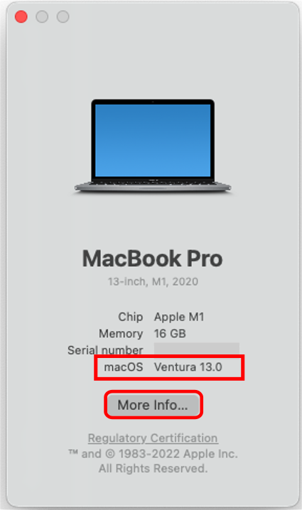

## Compatible Computer

!!! info "Time Estimate"
    **If you are building with a Mac and Xcode:**

    - 5 minutes, if you have a Mac with Sonoma (macOS 14.0) or higher
    - 30-60 minutes, if you need to install macOS updates

    Hint: OS stands for Operating System

!!! tip "Build with Browser"

    If you do not have a Mac, you can build&nbsp;Loop 3&nbsp;with any computer using a browser. If you want to use that method, review this list and head over to [Build with Browser](../browser/bb-overview.md){: target="_blank" }.

    - You need a paid ($99/year)&nbsp;[Apple Developer Account](apple-developer.md){: target="_blank" }
    - You need an account (free) with&nbsp;[GitHub](https://github.com)
    - You need a [compatible phone](phone.md) to install the app from *TestFlight*
    - You need a [compatible Pump](pump.md) and [CGM](cgm.md) if you want to actually use the app (and not just explore the app)

!!! abstract "Summary"
    Your computer, iPhone and Xcode must have compatible versions to build the *Loop* app using a *Mac*.

    * A summary list of [Compatible Versions](#compatible-versions) is found on this page with more detail in a later page

	If you are buying a Mac specifically to use the build with *Mac* method, chose one with capabably of being updated to the Sonoma (macOS 14) operating system and at least 256 GB (512 GB is better). The Build with Browser method works on any computer or tablet.

!!! question "FAQs"
    - **"Do I need a Mac or Virtual Machine?."** Not any more! You can build [Loop 3](../browser/bb-overview.md){: target="_blank" } with any browser on any computer.
    - **"I want to use the build with *Mac* method. Can I use a PC or Windows computer? I don't own an Apple computer."** Yes, you can but only if your PC uses Intel chips. Please read this FAQ about using a [Virtual Machine](../faqs/loop-faqs.md#can-i-use-a-pc-or-windows-computer-to-build){: target="_blank" }.
    - **"How often do I need to use the computer if I choose the build with *Mac* method?"** Computer access is required when
        * Initially installing the Loop app
        * Loop app expires (Annually for a paid account or weekly for a free account)
        * Updating to a newer Loop release
        * You do NOT need access to an Apple computer to update your phone iOS, troubleshoot or change Loop settings

If you have access to a computer with MacOS 14.0 or newer, you can skip ahead to [Check Space Available](#check-the-space-available).

## Compatible Versions

We used to keep track of the minimum Xcode and macOS that enabled users to keep building with their (often older) Mac computer.

With the advent of browser build, this is no longer worth maintaining. If you don't or can't keep your Mac up to date, please use [Build with Browser](../browser/bb-overview.md){: target="_blank" }.

!!! warning "iOS Dictates Your Computer Needs"

    The more up-to-date you keep your phone iOS, the more up-to-date your computer and macOS needs to be to build the *Loop* app with the *Mac* build method. A new build is required at least once a year. More information on iOS is on the [Xcode Version](xcode-version.md#how-do-all-the-minimum-versions-relate-to-each-other) page.

    There are important security updates that go along with iOS updates. Please install those iOS updates as soon as you can.

Do not use any of the beta macOS versions. (If you don't know what that means, you aren't using one.)

## Check Your macOS Version

To find your macOS version, click on the Apple icon in the computer's upper left corner and select `About this Mac`. The graphic below highlights the macOS version with a red rectangle. Your computer can be a MacBook, iMac, macMini, etc. It will work to build Loop if it has the minimum required macOS version and enough storage.

> {width="300"}

To update your operating system:

* Click on the Apple and choose `System Settings` or click on the `More Info` button on the screen shown above
    * Select `General` and `Software Update`, just like you would on the phone interface

## Check the Space Available

You need to have 50 GB free space in order to install Xcode as directed on the [Xcode Version](xcode-version.md) page. Tap on More Info to open the About screen (under System Settings->General), which includes storage at the bottom of the display.

 To free up space, move things like photos to an external drive. The Xcode application cannot be run from an external drive.

If you are evaluating a used computer, it's best to have at least 256 GB total disk space (more is better).

## Which Macs Are Compatible with macOS Tahoe?

Tahoe (macOS 26) is not yet required for building the *Loop* app on a phone running iOS 26 with the *Mac* method. The normal *Apple* schedule is that you will be required to have this installed by April of the year after the *iOS* version increments.

* MacBook Pro introduced in 2020 or later
* MacBook Air introduced in 2020 or later
* Mac mini introduced in 2020 or later
* iMac introduced in late 2020 or later
* iMac Pro introduced in 2017 or later
* Mac Studio introduced in 2022 or later
* Mac Pro introduced in 2019 or later
* get the full list from [Apple](https://www.apple.com/os/macos/)

## Which Macs Are Compatible with macOS Sequoia?

Sequoia (macOS 15) is required for building the *Loop* app on a phone running iOS 18.6 or higher with the *Mac* method. 

* MacBook Pro introduced in 2018 or later
* MacBook Air introduced in 2020 or later
* Mac mini introduced in 2018 or later
* iMac introduced in late 2019 or later
* iMac Pro introduced in 2017 or later
* Mac Studio introduced in 2022 or later
* Mac Pro introduced in 2019 or later
* get the full list from [Apple for Sequoia](https://support.apple.com/en-us/120282)

## Older Macs

Look into building with [GitHub Actions](../browser/bb-overview.md){: target="_blank" } - no need to worry about versions for Mac OS or Xcode - all done for you on GitHub (some configuration required). Works with any computer (PC or Mac or Tablet).

## Next Step:

If you already have an [Apple Developer ID](apple-developer.md) or you are using a free ID, next step is [Xcode Version](xcode-version.md).

!!! warning "Free ID"
    The free ID method only works when using the build with *Mac* method. The [Build with Browser](../browser/bb-overview.md) method requires a paid developer ID ($99/year) but does not require a Mac computer.
