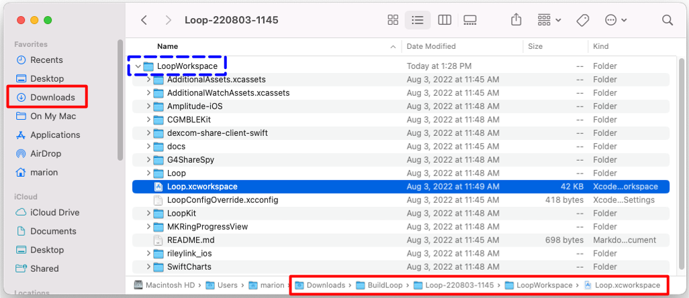
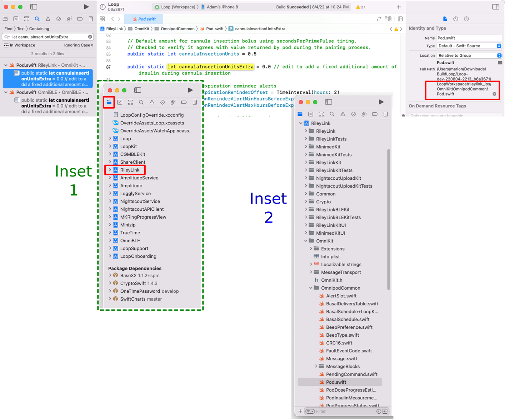

## Overview

When applying a customization using *Mac*, the downloaded code should be fairly recent. If you are not sure, get a fresh download. If you know your downloaded code is the [Current Release](../version/releases.md#current-release){: target="_blank" }, you can skip the download and use the same folder as last time.

### Find My Downloaded Loop Code

Refer to the graphic below.  The Downloads folder in Finder is highlighted on the upper left. The full path to Loop.xcworkspace is highlighted along the bottom.

!!! success "Loop to LoopWorkspace"
    Note that the directory `Loop.xcworkspace` has been renamed to `LoopWorkspace.xcworkspace` in the released code. For experienced builders - you realize this is good because the build process is easier.

    The words were updated, but it will take time for the graphics to be updated.

* Open Finder
* Navigate to Downloads/BuildLoop and look for your download by name and date
* Open that folder, for example, Downloads/BuildLoop/Loop-220803-1145, and inside that folder open the LoopWorkspace folder
* Inside the Downloads/BuildLoop/Loop-220803-1145/LoopWorkspace folder, double-click on LoopWorkspace.xcworkspace (graphic not updated yet)
* Xcode automatically opens to that particular download
* You can then make the customizations and build to your phone

{width="750"}
{align="center"}

!!! tip "Experienced Builders"
    Experienced builders will often build a fresh download to a simulator for their phone iOS (not their phone) to ensure download is good and is compatible with macOS, Xcode and phone iOS. Once the build is successful, they apply their customizations and build again to the simulator. Last step is to build the customized version to their real phone.

## Instructions for Finding the Lines

For each customization, you are given landmarks to find the correct location in the code when you review [Version: Custom Edits](../version/code-custom-edits.md){: target="_blank" }. You can choose to search using the `Key_Phrase` or navigate to the file in the folder structure and look for ( ++cmd+l++ # ) the line number. 

* Either [Key_Phrase](#key_phrase) or [Module, Folder, File](#module-folder-file)
 can be used to find the lines
* Be sure to save the file when you make a change - otherwise the modification does not get built into your app
* Some folder icons show different names in Xcode, see [Folders and Icons](#folders-and-icons)

### Key_Phrase

``` { .txt .copy title="Example of a Key_Phrase" }
use the copy button at right, paste into search
The copy button for this exampe is just for practice
Do not paste the result anywhere
```

To search using the `Key_Phrase` (see graphic below for clarification):

* A copy button is available when you hover your mouse in the right-hand side of the block below the title `Key_Phrase`;  click on it to copy the phrase
* In Xcode, tap the Find menu item and select `Find in Workspace`
* Paste the text into the Find search-box that opens on upper left of Xcode screen and hit enter
    * **If you don't see the phrase in the box, hit backspace - your system copied an extra return**
* You should see a message `1 result in 1 file` (for most cases)
    * Some customizations will show more than one result, but that will be explained in the directions for that customization
* The file in which the line is located is reported showing the line in that file containing the `Key_Phrase`
* Click on the one you think is correct and it will display in the main middle window of Xcode with the Keyword highlighted on the line you selected
    * The `Key_Phrase` was selected to limit the search to just the relevant line (if possible)
    * In some cases, the `Key_Phrase` gets you close but not exactly on the line where you need to make the modifications - please read carefully

{width="750"}
{align="center"}

### Module, Folder, File

Each customization will also show Module, Folder and File bullet below the key phrase.

  * Module: Loop
  * Folder: Loop/subfolder1/subfolder2/etc.
  * File: filename.swift, line number(s)

## Open a Terminal in LoopWorkspace Folder

If you use the [Loop and Learn: Customization Select Script](https://www.loopandlearn.org/custom-code), it automatically locates your most recent download, makes the customization you select in that download and then opens Xcode for you.

But sometimes, you need to find your downloaded code and make your own changes in Xcode. This section tells you how to do this.

Refer to the graphic below.  The Downloads folder in Finder is highlighted on the upper left. The full path to Loop.xcworkspace is highlighted along the bottom. Double clicking on that file opens Xcode; but to apply customizations, you need to type commands in the terminal.

* Open Finder
* Navigate to Downloads/BuildLoop and look for your download by name and date
* Open that folder, for example, Downloads/BuildLoop/Loop-220803-1145
* Find the LoopWorkspace folder icon (dashed-blue rectangle)
* Hold down the CTRL key and click (or right-click) LoopWorkspace
* A menu appears - select `New Terminal at Folder` (near the bottom of the list)

This new terminal window is ready to accept commands as needed when the instructions say to start a terminal in the LoopWorkspace folder.

To confirm you are in the correct location, type `pwd` and return in the terminal. The response must end in LoopWorkspace. For example, using the graphic below, the response to `pwd` should be similar to:

`
/Users/marion/Downloads/BuildLoop/Loop-20220803-1145/LoopWorkspace
`

{width="750"}
{align="center"}


## Folders and Icons

The folders listed in the code customization steps are the actual directory names as stored on your computer.  However, a shortened name is used for some folders when being displayed as icons in Xcode. Some people prefer to search through the folder icons to find a file instead of using the `Find in Workspace` feature.

In the graphic below, the user searched for an item found for both Eros and DASH pods (in two different files).  The top part of the graphic shows the result of the search with user clicking on one instance.  On the right side of the top graphic (highlighted by red rectangle) is the name of the selected file on the computer with the full directory name.

* Inset 1: User clicked on the folder icon (highlighted by red square) to see the list of icons for folders included in the LoopWorkspace
* Inset 2: User opens folders under RileyLink icon to open OmniKit, then OmnipodCommon to find the Pod.swift file (NOTE - the Eros information is in a different Module now, OmniKit, but the graphic has not been updated.)

{width="750"}
{align="center"}

These folder icon names are different from the directory names on the computer:

|  Folder Icon Name |  Directory Name | |
|:--|:--||
| ShareClient | dexcom-share-client-swift | 
| RileyLink | rileylink_ios | 
| Amplitude | Amplitude-iOS | 

All other icons and directory names match.

## Modify and Save

* Either `Key_Phrase` or `Module, Folder, File` method described on [Version: Custom Edits](../version/code-custom-edits.md){: target="_blank" } can be used to find the lines inside *Xcode* on your *Mac*
* Be sure to save the file when you make a change - otherwise the modification does not get built into your app
* Some folder icons show different names in Xcode, see [Folders and Icons](#folders-and-icons)
* When done with all the desired edits, plug in your phone and select it
    * Click on the "Play" button to build your customized code
