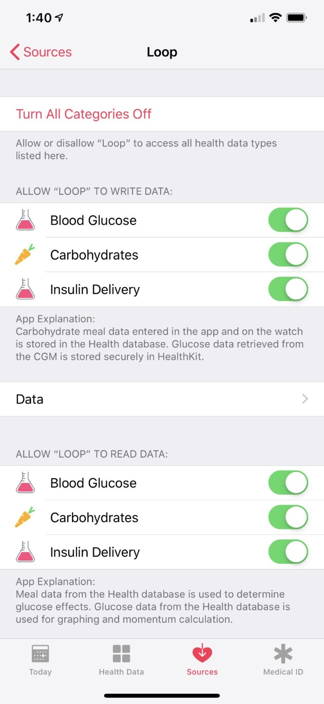

# Health Data

The Loop app uses the iPhone's Health app to store blood glucose, insulin, and carbohydrate data. Health data can also be accessed and uploaded by Tidepool's Mobile app and was an important step in the Jaeb Observational Study enrollment (that study has completed). Please review the settings below to ensure you have the proper settings.

## Loop Permissions

You need to set up Loop's permissions to store data in Health. When you finish building your first Loop app, the Health App screen automatically appears (figure below is older iOS version). You should toggle on all of the categories for Loop for both reading and writing, so that the green sliders are showing. Do it now - easiest time.

If you didn't turn those on initially or you need to check the settings, you need to go to the Health app (Red Heart). Directions for finding the right screen depend on iOS, so please google "how do I set Apple Health read/write permissions".  The top link for that search took me to the Apple help page. Select your iOS version to see how to do it on your phone. You need to find the place to set Health Permission for the Loop app inside the Health app.

You may see Sleep as a read option for Loop. Sleep is used to decide which times of day to use the limited daily allocation from Apple for updates to the Loop watch complication.

{width="300"}
{align="center"}

It is important at this point to also consider other apps which you may have previously given permission to write to Health. In particular, **you do not want other apps, like myFitness Pal or Spike, writing carbohydrate data to Loop**. This can cause Loop to have "doubled" carb entries and you will get incorrect insulin deliveries related to doubled carb entries. Once again - checking sources depends on iOS.  For iOS 12, you can check your various permissions by clicking on the sources button at the bottom of the Health app. Click on the apps listed as a source, and make sure none of them have permission to write carbohydrates to Health.  For iOS 13 and 14, find Carbohydrates, then scroll to the bottom and tap on Data Sources & Access, then scroll down to Data Sources.  There may be several apps listed that could write to carbohydrates.  You want all of them to say "Inactive" except for Loop. If you need to changes settings for an app, go back to the main health screen (iOS 13/14), Tap on Summary, tap on your profile icon (upper right), look for Apps under Privacy, select the app with permissions that you need to modify.

## Dexcom Permissions

You also need to enable your Dexcom app to write to the Health app. The steps shown in the figure below are valid for iOS 12. For iOS 13/14, open the Health app, tap on Summary, tap on your profile icon (upper right), look for Apps under Privacy, select your Dexcom app, make sure it has permission to write Blood Glucose.  If you do not do this, you will have a maximum history of 3 hours displayed in the Loop Glucose screen.

{width="550"}
{align="center"}
