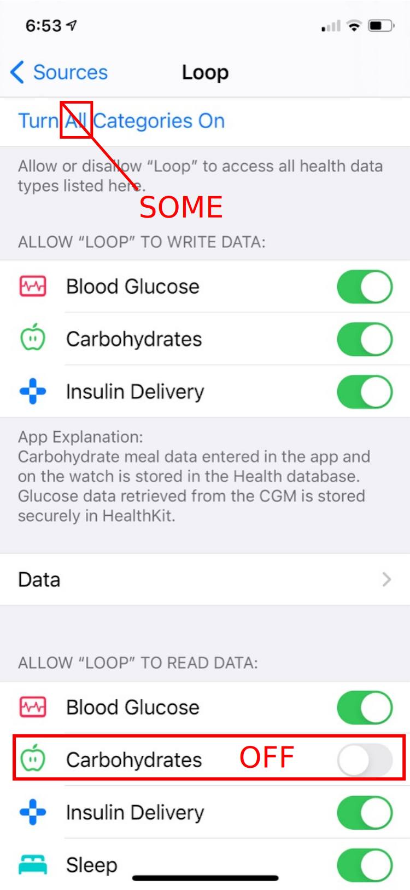
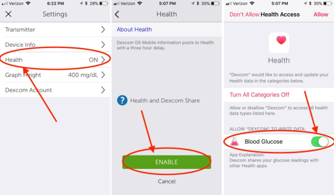

# Health Data

The Loop app uses the Health app to record blood glucose, insulin, and carbohydrate data. The blood glucose, insulin, and carbohydrate data stored in the Health app can also be accessed and uploaded by the [Tidepool](https://tidepool.org) Mobile app which enables display on of your data on the Tidepool web-based display tool. Please review the settings below to ensure you have the proper settings.

## Loop Permissions

You need to set up Loop's permissions to read and write some data in the Health app. When you finish building your first Loop app, the Health app screen for Loop permissions automatically appears. (People who have been looping a while should be aware that the permissions are slightly different now.) Do not enable permission for Loop to read carbohydrates from the Apple Health app.

You can also get to this screen (for iOS 14) by iPhone -> Settings -> Health (heart icon) -> Data Access & Devices -> Loop.

!!! warning "New Instructions"
    Loop does not need to read carbohydrates from the Health app.

    The old instructions suggested turning on all switches.  This is NOT necessary for carbohydrates and can be dangerous if

      1.  A different app writes carbohydrates to the Health app
      1.  If two Loopers use the same Apple ID - PLEASE - do not do this; [Loopers need their own Apple ID](step6.md#loopers-need-their-own-apple-id)

{width="300"}
{align="center"}

**Blood Glucose**: Permission to Write and Read

* Loop eavesdrops on the Bluetooth communication of the Dexcom G4/G5/G6 CGM and **writes** the values to the Health app for the first 3 hours
* After 3 hours, the Dexcom CGM app allows other apps (including the Health app) access to its CGM data, so Loop needs to **read** the older Blood Glucose from the Health app
* During times when there is no CGM data, the user can enter a finger stick value into the Health app Blood Glucose (BG) screen and Loop will **read** it, e.g., during sensor warmup

**Carbohydrates**: Permission to Write ONLY

* Loop has its own carbohydrate data store and does not need to read carbs from the Health app
* Once Loop records a carbohydrate entry, it will start to dose insulin to accommodate the expected rise in blood glucose from the carbohydrates consumed
* If any other app writes carbohydrates to the Health app, you do not want Loop to add them to what you've already entered into the Loop app (resulting in duplicate entries)

**Insulin Delivery**: Permission to Write and Read

* Loop **writes** basal and bolus doses to the Health app
* Loop **reads** any manual insulin added to the Health app, e.g., insulin taken by injection

**Sleep**: Permission to Read

* Loop uses Sleep information to decide which times of day to use the limited daily allocation from Apple for updates to the Loop watch complication.

## Dexcom Permissions

You also need to enable your Dexcom Mobile app to write to the Health app. The steps shown in the figure below are valid for iOS 12.

For iOS 13/14, the menu items are: iPhone -> Settings -> Health (heart icon) -> Data Access & Devices -> Dexcom app. Make sure Dexcom has permission to write Blood Glucose (after the 3 hour delay).  If you do not do this, you will have a maximum history of 3 hours displayed in the Loop Glucose screen.

{width="550"}
{align="center"}
