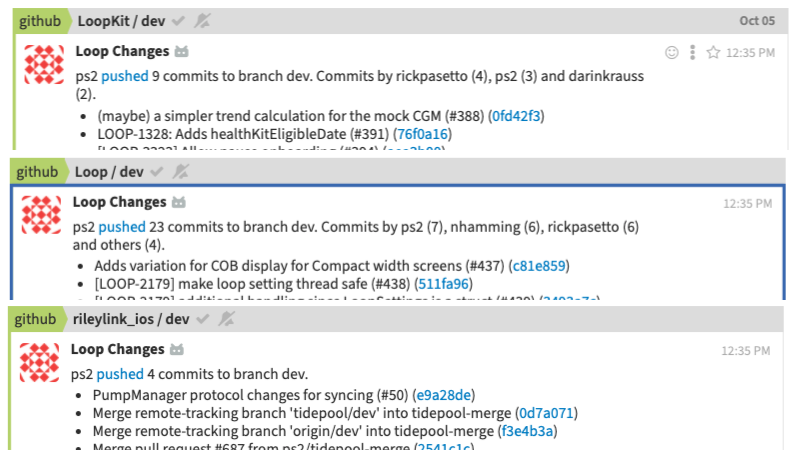
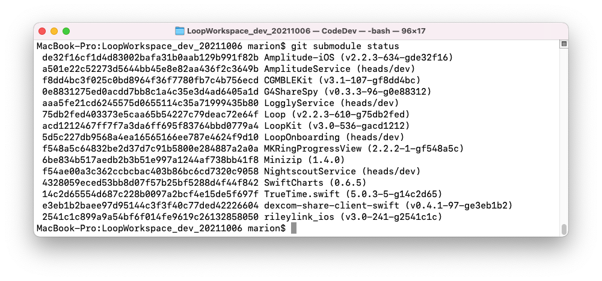
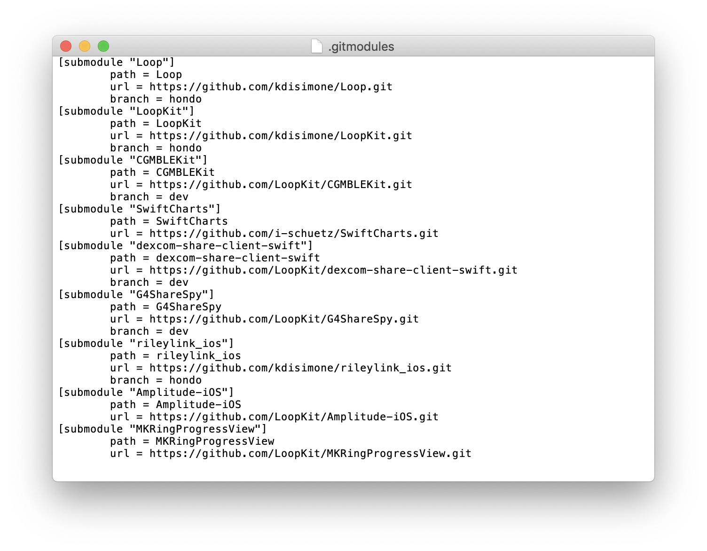

# Loop Workspace

This page is for the "advanced" user. It is a short introduction for folks interested in testing code before it is released, or contributing to that code.

If you wandered over here meaning to build the latest Loop release, the rest of this page might be interesting but you should not follow any of the steps. Head back over to [Build Loop App](step14.md) when you are ready to build the app.

!!! info "LoopWorkspace is now used for all Loop Builds"

    * With the release of Xcode 13, Loop builds require LoopWorkspace
    * Loop old-timers may remember the zip-download method - it is no longer available
    * For all Loopers who want the latest
        * [Loop Release](../faqs/release-faqs.md#loop-releases)
        * Follow the step-by-step instructions found at [Build Loop App](step14.md#build-loop-app)

The typical user who wants to build Loop does not need to know the level of detail on the rest of this page.


### What is git?

Git is a system of "distributed version control" that allows remotely (as in not located in same place) collaborating people to work on one project and still track their changes to the same place. For example, if I sent 5 people one document to proof-read at the same time...it is quite possible that the edits I will get back from those 5 people would conflict with each other. Bob may have entirely deleted a sentence while Mary would have added words to that sentence. Git lets these remotely collaborating people deal with "resolving conflict" between versions more easily and merging suggestions (pull requests) into a coordinated space.

So, in using git, we can do things with "git commands". Like "Hey git...make me an exact copy of that guy's work over there." or "Hey git, I'd like to compare my version of this page with Joe's version of the same page." Or using my old cookbook analogy..."Hey git, I'd like to start a new cookbook called Italian Desserts."

But yes, git commands take awhile to properly use. And they are not plain english friendly. 

## What is LoopWorkspace?

There is more information in [Loop Development FAQs](../faqs/branch-faqs.md#what-are-branches) that is not repeated here.

The important fact for this discussion on LoopWorkspace is that Loop developers own an account in GitHub called [LoopKit](https://github.com/LoopKit).  Within that account, the developers have several "repositories" that support Loop in particular. A repository is like a book...let's think of it like a cookbook for now. Within the LoopKit account, there are repositories for Loop itself, LoopDocs, and various other supporting "frameworks" that are helper repositories for Loop to build correctly. For example, Loop's repo has a lot of the info about the app itself; the outward facing things that you interact with. How information is put to you and taken in from you...that's in Loop repository code. But, there's more than just a user interface for Loop. Loop has to do a lot of complex work like Bluetooth communications, algorithm math, pump communications, etc. The Loop app has help from frameworks to do those other parts. CGMBLEkit for some of the transmitter parts of Loop, RileyLink_ios for the pump managers (talking to the pumps and decoding their information), LoopKit for the algorithm about carbs and insulin curves, etc.

When you build Loop from LoopWorkspace, each of those repositories is downloaded to your computer.  This is slower than the old zip-download as far as downloading Loop - but it is much faster when you build Loop because all the files are already on your computer.

LoopWorkspace uses submodules to define how the frameworks are coordinated for building. The graphic below shows the dev branch at a particular point in time.  The precise version, or commit, of each submodule is defined by 7-character hexadecimal codes (look up SHA-1) with the repository for each submodule defined in a text file called `.gitmodules`.

!!! info ""
    * Several key `git` and other operating system commands will be provided later to assist you
    * These commands will not be explained in detail
    * If you want to know more, search the internet for documentation
    * Often a series of commands is shown on one line, separated by semicolons

The commit identifier for each submodule is important because that repository can be modified after things are set up and working with Loop.  When you download the code from that repository you want the exact version that was tested.

!!! info ""
    * Later on there will be information about determining your `git branch` for a given submodule
    * You'll see language: `(HEAD detached at #)`
    * That # is the commit identifier for the submodule

The commit for the LoopKit submodule is highlighted by the red rectangle in the graphic below. Advanced users testing the dev branch (or other branches or forks) need to know how to tell if their current download is up-to-date.


{width="750"}
{align="center"}


## Clone LoopWorkspace

To get that LoopWorkspace code to your computer, first open a terminal. Make sure your current path name does not have any embedded spaces.  If it does, you will get errors on your build.

If you don't know how to open a terminal and navigate to a directory, reconsider whether you are ready for this page.

You need to use a "git clone" command LIKE THIS (but not exactly the same...you're going to edit the "branch-name" part in there):

`git clone --branch=branch-name --recurse-submodules https://github.com/LoopKit/LoopWorkspace`

Now...look carefully and notice two things...that command is getting (1) the version of LoopWorkspace found in the LoopKit repository and (2) selects the branch you want to start working with when the clone is done.

So, you will need to edit that "branch-name" before using the command so that you are getting started with the branch you want. If you want to clone from a different fork, the LoopKit will be replaced with the name of the github site for the fork. For example, to test dev (which is under development and has some cool new architecture and features), you would copy/paste:

```
git clone --branch=dev --recurse-submodules https://github.com/LoopKit/LoopWorkspace
```


### Start Xcode using command line

If you want to start the build from the command line, enter the following 2 lines into the terminal and skip ahead to [Building LoopWorkspace](#building-loopworkspace)

```
cd LoopWorkspace
xed .
```

Remember the warning - if you build dev on your phone from Loop master, it should work fine. Going backwards, please delete the app from you phone and enter all your settings again to return to master.


### Start Xcode using Finder

The cloned version of the LoopWorkspace will go into the current directory in the Terminal app when you executed the command. Terminal app opens in your User account home directory by default when you first open it. Unless you changed to a different directory, check your home directory for the LoopWorkspace folder.

How can you find your home directory?

1. In Terminal, if you use `cd` that will take you there automatically.
2. In Finder, shift-command-H will open your "home" folder.

{width="750"}
{align="center"}

There are a lot of cloned things in this home directory that involve Loop. You may have fewer...but be aware, you can always delete and reclone if you are in doubt or confused. You can also set up a special directory to hold the cloned code - just make sure there are no embedded spaces in the full path name.

For this graphic, the cloned LoopWorkspace is in the home directory.

1. Open Finder and navigate to the location that has LoopWorkspace
1. Open the LoopWorkspace folder
1. Search for and double-click on the `Loop.xcworkspace` folder - this automatically opens the Workspace in Xcode

{width="550"}
{align="center"}


## Building LoopWorkspace

Once Xcode is opened for the LoopWorkspace, everything is pretty similar to building master. You need to click on that blue Loop folder to see the signing targets, and you need to change the build scheme to the left of your phone to "Loop (Workspace)" in order to build properly.

* New for dev branch of LoopKit/LoopWorkspace
    * Enter your Apple Developers ID in the LoopConfigOverride.xcconfig file that now appears in the top of the folder list (not shown in this graphic).  
    * This automatically signs the 5 targets required for the dev branch.

{width="750"}
{align="center"}


## Updating Loop using LoopWorkspace

When it's time to update the copy of LoopWorkspace on your computer - you have choices. A few methods are provided below.

1. Use the following git commands in the LoopWorkspace folder of your terminal:
    ```
    git fetch
    git pull --recurse
    ```
1. You can redo the whole cloning process

If you are testing the LoopKit dev branch, you need to be on [zulipchat](https://loop.zulipchat.com) and subscribe to at least the #development and #github streams. (It's a good idea to subscribe to all the streams.) When you see repository updates similar to the graphic below, there may also be an announcement in the #development channel that LoopWorkspace is updated and ready to test. If not you can check the commits in LoopWorkspace and see if they've been updated. It's a good idea to wait 24 hours. My procedure is to build dev to my backup phone and then put it on my "real" phone. Otherwise, wait for someone else to do it and give the all-clear in zulipchat.

{width="600"}
{align="center"}

### Compare your local clone to LoopWorkspace

In an ideal world, LoopWorkspace has the most recent compatible submodule identifiers revised at the same time the submodules are updated.  You will notice the commit identifiers for the updated submodules are different from the ones you have locally.

You can check your current submodules with the `git submodule status` command in the LoopWorkspace folder of your terminal:


{width="600"}
{align="center"}

What are those super-long numbers?  Those are the actual SHA-1 (remember - look it up) for the commits.  But the first 7 characters are sufficient to uniquely identify the commit you need for the repository and branch identified in `.gitmodules`.  So compare the first 7 characters to the LoopKit / LoopWorkspace number and you know whether you need to update or not.

To determine the commit for a single submodule on your computer, use the following commands in the LoopWorkspace folder:

```
  cd <submodule-name>; git branch; cd ..
```

The response will be similar to this exchange:

```
  cd rileylink_ios; git branch; cd ..
```

```
  * (HEAD detached at 2541c1c)
    dev
```

The asterick indicates the branch that is currently checked out (active).

The phrase `* (HEAD detached at #)` allows you to compare your local version version with the commit identifier on github.


### LoopWorkspace Unchanged

What happens if you update (`git pull --recurse`) and there are no changes at the LoopWorkspace repository? There will be no change to your current clone on your computer.

* You'll see a series of responses saying:
    * `Fetching submodule submodule-name` for each submodule-name
    * followed by `Already up to date.`

### LoopWorkspace Updated

What happens if you update (`git pull --recurse`) and there are changes at the LoopWorkspace repository? The changes will be brought down to your clone on your computer.

**You'll need to build Loop again to get these changes incorporated in the app on your phone.**

* You'll see a series of responses saying:
    * `Fetching submodule submodule-name` for each submodule-name
    * One or more will show changes and specify which submodules were changed
        * followed by `Submodule path submodule-name: checked out ` new SHA-1

### Update Locally

It has happened that you notice changes in one or more repository (in the #github stream) followed by an announcement in the #development stream that changes have been committed and please test.  But you get the response shown in the [LoopWorkspace Unchanged](#loopworkspace-unchanged) scenario. You can make a comment in zulipchat, saying please update LoopWorkspace and then wait, or you can download the appropriate commit. If you are a new tester - you probably want to wait.

If you want to go on and test, you can update to the correct commit without waiting for LoopWorkspace to get updated.

First, in zulipchat, in the #github stream of the commit, click on the word `pushed` and that will take you to the commit. For example, clicking on pushed in zulipchat from the graphic shown above, goes to this website:

`https://github.com/ps2/rileylink_ios/compare/8ff4bca2bc5f...2541c1c899a9`

This indicates the final commit of that push for rileylink_ios is identified as `2541c1c`.

At this point, the commands to get that commit locally on your computer are as follows, starting from the LoopWorkspace folder:

`cd rileylink_ios; git fetch; git checkout 2541c1c; cd ..`

If you got a error message the # you requested `did not match any file(s) known to git`, you either typed it incorrectly or you forgot the `git fetch` command. The fetch command brings down information from github to your computer but doesn't make changes to what you have checked out.

### Local Modifications Conflict

If you have modified anything in a submodule folder on your computer, it might be in conflict with the latest commit.

If you get a messages such as this:

```
  error: Your local changes to the following files would be overwritten by checkout:
    Loop/Managers/DeviceDataManager.swift
    Loop/Models/LoopConstants.swift
  Please commit your changes or stash them before you switch branches.
  Aborting
```

The easiest fix is to type:

```
  cd Loop; git stash; cd ..
  git pull --recurse
```


## Checking out different branches within a LoopWorkspace

More advanced users...I'm not going to explain this in quite so much detail, but yes, you can individually change the branches in a LoopWorkspace.

There are 2 main ways to do this.

1. If you're already familiar with git, the easiest way is to `cd` into the appropriate repository (like `cd rileylink_ios`) and `checkout` the desired branch.

2. If you're not as familiar with git, if you edit your .gitmodules directory in LoopWorkspace, you can specify other repos to use (and add a line to specify branches, too). Then if you do a `git submodule sync` the workspace will sync to new submodules. Then `git submodule update --init --recursive --remote` will update all the submodules to the right branches and get HEADs detached correctly, etc. Note that the HEADs will be detached at the top of the branch (most recent commit) based off of `.gitmodules`.

{width="750"}
{align="center"}

## Non-LoopKit clones

!!! info "Average Loopers can skip this whole section...it's for Developers mostly"

    This whole section about non-LoopKit workspace clones is something almost every Looper can totally skip over. I'm only writing up this section for people who are interested in dabbling in code collaborations/customizations that they would want to maintain separate from LoopKit proper.

Scenario: You have a friend named DeveloperBob who has his own version of LoopWorkspace that he's customized. DeveloperBob wants you to look at his code customizations and collaborate with him. You need to change the "git clone" command to get DeveloperBob's version, not LoopKit's version. And, you'd want to make sure you specify the branch that the new feature is on, too. DeveloperBob should usually include the branch name when he posts/shares. So, the command line might be edited to something like:

`git clone --branch=new-features --recurse-submodules https://github.com/DeveloperBob/LoopWorkspace`

So...if you are trying to grab someone's LoopWorkspace to use it, you'll need to make sure you get the command correct if they don't specify it for you.
You can't clone mutliple "LoopWorkspaces" into the exact same home directory (because they will have the same name), so you may want to create a subdirectory to put them in. Like you could make a folder called "DeveloperBob" and then move into that directory in Terminal before you clone DeveloperBob's LoopWorkspace.

How would you do that? Simple `cd && mkdir DeveloperBob` would make the new folder in your home directory. And then `cd DeveloperBob` would move your Terminal app to be working inside the new DeveloperBob folder. So if you wanted to clone DeveloperBob's LoopWorkspace, that would be a good way to keep track of where the code came from.

If you ever get in doubt and can't remember where your code was cloned from, you can `cd LoopWorkspace` to get into the directory and then use `git remote -v` to tell you where it came from.

## Pushing commits from LoopWorkspace

So you've got a great idea for a new feature, made those changes to your LoopWorkspace and want to get them into Github. Awesome!

To understand how to do this, we'll need to understand a bit more about how git keeps track of changes. In git, developers can have different "branches" (see the [branch FAQs page](../faqs/branch-faqs.md#what-are-branches) for more details about what a branch is). There are two different types of branches: remote and local. If you were to fork Loop on Github, then the branches that you can see on Github are "remote" branches - they're hosted on the Github server. On the other hand, you can also create "local" branches that are stored directly on your computer by "checking out" the remote branch. You'll need to "commit" your changes to the local branch, then "push" those changes to the remote branch in order to be able to see them in Github. There are specific commands that you can type into the command line to do all of these actions, but I'm not going to go into detail because there are different ways and everyone has their own preference.

It's a little easier to think about this with an analogy. Let's say you're working at a company that's creating a cookbook. There's a centralized, production-ready version of the cookbook on their website that all the employees can view. Think of the website version of this cookbook as being like the remote branch. You're assigned to change the pancake recipe in the cookbook. Since the company doesn't want employees to make changes directly to the version of the cookbook that the customers see, you need to make a copy of it on your computer so you can make your changes to the pancake recipe. When you make the personal copy on your computer, it's like "checking out" the remote branch. Your copy is like the local branch - you can make whatever changes you want without having to worry about customers accidentally seeing them. When you make an important change to the recipe (like adding a photo or changing the ingredients), you might want to make a note in the edit history so that you can go back to that version of the recipe in case you accidentally make unintended changes - those notes you make would be "commits". Once you're happy with the recipe, you'll add it back into the production version of the cookbook on the website, which is similar to what you're doing when you "push" your changes.

Where do the submodules fit in? Each submodule is actually a branch, so when you make changes to multiple submodules, you'll need to commit those changes to their respective branches. Let's say you've made changes to Loop and LoopKit. You'll need to go into Loop and commit + push the changes, then go into LoopKit and commit + push the changes.

There are a few different ways to keep track of all these different branches. Some people like using the command line (which is what you're using when you do commands like `git clone`) because it's very customizable and has the largest variety of commands. Others like to use graphical Git editors, which make it easier to see changes and be able to do a variety of common actions (like cloning, committing, and pushing) with the push of a button. Everyone has their own preferences, but some methods that Loop contributors have used in the past include the command line, [Gitkraken](https://www.gitkraken.com/), and [SourceTree](https://www.sourcetreeapp.com/).
