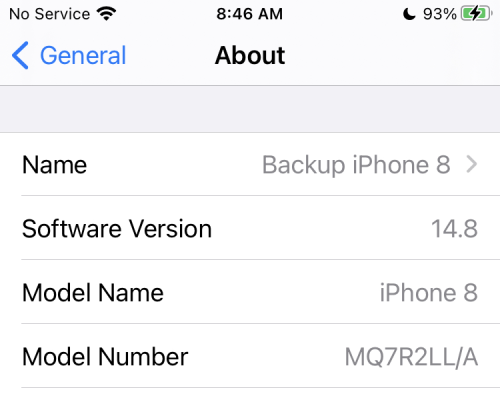

## Overview

!!! info "Time Estimate"
    - 5 minutes, to check your device and *iOS*
    - 20 minutes, if need to update your compatible device to a new *iOS*
    - 10 minutes, if you need to order a [Compatible Device](#compatible-device) 
    - 0 minutes, if you own an Android and will not use *Apple* products; check out [AndroidAPS Documention](https://androidaps.readthedocs.io/en/latest/){: target="_blank" }

!!! abstract "Summary"
    - Check your iPhone against the [Compatible Device](#compatible-device) list
        * For all devices, the newest *iOS* is strongly recommended
    - Make sure the phone has good battery life
    - Turn off automatic updates

!!! question "FAQs"
    - **"Can I use an android?"** No. Check out [AndroidAPS Documention](https://androidaps.readthedocs.io/en/latest/){: target="_blank" }.
    - **"Can I use an iPad?"** No. Older iPads do not support *Apple Health* which is required for the *Loop* app. It may be possible with newer iPads and newer *iOS*, but this has not been tested.
    - **"Does my iPhone need a cell plan?"** No. The *Loop* app works using communication on your phone with your CGM and your pump; no internet connection required. However, if access to *Dexcom Follow* or <code>Nightscout</code> monitoring of the *Loop* app is a priority, then a cell plan may be desired.
    - **What watches work with the *Loop* app?** Only *Apple* watches work with the *Loop* app. With *iOS 17*, some of the older *Apple* watch series are no longer compatible. See: [Watch Hardware and OS Requirements](../operation/features/watch.md#watch-hardware-and-os-requirements)

## Which Devices Are Compatible?

The *Loop* app requires an *Apple* device and uses the *Apple Health* app to store and retrieve your blood glucose and insulin data and to store your carbohydrate records. Older iPads do not support *Apple Health* which used to be required, and is still strongly recommended, for the *Loop* app. It may be possible to run Loop with newer iPads and newer *iOS*, but this has not been tested.

You need a minimum version of the mobile operating software, called the *iOS*, to be installed on your iPhone. The *Loop* app is compatible with iPhone devices with *iOS* 15.1 or newer. 

* It is unusual for four different *iOS* to be supported
* The developers try to maintain support for the current and one-level earlier *iOS*
    * Be prepared for your *iOS* 15 device to no longer be supported in future releases
    * Be prepared for your *iOS* 16 device to no longer be supported in future releases

### Compatible Device

All the devices listed below are currently compatible with Loop. They are separated by the available *iOS* for the phone. Those that only support *iOS* 15 or 16 may become incompatible for the next version of the *Loop* app, but can be used with `Loop version 3.4.x`.

These phones require *iOS* 18

- iPhone 16, all variants

These phones are compatible with both *iOS* 17 and 18

- iPhone 15, all variants
- iPhone 14, all variants
- iPhone 13, all variants
- iPhone 12, all variants
- iPhone 11, all variants
- iPhone XR, XS, XS max 
- iPhone SE (3rd generation or later model; 2022 first release)
- iPhone SE (2nd generation; 2020 first release)

These phones are limited to *iOS* 16.

- iPhone X, without an extra letter
- iPhone 8, all variants

These phones are limited to *iOS* 15.

- iPhone 7, all variants
- iPhone 6s or 6s Plus, note the `s`
- iPhone SE (1st generation; 2016 first release)
- iPod Touch, 7th generation

## Find Your *iOS*

Your *iOS* version can be found under the phone Settings -> General -> About display on the `iOS Version` line as shown below.

{width="300"}

Do not use any of the beta *iOS* versions. (If you are uncertain what that means, then you are not using one.)

### Developer Mode - *Mac* Build Only

> When you build the *Loop* app using [Build with Browser](../browser/bb-overview.md), you are not required to enable Developer Mode on the phone or watch.

With *iOS* 16 or newer and *watchOS* 9 or newer, *Apple* added a feature. If you want to know more, click on this [Apple Link about Developer Mode](https://developer.apple.com/documentation/xcode/enabling-developer-mode-on-a-device){: target="_blank" }.

When you build the *Loop* app on your phone from *Xcode* directly and then transition to or start with *iOS* 16 or newer, you need to have Developer Mode enabled. This is also a requirement to use the *Loop* app on a watch paired to your phone running *watchOS* 9 or newer. You will be told to enable it in the [Build the *Loop* App: Prepare your Phone and Watch](build-app.md#prepare-your-phone-and-watch) instructions.

!!! info "Developer Mode with *iOS* 16 or newer, *watchOS* 9 or newer"
    If you already have the *Loop* app built with *Xcode* on your phone/watch when you update to *iOS* 16 or newer/*watchOS 9* or newer or newer, you will be told that the *Loop* app requires Developer Mode to run.
    
    You will not be able to run the *Loop* app on your phone (or watch) until you have enabled Developer Mode on the device(s).

    {width="300"}
    {align="center"}

## Battery Health

Make sure the battery on your phone is solid. Your phone will become a critical health device - you want it to keep working.

* Make sure a charger and cord are in your diabetes supplies
* Consider buying a battery pack, keep it charged, and add it to your travel bag

!!! tip "Low Power Mode"
    With newer *iOS*, some people have reported the *Loop* app continues working in the background (phone locked) even in [Low Power Mode](https://support.apple.com/en-us/HT205234){: target="_blank" }. Others have reported they still get red loops. You can experiment to determine if your phone/iOS/app is able to maintain green loops in low-power mode. Otherwise, the best practice is to avoid Low Power Mode.

## Use Automatic Time

Be sure to set the phone to automatic time. Do not try to defeat a game by modifying time on the same phone used to control your insulin.

Please read: [The *Loop* Phone Must be on Automatic Time](../faqs/time-faqs.md#the-loop-phone-must-be-on-automatic-time).

## Turn Off Automatic Updates

*Apple* provides updates regularly to the *iOS*.  Often, these updates include critical security patches in addition to improved new features.

**Please be proactive - install updates as soon as the all-clear is given for using the *Loop* app with that *iOS* update.**

If a limitation on your *Mac* prevents you from updating your phone to the latest *iOS*, consider using [Build with Browser](../browser/bb-overview.md).

### Why Turn off Automatic Updates?

* Once you accept an *iOS* phone update, you cannot go backwards
    * Some *iOS* updates require updates to *Xcode* and *macOS* before people can build the *Loop* app on that device again
    * It is rare, but *iOS* updates have caused the *Loop* app to stop working until other updates were made and the *Loop* app was rebuilt on that phone
* Turn off automatic updates so you can choose when to update your phone and avoid being caught without your *Loop* app
* Google the instructions for your device:
    1. Configure your phone to automatically download the updates
    1. Choose to install the updates manually

When *iOS* updates are released, the [_Loop and Learn_ Version Updates](https://www.loopandlearn.org/version-updates){: target="_blank" } page is typically updated faster than LoopDocs. Check to see if a new update is causing an issue with the *Loop* app or your CGM before accepting the update from *Apple*.

Within a few days, the "All-Clear" or (very rare) the "WAIT there is a problem" message will be posted.

## Next Step: Compatible Pump

Now you are ready to check if you have a [Compatible Insulin Pump](pump.md).
