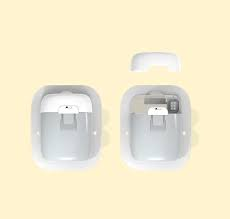

## Compatible Pump

!!! info "Time Estimate"
    - Omnipod users: 3 seconds to remember which Personal Diabetes Manager (PDM) you've been using.
    - Medtronic users: 10 minutes to put a battery in and look at model and firmware
    - Dana users: 5 minutes to check your model number
    - Other pump users: 5 days to email friends asking them to check closets for their old Medtronic pump or call your insurance to start prior authorization for Omnipod

!!! abstract "Summary"
    - If you have a Medtronic pump, check the [Medtronic Pump Version](#check-medtronic-pump-version) list to ensure compatible model/firmware
    - If you use [Omnipod](#omnipod-pumps) - check which kind
    - If you use [Dana](#sooil-dana-pumps) - check which kind
    - If you use [Medtrum Nano](#medtrum-touchcare-nano) - Check which loop version

!!! question "FAQs"
    - **"How can I find a compatible Medtronic pump?"** Refer to [Finding a Medtronic Pump](#finding-a-medtronic-pump).
    - **"What are the differences between Medtronic pump models?"** This question is answered in the [Extra Details](#extra-details-on-medtronic) section.
    - **"But what about the other types of pumps?"** No other pumps work with the *Loop* app at this time.
        - There are other open-source closed loop options such as [AAPS: Android Artificial Pancreas System](https://androidaps.readthedocs.io/en/latest/index.html) and [OpenAPS](https://openaps.readthedocs.io/en/latest/) that support other pumps
    - **"Can I change the firmware of my Medtronic pump?"** No.

## Pumps Compatible with the *Loop* app

These types of pumps are compatible with the *Loop* app.

* [Older Medtronic pumps](pump.md#check-medtronic-pump-version)
* [Omnipod Eros pumps](pump.md#omnipod-pumps)
* [Omnipod DASH pumps](#omnipod-dash)
    * See caveat about [iPhone 16](phone.md#compatible-device){: target="_blank" }
* [Dana-i / DanaRS-v3](#sooil-dana-pumps) (v3.7.5 or newer)
* [Medtrum Touchcare Nano](#medtrum-nano) (feat/dev-medtrum branch only, v3.9.0 or newer)

## Check Medtronic Pump Version

* Medtronic 515 or 715 (any firmware)
* Medtronic 522 or 722 (any firmware)
* Medtronic 523 or 723 (firmware 2.4 or lower)
* Medtronic Worldwide Veo 554 or 754 (firmware 2.6A or lower)
* Medtronic Canadian/Australian Veo 554 or 754 (firmware 2.7A or lower)

If you have one of the pumps listed above, you are good to go on Loop! Congrats!

## Extra Details on Medtronic

There are a number of Medtronic insulin pumps manufactured between 2006 – 2012 which are compatible with the *Loop* app.  Compatibility has two requirements: (1) pump model and (2) firmware.

### Medtronic Pump Model

To determine your pump model, look at the back of your pump to locate the sticker similar to that shown in the graphic below.  On the right-hand side of the sticker, it says REF MMT-XXXXXX

!!! note ""

    - MMT ---> Pump Manufacturer Model (MiniMed Medtronic)
    - 722 ---> Pump Model Number
    - NA ---> Pump Region (NA=North America, CA=Canada/Australia, WW=Worldwide)
    - S ---> Pump Color (S=Smoke, L=Clear/Lucite, B=Blue, P=Pink/Purple)

Some pumps may have an “L” or “S” or "R" before the pump region, e.g. a model number like MMT-722LNAS.  This does not affect compatibility with the *Loop* app.

### Medtronic Pump Firmware

A pump’s firmware is the internal software that runs your pump.  Older Medtronic firmware allows the *Loop* app to act as a “remote control” to set temporary basal rates and report back pump data.  Newer firmware disabled that “remote control” access and therefore cannot be used with these DIY closed-loop systems.  There is currently no ability to downgrade a pump’s firmware or replace it with older firmware.  Before you buy a used pump, make sure the pump firmware is compatible.

!!! note ""

    The firmware on all 515/715 and 522/722 model Medtronic pumps is compatible with Loop. You will only need to check the firmware version for 523/723 and 554/754 model Medtronic pumps.

    + Medtronic 515 or 715 --> any firmware
    + Medtronic 522 or 722  --> any firmware
    + Medtronic 523 or 723 --> firmware 2.4 or lower
    + Medtronic Worldwide Veo 554 or 754 --> firmware 2.6A or lower
    + Medtronic Canadian/Australian Veo 554 or 754 --> firmware 2.7A or lower

To find your pump’s firmware you will need to power it on. If the pump has not been powered on for some time (i.e., has been in storage without a battery for a while), it will run through a start-up count and the firmware version will appear on the bottom right of the pump’s screen.  Don’t turn away, as the version number will only be displayed for a little while before the pump moves to other information displays.  

If the pump has been active recently or has a reservoir installed, follow these steps:

1. Press the {width="40"} button on your pump.  

2. Scroll down with the {width="40"} button to the bottom of the status display.  

3. Read the bottom line of the display.

### Medtronic Pump Differences

If you are in the position of being able to choose from different pump models, there are some slight differences between the Loop-compatible Medtronic pumps that may influence your decision.

**500 vs 700**:  The difference between the Medtronic 500 series and the 700 series pumps is the size of the insulin reservoirs.  The 500 series pumps use a 180-unit reservoir, and the 700 series pumps use a 300-unit reservoir (or smaller 180-unit reservoir, if you want).

**x15/x22 vs x23/x54**:  The noteworthy differences between the x15 and x22 pumps versus the x23 and x54 series pumps are:

* The x23/x54 pumps will allow for smaller insulin deliveries in certain situations if the smaller scroll rate is selected in the Bolus>Setup>Scroll Rate menu.

|Pump Model  |Basal increments  |Bolus increments  |Range  |
|---------|---------|---------|---------|
|515/715 and 522/722     |  0.05 0.1       |    0.1 0.1     | deliveries of less than 10 units greater than 10 units        |
|523/723 and 554/754     |  0.025 0.05 0.1       |   0.025  0.05  0.1      | between 0.025 to 0.975 units between 1 to 9.95 units greater than 10 units        |

* Additionally, because of the way the *Loop* app fetches information from the pump, the x23/x54 series of pumps are slightly better at conserving battery life through the use of the MySentry packets to collect information from the pump.  x22 pumps do not use MySentry.

* The x23/x54 series pumps are also faster at delivering boluses greater than 10 units.  On an x23 pump, a 13-unit bolus takes 5:00 minutes to complete.  On an x22 pump, a 13-unit bolus takes 8:40 minutes to complete.

### Finding a Medtronic Pump

Finding a compatible Medtronic pump is probably the most difficult part for most new Loopers.  Our suggestions:

* Talk to friends in the diabetes community.

* Ask your endocrinologist.  

* Ask at a local JDRF chapter meeting if someone has an old backup pump they'd be willing to donate to you.  

* Join diabetes supply groups on Facebook; both for-trade and for-sale groups.  

* Check Craigslist often and be willing to expand your search area to include larger cities.

* Check out the **HelpAround, NextDoor, OfferUp, and/or LetGo** apps for pumps.
  
* [Looping in a time of covid](https://www.facebook.com/groups/1087611668259945/)

The most success appears to come from either one-on-one discussions with people with diabetes, your doctors or using apps (Craigslist, NextDoor, LetGo, HelpAround).  If you are using Craigslist, you may wish to use an app on your iPhone to make the searching easier.  There are apps to search multiple cities at once for your keywords and set up alerts.

### Safe Purchasing

If you choose to purchase from a remote or unknown seller, here are some tips for safe purchasing:

* Use PayPal and purchase using the "Goods and Services" payment option. This costs nothing for the buyer, but the seller will lose 2.95% of the sale to PayPal fees. PayPal offers some protection for both buyer and seller in the event of fraud.  

* Ask for photos of the pump. Check to make sure the serial number of the pump on the back matches the serial number of the pump showing in the display menu. Ask for a short video of the pump, or at least a photo of the pump turned on, so that you can see the pump's firmware and model number. Cracks and some wear on these pumps are expected. These pumps are not usually free of marks. Many people are successfully looping on pumps that have cracks and rub marks, but you may want to ask if you are concerned about any you see in photos.

* Beware if the bottom of the reservoir/motor sleeve has the drive support cap pushed out, as shown [here](../troubleshooting/pump-errors.md#motor-error). Those pumps will generally not work (or only work intermittently), however, some people have successfully repaired those pumps as shown in that link. Just be aware that it should be checked in advance.

* Repairs to cracks or missing bits of plastic on battery cap area and reservoir caps are possible and not very difficult in most situations. You can read more about how to repair those [here](../troubleshooting/pump-errors.md#crackmissing-piece-repairs).

* Ask for shipping that includes a tracking number. USPS Priority Mail's smallest box is a great option.  It's only $7.20 domestically in the US and includes tracking. Ask the seller to add a small bit of packing protection such as bubble wrap around the pump to keep it safe during shipping. Make sure you get a tracking number within a reasonable period of time after you have paid.  

Red flags that may indicate a scam:

* Asking for payment through "friends and family" on PayPal, especially if you don't know the person or have any solid references for them. Paying in that way offers you no buyer protection. It's just like giving the seller cash, so you had better trust the seller.  

* Offering an "almost new" pump is a big red flag in the US. Do you really think a more than 10-year old pump would be unused and sitting in shrink wrap at this point? This seems highly suspicious. There are some out there, but they are very rare.

* Inability to provide new pictures of the pump when requested. Sure they posted some pictures with the ad, but what if they just downloaded them from other people's ads? The seller should be able to furnish a couple of "new" photos at your request. A good one to ask for is the battery and reservoir tops so you can see their condition.

### Pump Supplies

Medtronic will not typically sell pump supplies directly to customers who have not previously purchased a registered Medtronic pump. Ask your insurance about purchasing pump supplies through a durable medical equipment (DME) provider. Typically, the DME provider will coordinate with your insurance and doctor's office to get the necessary insurance approval and prescriptions for the supplies. If you are brand new to Medtronic infusion sites, you may want to ask for help from friends to try a variety of infusion sets before purchasing a full 90-day supply of any type in particular.

## Omnipod Pumps

!!! warning "Reminder and Disclaimer"

    The use of Omnipod pumps with the *Loop* app is not supported by Insulet, although they are aware it is happening. Do not call Insulet asking for help with your *Loop* app build, setup, or operation. You are fully responsible for your use of the *Loop* app and do so at your own risk. Please read these documents and familiarize yourself with the *Loop* app before using it.

### Omnipod Eros

Eros pods (also known as Gen 3) were launched in 2013 and continue to be sold by Insulet in some countries. Insulet stopped providing Eros pods in the US end of December 2023. As far as we know, there are no timelines announced for the discontinuation of Eros pods for other countries. Insulet doesn't specifically call these "Eros" anymore, they just use the term "Omnipod system". For clarity, from [Insulet's webpage](https://www.omnipod.com/discontinuation):

!!! info "Alternative Names for Omnipod Eros Pump and Pods"

    **Eros** pump is also known as **Classic**, or **UST400**, or *Omnipod Insulin Management* **System**.  

    Pharmacy sites sometimes may refer to the **Eros pods** as **Gen 3** but they are the same exact pods. 
    
Eros system has a big Personal Diabetes Manager (PDM) that does not look like a phone.

{width="750"}
{align="center"}

### Omnipod DASH

The DASH system has the newer, slimmer locked-android Personal Diabetes Manager (PDM) and built-in BLE communications in the pod, so there is no requirement for a RileyLink compatible device.

**A RileyLink-compatible device is not required to use DASH with the *Loop* app. The communication with your iPhone uses Bluetooth.**

{width="750"}
{align="center"}

[See warning about iPhone 16 with DASH](phone.md#compatible-device){: target="_blank" }.

### Omnipod 5

Loop does not support Omnipod 5 pods.

## Sooil Dana pumps

!!! warning "Dana pumps support is new - pay attention"
    The Dana pump is supported with the released *Loop* app, v3.8.0 or newer.
    
    Follow the [Zulipchat Dana Pump discusion](https://loop.zulipchat.com/#narrow/channel/144182-development/topic/DanaKit.20support.20for.20Loop) if you need additional support for the Dana pump.

    Read these pages in LoopDocs:

    * [Add a Dana Pump](../loop-3/add-pump.md#dana-i-danars-v3){: target="_blank" }
    * [Dana Troubleshooting](../troubleshooting/dana-faq.md){: target="_blank" }

**Every Dana pump has built-in BLE communications. Therefore, no RileyLink-compatible device is needed to use Dana-i / DanaRS-v3 with the *Loop* app.**

### Dana-i

The Dana-i is the latest and greatest from the Korean pump manufacturer Sooil, released in 2020.

> The *Loop* app v3.7.5 or newer supports the Dana-i. 

{width="250"}
{align="center"}

### DanaRS

The DanaRS was first released in 2002, with firmware version v1 which is not supported at this time. Only firmware version v3 and onwards are supported with the *Loop* app.
[Check here](../loop-3/add-pump.md#dana-i-danars-v3) to see how to check your firmware version.

> The *Loop* app v3.7.5 or newer supports the DanaRS-v3. 

{width="250"}
{align="center"}

## Medtrum Nano

!!! warning "You must build feat/dev-medtrum branch to use Medtrum patch pumps"
    The Medtrum patch pump is in feat/dev-medtrum (as of version v3.9.0) and is experimental as of now

!!! info "All versions are supported!"
    Both 200U (MD0201 & MD8201) and 300U (MD8301) version are supported with the correct version of the *Loop* app.

**Every Medtrum patch pump has built-in BLE communications. Therefore, no RileyLink-compatible device is needed to use Medtrum patch pump with the *Loop* app.**

The Medtrum patch pump is the second tubeless pump option available to the *Loop* app.
The patch pump is 13.8gram, 40.5mm X 31.5mm x 11.5mm, making it the smallest and most discreet patch pump on the market as of now.
It uses a steel cannula, instead of the Teflon cannula of the Omnipods, with a virtually painless insertion.

{width="250"}
{align="center"}

## Next Step: Compatible CGM

Now you are ready to check if you have a [Compatible CGM](cgm.md).
