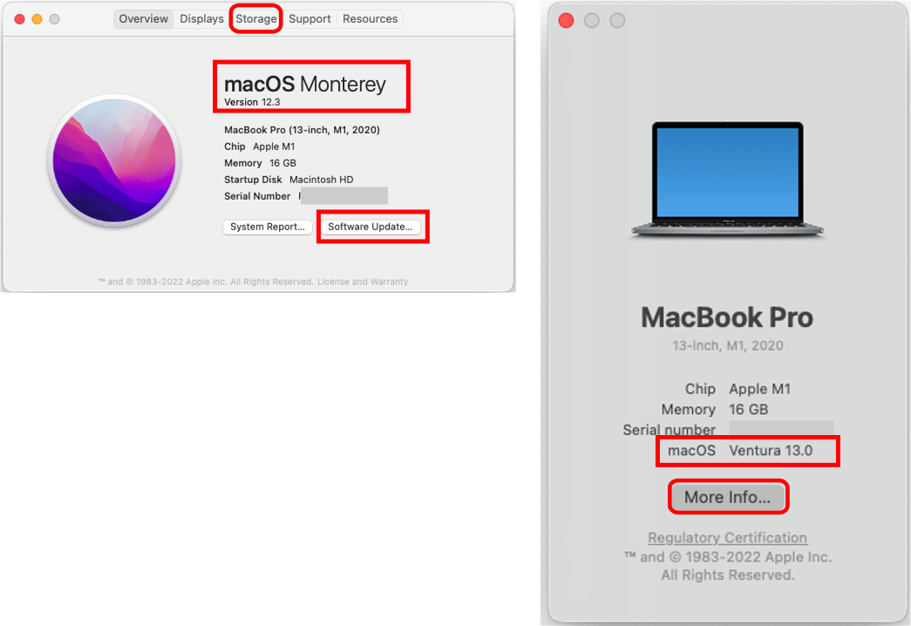

# Compatible Computer

!!! info "Time Estimate"
    - 5 minutes, if you have a Mac with Monterey (macOS 12.5) or higher
        - As of Oct 2022, Ventura (macOS 13.x) works with Loop, is  available but not (yet) required
    - 30-60 minutes, if you need to install macOS updates

    Hint: OS stands for Operating System

!!! danger "New Method (Loop-dev ONLY):"

    If you do not have a Mac, and you want to build [Loop-dev](build-select-dev.md), you can do this with any browser

    - You need a paid ($99/year) [Apple Developer Account](step6.md)
    - You need an account (free) with [github](https://github.com)
    - You need a [compatible phone](step2.md) to install the app from TestFlight
    - You need a [compatible Pump](step3.md) and [CGM](step4.md) if you want to actually Loop (and not just explore the app)

!!! abstract "Summary"
    Your computer, iPhone and Xcode must have compatible versions to build Loop.

    * A summary list of [Compatible Versions](#compatible-versions) is found on this page with more detail in a later page

	If you are buying a Mac, chose one with Ventura operating system and at least 256 GB (512 GB is better).

!!! question "FAQs"
    - **"Do I need a Mac or Virtual Machine?."** Yes if you are building the released version of Loop. The next version of [Loop (currently under development)](build-select-dev.md), can be built without a computer using github.
    - **"Can I use a PC or Windows computer? I don't own an Apple computer."** Yes, you can. Please read this FAQ about using a [Virtual Machine](../faqs/FAQs.md#can-i-use-a-pc-or-windows-computer-to-build).
    - **"Can I borrow someone else's Apple computer?"** Please see this FAQ about [Borrowing a Computer](../faqs/FAQs.md#do-i-need-to-own-my-own-apple-computer).
    - **"How often do I need to use the computer?"** Computer access is required when
        * Initially installing the Loop app
        * Loop app expires (Annually for a paid account or weekly for a free account)
        * Updating to a newer Loop release
        * You do NOT need access to an Apple computer to update your phone iOS, troubleshoot or change Loop settings

If you have access to a computer with MacOS 12.5 or newer, you can skip ahead to [Check Space Available](#check-the-space-available).

## Compatible Versions

The minimum macOS depends on the iOS of your iPhone/iPod.  Monterey is **required** to build on any iPhone with an iOS version starting with iOS 15.4 and can be used to build Loop for **any** of the phone iOS versions listed below. Higher values of iOS might trigger the need for an update to macOS or Xcode. Ventura is available and works to build Loop but is not required.

The [Loop and Learn Version Updates](https://www.loopandlearn.org/version-updates) page posts an update every time a new iOS is released and tested. That page is typically updated faster than LoopDocs and reports changes, if any, to the minimum Xcode or macOS.

* ** iOS 16 or newer**, the minimum macOS is Monterey (12.5)
* ** iOS 15.4 or newer**, the minimum macOS is Monterey (12.0)
* ** iOS 15 - 15.3.1**, the minimum macOS is Big Sur (11.3)
* ** iOS 14.5**, the minimum macOS is Big Sur (11.0)

If your macOS does not meet the minimum, check to see if you can [update your macOS](#check-your-macos-version)

If you are an **existing Looper with an older macOS**, please click to [Read the Warning](#older-operating-system-warning) **before** you update your phone to iOS 15.

!!! warning "iOS Dictates Your Computer Needs"

    The more up-to-date you keep your phone iOS, the more up-to-date your computer and macOS needs to be to build Loop. A new build is required at least once a year. More information on iOS is in [Download Xcode](step8.md#download-xcode).

Do not use any of the beta macOS versions. (If you don't know what that means, you aren't using one.)

## Check Your macOS Version

To find your macOS version, click on the Apple icon in the computer's upper left corner and select `About this Mac`. The graphic below highlights the macOS version with a red rectangle. Your computer can be a MacBook, iMac, macMini, etc. It will work to build Loop if it has the minimum required macOS version and enough storage.

With the Ventura macOS version, the `About this Mac` display changed. The left side of the graphic shows Monterey (or earlier) and the right side shows Ventura. Both styles of display indicate the macOS on this screen (red rectangle). For Ventura, when you tap on the `More Info` icon, it opens the General -> About screen from the System Settings menu. This is very similar to the phone Settings -> General -> About screen.

{width="750"}

If you do not have the required minimum macOS version

* For macOS 12.6.1 or earlier, check the `Software Update` button on the screen shown above
* For macOS 13.0 or later, click on the Apple and choose `System Settings`
    * Select `General` and `Software Update`, just like you would on the phone interface

Apple says upgrading to macOS Monterey or Ventura requires 26 GB of available storage.

## Check the Space Available

You need to have 50 GB free space in order to install Xcode in [Download Xcode](step8.md). At the top of the menu on the graphic above, click on the Storage Tab highlighted with a red rectangle, or, if running Ventura, tap on More Info to open the About screen (under System Settings->General), which includes storage at the bottom of the display.

 To free up space, move things like photos to an external drive. The Xcode application cannot be run from an external drive.

If you are evaluating a used computer, it's best to have at least 256 GB total disk space (more is better).

## Configure Terminal App for Rosetta

This step is only if your Mac uses an M1 or M2 chip. It is not needed for Macs that use an Intel chip. If you don't know if you have an M1, M2 or Intel chip, go back to the [Check Your macOS Version](#check-your-macos-version) section, and read the Chip line.

!!! abstract "New Apple M1/M2 chip users: IMPORTANT STEP"

    If you purchased an Apple computer with an M1 or M2 chip, you will need to do this step (one time only) to open the Terminal app using a "converter" app, called Rosetta.

    Go to the Finder app, click on Applications, then open the Utilities folder.  Locate the Terminal app but do not double click it to open a Terminal window. Instead, hold down the Control Key on the keyboard and single click on Terminal. This will bring up a menu of choices, select the "Get Info" option.

    {width="650"}

    Now in the informational window that appears...you'll see a checkbox that says "Open using Rosetta". Check that box...that will allow Terminal app to open using Rosetta when you double click on terminal in the future. You can close that informational window, after you check the box for "Open using Rosetta", and proceed with the rest of the directions just like normal.

    {width="450"}

Click on this link for more information from Apple about [Rosetta](https://support.apple.com/en-in/HT211861).

## Which Macs Are Compatible with macOS Ventura?

Ventura will eventually be required for building Loop. You can install Ventura on the following:

* MacBook Pro introduced in 2017 or later
* MacBook Air introduced in 2018 or later
* MacBook introduced in 2017 or later
* Mac mini introduced in 2018 or later
* iMac introduced in late 2017 or later
* iMac Pro
* Mac Studio
* Mac Pro introduced in 2019 or later
* get the full list from [Apple for Ventura](https://support.apple.com/kb/HT213264)

## Which Macs Are Compatible with macOS Monterey?

Monterey can be used for building Loop. You can install Monterey on the following:

* MacBook Pro, early 2015 or newer
* MacBook Air, early 2015 or newer
* MacBook, early 2016 or newer
* Mac Mini, late 2014 or newer
* iMac, 2015 or newer
* iMac Pro, 2017 or newer
* Mac Pro, late 2013 or newer
* get the full list from [Apple for Monterey](https://support.apple.com/en-us/HT212551)

## Older Macs

Several experienced Loopers have reported success using OpenCore-Legacy-Patcher to enable older Macs computers to use new versions of the operating system. Use this link at your own risk. This is not suggested for novice Mac users.

* [OpenCore Legacy Patcher](https://dortania.github.io/OpenCore-Legacy-Patcher/)

## Older Operating System Warning

!!! warning "Check before Upgrading iPhone"

    If you built Loop with Catalina (macOS 10.15.x):
    
    - DO NOT UPGRADE your phone to iOS 15
    - FIRST upgrade to at least Xcode 13, build the app on your phone
    - THEN upgrade to iOS 15
    - Otherwise you will get the dreaded ["Loop" is no longer available](updating.md#loop-is-no-longer-available) and need to rush through the updating Loop steps
    
    If this happens to you, your pod will continue delivering basal, but you will not be able to bolus.

## Next Step: Compatible iPhone/iPod Touch

Now you are ready to check if you have a [Compatible iPhone/iPod touch](step2.md).

