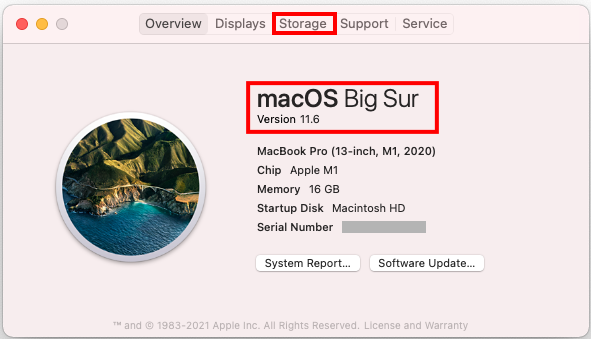

# Step 1: Compatible Computer

!!! info "Time Estimate"
    - 5 minutes, if you already have a Mac with Big Sur macOS
    - 30-60 minutes, if you need to install macOS updates

    Hint: OS stands for Operating System

!!! abstract "Summary"
    There are 3 things that have to be at a consistent version number to build Loop.

    * iPhone/iPod iOS determines the **minimum** [Xcode version (discussed in Step 8)](step8.md)
    * Xcode version determines the **minimum** [macOS](step1.md#macos) version
    * macOS version has hardware and disk space requirements

    If you are buying a Mac, you'll want to have Big Sur (or newer) as the operating system. Over the last few years, the amount of disk space required has expanded - do not consider anything with less than 256 GB (512 GB is better). For those new to Apple, the iOS, macOS and Xcode version numbers tend to increase annually.

    Minimum macOS for recent iOS:

    - macOS 11.3 (Big Sur) or newer is required for iOS 15 and higher
    - macOS 11.0 (Big Sur) is required for iOS 14.5 and higher

    Minimum means - newer versions build just fine. In other words, macOS 12.x (Monterey) is fine for building Loop, but not requred.

    If your macOS does not meet the minimum, check to see if you can [update your macOS](step1.md#check-your-macos)

    If you are an existing Looper with an older mac - you can choose to limit the iOS versions you accept - but you need to understand that Apple often provides updates that fix security problems.

    - macOS 10.15.x (Catalina) works up through iOS 14.4.x
    - macOS 10.14.x (Mojave) only works for phones with iOS 13.2 or earlier (and yes you can build to a 12.x device - but that won't be supported much longer.)

!!! question "FAQs"
    - **"Can I use a PC or Windows computer? I don't own an Apple computer."** Yes, you can. Please read this FAQ about using a [Virtual Machine](../faqs/FAQs.md#can-i-use-a-pc-or-windows-computer-to-build).
    - **"Can I borrow someone else's Apple computer?"** Please see this FAQ about [Borrowing a Computer](../faqs/FAQs.md#do-i-need-to-own-my-own-apple-computer).
    - **"How often do I need to use the computer?"** Computer access is required when you are
        * Initially installing the Loop app
        * Once per year (paid account) or once a week (free account) when Loop app expires
        * Updating to a newer Loop release because you want those improvements

    You do NOT need access to an Apple computer to update your phone iOS or to troubleshoot or change Loop settings, such as basal profiles or carb ratios.

## New M1 Chip Apple Computers

The newest Apple computers, released in November 2020, are compatible with building Loop. These new computers will make the build extremely fast. You will need to [configure the terminal app for Rosetta on the M1](step7.md#configure-terminal-app-for-rosetta-on-m1-computer). This only needs to be done one time.

## MacOS

The minimum macOS depends on the iOS of your iPhone/iPod. The latest macOS, Big Sur can be used to build Loop for **any** of the phone iOS versions listed below but is **required** to build on any iPhone with an iOS version starting with iOS 14.5.

* **If you have iOS 15 or newer**, the minimum macOS is Big Sur (11.3)

* **If you have iOS 14.5 or newer**, the minimum macOS is Big Sur (11.0)

Minimum means - newer versions build just fine. In other words, macOS 12.x (Monterey) is fine for building Loop, but not requred.

### Build Step 1: iOS 15 Warning if you built with Catalina

These next few lines are for Loopers who previously built with older macOS.  

* **WARNING** If you built Loop with Catalina - DO NOT UPGRADE your phone to iOS 15 - FIRST upgrade to Xcode 13, build the app on your phone - THEN upgrade to iOS 15. Otherwise you will get the dreaded ["Loop" is no longer available](updating.md#loop-is-no-longer-available) and need to rush through the updating Loop steps.  (Your pod will continue delivering basal, but you will not be able to bolus.)

* **If you have iOS 14 to 14.4.x**, the minimum macOS is 10.15.**4** (Catalina), newer is ok (Catalina or Big Sur)

* **If you have iOS 13.4 to 13.7**, the minimum macOS is 10.15.2 (Catalina), newer is ok (Catalina or Big Sur)

* **If you have iOS 12.4 to 13.2**, the minimum macOS is 10.14.4 (Mojave), newer is ok (Catalina or Big Sur)

!!! warning "iOS Dictates Your Computer Needs"

    Put simply for Loopers...the more up-to-date you keep your phone iOS, the more up-to-date your computer and macOS will need to be to enable a fresh build of Loop. A new build is required at least once a year. You can't avoid iOS updates forever...you just need to be aware of how they relate to each other if your computer is "getting on the older side". There will be more information presented on iOS in [Build Step 8: Download Xcode](step8.md#download-xcode).

Do not use any of the beta macOS versions. (If you don't know what that means, don't worry...that means you aren't using one.)

## Check Your macOS

You need an Apple computer that has at least the minimum macOS version described above. To find out which version you have installed, click on the little Apple icon in your computer's upper left corner and select `About this Mac`. The operating system in the graphic is highlighted with a red rectangle. It doesn't matter if the computer is a MacBook, iMac, macMini, etc...just so long as it has the minimum macOS you'll need. (But read the section about storage next.)

If your computer does not have the required minimum macOS version, you'll need to check the `Software Update` button on that screen to see if you can update.

{width="500"}

If your computer does not give you the option to update to a newer macOS (in other words you are stuck on older versions)...it is quite possible that Apple no longer provides updates for your computer.

Apple says macOS Big Sur requires 35.5GB of available storage to upgrade.

## Check the Space Available

While you are on the screen, above, look at the top of the menu and click on the Storage Tab highlighted in the graphic above with a red rectangle.  You will need to know the amount of free space when it's time for [Build Step 8: Download Xcode](step8.md). If you are checking out a used computer, it's best to have 256 GB total disk space and you may need to clear room by moving things like photos to an external drive. The operating system and Xcode take a lot of room.

## Which Macs Are Compatible with macOS Big Sur?

This is the preferred operating system for Loop.

* MacBook, 2015 or newer
* MacBook Air, 2013 or newer
* MacBook Pro, late 2013 or newer
* Mac Mini, late 2014 or newer
* iMac, 2014 or newer
* iMac Pro, 2017 or newer
* Mac Pro, 2013 or newer
* get the full list from [Apple for Big Sur](https://support.apple.com/en-us/HT211238)

## Which Macs Are Compatible with macOS Catalina?

If you are starting out - do not get a mac that can only support Catalina.

* get the full list from [Apple for Catalina](https://support.apple.com/en-us/HT210222)

## Next Step: Compatible iPhone/iPod Touch

Now you are ready to move onto Step 2 to check if you have a [Compatible iPhone/iPod touch](step2.md).
