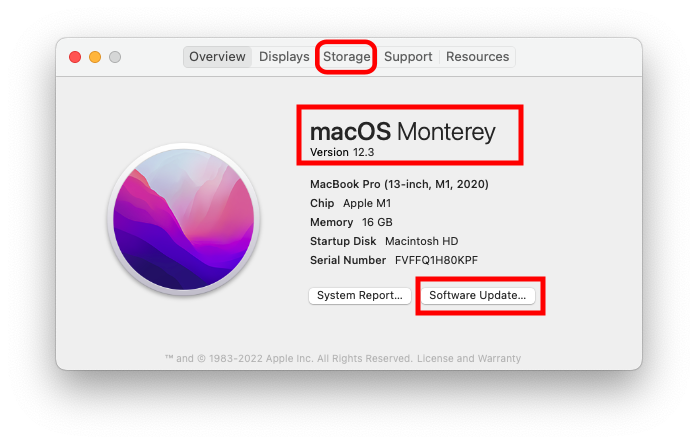
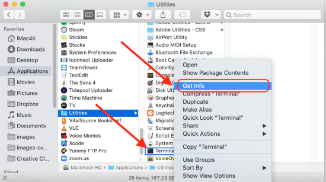
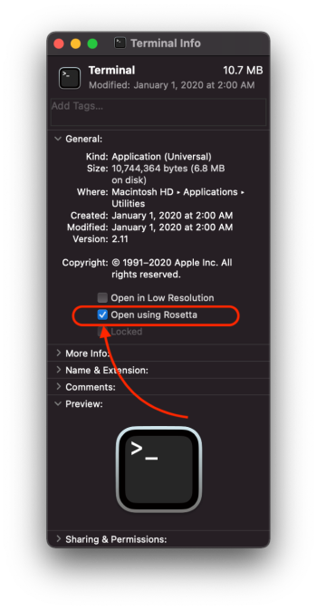

# Step 1: Compatible Computer

!!! info "Time Estimate"
    - 5 minutes, if you already have a Mac with Monterey macOS
    - 30-60 minutes, if you need to install macOS updates

    Hint: OS stands for Operating System, any macOS number starting with 12 is OK

!!! abstract "Summary"
    There are 3 things that have to be at a consistent version number to build Loop.

    * iPhone/iPod iOS determines the **minimum** [Xcode version (discussed in Step 8)](step8.md)
    * Xcode version determines the **minimum** [macOS](step1.md#macos) version
    * macOS version has hardware and disk space requirements

    If you are buying a Mac, you'll want to have Monterey (or newer) as the operating system. Over the last few years, the amount of disk space required has expanded - do not consider anything with less than 256 GB (512 GB is better). For those new to Apple, the iOS, macOS and Xcode version numbers tend to increase annually.

    Minimum macOS for recent iOS - newer versions build just fine:

    - macOS 12.0 (Monterey) or newer is required for iOS 15.4 (released March 2022)
    - macOS 11.3 (Big Sur) or newer is required for iOS 15 (released September 2021)
    - macOS 11.0 (Big Sur) is required for iOS 14.5 (released March 2021)

    If your macOS does not meet the minimum, check to see if you can [update your macOS](step1.md#check-your-macos)

    

!!! question "FAQs"
    - **"Can I use a PC or Windows computer? I don't own an Apple computer."** Yes, you can. Please read this FAQ about using a [Virtual Machine](../faqs/FAQs.md#can-i-use-a-pc-or-windows-computer-to-build).
    - **"Can I borrow someone else's Apple computer?"** Please see this FAQ about [Borrowing a Computer](../faqs/FAQs.md#do-i-need-to-own-my-own-apple-computer).
    - **"How often do I need to use the computer?"** Computer access is required when you are
        * Initially installing the Loop app
        * Once per year (paid account) or once a week (free account) when Loop app expires
        * Updating to a newer Loop release because you want those improvements

    You do NOT need access to an Apple computer to update your phone iOS or to troubleshoot or change Loop settings, such as basal profiles or carb ratios.

## MacOS

The minimum macOS depends on the iOS of your iPhone/iPod. The latest macOS, Monterey, can be used to build Loop for **any** of the phone iOS versions listed below but Monterey is **required** to build on any iPhone with an iOS version starting with iOS 15.4.

* **If you have iOS 15.4 or newer**, the minimum macOS is Monterey (12.0)

* **If you have iOS 15 - 15.3.1**, the minimum macOS is Big Sur (11.3)

* **If you have iOS 14.5**, the minimum macOS is Big Sur (11.0)

If you are an **existing Looper stuck on the older macOS**, [please see this warning](#older-operating-system-warning). Do not update your phone to iOS 15.

!!! warning "iOS Dictates Your Computer Needs"

    Put simply for Loopers...the more up-to-date you keep your phone iOS, the more up-to-date your computer and macOS will need to be to enable a fresh build of Loop. A new build is required at least once a year. You can't avoid iOS updates forever...you just need to be aware of how they relate to each other if your computer is "getting on the older side". There will be more information presented on iOS in [Build Step 8: Download Xcode](step8.md#download-xcode).

Do not use any of the beta macOS versions. (If you don't know what that means, don't worry...that means you aren't using one.)

## Check Your macOS

You need an Apple computer that has at least the minimum macOS version described above. To find out which version you have installed, click on the little Apple icon in your computer's upper left corner and select `About this Mac`. The operating system in the graphic is highlighted with a red rectangle. It doesn't matter if the computer is a MacBook, iMac, macMini, etc...just so long as it has the minimum macOS you'll need. (But read the section about storage next.)

If your computer does not have the required minimum macOS version, you'll need to check the `Software Update` button on that screen to see if you can update.

{width="500"}

If your computer does not give you the option to update to a newer macOS (in other words you are stuck on older versions)...it is quite possible that Apple no longer provides updates for your computer.

Apple says upgrading to macOS Monterey requires 26 GB of available storage to upgrade.

## Check the Space Available

While you are on the screen, above, look at the top of the menu and click on the Storage Tab highlighted in the graphic above with a red rectangle.  You will need to know the amount of free space when it's time for [Build Step 8: Download Xcode](step8.md). If you are checking out a used computer, it's best to have 256 GB total disk space and you may need to clear room by moving things like photos to an external drive. The operating system and Xcode take a lot of room.

## Which Macs Are Compatible with macOS Monterey?

Monterey is the preferred operating system for building Loop.

If you are starting out - make sure your Mac already has Monterey installed.

* MacBook, early 2016 or newer
* MacBook Air, early 2015 or newer
* MacBook Pro, early 2015 or newer
* Mac Pro, late 2013 or newer
* Mac Mini, late 2014 or newer
* iMac, 2015 or newer
* iMac Pro, 2017 or newer
* get the full list from [Apple for Monterey](https://support.apple.com/en-us/HT212551)

## New M1 Chip Apple Computers

Many new Apple computers use the M1 chips, released in November 2020. Before that Apple used Intel chips - now you can choose M1 or Intel for some models.  The M1 computers are compatible with building Loop. These new computers will make the build extremely fast. You will need to [configure the terminal app for Rosetta on the M1](#configure-terminal-app-for-rosetta-on-m1-computer). This only needs to be done one time.

### Configure Terminal App for Rosetta on M1 Computer

!!! abstract "New Apple M1 chip users: IMPORTANT STEP"

    If you purchased one of the new Apple computers that have the brand new Apple M1 chip, you will need to do this step (one time only) to open the Terminal app using a "converter" app, called Rosetta.

    Go to the Finder app, click on Applications, then open the Utilities folder.  Locate the Terminal app but do not double click it to open a Terminal window. Instead, hold down the Control Key on the keyboard and single click on Terminal. This will bring up a menu of choices, select the "Get Info" option.

    {width="650"}

    Now in the informational window that appears...you'll see a checkbox that says "Open using Rosetta". Check that box...that will allow Terminal app to open using Rosetta when you double click on terminal in the future. You can close that informational window, after you check the box for "Open using Rosetta", and proceed with the rest of the directions just like normal.

    {width="450"}

## Older Operating System Warning

!!! warning "Check before Upgrading iPhone"

    If you built Loop with Catalina - DO NOT UPGRADE your phone to iOS 15 - FIRST upgrade to at least Xcode 13, build the app on your phone - THEN upgrade to iOS 15. Otherwise you will get the dreaded ["Loop" is no longer available](updating.md#loop-is-no-longer-available) and need to rush through the updating Loop steps.  (Your pod will continue delivering basal, but you will not be able to bolus.)

## Next Step: Compatible iPhone/iPod Touch

Now you are ready to move onto Step 2 to check if you have a [Compatible iPhone/iPod touch](step2.md).
