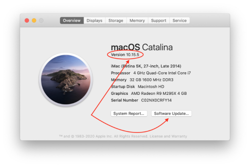

# Step 1: Compatible Computer

!!! danger "Time Estimate"
    - 5 minutes, if you already have Catalina or Big Sur macOS
    - 30-60 minutes, if you need to install macOS updates

!!! info "Summary"
    - The [minimum macOS](step1.md#macos) required depends on your phone iOS.  You'll probably need at least Catalina unless you have a phone that has not been updated in a long time.
    - Big Sur (newest macOS) may become required for iOS 14.5 (coming soon).
    - If your macOS does not meet the minimum, check to see if you can update your macOS.
    - If you cannot upgrade your existing computer, you'll need to check into a borrowed computer, patcher tool, or perhaps a new/used computer.
    - Check the `Software Update` to see if your computer has any updates available since you first installed it.

!!! warning "FAQs"
    - **"Can I use a PC or Windows computer? I don't own an Apple computer."** Yes...sort of. Please see [this FAQ about using Virtual Machine](../faqs/FAQs.md#can-i-use-a-pc-or-windows-computer-to-build).
    - **"What can I do if my computer is too old to be upgraded to Catalina?"** You could take a look at using [Catalina Patcher](http://dosdude1.com/catalina/), but this is totally on your own and not part of these instructions.
    - **"Can I borrow someone else's Apple computer?"** Yes, please see [this FAQ about borrowing a computer](../faqs/FAQs.md#do-i-need-to-own-my-own-apple-computer) to learn more.
    - **"How often do I need to use the computer?"** Computer access is only required when you are initially installing the Loop app or updating to a newer Loop release. You do NOT need access to an Apple computer in order to troubleshoot or change Loop settings, such as basal profiles or carb ratios.

## New M1 chip Apple Computers

Yes, the newest Apple computers just released in November 2020 are compatible with Loop building. These new computers will make Loop building extremely fast.

## MacOS

The minimum macOS depends on the iOS of your iPhone/iPod. The latest macOS, Big Sur (11.x) can be used to build Loop for any of the phone iOS listed below and may be **required** to build on any iPhone starting with iOS 14.5. The older macOS, Mojave, can not be used if your phone is updated past iOS 13.2.

* **If you have iOS 14.5 (not yet out) or newer**, the minimum macOS is expected to be Big Sur (11.x)

* **If you have iOS 14 to 14.4.x**, the minimum macOS is 10.15.**4** (Catalina), newer is ok (Catalina or Big Sur)

* **If you have iOS 13.4 to 13.7**, the minimum macOS is 10.15.2 (Catalina), newer is ok (Catalina or Big Sur)

* **If you have iOS 12.4 to 13.2**, the minimum macOS is 10.14.4 (Mojave), newer is ok (Catalina or Big Sur)

!!! danger "iOS dictates your computer needs"

    Put simply for Loopers...the more up-to-date you keep your iOS, the more up-to-date your computer and macOS will need to be, too. That's not necessarily a bad thing, and you can't avoid iOS updates forever...you just do need to be aware of how they relate to each other if your computer is "getting on the older side".

Do not use any of the beta macOS versions. (If you don't know what that means, don't worry...that means you aren't using one.)

## Check your macOS

You need an Apple computer that has at least the minimum macOS version as described above. To find out which version you have installed, click on the little Apple icon in your computer's upper left corner and select the `About this Mac`. It doesn't matter if the computer is a MacBook, iMac, macMini, etc...just so long as it has the minimum you'll need.

If your computer does not have the required minimum version, you'll need to check the `Software Update` button on that screen to see if you can update.

{width="500"}

If your computer does not give you the option to update to the newer macOS (in other words you are stuck on older versions)...it is quite possible that Apple has decided your computer is too old to run the latest and greatest. How old is too old? That will depend on your computer model and year as shown below:

## Which Macs are compatible with macOS Catalina?
* MacBook, 2015 or newer
* MacBook Air, 2012 or newer
* MacBook Pro, 2012 or newer
* Mac mini, 2012 or newer
* iMac, 2012 or newer
* iMac Pro, 2017 or newer
* Mac Pro, 2013 or newer
* get the full list from [Apple for Catalina](https://support.apple.com/en-us/HT210222)

## Which Macs are compatible with macOS Big Sur?
* MacBook, 2015 or newer
* MacBook Air, 2013 or newer
* MacBook Pro, late 2013 or newer
* Mac Mini, 2014 or newer
* iMac, 2014 or newer
* iMac Pro, 2017 or newer
* Mac Pro, 2013 or newer
* get the full list from [Apple for Big Sur](https://support.apple.com/en-us/HT211238)

## Next Step: Compatible iPhone/iPod touch

Now you are ready to move onto Step 2 to check if you have a [Compatible iPhone/iPod touch](step2.md).
