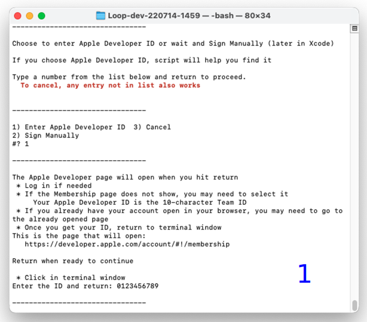
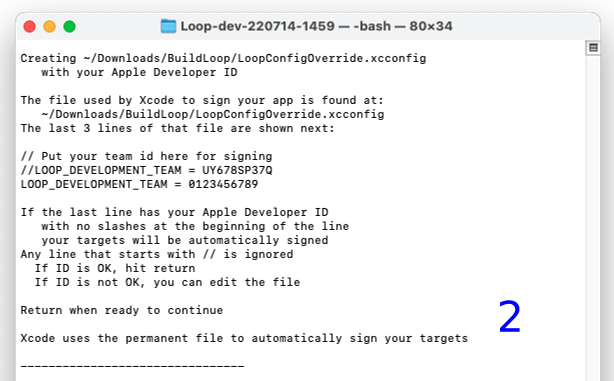

# Advanced Users Only

**Only build the dev branch if you're a developer/experienced user**

### About Loop-dev

Please read [What's going on in the dev branch?](../faqs/branch-faqs.md#whats-going-on-in-the-dev-branch) before deciding to test the dev branch.

- Note, the dev branch requires a minimum of iOS 14 on your device
- Once you install the dev branch on a device, you must delete the app to return to master (the released version), which means all settings will need to be entered in master and a new pod started
- The dev branch Loop user interface is updated - as an experienced Looper, you will notice the difference
- Updated documentation is a work-in-progress located under the [Loop 3](../loop-3/loop-3-overview.md) tab of LoopDocs

The development branch supports Omnipod DASH and many less experienced users want that capability. To assist these individuals, a special script (similar to build select) is provided.

### Download Loop-dev

This page assumes experience with using the Build-Select script in [Build Step 14](step14.md).

* A new script has been prepared to assist building the development branch for Loop and FreeAPS
* This script downloads the development branch and then selects a specific commit that has been lightly tested

This is still code under development, so please pay attention.

The commit is identified by a 7-digit alphanumeric code.  That code is included in the folder name of the downloaded code under Downloads/BuildLoop.  You can use finder to view the folder name after the script completes.

When you run the script, the instructions inform you of the date and commit that will be built.

Copy the Block of Text below by hovering over the button on the bottom right side of the text and clicking the copy icon (should say Copy to Clipboard when you hover over it). When you click the icon, a message that says “Copied to Clipboard” will appear on your screen.

Block of Text

```title="Copy and Paste to start the script to build a specific commit"
/bin/bash -c "$(curl -fsSL https://raw.githubusercontent.com/loopnlearn/LoopBuildScripts/main/BuildLoopFixedDev.sh)"
```

Paste the Block of Text into Terminal. Be sure to click anywhere in the terminal before trying to paste. (Ways to paste: CMD-V; or CNTL-click and select from menu or Edit-Paste at top of Mac screen.)

Read the screen (shown below).  Type 1 and return if you understand the warning and agree.

{width="700"}
{align="center"}

* Please read what is on the screen as you progress.
* Adjust font size as directed if you have difficulty seeing the directions.

You must type 1 (as shown in the graphic above) and return to indicate you understand the warning.

The next graphic warns you about building a development branch. The date and commit number in the script might not match the graphic below. The values in the script will be updated at appropriate times.

{width="750"}
{align="center"}

Continue following directions with the script.

After the cloning step, the specific commit will be "checked out". Verify there are no errors and proceed.

### Signing Targets

The script helps you configure a permanent file used by Xcode to automatically sign all your targets.

* The first time you use the script, it helps you set up the file used by Xcode to sign targets
* Once the permanent file is created, you can review it each time you run use a script, but should not need to change it

#### Create Permanent LoopConfigOverride.xcconfig

The following graphics show the messages for the first time the script is used on your computer.

If you see a message that starts with "The file used by Xcode to sign your app . . .", then skip ahead to [Use Permanent LoopConfigOverride.xcconfig](#use-permanent-loopconfigoverridexcconfig). You've already configured your file.


* Graphic 1 below shows:
    - User types 1 to use Apple Developer ID
    - User reads instructions for getting Team ID from the Membership page
       - The developer.apple.com web page is opened automatically when user is ready
    - User obtains ID
    - User enters ID in terminal

!!! note "Use Your Team ID"
    The Team ID entered in the graphics below is bogus - the script only checks that the entry is 10 characters long.

    Please follow directions and use your actual Apple Developer ID (the Team ID on the Membership page).

{width="750"}
{align="center"}

#### First Use of Script, continued:

* Graphic 2 below shows:
    - The permanent file is automatically created
    - User is given an opportunity to review the file information

{width="750"}
{align="center"}

User is then shown the [Final Messages](#final-messages)

#### Use Permanent LoopConfigOverride.xcconfig

* Graphic 3 below shows:
    - The permanent file is detected, user gets a chance to review it

{width="750"}
{align="center"}

#### Final Messages

* Graphic 2 and 3 above showed:
    * The user is always told which web pages will be opened and that Xcode will be opened
    * Then they must hit return when they are done reading

At this point the normal build steps continue, but the user does not need to sign the targets.

#### Loop-dev with Free Account

Yes you can build Loop-dev with the free account (Personal Team). There are some extra steps needed compared to the steps given for Loop 2.2.x on the [Build Step 14: Free Account](step14.md#free-account) section.

Note - if you know your Personal Team ID, you can enter it as directed in [Signing Targets](#signing-targets) above.

1. You must remove additional capabilities, the complete list is:
    * **Loop Target:** Push Notifications; Siri and **Time Sensitive Notifications**
    * **Watch App Extension Target:** Siri
1. Add the keyword `SIRI_DISABLED` to the LoopConfigOverride.xcconfig file
    * Examine the file and find the line that starts with `SWIFT_ACTIVE_COMPILATION_CONDITIONS = $(inherited)`
    * Insert the new keyword (separated by a space) anywhere after `$(inherited)` and before the slashes near the end of the line

### Build Loop-dev

* There are some package dependencies (new for Loop-dev) that are resolved first and then the indexing takes place
* If you notice a red x in Xcode (indicating an error) while it is resolving packages and indexing - please follow the steps for [Couldn't Get Revision for Package Dependency](build_errors.md#couldnt-get-revision-for-package-dependency)
* Once the packages are resolved and the indexing has started, you can build the app following the directions in the "Build Loop" section on [Step 14: Build Loop App: Build Loop](step14.md#build-loop).

We suggest reading the tips below on keeping Loop-dev updated. Checking for updates every week is a good idea.  Also - subscribe to all the streams on [Loop Zulipchat](https://loop.zulipchat.com) to make sure you don't miss critical information.

### Update Loop-dev

While Loop-dev is under active test, you will want to update frequently.

You may choose to run the script each time you update. You can discard older versions of the download by using Finder and navigating to Downloads/BuildLoop. Only the most recent copy is required to build loop.

You may prefer to use commands to fetch and pull the latest code without making a new clone. 

* Some users like to use [GitKraken](https://support.gitkraken.com/) to assist them (link takes you to a tutorial video).
* Some are comfortable with the command line git commands described on [here](loopworkspace.md#updating-loop-using-loopworkspace).

### Manual vs Automatic Signing

If you manually sign any of the targets, for example as an alternative way to get your Developer ID, the file in the Loop folder called `Loop.xcodeproj/project.pbxproj` is automatically modified to use that target name.

Once that happens, the feature that enables Xcode to use the `LOOP_DEVELOPMENT_TEAM` keyword in the LoopConfigOverride.xcconfig is no longer available.

To restore that capability, navigate in the terminal to the LoopWorkspace/Loop folder and issue this command:

```
git restore Loop.xcodeproj/project.pbxproj
```


### Remove carthage

!!! abstract "Completely Optional"
    This section is completely optional.

    It is only provided to assist those who installed carthage for Loop and want to remove it.

* You no longer need carthage, and can uninstall it from your system.

* You do NOT need to uninstall carthage - your choice. If you share the computer with someone else, make sure they don't need carthage.

First copy and paste this phrase into the terminal and hit return:

```
carthage version
```

* If the response gives you a version number, then carthage is installed - you can uninstall it if you choose

* If the response indicates, "carthage: command not found", you are done - it is no longer needed to build Loop-dev

If carthage is on your system, you can choose to remove it (completely optional with respect to building Loop with updated code).

Copy and paste the following line into the terminal window and hit return.  

```
rm -rf /usr/local/bin/carthage
```

!!! danger ""
    If the response says you don't have the privilege to do this - it is best to stop.

    * That means carthage was installed by another user - not you.
    * Check with them to make sure they don't require carthage on the computer.
    * The presence or absence of carthage no longer affects the build process for Loop - so it is fine to leave it on your computer.

Assuming the previous line did not give an error, then copy and paste this line into the terminal window and hit return to complete carthage removal:

```
sudo rm -rf /Library/Frameworks/CarthageKit.framework
```

You will be prompted for a password when you hit enter on the second line.   It is the same password you use in order to log into the computer.   It will not echo to the screen.
