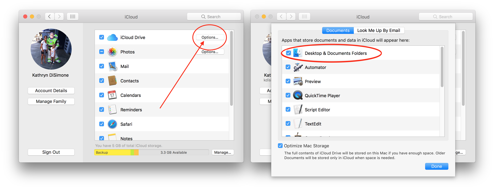

# Step 13: Download Loop Code

!!! danger "Time Estimate"
    - 10 minutes to read this page
    - 1 minute to download Loop code

!!! info "Summary"
    - Download the zip file from the master branch link below

!!! warning "FAQs"
    - **"What the heck is a branch?"** That's a great question. We have a page all about [Branch FAQs](../faqs/branch-faqs.md)
    - **"When do I need to download new Loop code?"** Anytime you want to update your Loop app to get new features, you'll simply download the code again by clicking on the links below. The links always go to the most recent version of each of the branches. It's a good idea is to delete your old downloads before making a new one, just to avoid confusion.

## Download Loop

You’ll need to download the Loop code. You will then build the app on your computer with Xcode, which will transfer the app to your phone or ipod.

Most users should click on the master branch link below to download Loop code and then follow the rest of the steps until you have a new version on your device. (This link always points to the most recent version of the code.)

---

- [Loop: master branch](https://github.com/LoopKit/Loop/archive/master.zip)

---

- [Advanced Users Only](#advanced-users-only)

---

!!! danger "What happened to the automatic-bolus branch?"
    - The updated master branch (Loop v2.2.5) was released Aug 22, 2021
        - Includes features (as an option) that were previously only available in the automatic-bolus branch
        - Includes a varieties of improvements and the orange-link patch
        - Please check out [Branch FAQs for v2.2.5](../faqs/branch-faqs.md#loop-v225)

## Store and Name Your Download Properly

It is best practice to leave your Loop code in your Downloads folder. If you store your Loop code in a different folder than Downloads (such as your Documents folder or Desktop), make sure the specified folder is **not** an iCloud drive. Storing your Loop code in an iCloud drive folder will prevent Loop from building successfully.  How do you know if a folder is an iCloud drive? Check your System Preferences. If your System Preferences for iCloud is set as shown below, your Documents and Desktop folders are iCloud drives and **NOT** appropriate places to save your Loop download.

{width="650"}
{align="center"}

Depending on your browser and settings, your Loop download may or may not automatically unzip. If it does not unzip automatically, you can right-click on the zip file and choose to "Open With" Archive Utility. This will create a blue folder called `Loop-master`.  HOWEVER, if you already have an existing `Loop-master` folder from a previous download, the name of the next download will be something like `Loop-master (1)`.

## Next Step: Build Loop App

Now you are ready to move onto Step 14 to [Build Loop App](step14.md).

## Advanced Users Only

If you are an advanced user who wants to build the dev branch - this section is for you.

!!! warning "Advanced Users Only"

    **Only build the dev branch if you're a developer/advanced user**

    Please read [What's going on in the dev branch?](../faqs/branch-faqs.md#whats-going-on-in-the-dev-branch) before deciding to test the dev branch.

    - Note, the dev branch requires a minimum of iOS 14 on your device
    - Once you install the dev branch on a device, you must delete the app to return to master or automatic-bolus, which means all settings will need to be entered and a new pod started
    - The dev branch user interface is different, i.e., the documentation in LoopDocs does not always match the screens you will see when you use the Loop app built from the dev branch
    - [Loop dev Preview](../faqs/dev-menus.md) is found in the FAQs section with some preliminary documentation

    The dev branch requires using LoopWorkspace and requires installation of carthage 0.36.0 on your Mac.  The links below are to the wiki for LoopWorkspace, the LoopDocs page on building with LoopWorkspace and the instructions for installing carthage 0.36.0 (not needed for master or automatic-bolus branches)  

    * [LoopWorkspace README](https://github.com/LoopKit/LoopWorkspace#readme): Replace "<branch\>" in "git clone" line with "dev"

    * LoopDocs page on [LoopWorkspace](loopworkspace.md)

    * LoopDocs page, ["Skip Step 7"](step7.md) for installing carthage 0.36.0

    New trick (dev branch only):

    * Edit the LoopConfigOverride.xcconfig
    * Uncomment the line starting with `LOOP_DEVELOPMENT_TEAM = `
    * Insert your developer ID
    * Build the Loop(Workspace) - all targets are signed automatically
