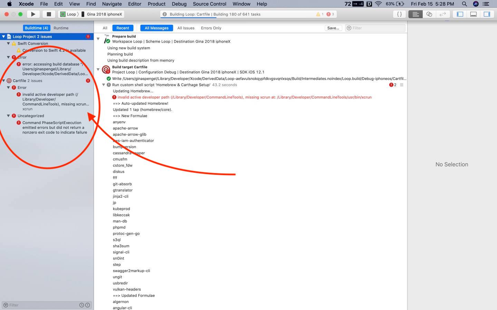

# Build the Loop App

## Build the Loop App Summary

!!! info "Time Estimate"
    - 60-80 minutes for first time builders
    - 10-15 minutes for a repeat builders

!!! abstract "Summary"
    You will:

    * Run the Build Select Script and download Loop code
    * Prepare to build the Loop app
    * Press the Xcode Build Button to build Loop
    * Watch in awe as you build your very own Loop app

!!! question "FAQs"
    The FAQs for building Loop are in-line with the steps that trigger the questions.

## Build Video

The Loop and Learn team prepared this [YouTube video](https://youtu.be/gddhljzsNkM) showing how to build Loop Master. We recommend reading the written directions below before (and while) watching the video.

This video starts with the steps for updating Loop. If this is your first time building, pay attention to what you'll need to do in about a year. The part you'll need to do today (open the terminal to start downloading Loop) is about 3 minutes into the video.

## Download Loop

This page has the detailed steps to run the Build Select Script to download the Loop code, prepare your computer and build Loop Master.

### Ensure a Year

!!! danger "Rebuild / Update on Same Computer?"
    If you used this same computer to build Loop previously and you did not delete provisioning profiles - you will not get a full year with the app.

    Go to [Updating: Step 4a](updating.md#step-4a-delete-old-provisioning-profiles) now and do that step if you missed it.

#### Open Terminal

Go to the Finder app, click on Applications, then open the Utilities folder.  Locate the Terminal app and double-click Terminal to open a terminal window. The terminal window is very plain looking when you open it. That is normal.

### Build Select Script

These instructions show each step needed to download Loop using the Build-Select script.

!!! note "Optional"
    The Build Select Script can also be used to build a companion app, called Loop Follow, and a fork of Loop, called FreeAPS. Follow these links to different websites for more information about those apps.

     * Information about [Loop Follow](https://github.com/jonfawcett/LoopFollow#readme)
     * Information specific to [FreeAPS](https://www.loopandlearn.org/freeapsdoc/)

     You do not need to know about these apps to build Loop master.

Copy the line below that starts with `/bin/bash` by hovering the mouse near the bottom right side of the text and clicking the copy icon (should say Copy to Clipboard when you hover over it). When you click the icon, a message that says “Copied to Clipboard” will appear on your screen.

```title="Copy and Paste to start the Build-Select script"
/bin/bash -c "$(curl -fsSL https://raw.githubusercontent.com/loopnlearn/LoopBuildScripts/main/BuildLoop.sh)"
```

Paste the line of text into Terminal. Be sure to click anywhere in the terminal before trying to paste. (Ways to paste: CMD-V; or CNTL-click and select from menu or Edit-Paste at top of Mac screen.)

Read the screen (shown below).  Type 1 and return if you understand the warning and agree.

{width="750"}
{align="center"}

* Please read what is on the screen as you progress.
* Adjust font size as directed if you have difficulty seeing the directions.

You must type 1 (as shown in the graphic above) and return to indicate you understand the warning.

Next you will see an introduction to the Build-Select script.  Please read this.  To build Loop, you will select the Build Loop option by typing 1 (as shown in the graphic below) and return.

{width="750"}
{align="center"}

Next you are asked which version of Loop you would like to build. Type 1 and return to build Loop Master (as shown in the graphic below) or 2 for the FreeAPS fork of Loop.

{width="750"}
{align="center"}

### XCode Errors with Build-Select

!!! warning "WARNINGS"

    If you see errors like these . . .

    * `xcrun: error: invalid active developer path (/Library/Developer/CommandLineTools), missing xcrun at: /Library/Developer/CommandLineTools/usr/bin/xcrun`
    * `xcode-select: Failed to locate 'git', requesting installation of command line developer tools`
    * `xcode-select: error: tool 'xed' requires Xcode`

    You missed one of these steps:

    * [Install Xcode](step8.md)
    * [Xcode command line tools](step9.md#command-line-tools)

### Wait for Download to Complete

This download can take from 3 minutes to 30 minutes depending on your download speed.  You can leave the room and return later to check on progress. When you read the words in the terminal, as the script runs, you may see terminology you do not understand - don't worry - you do not need to understand enumeration or submodule or cloning.  You only need to review the display to look for any error messages.

The next graphic shows terminal messages for the beginning of a successful download.

{width="750"}
{align="center"}

The final terminal messages of a successful download are shown in the next graphic.

{width="750"}
{align="center"}

If an error appears in your terminal window, read the error and tap any key other than 1, followed by return to cancel. Try to fix the error and run the script one more time. Still not working? Reach out for help at your favorite [Loop Social Media](../intro/loopdocs-how-to.md#how-to-find-help) site.

### Download was Successful

If there are no errors:

* Make sure your phone is unlocked and plugged into the computer
* Type 1 in the terminal window and return to Continue as shown in this graphic.

{width="750"}
{align="center"}

The final actions of the script are to open two browser windows and then Xcode:

* First the script tells you what will happen next and waits for you to indicate you're ready by tapping return
    * Open a page with abbreviated build instructions from a different site in your browser
        * If that webpage is not available, it is a convenience for experienced builders and not required
    * Open LoopDocs here (at the Prepare to Build section) in your browser
    * Open Xcode so you can prepare to build
* Last message informs you that you can close the terminal window if you're done
    * It's probably a good idea to wait until you've successfully built the app before closing the terminal

## Prepare to Build

**New builders should follow the detailed steps on this page - skip ahead to [Select the Loop Folder](#select-the-loop-folder).**

### Summary Graphic

!!! tip "Experienced Builders"
    Experienced builders can choose to follow the abbreviated build instructions instead.

    The Loop and Learn abbreviated [Build Instructions](https://www.loopandlearn.org/workspace-build-loop/) is automatically opened by the Build Select script

    Rearrange screens so you can see the webpage and Xcode.

{width="750"}
{align="center"}

### Select the Loop Folder

!!! danger "Don't touch that button!"
    You will be told exactly where on each screen you should click. Please only click in the designated places.

Follow the directions and compare your Xcode screen to the graphics as you walk through the steps.

As shown in the GIF below:

* Frame 1: This is what the Xcode screen looks the very first time it is opened after a fresh download
    * You need to click on the indicated Loop folder icon two times
* Frame 2: After the 2 clicks, the middle pane of the Xcode window is populated as shown

{width="750"}
{align="center"}


### Select Loop (Workspace) and Your Phone

If this is the **First Time** your phone or watch has been connected to Xcode, you will need to tell the phone and watch to "Trust this Computer".

The GIF below shows:

* Frame 1: Same as end of previous GIF
    * There's a red rectangle around the dropdown menus
    * The menu on the left says "Loop"
* Frame 2: Same as Frame 1 with a zoomed inset of the red rectangle
    * You can see Loop has a check mark beside it
    * Loop (Workspace) is one line below
    * Select Loop (Workspace)
* Frame 3: Zoomed inset after selecting Loop (Workspace)
* Frame 4: Desired result of selecting Loop (Workspace) and your phone

{width="600"}
{align="center"}

!!! warning "My Phone is Not Selected"
    * Plug in your unlocked phone and select your phone using the dropdown menu (right side of red rectangle highlight in the GIF)
        * Look in the iOS Device section
        * Not the iOS Simulator section

!!! warning "I Still Don't See My Phone"
    * If you don't see your phone, unplug and plug in again
    * Still don't see your phone - reboot the phone - and if that doesn't work - reboot the computer
    * Still don't see your phone - try a different cable or USB slot


!!! warning "Most Common Mistake"

    - The most common mistake in this step is:
        - not selecting Loop (Workspace)
        - not selecting your actual phone as shown in the second screenshot below

{width="650"}
{align="center"}

### Build to a Simulator

Skip this section if building to a phone and proceed to [Signing](#select-signing-capabilities-tab).

If you want to build to a simulator, you can skip most of the rest of this page.

* Simply choose one of the iOS Simulators instead of a phone and build
* With a simulator, you do not need to sign targets:
    * You must select Loop (Workspace)
    * Then you can click on the "play" button in the upper left pane of Xcode to build to the simulator
    * Skip ahead to [Build Loop](#build-loop) and ignore all the instructions about signing the app and warnings about code sign messages
* After a successful build, a simulated phone appears on your computer and you can interact with the app on that simulated phone

### Select Signing & Capabilities Tab

The graphic below indicates in red the three places you need to click in order to begin signing targets.

* First, click on the tab labeled `Signing & Capabilities`
* Second, click on the icon labeled `Loop` under the word `TARGETS`
* Third, click on the dropdown menu (red circle) by the word `Team`

!!! tip "Click Only where Instructed"
    Users sometimes click when they do not mean to.

    * Make sure `All`, indicated by dashed blue oval, is selected
        * If `Debug` or `Release` is accidentally tapped, you will not be able to build
    * Make sure checkbox in `Automatically manage signing`, indicated by dashed blue rectangle, remains checked

{width="750"}
{align="center"}


### Sign the Targets

It is time to Sign the Targets with your [Apple Developer ID](step9.md#add-apple-id)

!!! info "First Time"
    In addition to the [Trust Your Computer](#select-loop-workspace-and-your-phone) steps mentioned above for the first time you plug in your phone, the first time you use your Apple Developer ID to sign a target for an app, you need to register your device with your Apple Developer ID.

    A message similar to the one in the graphic below will appear with the first target you sign.

    At any time after you see that message, click on the "Register Device" button to confirm.

    * You **must** be connected to the Internet for this step because your computer needs to communicate with Apple to register that device
    * You **must** register the device at some point before you try to build the app to the device

{width="300"}
{align="center"}


Start with the Loop target, the first one on the target list. Choose the team you'd like to sign with.

{width="400"}
{align="center"}

- If you select a team name without (personal team), your app will last a full year.
- If you select a team name with (personal team), your app will expire after 7 days
    - You must disable [Push Notification and Siri](step14.md#free-account) - click on the link for instructions then return using your browser back button
    - If you never signed up for a [Free Developer Account](step9.md#add-apple-id), you will not have a (personal team) showing


A successfully signed target will have a provisioning profile and signing certificate similar to the screenshot below.

Click on each of the three remaining targets shown in the red box below, and repeat the signing steps by choosing the same team name as you selected in the first target. The four targets that must be signed prior to building the Loop app are Loop, Loop Status Extension, Watch App, and WatchApp Extension.

{width="750"}
{align="center"}


After signing the 4 targets, click on the Loop icon under the `PROJECTS` heading. (Refer to the bright blue box in graphic above - click on that Loop icon.)

- If you skip this step, you may get an "Entitlements" Build Error for either Loop or WatchApp
- Follow this procedure [Entitlements Error](build_errors.md#entitlements-error)
- Much easier to just click on Loop under `Projects`

!!! abstract "Advanced Users Only"

    There are [more targets](step13.md#signing-targets) which must be signed to build the dev branch.

    If you followed the directions in [Loop-dev](step13.md#signing-targets) and edited the LoopConfigOverride.xcconfig, your targets are already signed.

    - **Repeat: only build the dev branch if you're a developer/advanced user**

If you are using a paid account, skip over the next section to [Optional Steps](#optional-steps)

#### Free Account

These steps are only required for those building with the Free Account.

_The graphics in this section have not been updated to show "Loop (Workspace)"._

_The graphics in this section have not been updated for Xcode 13, which uses the trashcan icon instead of the x for removing capabilities._

_If you are using a free account to build Loop-dev, review this section and then [Loop-dev with Free Account](step13.md#loop-dev-with-free-account)_

!!! abstract "Free Developer Account Users: READ ME"

    If you are using a free developer account, you will need to do an extra step before you can successfully sign the targets. As a free developer, you are restricted from building apps that have Siri or push notification capabilities built-in. Loop has both of these capabilities, so you will need to disable them before signing and building your app.

    The push notification capability is used for setting remote overrides; disabling it will not affect other notifications on the Loop phone, e.g., "Loop Failure", "Pump Reservoir Low", etc. Click on the small x next to the Siri and push notification lines located at the bottom of the Signing & Capabilities box. You need to do this in both the Loop and WatchApp Extension targets.

    Note that this graphic shows `Debug` selected in the Signing & Capabilities pane. This is not correct - make sure that `All` is selected instead.

    {width="750"}
    {align="center"}

### Optional Steps

#### Code Customizations

**New Loop users**: Customizations are not a required part of any Loop build. As you gain experience using your Loop app, you may want to customize some of the features. First time builders are encouraged to build with the standard, default code. You can always update your Loop app to add customizations at a later time, using the same download. Subsequent build time is much faster than the initial build for a given download.

If you want any custom configurations to your Loop or Loop Apple Watch apps, follow the step-by-step instructions on the [Code Customizations](code_customization.md) page prior to pressing the Build button.

When you've finished your customizations, come on back to this section and continue with the rest of the build.

#### Pair Your Apple Watch

**New Apple Watch users**:

* If you have a new Apple watch and want to use it with Loop, first pair the watch with the iPhone before continuing to the next steps.
* If you get a new watch after building the Loop app, you'll need to redo your Loop build. (Don't worry, it's as easy as pressing play on your saved Loop project.)

**Existing Apple Watch users**: Please update your watchOS prior to building the Loop app.  The current version of Loop requires watchOS 4.1 or newer.

## Build Loop

Before building Loop, confirm that:

* Your iPhone is unlocked and plugged into the computer
* You selected Loop (Workspace)
* You selected your phone and not a simulator
* You signed the four targets
* You clicked on the Loop icon under the `PROJECTS` heading
* OPTIONAL: You [Apple watch](#pair-your-apple-watch) is paired and updated
* OPTIONAL: You finished desired [customizations](#code-customizations)?

It is time to press the “Build” (Play) button to start Xcode on its way.

!!! warning "First Time for This Computer"
    If you have never built an app on this computer, you will need to allow the app access once for every target.  [Review these instructions](#codesign-keychain-access) before you press the Build button so you know what to do.

_The graphics in this section have not been updated to show "Loop (Workspace)"._

!!! info "Helpful Tips"

    The final step of a successful build is for Xcode to copy the completed build to your iPhone; if your phone is locked, Xcode pops up a message letting you know.  Unlock your phone to continue.

{width="750"}
{align="center"}

You’ll see the progression of the build in the status window (top middle of Xcode). New builds can take 5-30 minutes, depending on the speed of the computer.  **Just be patient.**  The progress will stay on one step/task for a very long time, and then the others will fly by. Not every step is equal in duration. Do not give up on the build.

**Xcode will ALWAYS tell you eventually that the build either succeeded or failed via an ephemeral (self-disappearing) pop-up message on the computer display. If you miss the message, you can look at the top of the Xcode window to see a "Running Loop..." (success) or "Unlock Phone to Continue" or "Build Failed" (failure) message where the step progress was previously counting down.**

#### Codesign / Keychain Access

!!! abstract "First Time Builder or First Time on this Computer"

    Sometime during your first build on a computer, be ready for a codesign/keychain access prompt that you will see part-way through the build process.

    **FYI:** _codesign is for code sign - nothing to do with design._

    Enter the same password you use to log in to the mac, select always allow and then do it again next time you are asked - once for each target you just signed above.


    {width="350"}
    {align="center"}


    It is normal for this prompt to come up four times in a row even after you enter the correct password. In frustration, people think the prompt must be broken because it keeps reappearing and then people will press deny or cancel. **Don't press deny.** Keep entering your computer password and pressing the "Always Allow" button as many times as it takes (four times to be exact; one for each target in Xcode). After four times of successful password entry, the build will continue.


### Build Finished

!!! abstract "First Time Building on a New Device?"

    The first time you install an app on your iPhone using your developer account, you may get a warning like the one shown below. Don't worry.

    * You need to do extra step on the phone before the Loop app can open
    * Follow the directions in your warning (graphic is a little old)
    * For iOS 15:
        * Go to the phone Settings
        * Scroll to find the Developer icon and select it (or use search feature)
        * Enable trust for your Developer Account
    * If you are missing the Device Management/Profiles option in your iPhone settings, head over to [this Build Error section](build_errors.md#device-management-could-not-launch-loop) to find the solution.

{width="750"}
{align="center"}


### Build Succeeded

!!! success "Congratulations"

    If the build is successful, you'll see the message "Running Loop..." across the top of the Xcode window. Pick up your phone and look at it.

    You can unplug your phone from the computer now. You will get an Xcode message window that says "Lost connection to the debugger on <your phone name\>".  Just click OK.

    Your brand new Loop app will automatically open a screen asking you to allow Loop to send you notifications. The Health app permissions screen will be visible in the background, but you must answer the Notification request first. Click `Allow` to enable Loop to send you notifications.

    Now the Health permissions screen is active. Click on the `Turn All Categories On` line and then **immediately turn OFF the permission to read Carbohydrates**. The end result is that Health should have permission to read and write Blood Glucose and Insulin Delivery; permission to write Carbohydrates ([NOT read carbs](health.md#loop-permissions)); and permission to read Sleep Data. When the permissions are set correctly, i.e., match the image below, click `Allow` in the upper right corner.

    {width="450"}
    {align="center"}


    Next, you will use the [Set up App](../operation/overview.md) section of this website to keep proceeding safely.

!!! question "FAQ: But what about those yellow alerts that remain in Xcode?"

    If you see yellow alerts during and after your build is done, those are not an issue. Just ignore the yellow alerts.

    {width="750"}
    {align="center"}


### Build Failed

!!! warning "Breaking News for Xcode 13"

    There is a new error for Xcode 13, "WatchApp Extension.entitlements" or "Loop.entitlements" depending on which icon you left highlighted when signing targets.  (We checked many combinations - if you follow the instructions to highlight the Loop icon below `PROJECTS`, you won't get the error.) If you do see that error, follow this link: [Entitlements Error](build_errors.md#entitlements-error) for an easy fix.


If you get any other message that your build failed and see **RED ERROR** messages, go to the [Build Errors](build_errors.md) page to find the steps to fix your build error. Most build errors are covered on that page along with instructions on how to fix them and how to ask for help.

Once you've resolved the issue and start the build process again, Xcode will continue to show a red circle on the top line from the previous failure.  If you don't like seeing that, clean the build folder to clear the error.  Otherwise, as long as the steps of the build are showing across the top line, Xcode is still working on the build.  When the build succeeds, the red circle will disappear.

!!! abstract "Clean Build Folder"

    * In Xcode menu, select Product, then Clean Build Folder
    * Wait for cleaning to complete: you'll see a "Clean Finished" message


{width="750"}
{align="center"}

### Summary

If your build failed, you need to proceed to the [Build Errors](build_errors.md) page to find the solution. Please go there first to find the help you need.

If your build was successful but your phone was locked, you will see an Xcode message window that says "Unlock <your phone name\> to Continue". Simply unlock your phone and the app will be copied onto your phone and automatically open.

If there were no build errors, you're done building your Loop app.

If your phone is still plugged into you computer, you can unplug it. You will get an Xcode message window that says "Lost connection to the debugger on <your phone name\>".  Just click OK.

The next step is the begin the [Set up App](../operation/overview.md) process.


## Next Steps

!!! info "Add a Calendar Reminder"

    - It is good practice to add a reminder to your calendar when the app will expire (7 days or 1 year).
    - Be sure to add an alert to that reminder so you have enough time to do all the [Loop Updating](updating.md) steps to build the app again before it expires

## IMPORTANT SAFETY REMINDER

**DO THE STEPS BELOW**

**STAY IN OPEN LOOP UNTIL YOU UNDERSTAND THE SYSTEM**

Go to the [Set up App](../operation/overview.md) menu to configure your Loop and follow that up with the first [Operate](../operation/loop/open-loop.md) page and work those pages as you learn to run Loop safely.
