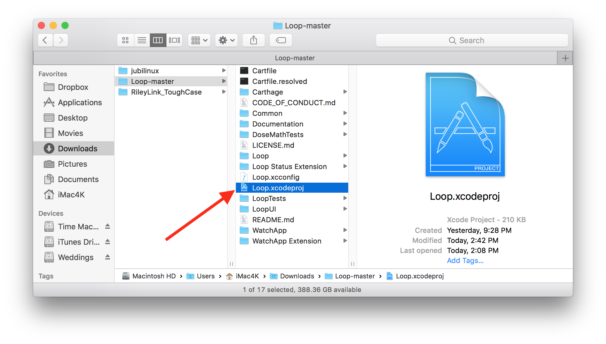
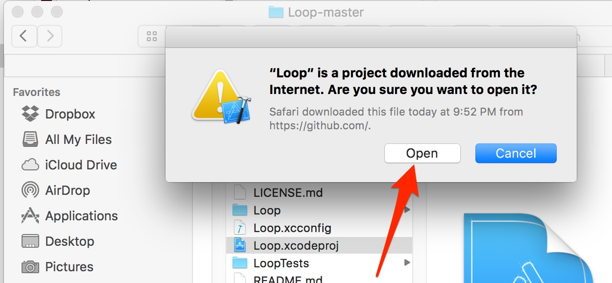
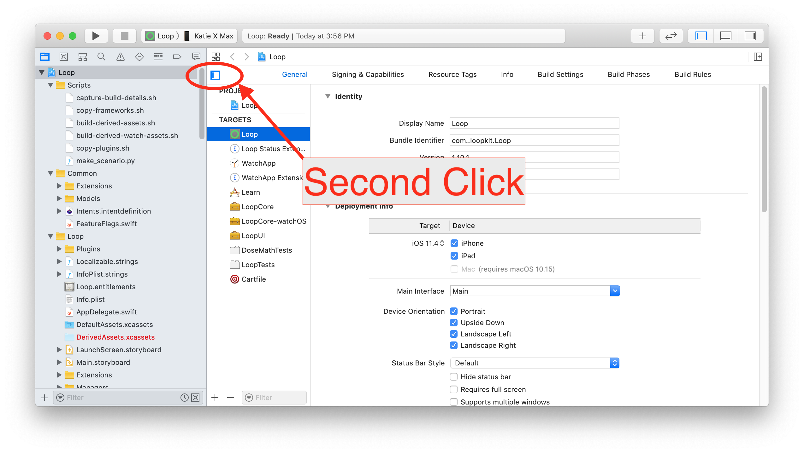
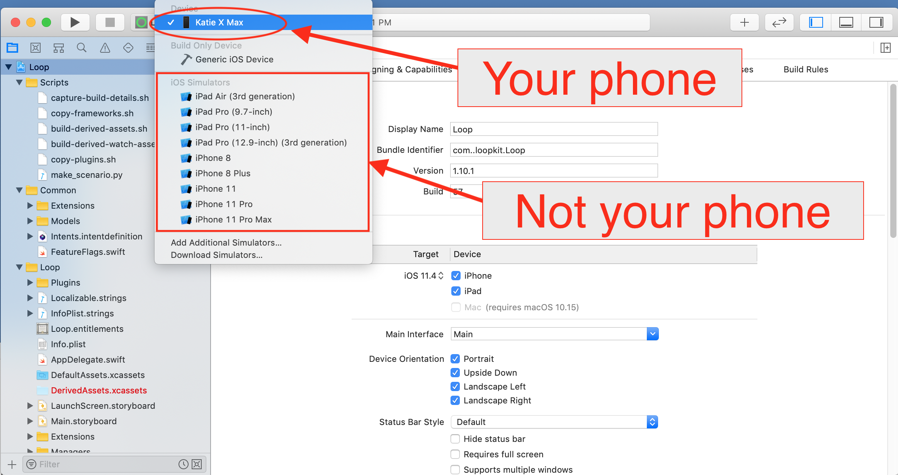
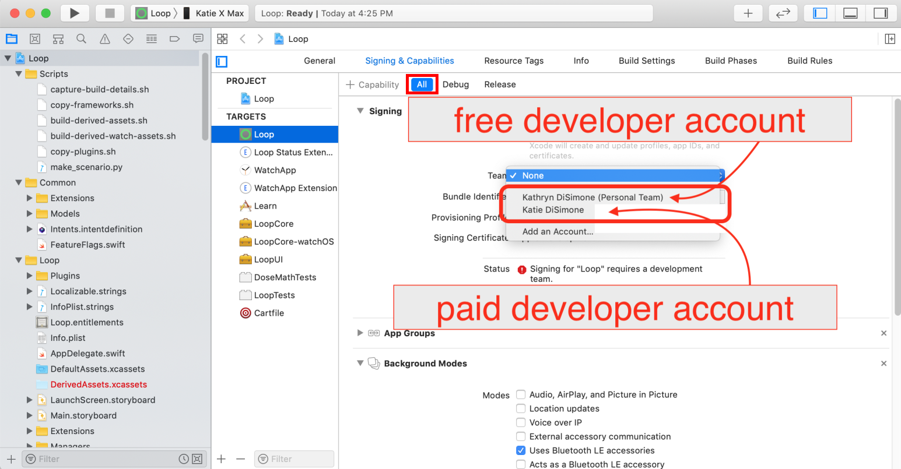
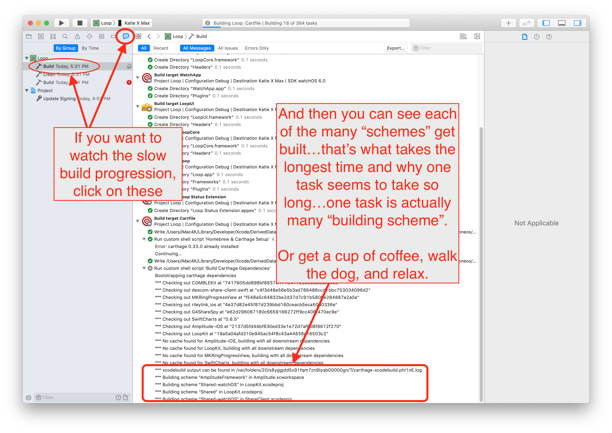
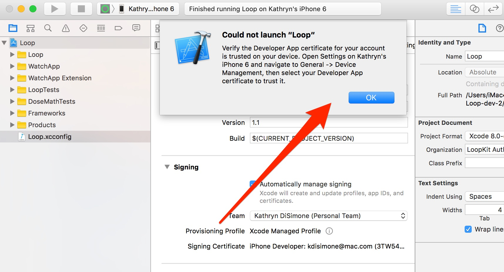

# Step 14: Build Loop App

!!! danger "Time Estimate"
    - 60-80 minutes for first time builders
    - 10-15 minutes for a repeat builders

!!! info "Summary"
    - Open the Loop code you downloaded in [Step 13](step13.md#download-loop)
        - Connect the phone to the computer
        - Trust the computer (on the phone)
        - Select your phone from the top of the device list in Xcode
        - Register the phone (if first time building to phone)
        - Sign the targets
        - Press the build button
        - Enter computer password four times during the build (for first build on computer)
        - Watch in awe as you just built your very own Loop app
    - Open whatever calendar you like to use and insert a reminder
        - The app will expire in 7 days or 1 year
        - Add an alert with enough time before expiration to prepare to rebuild

!!! warning "FAQs"
    - **"I got a build error! YIKES...what do I do?"** Check out the [Build Errors](build_errors.md) page for solutions.
    - **"The build seems to take a long time; is that normal?"** Yes, the first build of a new download will take quite a long time. Just be patient, one of the build steps may take *much* longer than all the others.

        - The build process always ends with either a "Build Succeeded" or "Build Failed" message; so just wait it out until you see one of those displayed.
        - If you are away from you computer when the build succeeds, you might miss the "Build Succeeded" message, but you will see "Running Loop on <your phone name\>" at the very top of the Xcode window - and the Loop app will be open on your phone.
        - The final step of a successful build is for Xcode to copy the completed build to your iPhone; if your phone is locked, Xcode pops up a message letting you know.  Unlock your phone to continue.

## Open Loop Project in Xcode

Open a Finder window.  Open the Downloads folder. Open your "Loop" code folder.

- Your folder name should be `Loop-master`.

Open your "Loop" code folder and double click on Loop.xcodeproj.

{width="750"}
{align="center"}

A warning will appear asking if you want to "Trust and Open" the "Loop" project downloaded from the internet. Click "Trust and Open" to start the Xcode application. Xcode will get itself organized; this may take a few minutes. Wait for the indexing to complete.

{width="450"}
{align="center"}

Once Xcode has finished indexing, the Loop project's various folders and files will appear in the far left column. We are now going to make three important sets of clicks:

1. First click: At the very top of all the folders and files listed, click on the blue icon next to the word "Loop". This will populate the middle part of the Xcode window with some information.

    {width="550"}
    {align="center"}

2. Second (set of) clicks: Now click on the box in the middle screen to reveal the targets column underneath that box. The four targets we will sign in the upcoming steps are now easily viewable. The four targets are Loop, Loop Status Extension, Watch App, and WatchApp Extension. Select the Loop target, shown in the screenshot below. It will be highlighted in blue to let you know it is selected.

    {width="550"}
    {align="center"}

3. Third Click: With the Loop target selected, click on "Signing & Capabilities" up near the top of the screen. After you click on that, you should see a "Signing" section occupying the bulk of the middle window. If you are missing the "Signing & Capabilities" section and didn't have to click somewhere else to see that part, you are running a much older version of Xcode (Xcode 10 or earlier). Please update [Xcode and possibly macOS](updating.md#step-1-install-macos-and-xcode-updates) now.

{width="550"}
{align="center"}

## Connect Your iPhone to Computer

Connect your iPhone via cable to the computer, select your iPhone from the very top of the drop-down list.  Your **iPhone’s personal name** should be at the top of the list. Don't accidentally select the generic iOS simulators listed below your iPhone's name.  

!!! info "Helpful Tips"

    - If this is the first time your iPhone has been plugged into this computer, you will need to open the iPhone and select "Trust this Computer" before your device will be useable in the menu selection.
    - If this is the first time your watch has been paired to the iPhone, you will need to select "Trust this Computer" on your watch.

!!! danger "Most Common Mistake"

    - The most common mistake in this step is not selecting your actual phone as shown in the second screenshot below. The default list is just a name of general phone models under a subheading called "iOS Simulators"...don't be fooled by those. Your ACTUAL phone will be up above that list of all the various simulator phone models.  You may need to scroll to the top of the list to see it.  Make sure you select your actual phone, not just a simulator phone model.

{width="750"}
{align="center"}

{width="650"}
{align="center"}

## Free Account

!!! danger "Free Developer Account Users: READ ME"

    If you are using a free developer account, you will need to do an extra step before you can successfully sign the targets. As a free developer, you are restricted from building apps that have Siri or push notification capabilities built-in. Loop has both of these capabilities, so you will need to disable them before signing and building your app.

    The push notification capability is used for setting remote overrides; disabling it will not affect other notifications on the Loop phone, e.g., "Loop Failure", "Pump Reservoir Low", etc. Click on the small x next to the Siri and push notification lines located at the bottom of the Signing & Capabilities box. You need to do this in both the Loop and WatchApp Extension targets.

    {width="750"}
    {align="center"}

## Sign the Targets

Once you select your device (your iPhone's name), you are ready to start signing the targets. Start with the Loop target, the first one on the target list.  Under the "Signing" area, ensure that you have "All" selected near the top and then select the dropdown menu where it currently says "none". Choose the team you'd like to sign with. Make sure you keep the "automatically manage signing" box checked in the signing area.

- If you do not have **"All"** selected near the top (indicated by the red box in the graphic below), your targets won't get signed properly.  Make sure you did not accidentally click on **"Debug"** or **"Release"**. (The previous "Free Account" graphic shows **"Debug"** selected - do NOT do that.)
- If you select a team name with (personal team), your app will expire after 7 days and you must disable [Push Notification and Siri](step14.md#free-account) as mentioned above.
- If you select a team name without (personal team), your app will last a full year.  
- If you never signed up for a [Free Developer Account](step9.md#add-apple-id), you will not have a (personal team) showing.

{width="750"}
{align="center"}

Once you choose your signing team, Xcode will automatically generate provisioning profiles and signing certificates.  If this is the first time you are building on this iPhone with this developer account, you may be prompted to register the device.  Simply click on the "Register Device" button to confirm. Note - you **must** be connected to the Internet for this step because your computer needs to communicate with Apple to register that device. (Sharp-eyed users may notice this Xcode screen looks a little different from the one on your Mac - it's from an older version of Xcode and the graphic was not updated because the relevant information refers to registering your phone.  Don't sweat it if your screen looks a little different from some of the graphics.)

{width="750"}
{align="center"}

A successfully signed target will have a provisioning profile and signing certificate similar to the screenshot below.  Click on each of the three remaining targets shown in the red box below, and repeat the signing steps by choosing the same team name as you selected in the first target. The four targets that must be signed prior to building the Loop app are Loop, Loop Status Extension, Watch App, and WatchApp Extension.

{width="750"}
{align="center"}

!!! warning "Advanced Users Only"

    There are more targets which must be signed to build the dev branch - should be obvious in the Xcode window.

    If you read the hint in [Step 13](step13.md#advanced-users-only) and edited the LoopConfigOverride.xcconfig, your targets are already signed.

    - **Repeat: only build the dev branch if you're a developer/advanced user**

## Code Customizations

**New Loop users**: Customizations are not a required part of any Loop build. As you gain experience using your Loop app, you may want to customize some of the features. First time builders are encouraged to build with the standard, default code. You can always update your Loop app to add customizations at a later time, using the same download. Subsequent build time is much faster than the initial build for a given download.

If you want any custom configurations to your Loop or Loop Apple Watch apps, follow the step-by-step instructions on the [Code Customizations](code_customization.md) page prior to pressing the Build button.

When you've finished your customizations, come on back to this section and continue with the rest of the build.

## Pair Your Apple Watch

**New Apple Watch users**: If you have an unopened Apple watch and want to use it with Loop, first pair the watch with the iPhone before continuing to the next steps.  If you get a new watch after building the Loop app, you'll need to redo your Loop build. (Don't worry, it's as easy as pressing play on your saved Loop project.)

**Existing Apple Watch users**: Please update your watchOS prior to building the Loop app.  The current version of Loop requires watchOS 4.1 or newer.

## SAFETY INTERMISSION

STOP STOP STOP ... This intermission is about safety.

Some new users input settings and start using the Loop app without fully understanding the effects of the configuration values. That is a **bad** idea.

!!! warning "DO NOT WING THE SETUP"

    Sorry to shout, but better to get your attention now before a mistake is made.

    - **Continue to use these docs to finish setting up your app after it builds**.
    - **DO NOT ENTER ONE LOOP APP SETTING WITHOUT HAVING THE DOCS OPEN AND FOLLOWING ALONG AT THE SAME TIME.**
    - **The Loop app automatically doses insulin based on your configuration settings and your meal entries.**

The section in these docs called "Set up App" (look for it now at the top of this webpage - it's a menu title) needs to be used to input all the [settings](../operation/overview.md) in your Loop app once it is built. READ ALONG WITH THE DOCS to enter those settings. There are important safety tips and advice in there. And then after you finish setup, you need to read the "Operate" section BEFORE YOU OPERATE LOOP. Don't bolus for a meal, or enter a meal, until you've read through the Operate section.

Please heed this advice about using the setup and operate sections. People have ignored this advice and gotten themselves, or their child, into a dangerous situation by entering incorrect settings and going straight to Closed Loop before understanding how Loop operates. They skim and think that's good enough. You should not skim where your health, or your child's health, is concerned.  you should read these documents carefully and UNDERSTAND them before you proceed.

There is a lot of information. The two most important warnings are highlighted here.

!!! warning "TOP TWO SAFETY MISTAKES YOU SHOULD AVOID"
    1. Do not enter settings if you are unsure of the correct value or what the setting means. Don't just guess an ISF, carb ratio, basal rate, suspend threshold or delivery limits. If you don't know your settings or know what the terms mean, stop and try one of these steps:

        - [Search](../index.md#how-to-use-these-docs) the docs for the term: all the settings terms are defined in the docs.
        - Ask your endo if you don't have established values for those settings.
        - Still confused - this is a time to post on a [Loop Social Media](../index.md#stay-in-the-loop) site rather than guess.

            Example post: "I've read the docs but I'm still confused about xxx".  You may get a link back to a specific section of one page.  Read that section first. If that doesn't clarify things, then reply in that same post with what confuses you.

            Please - pick one site; work with one mentor; do not post in multiple places at once.  

    2. Once carb entries are saved using the [Carb Entry to Meal Bolus Menus](../operation/features/carbs.md) or the [Edit Carbohydrates Menu](../operation/features/carbs.md#edit-meals), Loop will provide increased insulin to handle that entry while in closed loop. If your settings are wrong, the amount of insulin will be wrong.

          - The Loop app is an automated insulin delivery system and if it thinks you have carbs on board, it will try to give you appropriate insulin for those carbs.
          - **You must delete or edit a saved carb entry if you no longer want Loop to provide insulin for it.**
          - The [Apple Health Permissions](health.md#loop-permissions) should be configured so that Loop can write carbohydrates (report to other apps), but Loop should **NOT** have permission to read carbohydrates. This prevents inadvertent entries from other apps or by a mistaken manual entry, e.g., entering a  Blood Glucose entry in the carbohydrate section of Apple Health.

Now that the safety intermission is done, you can continue on with the last step in building your app.

## Build Loop

Have you signed the four targets? Are you done with any customizations? Has your Apple watch been paired and updated? Is your iPhone unlocked and plugged into the computer?

Let’s finish the installation of the Loop app onto your iPhone. Double-check to make sure your iPhone's name is still selected and then press the “Build” button to start Xcode on its way.

!!! info "Helpful Tips"

    - The final step of a successful build is for Xcode to copy the completed build to your iPhone; if your phone is locked, Xcode pops up a message letting you know.  Unlock your phone to continue.

{width="750"}
{align="center"}

You’ll see the progression of the build in the status window (top middle of Xcode). New builds can take 40-60 minutes, depending on the speed of the computer and the internet.  **Just be patient.**  The progress will get stay on one step/task for a very long time, and then the others will fly by. Not every step is equal in duration. Do not give up on the build.

**Xcode will ALWAYS tell you eventually that the build either succeeded or failed via a short (self-disappearing) pop-up message on the computer display. If you miss the message, you can look at the top of the Xcode window to see a "Running Loop..." (success) or "Build Failed" (failure) message where the step progress was previously counting down.**

!!! danger "Are you the impatient type?"

    If you just simply can't bear the uncertainty of not seeing that things are progressing, you can take a peek "under the hood" and watch the individual build steps by clicking on the Report Navigator icon and then the build row at the top of the list. You can watch the slow list of scheme building while you wait.

    {width="650"}
    {align="center"}

!!! info "First Time Builder or First Time on this Computer"

    Sometime during your first build on a computer, be ready for a codesign/keychain access prompt that you will see part-way through the build process.

    {width="350"}
    {align="center"}

    When you see this prompt, shown above, enter your computer password (the one you use to log in) and then select "Always Allow". It is normal for this prompt to come up four times in a row even after you enter the correct password. In frustration, people think the prompt must be broken because it keeps reappearing and then people will press deny or cancel. **Don't press deny.** Keep entering your computer password and pressing the "Always Allow" button as many times as it takes (four times to be exact; one for each target in Xcode). After four times of successful password entry, the build will continue.

!!! warning "While you are waiting..."

    While you are waiting for the build to complete, check out two pages:

    - [Red Loop Troubleshooting](../troubleshooting/yellow-red-loop.md)
    - And if you plan to use an Omnipod: [Pod Pairing Toubleshooting](../troubleshooting/pod-pairing.md)

    Ok, back to the building instructions.

## Build Finished

!!! info "First Time Building on a New Device?"

    If this is the first time you have installed an app on your iPhone using your developer account, you may get a warning like the one shown below after a successful build. Don't worry, Loop usually installed just fine on the phone but needs you to do an extra step on the phone before the Loop app can open. Just follow the directions shown in the warning for what you need to do on your iPhone. Go to Settings->General->Device Management (or profiles, Profiles & Device Management on newer iOS) and enable trust for your Developer Account. If you are missing the Device Management/Profiles option in your iPhone settings, then head over to [this Build Error section](build_errors.md#device-management-could-not-launch-loop) to find the solution.

    {width="750"}
    {align="center"}

## Build Succeeded

!!! danger ""

    Congrats! If the build is successful, you'll see the message "Running Loop..." across the top of the Xcode window. Pick up your phone and look at it.

    You can unplug your phone from the computer now. You will get an Xcode message window that says "Lost connection to the debugger on <your phone name\>".  Just click OK.

    Your brand new Loop app will automatically open a screen asking you to allow Loop to send you notifications. The Health app permissions screen will be visible in the background, but you must answer the Notification request first. Click `Allow` to enable Loop to send you notifications.

    Now the Health permissions screen is active. Click on the `Turn All Categories On` line and then **immediately turn OFF the permission to read Carbohydrates**. The end result is that Health should have permission to read and write Blood Glucose and Insulin Delivery; permission to write Carbohydrates ([NOT read carbs](health.md#loop-permissions)); and permission to read Sleep Data. When the permissions are set correctly, i.e., match the image below, click `Allow` in the upper right corner.

    {width="450"}
    {align="center"}

    Next, you will use the [Set up App](../operation/overview.md) section of this website to keep proceeding safely.

!!! warning "FAQ: But what about those yellow alerts that remain in Xcode? Should I worry about them?"

    If you see yellow alerts after your build is done...those are not an issue. Whether your build succeeded or failed...the yellow warnings play no role in either outcome. Don't try to resolve them or fret about them. They mean nothing to the successful use of your Loop app.

    {width="750"}
    {align="center"}

## Build Failed

If you get a message that your build failed and see **RED ERROR** messages, go to the [Build Errors](build_errors.md) page to find the steps to fix your build error. Most build errors are covered on that page along with instructions on how to fix them and how to ask for help.

Once you've resolved the issue and start the build process again, Xcode will continue to show a red circle on the top line from the previous failure.  Don't worry about it.  As long as the steps of the build are showing across the top line, Xcode is still working on the build.  When the build succeeds, the red circle will disappear.

{width="750"}
{align="center"}

## Summary

If your build failed, you need to proceed to the [Build Errors](build_errors.md) page to find the solution. Please go there first to find the help you need.

If your build was successful but your phone was locked, you will see an Xcode message window that says "Unlock <your phone name\> to Continue". Simply unlock your phone and the app will be copied onto your phone and automatically open.

If there were no build errors, you're done building your Loop app.

If your phone is still plugged into you computer, you can unplug it. You will get an Xcode message window that says "Lost connection to the debugger on <your phone name\>".  Just click OK.

The next step is the begin the [Set up App](../operation/overview.md) process.

## Next Steps

!!! danger "Add a Calendar Reminder"

    - It is good practice to add a reminder to your calendar when the app will expire (7 days or 1 year).
    - Be sure to add an alert to that reminder so you have enough time to do all the [Loop Updating](updating.md) steps to build the app again before it expires

Go to the [Set up App](../operation/overview.md) menu to configure your Loop and follow that up with the first [Operate](../operation/features/carbs.md) page and work those pages as you learn to run Loop safely.
