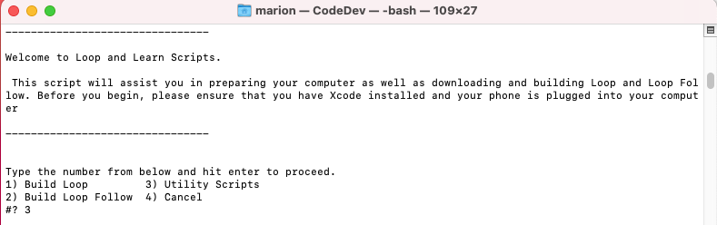
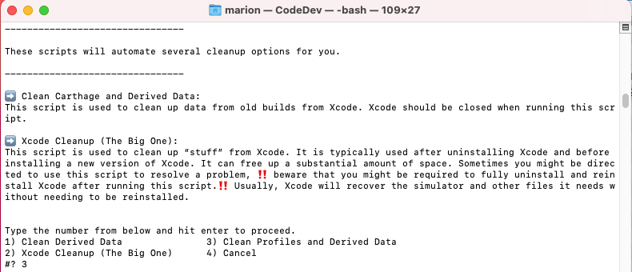
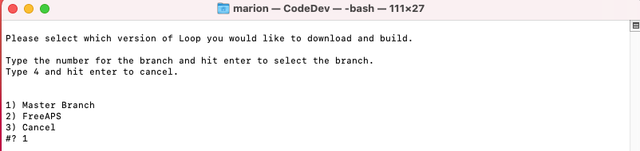
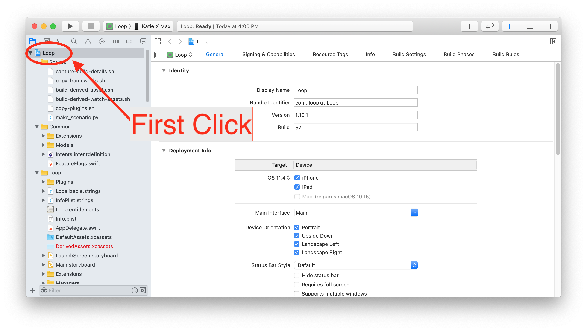
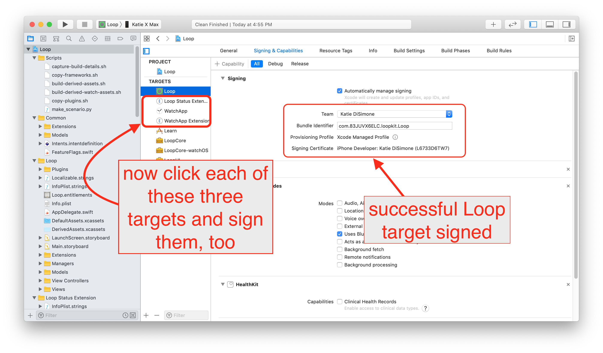

# Step 14: Build Loop App

!!! danger "Time Estimate"
    - 60-80 minutes for first time builders
    - 10-15 minutes for a repeat builders

!!! info "Summary"
    - You should have read the Build-Select Instructions in Step 13
    - **First Time:** steps are needed if first time with this phone or this computer
    - It is now time to execute those Instructions
        - [Run Build Select Script](https://www.loopandlearn.org/build-select/#use-script)
        - Xcode opens when done
        - Connect the phone to the computer
        - **First Time:** Trust the computer
        - Select Loop(Workspace) and your phone at top of Xcode
        - **First Time:** Register the phone
        - Sign the targets
        - Press the build button
            - **First Time:** Enter computer password four times during the build
            - Watch in awe as you just built your very own Loop app
    - Open whatever calendar you like to use and insert a reminder
        - The app will expire in 7 days or 1 year
        - Add an alert with enough time before expiration to prepare to rebuild

!!! warning "FAQs"
    - **"The build seems to take a long time; is that normal?"** Yes. The good news is the Workspace build is much faster than the old method.  It is not unusual for one of the build steps to take *much* longer than all the others.
        - The build process always ends with either a "Build Succeeded" or "Build Failed" message; so just wait it out until you see one of those displayed.
        - If you are away from you computer when the build succeeds, you might miss the "Build Succeeded" message, but you will see "Running Loop on <your phone name\>" at the very top of the Xcode window - and the Loop app will be open on your phone.
        - The final step of a successful build is for Xcode to copy the completed build to your iPhone; if your phone is locked, Xcode pops up a message letting you know.  Unlock your phone to continue.
        - Ingore the yellow warnings - do not try to "fix" them
    - **"I got a build error! YIKES...what do I do?"** Check out the [Build Errors](build_errors.md) page for solutions.

## Execute the Build Select Script

At this point, you should have reviewed the entire [Build Select Script](https://www.loopandlearn.org/build-select/) page - if not, do it now.

The Build Select script will be executed two times.  The summary is given here with helper graphics below.  The summary includes links so you can click on the link then hit the back button on your browser to return to the list.

1. Open a [terminal](#open-terminal) on your Computer
1. Open [Execute the Script](https://www.loopandlearn.org/build-select/#use-script)
1. First time through:
    - Hit the copy button on the page and paste the saved buffer into your terminal, hit return
    - Acknowledge the Warning by typing 1 and return
    - Select Utility Scripts by typing 3 and return
    - Select Clean Profiles and Derived Data by typing 3 and return
1. Second time through:
    - You can up-arrow and hit return, or paste the saved buffer again, hit return
    - Acknowledge the Warning by typing 1 and return
    - Select Build Loop by typing 1 and return
    - Select Master Branch by typing 1 and return
    - The download of all code needed to build Loop will now happen (see example graphics below)
1. Review the text on your screen - if any errors are reported, try one more time then ask for help
1. Type 1 and hit return to continue to the build

Xcode will open automatically.

Your browser will open automatically in front of Xcode and display the same graphic shown below.

Rearrange so you can see the graphic and the Xcode screen and follow the directions.

### Open Terminal

Go to the Finder app, click on Applications, then open the Utilities folder.  Locate the Terminal app and double-click Terminal to open a terminal window. (Folks with M1 computer, make sure you [configured the terminal app for rosetta](step7.md#configure-terminal-app-for-rosetta-on-m1-computer) first.) The terminal window is very plain looking when you open it. That is normal.

## Clean Up

The clean up steps are always a good idea.  If you've never built Loop, this will take almost no time and you get in the habit of doing it. If you've ever build Loop, you should take the steps to prevent build problems later.

### Load the Paste Buffer

You will load the paste buffer by clicking on this [link](https://www.loopandlearn.org/build-select/#use-script) and hitting the "Copy" button to the right of step 2. The button that says "Copy" will change to "Copied" once you click it.

Then paste the text into the terminal window; it should look like the next graphic.

{width="750"}
{align="center"}

You must type 1 and hit return in the terminal window to agree that you understand the warning.

Next you will select the Utility Scripts option by typing 3 and return.

{width="750"}
{align="center"}

Next you will select the Clean Profiles and Derived Data option by typing 3 and return.

{width="750"}
{align="center"}

Once this completes, you should see this in your terminal.  

{width="750"}
{align="center"}

If instead, you saw something like:

`rm: /Users/marion/Library/Developer/Xcode/DerivedData: Directory not empty`

Please quit out of Xcode and repeat the steps for [Clean-Up](#clean-up)

## Download and Build

At this point you can hit the up-arrow key to bring the script command into view and hit return to start it - or repeat the copy paste steps from above. This time, you wil make selections to download the Loop code. After you start the script and accept the warning, type 1 and hit return to Build Loop.

{width="750"}
{align="center"}

Next you are asked which version of Loop you would like to build. Type 1 and hit return to build the Master Branch.

{width="750"}
{align="center"}

This download can take from 3 minutes to 30 minutes depending on your download speed.  You can leave the room and return later to check on progress.  The download starts out with the "enumeration" of all the submodules that will be downloaded. This is followed by a cloning step for each submodule. The cloning for the first module is included in the first graphic.

{width="750"}
{align="center"}

The final submodule cloning is shown along with the summary of all the Submodule paths in the next graphic.

{width="750"}
{align="center"}

If any errors are shown in your terminal window, you need to read the error.  You can try the script one more time.  But if you continue to get errors (bad internet connection or not enough room), you should reach out for help at your favorite [Loop Social Media](../index.md#stay-in-the-loop) site.

As soon as the script completes and you type 1 to Continue, Xcode will automatically open for the Workspace you just downloaded and a graphic showing the steps an experienced builder needs to follow will be presented.

Xcode will open automatically.

Your browser will open automatically in front of Xcode and display the same graphic shown below.

Rearrange so you can see the graphic and the Xcode screen and follow the directions.

TODO - finish updating graphics.

Once Xcode has finished indexing, the Loop project's various folders and files will appear in the far left column. We are now going to make three important sets of clicks:

1. First click: At the very top of all the folders and files listed, click on the blue icon next to the word "Loop". This will populate the middle part of the Xcode window with some information.

    {width="550"}
    {align="center"}

2. TODO - not needed for Xcode 13.  Is it needed for Xcode 12?   Change this to Select Loop (Workspace) at top. Second (set of) clicks: Now click on the box in the middle screen to reveal the targets column underneath that box. The four targets we will sign in the upcoming steps are now easily viewable. The four targets are Loop, Loop Status Extension, Watch App, and WatchApp Extension. Select the Loop target, shown in the screenshot below. It will be highlighted in blue to let you know it is selected.

    {width="550"}
    {align="center"}

3. Third Click: With the Loop target selected, click on "Signing & Capabilities" up near the top of the screen. After you click on that, you should see a "Signing" section occupying the bulk of the middle window.

{width="550"}
{align="center"}

## Connect Your iPhone to Computer

Make sure your phone is unlocked.

Connect your iPhone via cable to the computer, select your iPhone from the very top of the drop-down list.  Your **iPhone’s personal name** should be at the top of the list. Don't accidentally select the generic iOS simulators listed below your iPhone's name.  

!!! info "Helpful Tips"

    - If this is the first time your iPhone has been plugged into this computer, you will need to open the iPhone and select "Trust this Computer" before your device will be useable in the menu selection.
    - If this is the first time your watch has been paired to the iPhone, you will need to select "Trust this Computer" on your watch.

!!! danger "Most Common Mistake"

    - The most common mistake in this step is:
        - not selecting LoopWorkspace and/or
        - not selecting your actual phone as shown in the second screenshot below
    - The default list is just a name of general phone models under a subheading called "iOS Simulators"...don't be fooled by those. Your ACTUAL phone will be up above that list of all the various simulator phone models.  You may need to scroll to the top of the list to see it.  Make sure you select your actual phone, not just a simulator phone model.

{width="750"}
{align="center"}

{width="650"}
{align="center"}

## Free Account

!!! danger "Free Developer Account Users: READ ME"

    If you are using a free developer account, you will need to do an extra step before you can successfully sign the targets. As a free developer, you are restricted from building apps that have Siri or push notification capabilities built-in. Loop has both of these capabilities, so you will need to disable them before signing and building your app.

    The push notification capability is used for setting remote overrides; disabling it will not affect other notifications on the Loop phone, e.g., "Loop Failure", "Pump Reservoir Low", etc. Click on the small x next to the Siri and push notification lines located at the bottom of the Signing & Capabilities box. You need to do this in both the Loop and WatchApp Extension targets.

    {width="750"}
    {align="center"}

## Sign the Targets

Once you select your device (your iPhone's name), you are ready to start signing the targets. Start with the Loop target, the first one on the target list.  Under the "Signing" area, ensure that you have "All" selected near the top and then select the dropdown menu where it currently says "none". Choose the team you'd like to sign with. Make sure you keep the "automatically manage signing" box checked in the signing area.

- If you do not have **"All"** selected near the top (indicated by the red box in the graphic below), your targets won't get signed properly.  Make sure you did not accidentally click on **"Debug"** or **"Release"**. (The previous "Free Account" graphic shows **"Debug"** selected - do NOT do that.)
- If you select a team name with (personal team), your app will expire after 7 days and you must disable [Push Notification and Siri](step14.md#free-account) as mentioned above.
- If you select a team name without (personal team), your app will last a full year.  
- If you never signed up for a [Free Developer Account](step9.md#add-apple-id), you will not have a (personal team) showing.

{width="750"}
{align="center"}

Once you choose your signing team, Xcode will automatically generate provisioning profiles and signing certificates.  If this is the first time you are building on this iPhone with this developer account, you may be prompted to register the device.  Simply click on the "Register Device" button to confirm. Note - you **must** be connected to the Internet for this step because your computer needs to communicate with Apple to register that device. (Sharp-eyed users may notice this Xcode screen looks a little different from the one on your Mac - it's from an older version of Xcode and the graphic was not updated because the relevant information refers to registering your phone.  Don't sweat it if your screen looks a little different from some of the graphics.)

{width="750"}
{align="center"}

A successfully signed target will have a provisioning profile and signing certificate similar to the screenshot below.  Click on each of the three remaining targets shown in the red box below, and repeat the signing steps by choosing the same team name as you selected in the first target. The four targets that must be signed prior to building the Loop app are Loop, Loop Status Extension, Watch App, and WatchApp Extension.

{width="750"}
{align="center"}

!!! warning "Advanced Users Only"

    There are more targets which must be signed to build the dev branch - should be obvious in the Xcode window.

    If you read the hint in [Step 13](step13.md#advanced-users-only) and edited the LoopConfigOverride.xcconfig, your targets are already signed.

    - **Repeat: only build the dev branch if you're a developer/advanced user**

## Code Customizations

**New Loop users**: Customizations are not a required part of any Loop build. As you gain experience using your Loop app, you may want to customize some of the features. First time builders are encouraged to build with the standard, default code. You can always update your Loop app to add customizations at a later time, using the same download. Subsequent build time is much faster than the initial build for a given download.

If you want any custom configurations to your Loop or Loop Apple Watch apps, follow the step-by-step instructions on the [Code Customizations](code_customization.md) page prior to pressing the Build button.

When you've finished your customizations, come on back to this section and continue with the rest of the build.

## Pair Your Apple Watch

**New Apple Watch users**: If you have an unopened Apple watch and want to use it with Loop, first pair the watch with the iPhone before continuing to the next steps.  If you get a new watch after building the Loop app, you'll need to redo your Loop build. (Don't worry, it's as easy as pressing play on your saved Loop project.)

**Existing Apple Watch users**: Please update your watchOS prior to building the Loop app.  The current version of Loop requires watchOS 4.1 or newer.

## Build Loop

Confirm that you are ready to build Loop:

* Have you signed the four targets?
* Are you done with any customizations?
* Has your Apple watch been paired and updated?
* Is your iPhone unlocked and plugged into the computer?
* Have you selected Loop(Workspace)?
* Have you selected your phone and not a simulator?

It is time to press the “Build” (Play) button to start Xcode on its way.

!!! info "Helpful Tips"

    - The final step of a successful build is for Xcode to copy the completed build to your iPhone; if your phone is locked, Xcode pops up a message letting you know.  Unlock your phone to continue.

{width="750"}
{align="center"}

You’ll see the progression of the build in the status window (top middle of Xcode). New builds can take 5-30 minutes, depending on the speed of the computer.  **Just be patient.**  The progress will get stay on one step/task for a very long time, and then the others will fly by. Not every step is equal in duration. Do not give up on the build.

**Xcode will ALWAYS tell you eventually that the build either succeeded or failed via a short (self-disappearing) pop-up message on the computer display. If you miss the message, you can look at the top of the Xcode window to see a "Running Loop..." (success) or "Build Failed" (failure) message where the step progress was previously counting down.**

## Codesign / Keychain Access

!!! info "First Time Builder or First Time on this Computer"

    Sometime during your first build on a computer, be ready for a codesign/keychain access prompt that you will see part-way through the build process.

    Enter the same password you use to log in to the mac, select always allow and then do it again next time you are asked - once for each target you just signed above.

    {width="350"}
    {align="center"}

    It is normal for this prompt to come up four times in a row even after you enter the correct password. In frustration, people think the prompt must be broken because it keeps reappearing and then people will press deny or cancel. **Don't press deny.** Keep entering your computer password and pressing the "Always Allow" button as many times as it takes (four times to be exact; one for each target in Xcode). After four times of successful password entry, the build will continue.

## Build Finished

!!! info "First Time Building on a New Device?"

    If this is the first time you have installed an app on your iPhone using your developer account, you may get a warning like the one shown below after a successful build. Don't worry, Loop usually installed just fine on the phone but needs you to do an extra step on the phone before the Loop app can open. Just follow the directions shown in the warning for what you need to do on your iPhone. Go to Settings->General->Device Management (or profiles, Profiles & Device Management on newer iOS) and enable trust for your Developer Account. If you are missing the Device Management/Profiles option in your iPhone settings, then head over to [this Build Error section](build_errors.md#device-management-could-not-launch-loop) to find the solution.

    {width="750"}
    {align="center"}

## Build Succeeded

!!! danger ""

    Congrats! If the build is successful, you'll see the message "Running Loop..." across the top of the Xcode window. Pick up your phone and look at it.

    You can unplug your phone from the computer now. You will get an Xcode message window that says "Lost connection to the debugger on <your phone name\>".  Just click OK.

    Your brand new Loop app will automatically open a screen asking you to allow Loop to send you notifications. The Health app permissions screen will be visible in the background, but you must answer the Notification request first. Click `Allow` to enable Loop to send you notifications.

    Now the Health permissions screen is active. Click on the `Turn All Categories On` line and then **immediately turn OFF the permission to read Carbohydrates**. The end result is that Health should have permission to read and write Blood Glucose and Insulin Delivery; permission to write Carbohydrates ([NOT read carbs](health.md#loop-permissions)); and permission to read Sleep Data. When the permissions are set correctly, i.e., match the image below, click `Allow` in the upper right corner.

    {width="450"}
    {align="center"}

    Next, you will use the [Set up App](../operation/overview.md) section of this website to keep proceeding safely.

!!! warning "FAQ: But what about those yellow alerts that remain in Xcode? Should I worry about them?"

    If you see yellow alerts after your build is done...those are not an issue. Whether your build succeeded or failed...the yellow warnings play no role in either outcome. Don't try to resolve them or fret about them. They mean nothing to the successful use of your Loop app.

    {width="750"}
    {align="center"}

## Build Failed

If you get a message that your build failed and see **RED ERROR** messages, go to the [Build Errors](build_errors.md) page to find the steps to fix your build error. Most build errors are covered on that page along with instructions on how to fix them and how to ask for help.

Once you've resolved the issue and start the build process again, Xcode will continue to show a red circle on the top line from the previous failure.  Don't worry about it.  As long as the steps of the build are showing across the top line, Xcode is still working on the build.  When the build succeeds, the red circle will disappear.

{width="750"}
{align="center"}

## Summary

If your build failed, you need to proceed to the [Build Errors](build_errors.md) page to find the solution. Please go there first to find the help you need.

If your build was successful but your phone was locked, you will see an Xcode message window that says "Unlock <your phone name\> to Continue". Simply unlock your phone and the app will be copied onto your phone and automatically open.

If there were no build errors, you're done building your Loop app.

If your phone is still plugged into you computer, you can unplug it. You will get an Xcode message window that says "Lost connection to the debugger on <your phone name\>".  Just click OK.

The next step is the begin the [Set up App](../operation/overview.md) process.

## Next Steps

!!! danger "Add a Calendar Reminder"

    - It is good practice to add a reminder to your calendar when the app will expire (7 days or 1 year).
    - Be sure to add an alert to that reminder so you have enough time to do all the [Loop Updating](updating.md) steps to build the app again before it expires

Go to the [Set up App](../operation/overview.md) menu to configure your Loop and follow that up with the first [Operate](../operation/features/carbs.md) page and work those pages as you learn to run Loop safely.
