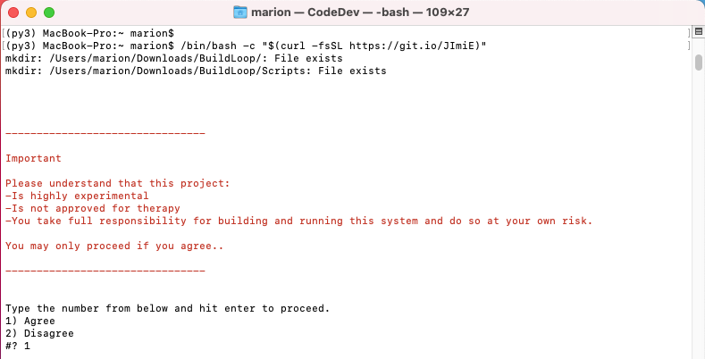
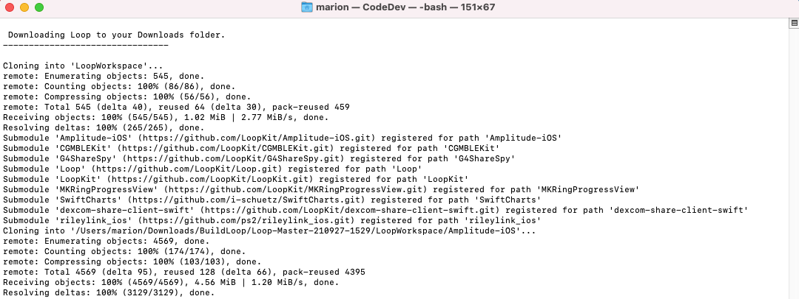
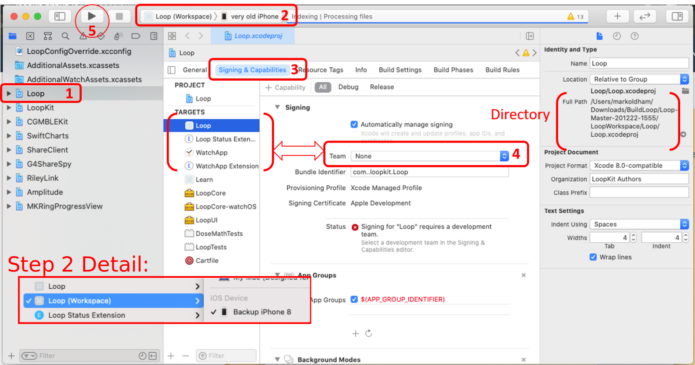
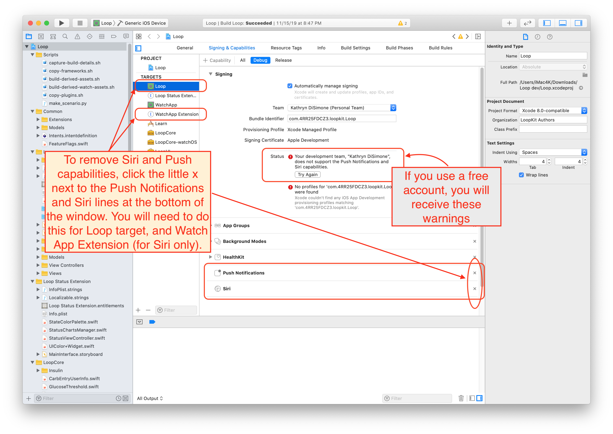

# Step 14: Build Loop App

!!! info "Time Estimate"
    - 60-80 minutes for first time builders
    - 10-15 minutes for a repeat builders

!!! abstract "Summary"
    - First Time Builders - if you have not completed [all the build steps](overview.md), do them now and then return
    - Repeat Builders - please start with the [Updating page](updating.md), then return
    - Some steps are needed only for **First Time** with this phone or this computer
    - It is now time to build your app
        - Open terminal and copy/paste commands into it
        - Connect the phone to the computer
        - **First Time:** Trust the computer
        - Select Loop (Workspace) and your phone at top of Xcode
        - **First Time:** Register the phone
        - Sign the targets
            - Then click on a specific location with your mouse
            - This is new with Xcode 13 - avoids an annoying build error
        - Press the build button
            - **First Time:** [Enter computer password four times](#codesign-keychain-access) during the build
            - Watch in awe as you just built your very own Loop app
    - Open whatever calendar you like to use and insert a reminder
        - The app will expire in 7 days or 1 year
        - Add an alert with enough time before expiration to prepare to rebuild

!!! question "FAQs"
    - **"The download seems to take a long time; is that normal?"** Yes. The download of the Loop submodule takes the longest. Having a good internet connection is important. (The word submodule gets discussed later.)
    - **"The build seems to take a long time; is that normal?"** Yes. The good news is the Workspace build is much faster than the old method.  It is not unusual for one of the build steps to take *much* longer than all the others.
        - The build process always ends with either a "Build Succeeded" or "Build Failed" message; so just wait it out until you see one of those displayed.
        - If you are away from you computer when the build succeeds, you might miss the "Build Succeeded" message, but you will see "Running Loop on <your phone name\>" at the very top of the Xcode window - and the Loop app will be open on your phone.
        - The final step of a successful build is for Xcode to copy the completed build to your iPhone; if your phone is locked, Xcode pops up a message letting you know.  Unlock your phone to continue.
        - Ingore the yellow warnings - do not try to "fix" them
    - **"I got a build error! YIKES...what do I do?"** Check out the [Build Errors](build_errors.md) page for solutions.

## Execute the Build Select Script

There is a page on the Loop and Learn site for using the [Build Select Script](https://www.loopandlearn.org/build-select/).  If you prefer, you can go to that site and follow those (somewhat briefer) instructions. The use of the build-select script has been incorporated into LoopDocs now, so you don't need to jump between sites - it is your choice.


### Open Terminal

Go to the Finder app, click on Applications, then open the Utilities folder.  Locate the Terminal app and double-click Terminal to open a terminal window. (Folks with M1 computer, make sure you [configured the terminal app for rosetta](step1.md#configure-terminal-app-for-rosetta-on-m1-computer) first. This only has to be done one time.) The terminal window is very plain looking when you open it. That is normal.

## Download and Prepare to Build

There is a copy button located by hovering on the right-hand side of each labeled block of text below.  Click on it, all the words in the block are copied into your paste buffer, and then you can paste those words into the terminal.

* This script has been recently updated with much clearer instructions.  
* Please read what is on the screen as you progress.
* Adjust font size as directed if you have difficulty seeing the directions.

!!! success "Video using Build-Select"

    If you prefer to watch a video of building with this step-by-step method, here's the link to the [YouTube video](https://youtu.be/gddhljzsNkM) prepared by the Loop and Learn team.

### Step-by-Step

These instructions show each step needed to build Loop using the Build-Select script.

There is a copy button located by hovering on the right-hand side of a labeled block of text below.  Click on it, all the words in the block are copied into your paste buffer, and then you can paste those words into the terminal. Then read the instructions and follow them.

```title="Copy and Paste to start the Build-Select script"
/bin/bash -c "$(curl -fsSL https://raw.githubusercontent.com/loopnlearn/LoopBuildScripts/main/BuildLoop.sh)"
```

!!! note ""
    If you've built using the build-select script before and think the command looks a little different, you are correct.  Copy and paste the command as shown.  This uses a more explicit path to the script.

{width="750"}
{align="center"}

You must type 1 (as shown in the graphic above) and hit the ENTER key to indicate you understand the warning.

Next you will see an introduction to the Build-Select script.  Please read this.  To build Loop, you will select the Build Loop option by typing 1 (as shown in the graphic below) and hitting the ENTER key.

{width="750"}
{align="center"}

Next you are asked which version of Loop you would like to build. Type 1 and hit the ENTER key to build the Master Branch (as shown in the graphic below) or 2 for the FreeAPS fork of Loop.

{width="750"}
{align="center"}

!!! warning "If you see errors like these . . ."

    * `xcrun: error: invalid active developer path (/Library/Developer/CommandLineTools), missing xcrun at: /Library/Developer/CommandLineTools/usr/bin/xcrun`
    * `xcode-select: Failed to locate 'git', requesting installation of command line developer tools`
    * `xcode-select: error: tool 'xed' requires Xcode`
    * You missed one of these steps:
        * [Build Step 8: Install Xcode](step8.md)
        * [Build Step 9: Xcode command line tools](step9.md)


This download can take from 3 minutes to 30 minutes depending on your download speed.  You can leave the room and return later to check on progress. You do not need to understand the definitions for enumeration or submodule or cloning.  You only need to review the display to look for any errors after the download is finished. The download starts out with the enumeration of all the submodules that will be downloaded. This is followed by a cloning step for each submodule. The cloning for the first module is included in the first graphic.

{width="750"}
{align="center"}

The final submodule cloning is shown along with the summary of all the submodule paths in the next graphic.

{width="750"}
{align="center"}

If any errors are shown in your terminal window, you need to read the error and hit any key (other than 1) ENTER to cancel.  You can try the script one more time.  But if you continue to get errors (bad internet connection or not enough room), you should reach out for help at your favorite [Loop Social Media](../index.md#finding-help) site.


### Review Download for Errors

Assuming there are no errors, then type 1, ENTER to Continue.

* Your browser will open a page that displays the same graphic shown below along with summary build instructions
* Xcode will open automatically
* Rearrange screens so you can see the graphic and Xcode and follow the directions

{width="750"}
{align="center"}


## Wait for Xcode to Start Indexing

There is a new step to the signing procedure.  Please read this section.

When you look at the graphic below, you'll notice a message at the top that says "Indexing". Please wait for the indexing to start in your Xcode before trying to build. 

!!! info "Looking Ahead"
    
    Versions of Loop in the future, e.g., what is currently Loop-dev and FreeAPS-dev, will need to download some packages.  Those dev branches sometimes require the builder to execute the [Cycle Dependency fix](build_errors.md#cycle-dependency) before indexing can begin. (It's easy, just be aware.)

{width="750"}
{align="center"}

The graphic above is coordinated with the numbers in the list below. If you are a new builder, you probably want to click on each link in the steps to read the details (and then click the back button in your browser when done). An experienced builder can use this list as a reminder.

!!! warning "New Step for Xcode 13"

    There is a new step highlighted in red and green labeled 4.5.  Be sure to click on the Loop icon under the `PROJECT` heading BEFORE hitting build.  Otherwise - you may get an "Entitlements" Build Error for either Loop or WatchApp and will need this procedure [Entitlements Error](build_errors.md#entitlements-error).

1. At the very top of all the folders and files listed on the left side, click on the blue icon next to the word "Loop". You might need to click a second time to highlight the Loop folder. This will populate the middle part of the Xcode window.
1. [Plug in your phone](#connect-your-iphone-to-computer) - make sure it is unlocked.  If this is the **First Time** for your phone or watch, you will need to tell the phone and watch to "Trust this Computer".
    * Select **Loop (Workspace)** from the dropdown at the upper left
        - Examine the Step 2 Detail in the graphic above
        - The selection when Xcode opens is Loop
        - You need to change the selection to be **Loop (Workspace)**
    * Select your phone (not a simulator of the same model as your phone) - it will be near the top of the dropdown list under the heading iOS Device
    * If you don't see your phone, unplug and plug in again
1. Click on the "Signing & Capabilities" tab near the top of the screen. After you click on that, you should see a "Signing" section occupying the bulk of the middle window matching the graphic above.
1. It is time to Sign the Targets with your [Apple Developer ID](step9.md#add-apple-id)
    * For [Free Account](#free-account) - you must take additional steps before signing
    * For Paid Account - [sign the targets](#sign-the-targets) indicated in the graphic above
    * ONLY sign the 4 targets highlighted in the graphic above
        - If you sign other targets you might generate errors when you build and they do NOT need to be signed
    * Step 4.5 - click on the Loop icon under the `PROJECTS` heading once the 4 targets are signed.
1. You are ready to Build Loop if all the following are completed:
    * You signed the 4 targets
    * You have clicked on the Loop icon under the `PROJECTS` heading
    * Your iPhone is unlocked and plugged into the computer
    * You selected Loop (Workspace)
    * You selected your phone and not a simulator
    * OPTIONAL: your [Apple watch](#pair-your-apple-watch) been paired and updated
    * OPTIONAL: you are done with desired [customizations](#code-customizations)

If you think you are ready, click on the link for [Build Loop](#build-loop) to skip past details of steps already completed. This takes you to the section of this page that walks you through the actual build and, for first time builders, information about when and how to enter passwords.

---

Extra details - there are some extra details for some of the steps summarized above - the links in that list above take you to the appropriate extra details section.

**If you are a first-time builder, please read through all the extra details before you start you build**

Head to [Build Loop](#build-loop) when you are ready to build.

### Connect Your iPhone to Computer

_The graphics in this section have not been updated to show "Loop (Workspace)"._

Make sure your phone is unlocked.

Connect your iPhone via cable to the computer, select your iPhone from the very top of the drop-down list.  Your **iPhone’s personal name** should be at the top of the list. Don't accidentally select the generic iOS simulators listed below your iPhone's name.  

!!! abstract "Helpful Tips"

    - If this is the first time your iPhone has been plugged into this computer, you will need to open the iPhone and select "Trust this Computer" before your device will be useable in the menu selection.
    - If this is the first time your watch has been paired to the iPhone, you will need to select "Trust this Computer" on your watch.

!!! warning "Most Common Mistake"

    - The most common mistake in this step is:
        - not selecting Loop (Workspace) (old graphic; yours must be Workspace)
        - not selecting your actual phone as shown in the second screenshot below
    - The default list is just a name of general phone models under a subheading called "iOS Simulators"...don't be fooled by those. Your ACTUAL phone will be up above that list of all the various simulator phone models.  You may need to scroll to the top of the list to see it.  Make sure you select your actual phone, not just a simulator phone model.

{width="750"}
{align="center"}

{width="650"}
{align="center"}

### Free Account

_The graphics in this section have not been updated to show "Loop (Workspace)"._

_The graphics in this section have not been updated for Xcode 13, which uses the trashcan icon instead of the x for removing capabilities._

_If you are building Loop-dev, review this section and then [Loop-dev with Free Account](step13.md#loop-dev-with-free-account)_

!!! abstract "Free Developer Account Users: READ ME"

    If you are using a free developer account, you will need to do an extra step before you can successfully sign the targets. As a free developer, you are restricted from building apps that have Siri or push notification capabilities built-in. Loop has both of these capabilities, so you will need to disable them before signing and building your app.

    The push notification capability is used for setting remote overrides; disabling it will not affect other notifications on the Loop phone, e.g., "Loop Failure", "Pump Reservoir Low", etc. Click on the small x next to the Siri and push notification lines located at the bottom of the Signing & Capabilities box. You need to do this in both the Loop and WatchApp Extension targets.

    {width="750"}
    {align="center"}


### Sign the Targets

_The graphics in this section have not been updated to show "Loop (Workspace)"._

Once you select your device (your iPhone's name), you are ready to start signing the targets. Start with the Loop target, the first one on the target list.  Under the "Signing" area, ensure that you have "All" selected near the top and then select the dropdown menu where it currently says "none". Choose the team you'd like to sign with. Make sure you keep the "automatically manage signing" box checked in the signing area.

- If you do not have **"All"** selected near the top (indicated by the red box in the graphic below), your targets won't get signed properly.  Make sure you did not accidentally click on **"Debug"** or **"Release"**. (The previous "Free Account" graphic shows **"Debug"** selected - do NOT do that.)
- If you select a team name with (personal team), your app will expire after 7 days and you must disable [Push Notification and Siri](step14.md#free-account) as mentioned above.
- If you select a team name without (personal team), your app will last a full year.  
- If you never signed up for a [Free Developer Account](step9.md#add-apple-id), you will not have a (personal team) showing.

{width="750"}
{align="center"}

Once you choose your signing team, Xcode will automatically generate provisioning profiles and signing certificates.  If this is the first time you are building on this iPhone with this developer account, you may be prompted to register the device.  Simply click on the "Register Device" button to confirm. Note - you **must** be connected to the Internet for this step because your computer needs to communicate with Apple to register that device. (Sharp-eyed users may notice this Xcode screen looks a little different from the one on your Mac - it's from an older version of Xcode and the graphic was not updated because the relevant information refers to registering your phone.  Don't sweat it if your screen looks a little different from some of the graphics.)

{width="750"}
{align="center"}

A successfully signed target will have a provisioning profile and signing certificate similar to the screenshot below.  Click on each of the three remaining targets shown in the red box below, and repeat the signing steps by choosing the same team name as you selected in the first target. The four targets that must be signed prior to building the Loop app are Loop, Loop Status Extension, Watch App, and WatchApp Extension.

{width="750"}
{align="center"}

!!! abstract "Advanced Users Only"

    There are [more targets](step13.md#signing-targets) which must be signed to build the dev branch.

    If you read the hint in [Step 13](step13.md#signing-targets) and edited the LoopConfigOverride.xcconfig, your targets are already signed.

    - **Repeat: only build the dev branch if you're a developer/advanced user**


### Code Customizations

**New Loop users**: Customizations are not a required part of any Loop build. As you gain experience using your Loop app, you may want to customize some of the features. First time builders are encouraged to build with the standard, default code. You can always update your Loop app to add customizations at a later time, using the same download. Subsequent build time is much faster than the initial build for a given download.

If you want any custom configurations to your Loop or Loop Apple Watch apps, follow the step-by-step instructions on the [Code Customizations](code_customization.md) page prior to pressing the Build button.

When you've finished your customizations, come on back to this section and continue with the rest of the build.

### Pair Your Apple Watch

**New Apple Watch users**: If you have an unopened Apple watch and want to use it with Loop, first pair the watch with the iPhone before continuing to the next steps.  If you get a new watch after building the Loop app, you'll need to redo your Loop build. (Don't worry, it's as easy as pressing play on your saved Loop project.)

**Existing Apple Watch users**: Please update your watchOS prior to building the Loop app.  The current version of Loop requires watchOS 4.1 or newer.

## Build Loop

Confirm that you are ready to build Loop:

* Is your iPhone unlocked and plugged into the computer?
* Have you signed the four targets?
* Have you clicked on the Loop icon under the `PROJECTS` heading?
* Have you selected Loop (Workspace)?
* Have you selected your phone and not a simulator?
* Are you done with any customizations?
* Has your Apple watch been paired and updated?

It is time to press the “Build” (Play) button to start Xcode on its way.

_The graphics in this section have not been updated to show "Loop (Workspace)"._

!!! info "Helpful Tips"

    The final step of a successful build is for Xcode to copy the completed build to your iPhone; if your phone is locked, Xcode pops up a message letting you know.  Unlock your phone to continue.

{width="750"}
{align="center"}

You’ll see the progression of the build in the status window (top middle of Xcode). New builds can take 5-30 minutes, depending on the speed of the computer.  **Just be patient.**  The progress will stay on one step/task for a very long time, and then the others will fly by. Not every step is equal in duration. Do not give up on the build.

**Xcode will ALWAYS tell you eventually that the build either succeeded or failed via an ephemeral (self-disappearing) pop-up message on the computer display. If you miss the message, you can look at the top of the Xcode window to see a "Running Loop..." (success) or "Unlock Phone to Continue" or "Build Failed" (failure) message where the step progress was previously counting down.**

### Codesign / Keychain Access

!!! abstract "First Time Builder or First Time on this Computer"

    Sometime during your first build on a computer, be ready for a codesign/keychain access prompt that you will see part-way through the build process.

    Enter the same password you use to log in to the mac, select always allow and then do it again next time you are asked - once for each target you just signed above.


    {width="350"}
    {align="center"}


    It is normal for this prompt to come up four times in a row even after you enter the correct password. In frustration, people think the prompt must be broken because it keeps reappearing and then people will press deny or cancel. **Don't press deny.** Keep entering your computer password and pressing the "Always Allow" button as many times as it takes (four times to be exact; one for each target in Xcode). After four times of successful password entry, the build will continue.


## Build Finished

!!! abstract "First Time Building on a New Device?"

    If this is the first time you have installed an app on your iPhone using your developer account, you may get a warning like the one shown below after a successful build. Don't worry, Loop usually installed just fine on the phone but needs you to do an extra step on the phone before the Loop app can open. Just follow the directions shown in the warning for what you need to do on your iPhone. Go to Settings->General->Device Management (or profiles, Profiles & Device Management on newer iOS) and enable trust for your Developer Account. If you are missing the Device Management/Profiles option in your iPhone settings, then head over to [this Build Error section](build_errors.md#device-management-could-not-launch-loop) to find the solution.

    {width="750"}
    {align="center"}

## Build Succeeded

!!! success "Congratulations"

    If the build is successful, you'll see the message "Running Loop..." across the top of the Xcode window. Pick up your phone and look at it.

    You can unplug your phone from the computer now. You will get an Xcode message window that says "Lost connection to the debugger on <your phone name\>".  Just click OK.

    Your brand new Loop app will automatically open a screen asking you to allow Loop to send you notifications. The Health app permissions screen will be visible in the background, but you must answer the Notification request first. Click `Allow` to enable Loop to send you notifications.

    Now the Health permissions screen is active. Click on the `Turn All Categories On` line and then **immediately turn OFF the permission to read Carbohydrates**. The end result is that Health should have permission to read and write Blood Glucose and Insulin Delivery; permission to write Carbohydrates ([NOT read carbs](health.md#loop-permissions)); and permission to read Sleep Data. When the permissions are set correctly, i.e., match the image below, click `Allow` in the upper right corner.

    {width="450"}
    {align="center"}


    Next, you will use the [Set up App](../operation/overview.md) section of this website to keep proceeding safely.

!!! question "FAQ: But what about those yellow alerts that remain in Xcode? Should I worry about them?"

    If you see yellow alerts after your build is done...those are not an issue. Whether your build succeeded or failed...the yellow warnings play no role in either outcome. Don't try to resolve them or fret about them. They mean nothing to the successful use of your Loop app.

    {width="750"}
    {align="center"}


## Build Failed

!!! warning "Breaking News for Xcode 13"

    There is a new error for Xcode 13, "WatchApp Extension.entitlements" or "Loop.entitlements" depending on which icon you left highlighted when signing targets.  (We checked many combinations - if you follow the instructions to highlight the Loop icon below `PROJECTS`, you won't get the error.) If you do see that error, follow this link: [Entitlements Error](build_errors.md#entitlements-error) for an easy fix.


If you get any other message that your build failed and see **RED ERROR** messages, go to the [Build Errors](build_errors.md) page to find the steps to fix your build error. Most build errors are covered on that page along with instructions on how to fix them and how to ask for help.

Once you've resolved the issue and start the build process again, Xcode will continue to show a red circle on the top line from the previous failure.  If you don't like seeing that, clean the build folder to clear the error.  Otherwise, as long as the steps of the build are showing across the top line, Xcode is still working on the build.  When the build succeeds, the red circle will disappear.

!!! abstract "Clean Build Folder"

    * In Xcode menu, select Product, then Clean Build Folder
    * Wait for cleaning to complete: you'll see a "Clean Finished" message


{width="750"}
{align="center"}

## Summary

If your build failed, you need to proceed to the [Build Errors](build_errors.md) page to find the solution. Please go there first to find the help you need.

If your build was successful but your phone was locked, you will see an Xcode message window that says "Unlock <your phone name\> to Continue". Simply unlock your phone and the app will be copied onto your phone and automatically open.

If there were no build errors, you're done building your Loop app.

If your phone is still plugged into you computer, you can unplug it. You will get an Xcode message window that says "Lost connection to the debugger on <your phone name\>".  Just click OK.

The next step is the begin the [Set up App](../operation/overview.md) process.


## Next Steps

!!! info "Add a Calendar Reminder"

    - It is good practice to add a reminder to your calendar when the app will expire (7 days or 1 year).
    - Be sure to add an alert to that reminder so you have enough time to do all the [Loop Updating](updating.md) steps to build the app again before it expires

## IMPORTANT SAFETY REMINDER

**DO THE STEPS BELOW**

**STAY IN OPEN LOOP UNTIL YOU UNDERSTAND THE SYSTEM**

Go to the [Set up App](../operation/overview.md) menu to configure your Loop and follow that up with the first [Operate](../operation/features/carbs.md) page and work those pages as you learn to run Loop safely.
