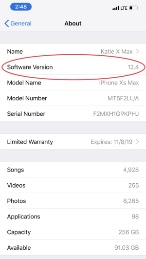

# Step 2: Compatible iPhone or iPod touch

!!! danger "Time Estimate"
    - 5 minutes, if your iPhone or iPod touch is at iOS 12.4 or newer; iOS 14.4.2 or higher is recommended
    - 20 minutes, if need to update your compatible device to a new iOS
    - 10 minutes, if you need to order a [compatible device](step2.md#compatible-devices) from Apple website
    - 0 minutes, if you own an Android and won't buy Apple products; check out [AndroidAPS Documention](https://androidaps.readthedocs.io/en/latest/)

!!! info "Summary"
    - Check your iOS version and make sure you have iOS 12.4 minimum
    - WARNING, although the current version of Loop can be built with iOS 12.4, using newer iOS is strongly recommended
    - If using Dexcom CGM, your Looping iPhone/iPod touch will need the Dexcom app installed on it to Loop without an internet connection.
    - This is a good time to read [Turn Off Automatic Updates](#turn-off-automatic-updates)

!!! warning "FAQs"
    - **"Can I use an android?"** No. Check out [AndroidAPS Documention](https://androidaps.readthedocs.io/en/latest/).
    - **"Can I use an iPad?"** No. iPads do not support Apple Health and Loop uses Apple Health.
    - **"Does my iPhone need a scell plan?"** No. Loop works using communication via Bluetooth and the RileyLink compatible device with your CGM and pump; no internet connection required. However, without a cell plan, connection to the internet relies on WiFi availability. If access to Dexcom Follow or Nightscout monitoring of Loop is a priority, then a cell plan may be desired.  

## Which Devices Are Compatible?

Loop requires an iPhone or iPod touch. Loop uses the Apple Health app to store and retrieve your blood glucose and insulin data and to store your carbohydrate records. iPads do not have the Apple Health app, so iPads will not work with Loop.

You need a minimum version of the mobile operating software, called the phone's "iOS", to be installed on your iPhone or iPod touch. Loop is compatible with iPhone and iPod touch devices with iOS 12.4 or newer. The next version of Loop may require a minimum of iOS 14.

### Compatible Devices

These devices are compatible with iOS 14, which is expected to be the minimum iOS required to build the next version of Loop.

- iPhone 12, all variants
- iPhone 11, all variants
- iPhone X, all variants
- iPhone 8, all variants
- iPhone 7, all variants
- iPhone 6s, all variants - but note the "s"
- iPhone SE (2016 or later model)
- iPod Touch, 7th generation

### Devices That Will Soon Be Incompatible

- iPhone 5s, 6, 6+
- iPod Touch, 6th generation

Apple stopped providing iOS updates for these devices at iOS 12.x. These older devices cannot be updated to use these newer iOS versions, e.g., iOS 13, 14 or above. You can still build Loop master and automatic-bolus branch with these older devices so long as your device has iOS 12.4 at a minimum. HOWEVER, there are upcoming Loop changes that will require users to have iOS 14 on their devices to build Loop. There is no set timeframe for when that minimum requirement will change.  When that happens, the docs will be updated and an announcement made in all the [Loop Social Media](../index.md#stay-in-the-loop) sites.

Side note for people who are seasoned Loop users and know about branches and such: Currently (July 2021), several popular Loop forks require devices to have iOS 13 or newer, and Loop dev requires iOS 14 as a minimum. There's no set timeframe for when dev will next be merged into master.

## Find Your Device's iOS

Your phone's iOS version can be found under the Settings app, General, About as shown below.

{width="300"}

Do not use any of the beta iOS versions. (Don't worry...if you don't know what that means, then you aren't using one.)

## Turn Off Automatic Updates

Loop mentors recommend that automatic updates be turned off.

Apple provides updates regularly to the iOS.  Often, these updates include critical security patches in addition to improved new features.

* **Why Turn off Automatic Updates?** Once you accept an iOS phone update, you cannot go backwards and this can force a requirement to update your Mac operating system and then Xcode before you can build Loop on that device again

For new people - you may be wondering why you care?

  * Loop must be rebuilt at least once a year (the app expires)
  * When the Loop app expires, you get a Loop not available message and must rebuild
  * Although Loop is fairly stable now; in the past, messages were posted to encourage people to rebuild ASAP because:
      * There were issues found with the code
      * Important new feature were implemented

When you turn off automatic updates, then you can choose when to update your phone. **Please be proactive - install updates as soon as the "Loop" all-clear is given. If a limitation on your Mac is preventing you from being able to update your phone to the latest iOS, please pay attention to security vulnerabilities.** We recommend that updates be installed as soon as the All-Clear is given.  Updates are important.

- An iOS update has never prevented Loop from working
- But an iOS update often requires an Xcode update to build Loop on that device and in some cases, that also requires a Mac OS update before the required Xcode version can be installed
- Rarely, but it has happened, that Xcode update requires a Loop code update
- If a problem is found, the solution is typically posted pretty quickly
- Google the instructions for your device if you cannot figure it out
    1. Please configure your phone to automatically download the updates
    1. You should choose to perform the installation of the updates manually
- Check on your favorite [Loop Social Media](../index.md#stay-in-the-loop) site to see if a newly released iOS is causing an issue with Loop or your CGM before accepting the update from Apple
- The "All-Clear" or "WAIT there's a problem" is normally posted within a few days

It is expected that iOS 15 will be released soon. This operating system may or may not require some updates to Loop code before being able to rebuild. The developer is running Loop on a beta iOS 15 phone and reports no issues, so it may go smoothly. Many of us remember the iOS 12 to iOS 13 transition was somewhat rocky.  This is a good time to have automatic downloads turned on, with automatic installation of the update turned off.

## Next Step: Compatible Pump

Now you are ready to move onto Step 3 to check if you have a [Compatible pump](step3.md).
