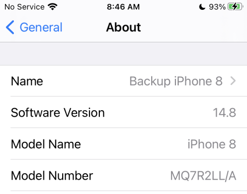

# Step 2: Compatible iPhone or iPod touch

!!! info "Time Estimate"
    - 5 minutes, to check your iOS version
    - 20 minutes, if need to update your compatible device to a new iOS
    - 10 minutes, if you need to order a [compatible device](step2.md#compatible-devices) from Apple website
    - 0 minutes, if you own an Android and won't buy Apple products; check out [AndroidAPS Documention](https://androidaps.readthedocs.io/en/latest/)

!!! abstract "Summary"
    - Check your iOS version and make sure you have iOS 14.4.2 or higher, using newer iOS is strongly recommended
        - WARNING, although the current version of Loop can be built with iOS 12.4, this will not be supported much longer
    - If using Dexcom CGM, your Looping iPhone/iPod touch will need the Dexcom app installed on it to Loop without an internet connection.
    - Make sure the phone has good battery life
    - This is a good time to read [Turn Off Automatic Updates](#turn-off-automatic-updates)

!!! question "FAQs"
    - **"Can I use an android?"** No. Check out [AndroidAPS Documention](https://androidaps.readthedocs.io/en/latest/).
    - **"Can I use an iPad?"** No. iPads do not support Apple Health and Loop uses Apple Health.
    - **"Does my iPhone need a cell plan?"** No. Loop works using communication via Bluetooth and the RileyLink compatible device with your CGM and pump; no internet connection required. However, without a cell plan, connection to the internet relies on WiFi availability. If access to Dexcom Follow or Nightscout monitoring of Loop is a priority, then a cell plan may be desired.  

## Which Devices Are Compatible?

Loop requires an iPhone or iPod touch. Loop uses the Apple Health app to store and retrieve your blood glucose and insulin data and to store your carbohydrate records. iPads do not have the Apple Health app, so iPads will not work with Loop.

You need a minimum version of the mobile operating software, called the phone's "iOS", to be installed on your iPhone or iPod touch. Loop is compatible with iPhone and iPod touch devices with iOS 12.4 or newer. The next version of Loop will require a minimum of iOS 14.

### Compatible Devices

These devices are compatible with iOS 14 and iOS 15.

- iPhone 13, all variants
- iPhone 12, all variants
- iPhone 11, all variants
- iPhone X, all variants
- iPhone 8, all variants
- iPhone 7, all variants
- iPhone 6s, all variants - but note the "s"
- iPhone SE (2016 or later model)
- iPod Touch, 7th generation

### Devices That Will Soon Be Incompatible

!!! Warning "Plan to Update Soon"

    - You will not be able to build the next release of Loop on these device

- iPhone 5s, 6, 6+
- iPod Touch, 6th generation

## Find Your Device's iOS

Your phone's iOS version can be found under the phone Settings -> General -> About display as shown below.

{width="300"}

Do not use any of the beta iOS versions. (Don't worry...if you don't know what that means, then you aren't using one.)

## Avoid Low Power Mode

Make sure the battery on your phone is solid. Your phone will become a critical health device - you want it to keep working.

Even with a solid battery, there will be times when your phone battery is low. In this case, the phone will warn you and offer to go into Low Power Mode. One of the things that happens in low power mode is that apps allowed to work in the background, i.e., when the phone is locked, will no longer do that. Loop is one of those apps - you want Loop to keep working when your phone is locked.  Your CGM is also one of those apps.

* Say NO to Low Power Mode
* Make sure a charger and cord are in your diabetes supplies
* Consider buying a battery pack, keep it charged and add it to your travel bag

## Turn Off Automatic Updates

Loop mentors recommend that automatic updates be turned off.

Apple provides updates regularly to the iOS.  Often, these updates include critical security patches in addition to improved new features.

* **Why Turn off Automatic Updates?** Once you accept an iOS phone update, you cannot go backwards and this can force a requirement to update Xcode before you can build Loop on that device again; and in some cases your Mac operating system must also be updated before installing the required Xcode version 

For new people - you may be wondering why you care?

  * Loop must be rebuilt at least once a year (the app expires)
  * When the Loop app expires, you get a ["Loop" is no available](updating.md#loop-is-no-longer-available) message and must rebuild
  * As of Loop release, v2.2.6, you get automated [notifications](../operation/features/notifications.md#loop-app-expiration-notification) when expiration is approaching
  * Although Loop is fairly stable now; in the past, messages were posted to encourage people to rebuild ASAP because:
      * There were issues found with the code
      * Important new feature were implemented

When you turn off automatic updates, then you can choose when to update your phone.

**Please be proactive - install updates as soon as the "Loop" all-clear is given. If a limitation on your Mac is preventing you from being able to update your phone to the latest iOS, please pay attention to security vulnerabilities.**

We recommend that updates be installed as soon as the All-Clear is given, because updates are important - **BUT WAIT FOR THE ALL-CLEAR.**

- **Updating to iOS 15.4 requires Xcode 13.3 if you need to rebuild for any reason**
    - This release of Xcode 13.3 had an unfortunate requirement to modify the Loop Code (all Versions) before the app could be built on an iOS 15.4 device
    - What was worse, there was an additional change required to the Loop Code (all versions) to prevent that worst-case scenario
        - Successful build to the device, which wipes out the prior working version
        - Followed by a crash when using the device
        - This was fixed very quickly - but best let the experts sweat the details on their test phones
        - Avoid being caught without a working Loop app by turning off automatic updates
- **Updating to iOS 15 immediately stops the Loop app if it was built with Xcode versions 12.4 or earlier and requires a rebuild to continue Looping**
    - Look at the Issue Report to determine the [Xcode version](../faqs/update-faqs.md#how-can-i-confirm-xcode-version-i-used) used to build Loop on your phone
    - With major iOS updates, it's not a bad idea to wait a few weeks for Apple to push out a few minor updates
- An iOS update often requires an Xcode update to build Loop on that device and in some cases, that also requires a computer macOS update before the required Xcode version can be installed
- Google the instructions for your device if you cannot figure it out
    1. Please configure your phone to automatically download the updates
    1. You should choose to perform the installation of the updates manually
- Check on your favorite [Loop Social Media](../index.md#stay-in-the-loop) site to see if a newly released iOS is causing an issue with Loop or your CGM before accepting the update from Apple
- The "All-Clear" or "WAIT there's a problem" is normally posted within a few days

Apple released iOS 15.4 on March 14, 2022.

## Next Step: Compatible Pump

Now you are ready to move onto Step 3 to check if you have a [Compatible pump](step3.md).
