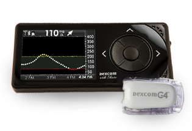

# Step 4: Compatible CGM

!!! info "Time Estimate"

    - 10 minutes to read this page

!!! abstract "Summary"

    Loop is compatible with:

    - Dexcom G4 Share, G5, or G6 CGM systems
    - Medtronic sensors connected to a Loop-compatible Medtronic pumps

!!! question "FAQs"

    - **"What about Libre sensors?"** You will need to seek out a modified version of Loop (search posts and then ask about "forks" that support your CGM in a [Loop Social Media](../index.md#stay-in-the-loop) site.)
    - **"What about Eversense?"** Eversense's application does not integrate with Apple Health nor has the communications protocols for Eversense been reverse engineered for iOS. Therefore, Eversense is not currently compatible with Loop.

## Continuous Glucose Monitor (CGM)

A continuous glucose monitor (CGM) provides Loop with blood glucose readings. These readings allow Loop to model the current glucose trend and predict future blood glucose based on carbohydrate input and your Loop settings. The following are the types of CGMs compatible with Loop. CGM readings are a required part of looping. If your Loop app is unable to retrieve blood glucose (BG) data, it will not be able to loop.

## Dexcom G5 and G6 CGM {width="150"}

Dexcom G5 and G6 CGM data is transmitted directly to the Dexcom app on your iPhone via Bluetooth. Neither of these two systems require the use of a stand-alone receiver. For Loop to function without an internet connection, you will need the Dexcom app running on the same device as Loop.

!!! warning "Dexcom G5 Support"

    [Dexcom has stopped supporting the G5 system in the US](https://www.dexcom.com/obsolescence). In the US, and some other countries, the G5 is not available for download from the Apple Store. There are countries in which Dexcom does supply and support G5. The G5 capability will be supported in the next version of Loop (currently under test in the dev branch.)

    There are third party apps, which interface with G4 and G5 transmitters, supported by some forks of Loop. The version of Loop supported by these documents only works with the Dexcom apps.

## Dexcom G4 CGM with Share Receiver {width="150"}

!!! warning "Loop 3.0 will not support G4"

    The plan is the next version of Loop (currently under test in the dev branch.) will drop support of G4 because it is so far out of date. If this is a problem for current Loop users, please post on your favorite [social media site](../index.md#finding-help).

The Dexcom G4 Share system transmits CGM data from the transmitter to a Dexcom G4 Share Receiver. The receiver, in turn, connects to the Dexcom Share2 app on your iPhone via Bluetooth. The Share2 app uploads CGM data to the Dexcom servers from your phone. For Loop to function without an internet connection, you will need the Dexcom app running on the same device as Loop.

## Medtronic CGM {width="150"}

The Minimed Enlite CGM, available with the Medtronic 522/722, 523/723, and 554/754, wirelessly sends blood glucose readings to the pump. Loop can read the Medtronic CGM data directly from the pump using a RileyLink compatible device.

## Offline Use

Offline use means using Loop when there is no cell data or internet available. Loop does not require any special setup to operate offline.

For offline Loop use, the iPhone's Bluetooth still needs to be active; and for Dexcom users, the Share2, G5, or G6 app also needs to be running on your Loop phone. If you put your iPhone into Airplane mode, remember to turn Bluetooth back on to keep your Loop running. If your offline use is failing, chances are you have forgotten to update your transmitter ID in Loop settings when you changed transmitters.

## Dexcom Share

Loop is capable of downloading Dexcom Share data for use in modeling BG. However, this is not a typical configuration and requires internet connection for both the phone with the Dexcom app and the phone with the Loop app.  As will be discussed during the Loop Set Up Steps for adding a CGM, you usually enter the Dexcom transmitter ID and leave the Dexcom Share setting blank.

## CGMs Not Natively Supported in Loop

There are other CGM, such as Libre (with BluCon or Miao Miao), Eversense and Medtronic Guardian sensors. Loop does not natively support those CGMs.  If you would like to use one of those alternate CGMs and Loop, you will need to look into third-party integrations to allow Loop to access the blood glucose data. First search for previous posts on the topic and then ask questions in a [Loop Social Media](../index.md#stay-in-the-loop) site. Currently, there are no solutions for Eversense or Guardian CGM to be used with Loop, but some [Uploaders](https://nightscout.github.io/uploader/uploaders/) to Nightscout are available using an Android phone.

## Next Step: Order a RileyLink Compatible Device

Now you are ready to move onto Step 5 to [Order a RileyLink Compatible Device](step5.md).
