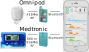
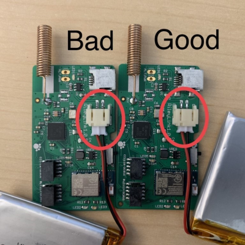
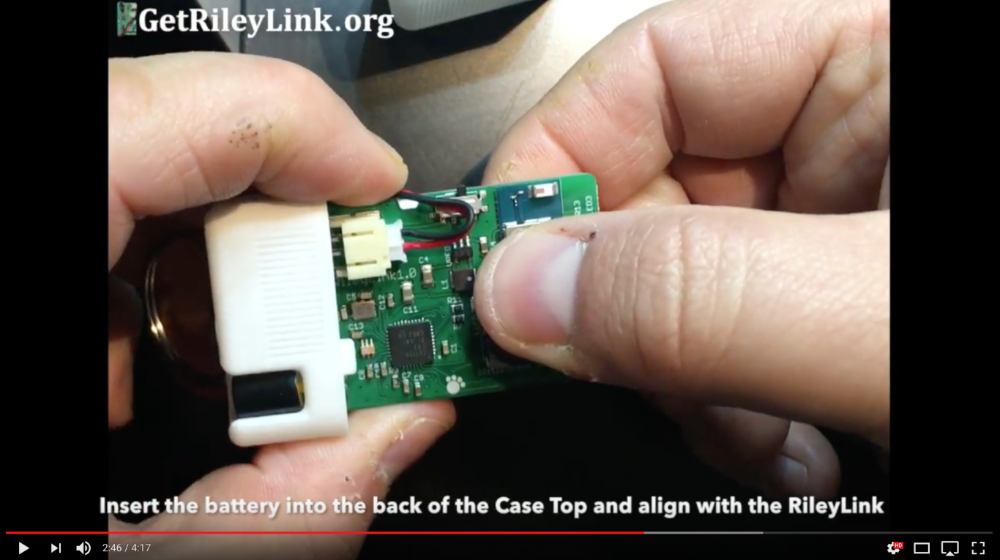
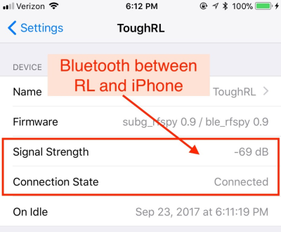
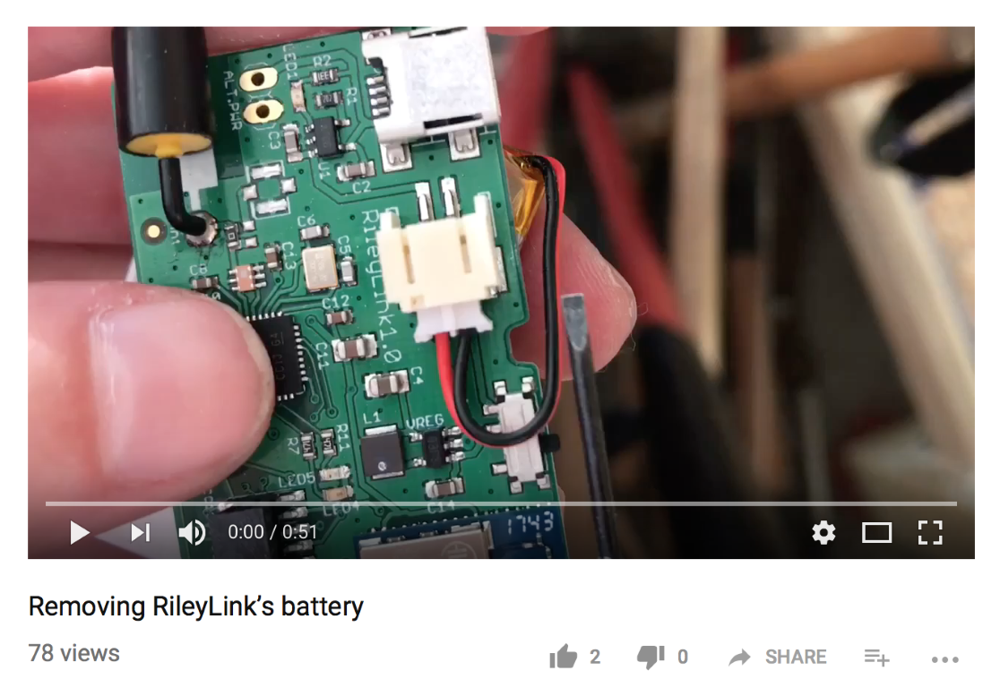

# Step 5: Order a RileyLink

!!! danger "Time Estimate"
    - 15-20 minutes to read about the RileyLink and other radio-link options
    - 15 minutes to order a radio-link
    - 15-20 minutes to assemble the RileyLink (if you choose that radio-link)

!!! info "Summary"
    - Decide what kind of radio-link to buy
    - Order your radio link
    - If you choose RileyLink
        - Assemble the RileyLink

!!! warning "FAQs"
    - **RileyLink vs radio-link**: The RileyLink is the original design. Other DIY Loopers have created several other options.  A new section has been added to this page: [Radio-link Options](step5.md#radio-link-options).  All headers will continue using RileyLink in the name (because we don't want to mess up the links).  But gradually, radio-link will be used in the body of the pages - unless it is specific to RileyLink.
    - **"Do I need a radio-link?"** Yes. Loop will not work without a radio-link.
    - **"What happens if I lose my radio-link or walk away from it?"** Good question...answered [here](../faqs/rileylink-faqs.md#what-happens-if-i-walk-away-from-my-rileylink).
    - **"Can I use an Omnipod RileyLink with a Medtronic pump? or vice versa?"** Good question...answered [here](../faqs/rileylink-faqs.md#what-will-happen-if-your-radio-link-has-the-wrong-antenna).
    - **"Can I swap out radio-links at any time?"** Yes, you can. Radio-links can be replaced quite simply without needing to start a new pod or rebuild Loop app. There's a place in Loop settings where you find your new device name and turn "on" the Bluetooth connection to start using it. You can swap between RileyLink, OrangeLink, EmaLink or the next version of link.
    - **"How close does the radio-link need to be to me? Do I have to carry it with me?"** Good questions...answered [here](../faqs/rileylink-faqs.md#do-i-have-to-carry-the-rileylink-everywhere).
    - **"Why is it named RileyLink?"** Riley is the name of Pete Schwamb's daughter and he's the guy that created the RileyLink.
    - **"Can I make my own radio-link?"** Technically yes, however it is not an easy project. You'll need specialized tools and patience.

## What is RileyLink

The radio-link (RL) is an open-source hardware device that can bridge Bluetooth Low Energy (BLE) to the radio-frequency wireless communication used by select Medtronic and Omnipod pumps. What does that mean to you? It means radio-link is the communication highway between your insulin pump, CGM, and iPhone.

**DIY Loop will not work without the radio-link.**

{width="450"}
{align="center"}

## Order RileyLink

There used to be just one option. Now there are more, so you have to make a decision.

## Radio-link Options

!!! info "Radio-links"
    - One thing that might affect your choice is where you live and whether you want to charge it or change batteries
        - These devices are sold at cost
        - If you are in the US, shipping for RileyLink and OrangeLink is less expensive
        - The EmaLink ships from Europe
        - A [Comparison Chart](https://getrileylink.org/rileylink-compatible-hardware-comparison-chart?fbclid=IwAR2vHbOzla-zmM-cSp4NkOB_23k3spgnaYvCIGRcACcIQ25FJAU_7HRkH2A) is provided by the getrileylink (non-profit) organization for all the radio-links listed below
    - RileyLink
        - Designed by Pete Schwamb, available from [getrileylink](https://getrileylink.org)
        - Rechargable battery (max 36 hours per charge)
        - Must order either Omnipod or Medtronic version
    - OrangeLink
        - Designed by Vic Wu, available from [getrileylink](https://getrileylink.org)
        - Uses 2 AAA batteries, weeks of use typical
        - Works with either Omnipod or Medtronic
        - Uses new chipsets, reported to have longer range
        - Matches Apple Airpod form factor, so can use airpod cases
    - EmaLink
        - Designed by Sorin Kupas-Spunei to increase range, offer smaller sizes
        - Rechargable battery (variety of case/battery sizes available)
            - Micro/Nano: 2 to 3 days
            - Standard: 6 to 7 days
            - Maxx: 12 to 14 days
        - Must order either Omnipod or Medtronic version
        - See [EmaLink Information](https://github.com/sks01/EmaLink#emalink)
            - This link has several photos with all radio-links, pod and Medtronic in same frame
        - This design is from Europe, available by sending a private message via github to Sorin (sks01)
        - Robert Holbrook has made it easier for US buyers with this [Ema Order Sheet](https://docs.google.com/forms/d/e/1FAIpQLSdcHBUN6e1yPxxvlaXYRBL1liF9W8OYDOpTR2tWquXESo0bKg/viewform)
            - For US buyers, sometimes a group-buy is organized on Facebook to minimize shipping costs

## Assemble RileyLink

Your RileyLink will come with the battery disconnected and the parts not already inside the case. It will be up to you to put the RL in the case and attach the battery.

Make sure the lipo battery is well-plugged into the connection. Line up the little ridge appropriately, and push fairly firmly to get the connection tight.  Poor battery cable connection can make the Loop communications fail.  See photos below, for example.

!!! warning "Common new user errors"

    The most common two errors for new RileyLink owners are (1) not fully pushing in the lipo battery cable connection and (2) failing to charge the RileyLink. Compare your lipo battery cable with the photos; it takes a bit of oomph to push that plug fully in like the photos shown below. Remember to charge your RileyLink each night.

{width="400"}
{align="center"}

Loose battery cable on left, Proper battery cable on right

Finally, the board and the battery fit into the slim case fairly tightly as well.  Click on the image below to watch a helpful [assembly video](https://www.youtube.com/watch?v=-GHxxEJMCZc&feature=youtu.be).

## Extra Details about RileyLink

All of these radio-links communicate with the pump through radio frequency communications and with the phone through Bluetooth.  Numerous factors can influence how well those communications can function...interferences from other devices, temperature, physical blocking, going through your body (think water), etc.

### Radio communications

**Medtronic Only** When your RL and pump first connect, Loop performs a series of tests that you won't see...they are tuning tests. Basically, Loop sends little test messages via the RL to the pump and waits for a response. Loop tries this same "ping" to the pump over a range of frequencies based on the pump you've told Loop to expect (Medtronic NA/CA, or Medtronic WW).  The Loop app will then use the radio frequency with the strongest response for future pump communications.

**For long-time MMT Loopers who remember hitting the tune button:** Usually this best frequency is constant for any given Medtronic pump + RL, but may drift with time or temperature changes. The tuning mentioned above is started automatically if pump communications fail for 14 minutes (in other words, two looping cycles). You no longer need to hit the tune button in the menu.

### Bluetooth communications

The radio-link communicates with your iPhone and Loop app through Bluetooth (BT).  

!!! info "Bluetooth Troubleshooting"

    If your iPhone has BT issues, your Loop will have failures.  There have been reports of BT audio devices (such as BT pairings in your car or home audio BT speakers) interfering with the Loop.  If you are finding Loop failures frequently happening at a particular location, you may try to troubleshoot if there are BT problems in the area.

Your BT signal strength can be seen in the Loop settings, Pump settings, device menu, on the `Signal Strength` line. As you move closer and further away from your phone, you can watch that number dynamically change. This line is **not** displaying the signal strength of your pump RF communications, just BT between the radio-link and the phone.

You will notice the Signal Strength is a negative number and in units of dB.  Remember that number line from elementary school?  A signal strength of -50&nbsp;dB is a stronger signal than  -80&nbsp;dB.  

{width="400"}
{align="center"}

### RileyLink Lights

!!! danger ""
    This section is about the RileyLink lights. The other radio-link lights may be different. The light pattern for other radio-links are not included on this page.

The RileyLink has several lights that you may notice from time to time. There is no 'power' light. If you suspect that your RileyLink is not being powered, try turning it off and on using the small sliding switch. You should see lights in the middle of the board flash when you do this.  If they flash, that means the board has power.

* Red light: Charging light. The red light will remain on while RileyLink is charging, and it will turn off when charging is complete. You may notice the red light turn on periodically even after charging is complete...it's just "topping off".

* Green light: Bluetooth connection light. The green light will remain on while you have a BT connection with your iPhone.  If that green light fails to stay on, you should troubleshoot your BT connections. Try restarting BT on your iPhone and/or turning the RileyLink off/on by its power switch.

* Blue light: Pump communications.  If you have an older firmware on your RileyLink, some of the blue lights will flash periodically as it communicates with the pump. It's just letting you know that it is busy talking and collecting info. You will also see increased blue flashes if you have "Enabled Diagnostic LEDs" for MDT users that have the RLs with updated firmware (shipping since late August 2018).

A solid blue light that consistently remains lit on the board could mean one of two things:

* A temporary issue that can be resolved by rebooting the RL physically (turning the switch off/on), or

* An electrical short or damage to the board.  Sweat and moisture are most likely culprits, so try to keep case free from those environments. Don't keep RL in sports bras or waistband next to skin, for example, while exercising.

If your blue light remains on despite trying a restart, it is time to pull out your backup RL.

### RileyLink Charging

The battery that comes with RileyLink is not charged completely when it is shipped, so be sure to charge it up before initial use.  You'll need a [mini-USB cable](https://www.amazon.com/AmazonBasics-USB-2-0-Cable--Male/dp/B00NH13S44) and [0.5A USB charging power supply](https://www.amazon.com/Cellet-Powered-Charger-iPhones-Smartphones-/dp/B00FE8WFCO) like your iPhone power supply.  RileyLink takes about 2 hours to fully charge (the red light will turn off when fully charged, read note above about red light patterns) and should easily last at least a full day of constant Loop use.  Typically, it can go into the 30-hour range without any problems.  Most people charge their RL each night when they are sleeping.  You don't have to worry about leaving the RL plugged in "too long" for charging.  It will automatically stop charging the battery when it is fully charged.

Since the best practice is to charge your RileyLink overnight while you sleep, and the battery lasts safely over 24 hours, there is no battery level indicator for the RileyLink.  The RileyLink's charge level is not viewable on Nightscout, nor within the Loop app.  If you forget to charge your RileyLink overnight, you can recharge it with a portable USB battery in a pinch.  A [short mini-USB cable](https://www.adafruit.com/product/899) could be a good addition to a small gear bag.

### Range

The range at which all radio-links will function is **heavily** dependent on the environment that you are in. Both the EmaLink and OrangeLink have reported longer ranges, so they can be kept in a central location - but still need to be "near enough". The rest of this section discusses RileyLink.

Most people keep their RileyLink in a pocket or carry a belt holster during the day on the same side of their body as their pump. The radio frequency communications will have a shorter range than the BT communications, therefore RileyLink will do better closer to the pump rather than the iPhone if you are deciding on options for carrying gear.

Generally speaking, RileyLink is solid about 10-12 feet away in most environments. In some situations, you could have RileyLink work fine even at 20+feet away. Other times, you may need to get RileyLink closer.

What influences this distance? The biggest influences are (1) body-blocking and (2) "noisy" environments. The human body is a lot of water, and water is an excellent blocker of wireless communication.  So, sleeping on a pod and smothering it entirely with your body will possibly decrease the ability of radio-link to communicate with the pod. Environments with a high concentration of wireless signals can also interfere with radio-link communications and make closer proximity a benefit. Where might those kinds of situations happen? Concerts, conferences, and sporting arenas are pretty prone to interference.

### RileyLink Lipo Battery

Keep your RileyLink and lipo battery protected from damage.  Lipo batteries are unsafe when damaged or punctured, so the case is an important part of safe Looping. If your battery is damaged in some way, please disconnect it immediately, and dispose of it (they should be recycled). You can order new RileyLink batteries on the [GetRileyLink website](http://getrileylink.org/)

### Removing Lipo Battery

To remove the lipo battery from the RileyLink, please do so slowly and patiently. Work the battery connection side to side slowly to loosen it from the plug. Some people have reported success using small, curved needle-nose pliers such as hemostats. Others have used small flathead screwdrivers as shown in [this video](https://youtu.be/s2qNPLpfwww).

## Waiting for RileyLink

Yes, waiting for your radio-link to arrive is extremely difficult if they are backordered.  PLEASE be patient, since Loop CANNOT work without one.

If you're really dying to do something while the radio-link ships, you can proceed with finishing these build directions all the way through Step 14...but after that you'll have to wait for the radio-link.  You can't properly enter any settings or pump info in the Loop app without it.

## Next Step: Enroll in Apple Developer Program

Now you are ready to move onto Step 6 to [enroll in the Apple Developer Program](step6.md).
