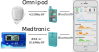

# Step 5: Order a RileyLink Compatible Device

!!! info "Time Estimate"
    - 15-20 minutes to read about RileyLink compatible devices
    - 15 minutes to order a device

!!! abstract "Summary"
    - Decide what kind of RileyLink compatible device to buy
    - Order your compatible device

!!! question "FAQs"
    - **What is a RileyLink Compatible Device?** RileyLink refers to both the communication protocol and the name of the original device. Other DIY Loopers have created [RileyLink Compatible Devices](step5.md#rileylink-compatible-devices) that use the RileyLink protocol. At the current time, RileyLink, OrangeLink and EmaLink devices are available for purchase and all can be used interchangeably with Loop.
    - **Do I have to buy one?** These are open-source hardware devices, but it takes special skills to build them yourself. It is recommended you buy one (or two).
    - **"What happens if I lose my RileyLink compatible device or walk away from it?"** Within a half hour, your pump returns to normal scheduled basal rate
    - **"Can I swap out RileyLink compatible devices at any time?"** Yes, you can. You do not need to start a new pod or rebuild the Loop app. Tap on the pump menu in Loop settings to search for new devices and enable Loop to create a Bluetooth connection. You can swap between RileyLink, OrangeLink, EmaLink or some future RileyLink compatible device.
    - **"How close does the RileyLink compatible device need to be to me? Do I have to carry it with me?"** See [RileyLink Compatible Device Range](../faqs/rileylink-faqs.md#range).

## What is a RileyLink Compatible Device

The RileyLink compatible device is an open-source hardware device that can bridge Bluetooth Low Energy (BLE) to the radio-frequency wireless communication used by select Medtronic and Omnipod pumps. What does that mean to you? It means the device is the communication highway between your insulin pump, CGM, and iPhone.

The next version of Loop (currently being tested in the dev branch) will have DASH support (the pod with the Blue needle cap - direct Bluetooth to the phone with no need for a RileyLink compatible device). Please - be patient.  If you are not already an experienced Looper willing to test code under development, wait until this code is released.

**The released version of Loop will not work without a RileyLink compatible device.**

{width="600"}

## RileyLink Compatible Devices

The RileyLink protocol defines a specific bluetooth interface and way of opening a Sub-GHz radio channel to pumps. All RileyLink compatible devices follow the RileyLink protocol.

There used to be just one option, the original RileyLink. Now there are more options, so you have to make a decision. Depending on your choice, be sure to have the correct charger and cables or batteries handy and add spare compatible supplies to your diabetes go-bag.

- A [Comparison Chart](https://getrileylink.org/rileylink-compatible-hardware-comparison-chart?fbclid=IwAR2vHbOzla-zmM-cSp4NkOB_23k3spgnaYvCIGRcACcIQ25FJAU_7HRkH2A) is provided by the GetRileyLink organization for all the RileyLink compatible devices listed below
- RileyLink
    - Designed by Pete Schwamb, available from [GetRileyLink](https://getrileylink.org)
    - Rechargable battery (max 36 hours per charge)
    - Must order either Omnipod or Medtronic version
- OrangeLink
    - Designed by Vic Wu, available from [GetRileyLink](https://getrileylink.org)
    - Uses 2 AAA batteries, batteries typically last weeks or more, depending on batteries/pump type
    - Works with either Omnipod or Medtronic
    - Uses new chipsets, reported to have longer range
    - Matches Apple Airpod form factor, so you can use airpod cases
- EmaLink
    - Designed by Sorin Kupas-Spunei to increase range, offer smaller sizes
    - Rechargable battery (various case/battery sizes available)
        - Micro/Nano: 2 to 3 days
        - Standard: 6 to 7 days
        - Maxx: 12 to 14 days
    - Must order either Omnipod or Medtronic version
    - This [EmaLink Information](https://github.com/sks01/EmaLink#emalink) includes photos of various EmaLink configurations as well as photos showing relative sizes of EmaLink, OrangeLink and RileyLink
    - In North America, available from [EmaLink.us](https://www.emalink.us) or [CustomTypeOne.com](https://www.customtypeone.com)
    - Outside North America, please use this [Ema Order Sheet](https://docs.google.com/forms/d/e/1FAIpQLSdcHBUN6e1yPxxvlaXYRBL1liF9W8OYDOpTR2tWquXESo0bKg/viewform)

## More information

There is an entire FAQs page on [RileyLink Compatible Devices](../faqs/rileylink-faqs.md).

Sections of interest include:

* [Firmware Update](../faqs/rileylink-faqs.md#orangelink-firmware) information on the OrangeLink
* [Ema and Orange Patch](../faqs/rileylink-faqs.md#emalink-and-orangelink-features) to see extra features on the Loop app screens

## Waiting for your RileyLink Compatible Device

While you are waiting for the RileyLink compatible device to arrive, you can proceed with these build directions all the way through Step 14. After that, you'll have to wait for your device. You can't properly enter any settings or pump info in the Loop app without it.

The population of DIY loopers (Loop and Android APS) has grown enough that you might be able to find someone local to loan you their spare.

## Next Step: Enroll in Apple Developer Program

Now you are ready to move onto Step 6 to [enroll in the Apple Developer Program](step6.md).
