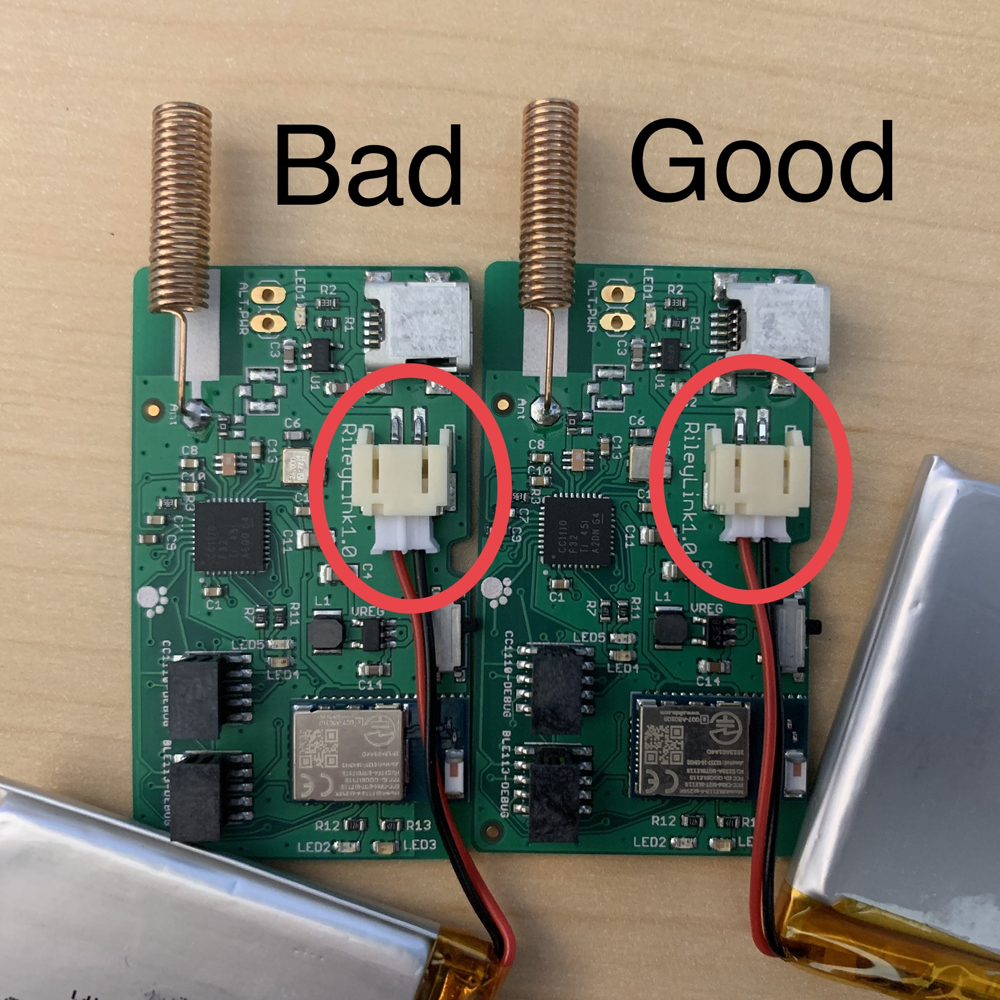

# Step 5: Order a RileyLink Compatible Device

!!! danger "Time Estimate"
    - 15-20 minutes to read about RileyLink compatible devices
    - 15 minutes to order a RileyLink compatible device

!!! info "Summary"
    - Decide what kind of RileyLink compatible device to buy
    - Order your RileyLink compatible device

!!! warning "FAQs"
    - **Do I have to buy one?** These are open-source hardware devices, but it takes special skills to build them yourself. It is recommended you buy one (or two).
    - **RileyLink Compatible Devices**: RileyLink refers to both the communication protocol and the name of the original device. Other DIY Loopers have created [RileyLink Compatible Devices](step5.md#rileylink-compatible-devices) that use the RileyLink protocol. At the current time, RileyLink, OrangeLink and EmaLink devices are available for purchase and all can be used interchangeably with Loop.
    - **"What happens if I lose my RileyLink compatible device or walk away from it?"** Within a half hour, your pump returns to normal scheduled basal rate
    - **"Can I swap out RileyLink compatible devices at any time?"** Yes, you can. You do not need to start a new pod or rebuild Loop app. Tap on the pump menu in Loop settings to search for new devices and enable Loop to create a Bluetooth connection. You can swap between RileyLink, OrangeLink, EmaLink or some future RileyLink compatible device.
    - **"How close does the RileyLink compatible device need to be to me? Do I have to carry it with me?"** See [RileyLink Compatible Device Range](step5.md#rileylink-compatible-device-range).

## What is a RileyLink Compatible Device

The RileyLink compatible device is an open-source hardware device that can bridge Bluetooth Low Energy (BLE) to the radio-frequency wireless communication used by select Medtronic and Omnipod pumps. What does that mean to you? It means the device is the communication highway between your insulin pump, CGM, and iPhone.

**DIY Loop will not work without a RileyLink compatible device.**

{width="600"}

## RileyLink Compatible Devices

The RileyLink protocol defines a specific bluetooth interface and way of opening a Sub-GHz radio channel to pumps. All RileyLink compatible devices follow the RileyLink protocol.

There used to be just one option. Now there are more, so you have to make a decision. Depending on your choice, be sure to have the correct charger and cables or batteries handy and add spare sets to your diabetes go-bag.

- One thing that might affect your choice is where you live and whether you want to charge the device or change batteries
    - If you are in the US, shipping for RileyLink and OrangeLink is less expensive
    - The EmaLink ships from Europe
    - A [Comparison Chart](https://getrileylink.org/rileylink-compatible-hardware-comparison-chart?fbclid=IwAR2vHbOzla-zmM-cSp4NkOB_23k3spgnaYvCIGRcACcIQ25FJAU_7HRkH2A) is provided by the GetRileyLink organization for all the RileyLink compatible devices listed below
- RileyLink
    - Designed by Pete Schwamb, available from [GetRileyLink](https://getrileylink.org)
    - Rechargable battery (max 36 hours per charge)
    - Must order either Omnipod or Medtronic version
- OrangeLink
    - Designed by Vic Wu, available from [GetRileyLink](https://getrileylink.org)
    - Uses 2 AAA batteries, weeks or more of use typical (depends on batteries/pump type)
    - Works with either Omnipod or Medtronic
    - Uses new chipsets, reported to have longer range
    - Matches Apple Airpod form factor, so can use airpod cases
- EmaLink
    - Designed by Sorin Kupas-Spunei to increase range, offer smaller sizes
    - Rechargable battery (various case/battery sizes available)
        - Micro/Nano: 2 to 3 days
        - Standard: 6 to 7 days
        - Maxx: 12 to 14 days
    - Must order either Omnipod or Medtronic version
    - This [EmaLink Information](https://github.com/sks01/EmaLink#emalink) includes photos of various EmaLink configurations as well as photos showing relative sizes of EmaLink, OrangeLink and RileyLink
    - This device ships from Europe, and is available by sending a private message via github to Sorin (sks01) or you can use this [Ema Order Sheet](https://docs.google.com/forms/d/e/1FAIpQLSdcHBUN6e1yPxxvlaXYRBL1liF9W8OYDOpTR2tWquXESo0bKg/viewform)
    - Sometimes, a group-buy is organized on Facebook to minimize shipping costs

## RileyLink Compatible Device Communications

All the RileyLink compatible devices communicate with the pump through radio frequency communications and with the phone through Bluetooth. Numerous factors can influence how well those communications can function...interferences from other devices, temperature, physical blocking, going through your body (think water), etc.

**Medtronic Only** When your device and pump first connect, Loop performs a series of tests that you won't see...they are tuning tests. Basically, Loop sends little test messages via the device to the pump and waits for a response. Loop tries this same "ping" to the pump over a range of frequencies based on the pump you've told Loop to expect (Medtronic NA/CA, or Medtronic WW). The Loop app will then use the frequency with the strongest response for future pump communications.

**For long-time Medtronic Loopers who remember hitting the tune button:** Usually this best frequency is constant for any given Medtronic pump + RileyLink compatible device, but may drift with time or temperature changes. The tuning mentioned above is started automatically if pump communications fail for 14 minutes (in other words, two looping cycles). You no longer need to manually tune.

!!! info "Bluetooth (BT) Troubleshooting"

    If your iPhone has BT issues, your Loop will have failures. There have been reports of BT audio devices (such as BT pairings in your car or home audio BT speakers) interfering with the Loop. If you are finding Loop failures frequently happening at a particular location, you may try to troubleshoot if there are BT problems in the area.

Your BT signal strength can be seen in the Loop settings, Pump settings, Device menu, on the `Signal Strength` line. As you move closer and further away from your phone, you can watch that number dynamically change. This line is **not** displaying the signal strength of your pump RF communications, just BT between the RileyLink compatible device and the phone.

You will notice the Signal Strength is a negative number and in units of dB. Remember that number line from elementary school?  A signal strength of -50&nbsp;dB is a stronger signal than  -80&nbsp;dB.  

{width="400"}
{align="center"}

## RileyLink Compatible Device Range

The range at which RileyLink compatible devices will function is dependent on the environment that you are in and the specific device design. Both the OrangeLink and some sizes of the EmaLink have reported longer ranges than RileyLink - but they still need to be "near enough".

What influences this distance for a given device? The biggest external influences are (1) body-blocking and (2) "noisy" environments. The human body is a lot of water, and water is an excellent blocker of wireless communication. So, sleeping on a pod and smothering it entirely with your body will possibly decrease the ability of the device to communicate with the pod. Environments with a high concentration of wireless signals can also interfere with device communications and make closer proximity a benefit. Where might those kinds of situations happen? Concerts, conferences, and sporting arenas are pretty prone to interference.

Many people keep their device on the same side of their body as their pump during the day. They use a pocket, carabiner, lanyard, SPIbelt - the options are endless. What you don't want to do is put it in a blocking bag that has RFID blocking (some travel fanny packs have that).  

The practical range can vary by device design and among individual units of the same design. Do some experiments - send a communication signal from phone to pump - if it makes the round-trip, extend the distance and repeat the test.  Figure out what works for your devices.

Suggested communication signals to send:

* **Medtronic**: Button Press
* **Omnipod**: Read Pod Status

If you use Omnipod and have a newer version of Loop, the report from Read Pod status has the Received Signal Strength Indicator (RSSI) between the RileyLink compatible device and the Pod

* The RSSI is a positive number with a larger number indicating a stronger signal strength detected by the Pod
* This information complements the BT signal strength reported in the device menu

If you want to be analytic about your range test, you can make a table of distance, Bluetooth strength and, if available, RSSI.

## Waiting for your RileyLink Compatible Device

While you are waiting for the RileyLink compatible device to arrive, you can proceed with finishing these build directions all the way through Step 14. After that you'll have to wait for the device. You can't properly enter any settings or pump info in the Loop app without it.

The population of DIY loopers (Loop and Android APS) has grown enough that you might be able to find someone local to loan you their spare.

## Next Step: Enroll in Apple Developer Program

Now you are ready to move onto Step 6 to [enroll in the Apple Developer Program](step6.md).

If you want more information about RileyLink, keep reading, then move on to Step 6.

## RileyLink Device Details

Since the RileyLink version of the communication link device has been around the longest, some additional information about that device has been added to this page throughout the years. The rest of this page is specific just to the RileyLink device.

### RileyLink Assembly

Your RileyLink will come with the Lithium-ion Polymer (LiPo) battery disconnected and the parts not already inside the case. It will be up to you to put the RileyLink in the case and attach the battery.

Make sure the LiPo battery is well-plugged into the connection. Line up the little ridge appropriately, and push fairly firmly to get the connection tight. Poor battery cable connection can make the Loop communications fail. See photos below, for example.

!!! warning "Common new user errors"

    The most common two errors for new RileyLink owners are (1) not fully pushing in the LiPo battery cable connection and (2) failing to charge the RileyLink. Compare your LiPo battery cable with the photos; it takes a bit of oomph to push that plug fully in like the photos shown below. Remember to charge your RileyLink each night.

{width="400"}
{align="center"}

Loose battery cable on left. Proper battery cable on right

Finally, the board and the battery fit into the slim case fairly tightly as well. Click on the image below to watch a helpful [assembly video](https://www.youtube.com/watch?v=-GHxxEJMCZc&feature=youtu.be).

### RileyLink Lights

The RileyLink has several lights that you may notice from time to time. There is no 'power' light. If you suspect that your RileyLink is not being powered, try turning it off and on using the small sliding switch. You should see lights in the middle of the board flash when you do this. If they flash, that means the board has power.

* Red light: Charging light. The red light will remain on while RileyLink is charging, and it will turn off when charging is complete. You may notice the red light turn on periodically even after charging is complete...it's just "topping off".

* Green light: Bluetooth connection light. The green light will remain on while you have a BT connection with your iPhone. If that green light fails to stay on, you should troubleshoot your BT connections. Try restarting BT on your iPhone and/or turning the RileyLink off/on by its power switch.

* Blue light: Pump communications. If you have an older firmware on your RileyLink, some of the blue lights will flash periodically as it communicates with the pump. It's just letting you know that it is busy talking and collecting info. You will also see increased blue flashes if you have "Enabled Diagnostic LEDs" for Medtronic users that have the RileyLinks with updated firmware (shipping since late August 2018).

A solid blue light that consistently remains lit on the board could mean one of two things:

* A temporary issue that can be resolved by rebooting the RileyLink physically (turning the switch off/on), or

* An electrical short or damage to the board. Sweat and moisture are most likely culprits, so try to keep case free from those environments. Don't keep RileyLink in sports bras or waistband next to skin, for example, while exercising.

If your blue light remains on despite trying a restart, it is time to pull out your backup RileyLink.

### RileyLink Charging

The battery that comes with RileyLink is not charged completely when it is shipped, so be sure to charge it up before initial use. You'll need a [mini-USB cable](https://www.amazon.com/AmazonBasics-USB-2-0-Cable--Male/dp/B00NH13S44) and [0.5A USB charging power supply](https://www.amazon.com/Cellet-Powered-Charger-iPhones-Smartphones-/dp/B00FE8WFCO) like your iPhone power supply. RileyLink takes about 2 hours to fully charge (the red light will turn off when fully charged, read note above about red light patterns) and should easily last at least a full day of constant Loop use. Typically, it can go into the 30-hour range without any problems. Most people charge their RileyLink each night when they are sleeping. You don't have to worry about leaving the RileyLink plugged in "too long" for charging. It will automatically stop charging the battery when it is fully charged.

Since the best practice is to charge your RileyLink overnight while you sleep, and the battery lasts safely over 24 hours, there is no battery level indicator for the RileyLink. The RileyLink's charge level is not viewable on Nightscout, nor within the Loop app. If you forget to charge your RileyLink overnight, you can recharge it with a portable USB battery in a pinch. A [short mini-USB cable](https://www.adafruit.com/product/899) could be a good addition to a small gear bag.

### RileyLink Battery

Keep your RileyLink and its Lithium-ion Polymer (LiPo) battery protected from damage. LiPo batteries are unsafe when damaged or punctured, so the case is an important part of safe Looping. If your battery is damaged in some way, please disconnect it immediately, and dispose of it (they should be recycled). You can order new RileyLink batteries on the [GetRileyLink website](http://getrileylink.org/)

### RileyLink Battery Removal

To remove the LiPo battery from the RileyLink, please do so slowly and patiently. Work the battery connection side to side slowly to loosen it from the plug. Some people have reported success using small, curved needle-nose pliers such as hemostats. Others have used small flathead screwdrivers as shown in [this video](https://youtu.be/s2qNPLpfwww).

