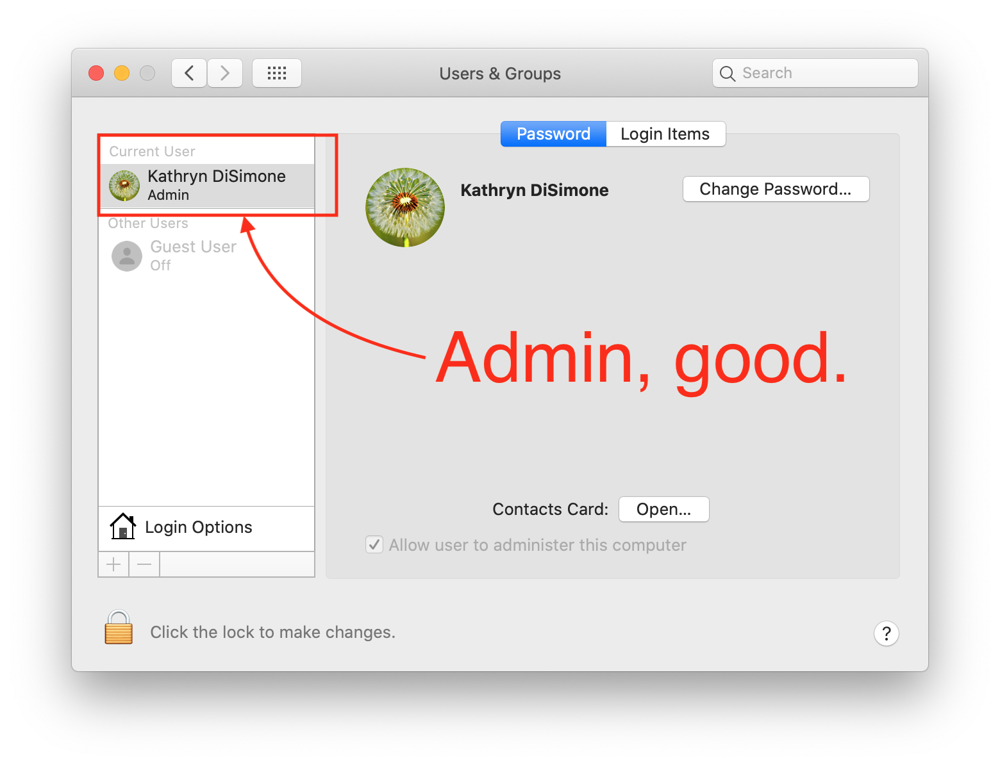
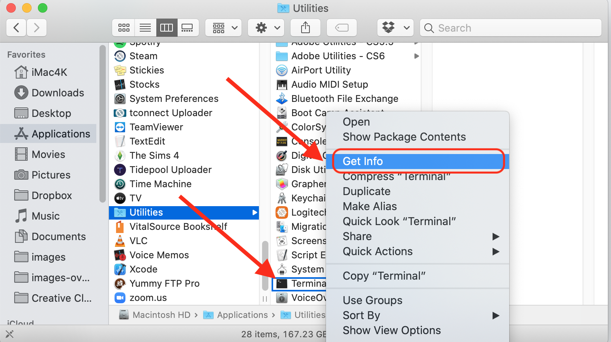
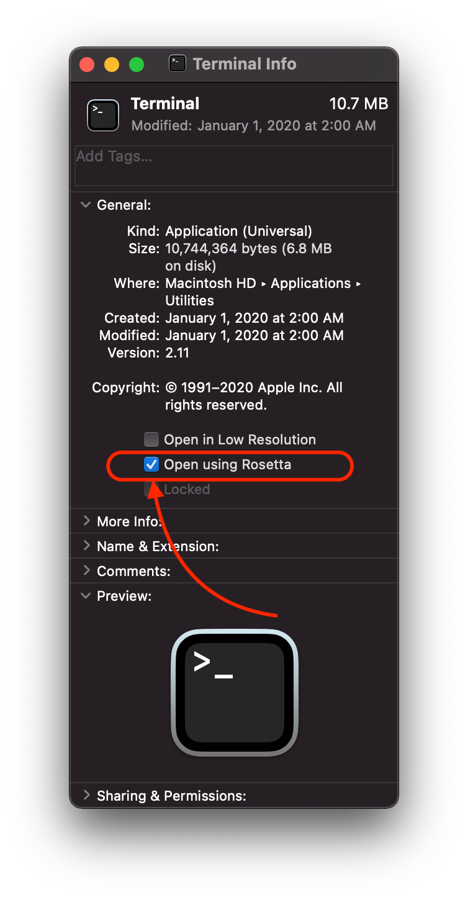

# Step 7: Skip Step 7

In the olden days, Loop could only be built on a computer using a tool called carthage that was installed using another tool called homebrew (Mac package manager). For the standard Loop, a separate installation of carthage is no longer needed.

**History**: In Jan 2021, when the version of carthage advanced from 0.36.0 to 0.36.1; Loop-building came to a halt. The developers responded and now you typically don't need to install carthage. If you are building one of those branches (most Loop builds), you can skip this page.

However, there are some forks, or the Workspace method for the dev branch, where carthage is still required; but it needs to be carthage 0.36.0. This page has been updated to just install that version of carthage.

The instructions for Step 7 (which most folks can skip) are maintained for those people who need to know how to install carthage and how to configure a new M1 computer terminal using Rosetta.

!!! info "Time Estimate"
    Some forks and branches of Loop require you to have carthage 0.36.0 installed on your computer.

    - 10-15 minutes assuming you know your computer's password

!!! abstract "Summary"

    - If you have a new M1 Mac, follow the Rosetta instructions the first time you open a terminal window
    - Open a terminal window
    - Install carthage 0.36.0 if you need it

!!! question "FAQs"

    - **"What if I don't install carthage?"** For many cases, you do not need to separately install carthage.  But if your build fails with the message that carthage is not installed, then you need to install it.

Remember, follow the steps, read slowly and carefully.  If you get stuck, there are mentors who can assist you: [Community Information](../index.md#stay-in-the-loop).

## Check Admin Status

Before installing carthage, check that your user account **has Administrative rights on the computer**. How can you tell?

Click on the Apple icon, select System Preferences, and open the Users & Groups section. If the account you are using doesn't say "Admin", then you need to click the lock and change that to an Admin account before proceeding. If you are using a work computer, you may not have admin rights on that computer...so be aware that you may have restrictions on company owned computers.

{width="650"}

## Configure Terminal App for Rosetta on M1 Computer

!!! abstract "New Apple M1 chip users: IMPORTANT STEP"

    If you purchased one of the new Apple computers that have the brand new Apple M1 chip, you will need to do this step (one time only) to open the Terminal app using a "converter" app, called Rosetta.

    Go to the Finder app, click on Applications, then open the Utilities folder.  Locate the Terminal app but do not double click it to open a Terminal window. Instead, hold down the Control Key on the keyboard and single click on Terminal. This will bring up a menu of choices, select the "Get Info" option.

    {width="650"}

    Now in the informational window that appears...you'll see a checkbox that says "Open using Rosetta". Check that box...that will allow Terminal app to open using Rosetta when you double click on terminal in the future. You can close that informational window, after you check the box for "Open using Rosetta", and proceed with the rest of the directions just like normal.

    {width="450"}

## Open Terminal

Go to the Finder app, click on Applications, then open the Utilities folder.  Locate the Terminal app and double-click Terminal to open a terminal window. (Folks with M1 computer, make sure you [configured the terminal app for rosetta](step7.md#configure-terminal-app-for-rosetta-on-m1-computer) first.) The terminal window is very plain looking when you open it. That is normal. Copy and paste the lines below into the terminal window.

## Check carthage Status

The steps required to install the correct version of carthage depend on whether carthage is already installed.

First copy and paste this phrase into the terminal and hit return:

`carthage version`

* If the response includes "0.36.0", you can move onto Step 8 to [download Xcode](step8.md). You can ignore the instructions to "Please update to the latest Carthage version: . . ." You want to stick with 0.36.0.

* If the response is, "-bash: carthage: command not found", then skip ahead to the [Install carthage 0.36.0 step](step7.md#install-carthage-0360).

* Any other response requires you to delete the current version of carthage first.

Copy and paste the following line into the terminal window and hit return.  

`rm -rf /usr/local/bin/carthage`

Wait for the prompt to appear, then copy and paste this line into the terminal window and hit return:

`sudo rm -rf /Library/Frameworks/CarthageKit.framework`

You will be prompted for a password when you hit enter on the second line.   It is the same password you use in order to log into the computer.   It will not echo to the screen.

## Install carthage 0.36.0

Go to this link: [Carthage.pkg](https://github.com/Carthage/Carthage/releases/tag/0.36.0) to download the carthage 0.36.0 package. After following the preceding link, ignore the warning message, scroll down to the Assets section and click on Carthage.pkg to start the download.

Once the download has completed, you need to take extra steps to install it - **do not double click to open it**.

Go to the Finder app, click on Downloads, locate Carthage.pkg. Hold down the Control Key on the keyboard and single click on Carthage.pkg. This will bring up a menu of choices, select Open from the menu and then Open (greyed out) again from the pop up box.  Then run through the install process.  You will need to enter your password. **The password is your computer's password.** Once installation completes, you can discard the Carthage.pkg when prompted.

If you need more help with this, this external link to the [Loop and Learn website](https://www.loopandlearn.org/carthage-0-36-0/#carthage-install) has some graphics to assist in this step.

## Next Step: Download Xcode

You can close the Terminal application now. You’re done with it. You do not need to do these steps again for any subsequent Loop builds. This is one of those "just do it once" on new computer installations. If you get a new computer though, you will have to repeat this step for the new computer.

Now you are ready to move onto Step 8 to [download Xcode](step8.md).
