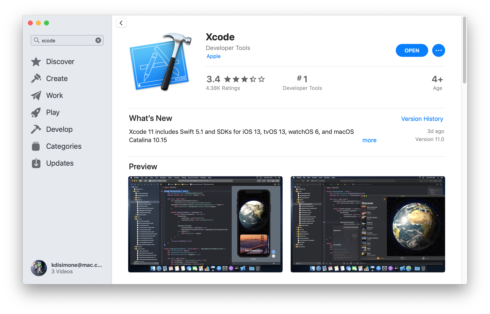
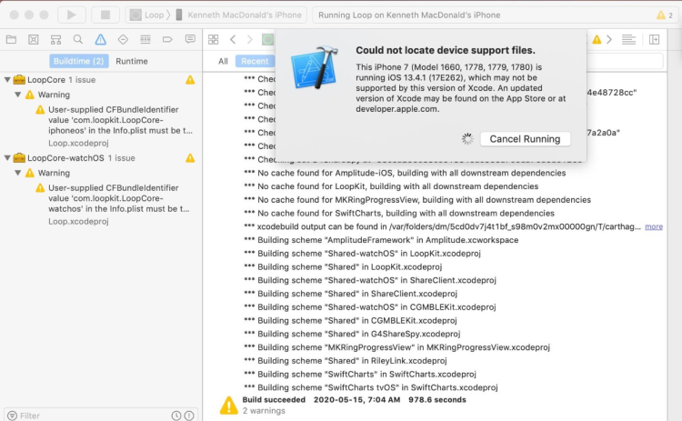

# Step 8: Download Xcode

!!! info "Time Estimate"
    - 45 minutes to 2 hours, depending on internet connection...but you don't need to babysit the download.

!!! abstract "Summary"
    - Check iPhone/iPod iOS version
        - The iOS version determines minimum Xcode version
        - The minimum Xcode version determines minimum macOS version
            - To make it even more fun, the minimum macOS depends on whether your Mac uses M1 or is Intel-based (Mac or VM)
        - If necessary, update [macOS](step1.md#check-your-macos) first and then return to this step
    - Download Xcode from your computer's App Store application

!!! question "FAQs"
    - **"Why isn't my Xcode installing?"** The two most common reasons are:
        1. lack of internet connection or
        2. not enough free space on the computer hard drive
    - Xcode is a large download, and it needs space to properly unpack and install itself
    - After Xcode has finished downloading (looks like the progress bar is almost completed), it takes a long time to unpack and install, be patient
    - For a new Xcode installation, at least 50GB of free space on your hard drive is required
        - If you get low on free space, you may have installation failures
        - [Check the Space Available](step1.md#check-the-space-available)

This step may take more time than the other steps, because the download takes a while. The good news is that you don't have to watch it. Instead, you can simply walk away once the download starts. If your laptop goes to sleep when you close the lid or when the screen saver starts - be sure to disable the screen saver and leave the laptop open. This is a big download, so don't expected this to be fast.

Xcode is a free application for Apple computers. Xcode will turn the Loop "raw" code into an iOS application and install it onto your iPhone/iPod. Make sure you have at least the minimum required macOS for this version of Xcode.

## Install Xcode

If you've done your homework (read this entire page) and are ready to download and install Xcode, here are the instructions:

- Open your App Store in your computer and search for Xcode
- You will be downloading it brand new or updating an existing installation
- If the version number you need is bigger than what is shown in the App Store, you need to update [macOS](step1.md#check-your-macos) first
    - This image is old (ignore the version number in this graphic)
    - For example, Xcode version 13.3 was released March 14, 2022

!!! warning "Direct Download"

    - If you previously did a direct download of Xcode, it will not show up in the App Store.
    - Either do another direct download or follow these directions in the Direct Download section to reconfigure so it will show up in the App Store.
        - [Direct Download of Xcode](updating.md#direct-download-of-xcode)

{width="750"}
{align="center"}

## Version Relationship Overview

Most people will update their iOS on their iPhones more often than they update their macOS or Xcode.  You know how it goes...you're tapping on your phone one day and it says there's a new version of iOS available for your phone. Want to update it now? Or be reminded of it later? Or maybe you even have the setting on your phone set to automatically install iOS updates.

Because the update looks so innocuous and we all lead busy lives, we forget that there might be consequences to iOS updates.

!!! info "Loop and iOS Updates"

    **Please Read**: [Turn Off Automatic Updates](step2.md#turn-off-automatic-updates)

!!! info "Minimum Xcode Version"

    The **minimum** version of Xcode you need is dependent on your version of iOS.

    **Please Read**: [Minimum Version List](#how-do-all-the-minimum-versions-relate-to-each-other)

!!! warning "Can't find the required Xcode version"
    - If your computer is not running at least macOS 12.0, the App Store won't show Xcode version 13.3
    - You must use iOS to determine which Xcode, which determines which macOS
    - Update your computer to at least that minimum macOS first

    Don't be the person who posts for help saying, "I'm trying to update my Loop app but am getting errors." When asked what Xcode version they have and if they've updated, they respond, "I don't have any Xcode updates available in the App Store, so I must be running the most current version."

    Actually, they forgot to check for [macOS](step1.md#check-your-macos) updates and therefore cannot see the needed Xcode update yet.

### After Update - Reboot

After any update of macOS or Xcode, things might not work the first time you try to build Loop.

Before posting for help - do a reboot and try again.

## How do all the minimum versions relate to each other?

The list below is for the **minimum** versions you'll need based on your iOS. The indication of a `color:linestyle` after the operating system nomenclature goes with the graphic found below.

**Newer** versions are always OK and should be used if your computer will accept the upgrade.

* If you are running an iPhone/iPod with iOS 15.4 or greater:
    * [macOS](step1.md#check-your-macos): version 12.0 (Monterey; green:solid)
    * Xcode: version 13.3
    * Expect the facts associated with iOS 15.4 or greater to change faster than LoopDocs will be updated
* If you are running an iPhone/iPod with iOS 15.0 to 15.3.1:
    * [macOS](step1.md#check-your-macos): version 11.3 (Big Sur; navy:dash)
    * Xcode: version 13
    * Note - at this point, your Apple Watch (if you use one) must be upgraded to watchOS 8.x
* If you are running an iPhone/iPod with iOS 14.5 through 14.8:
    * [macOS](step1.md#check-your-macos): version 11.0 (Big Sur; magenta:dash-dot)
    * Xcode: version 12.5
* If you are running an iPhone/iPod with iOS 14 through 14.4.x:
    * [macOS](step1.md#check-your-macos): version 10.15.4 (Catalina; cyan:dash) or if running an M1 Mac, version 11.0 (Big Sur; magenta:dash-dot)
    * If you build Loop using [Xcode 12.4 or earlier](../faqs/update-faqs.md#how-can-i-confirm-xcode-version-i-used)  - **do NOT upgrade that phone to iOS 15** - the Loop app will immediately stop working
    * Xcode: version 12.4
    * It is suggested you find a method to upgrade your computer if you are stuck on Catalina

Experienced Users:

* Once your macOS is at the correct level
* Instead of using the App Store to update Xcode, you can use the [Direct Download of Xcode](updating.md#direct-download-of-xcode)

### Wikipedia Chart for Apple Versions

This graphic (copied from Wikipedia and last updated March 2022) is not updated with every iOS update - use it as a map to read the minimum requirements.  Every attempt will be made to update the words in the [Minimum Version List](#how-do-all-the-minimum-versions-relate-to-each-other) promptly - that's much easier than updating a graphic.

Follow this link to [Wikipedia](https://en.wikipedia.org/wiki/Xcode) and scroll down to the the current version of this figure - the graphic shown below is a map of how to read the current version of this figure at Wikipedia.

{width="750"}
{align="center"}

## What happens if you try using too old of Xcode?

!!! danger "Breaking News"
    * If you try to build with a version of Xcode older than 11.4.1 you will get a Revoke Certificate message when you try to sign targets
    * Go to [Revoke Certificate Issue](updating.md#revoke-certificate-issue) to see the error message
    * Solution: update Xcode
          * Go to [Install macOS and Xcode updates](updating.md#step-1-install-macos-and-xcode-updates)

It isn't some catastrophic failure if you try to build with an outdated Xcode without realizing it. If the build fails, nothing happens to your phone (or Loop on your phone if you are rebuilding).  Nothing is copied from the computer to the phone until after you see the Build Succeeded message. You'll see a pretty obvious error message during your Loop build that says "Could not locate device support files." That messages is telling you that your iOS on the phone requires you to get a newer version of Xcode to be able to build Loop onto that phone.

{width="750"}
{align="center"}

So, if you see that error message, realize you may have to update your macOS to be able to see the newest Xcode version that you will need. Make sure to check that chart to see what your minimum versions are for the iOS you are running on your iPhone.

## Next Step: Xcode Preferences

Now you are ready to move onto Step 9 to [work on Xcode Preferences](step9.md).
