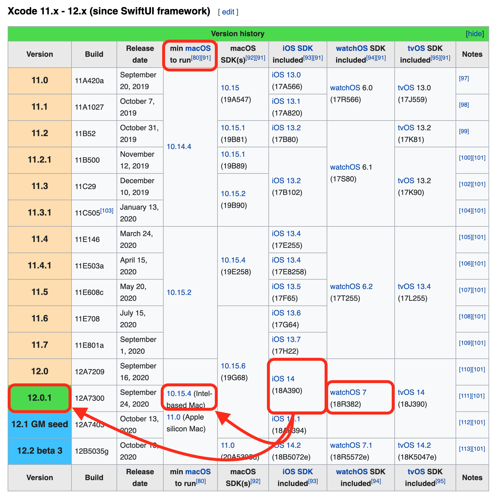

# Step 8: Download Xcode

!!! green "Time Estimate"
    - 45 minutes to 2 hours, depending on internet connection...but you don't need to babysit the download.

!!! info "Summary"
    - Check iPhone/iPod iOS version
        - The iOS version determines minimum Xcode version
        - The minimum Xcode version determines minimum macOS version
        - If necessary, update macOS
    - Download Xcode from your computer's App Store application

!!! faqs "FAQs"
    - **"Why isn't my Xcode installing?"** The two most common reasons are:
        1. lack of internet connection or
        2. not enough free space on the computer hard drive
    - Xcode is a large download, and it needs space to properly unpack and install itself
    - You need at least 50GB of free space on your hard drive before starting
    - If you get low on free space, you may have installation failures
        - You can check your free space by clicking on the `About this Mac` (see Build Step 1) and clicking the `Storage` tab

This step may take more time than the other steps, because the download takes a while. The good news is that you don't have to watch it. Instead, you can simply walk away once the download starts. If your laptop goes to sleep when you close the lid or when the screen saver starts - be sure to disable the screen saver and leave the laptop open. This is a big download, so don't expected this to be fast.

Xcode is a free application for Apple computers. Xcode will turn the Loop "raw" code into an iOS application and install it onto your iPhone/iPod. Make sure you have at least the minimum required macOS for this version of Xcode.

## Install Xcode

If you've done your homework (read this entire page) and are ready to download and install Xcode, here are the instructions:

- Open your App Store in your computer and search for Xcode
- You will be downloading it brand new or updating an existing installation
- If the version number you need is bigger than what is shown, stop and review the rest of this page
    - This image is old - latest Xcode version is 12.4 (March 17, 2021)

{width="750"}
{align="center"}

## How do all the minimum versions relate to each other?

Most people will update their iOS on their iPhones more often than they update their macOS or Xcode.  You know how it goes...you're tapping on your phone one day and it says there's a new version of iOS available for your phone. Want to update it now? Or be reminded of it later? Or maybe you even have the setting on your phone set to automatically install iOS updates.

Because the update looks so innocuous and we all lead busy lives, we forget that there might be consequences to iOS updates.

!!! green "Loop and iOS Updates"

    **Please Wait** - Disable the automatic iOS update.

    Most of the time, the consequence to an iOS update is nothing immediate. Your Loop app won't die, it will keep humming along. But sometimes, there is a problem with either Loop or the Dexcom app.  

    Be patient, check social media for the "OK to Update iOS Message" and then update your iOS. This normally only takes a few days.  

    If there is a problem with the iOS update, it's usually solved quickly. The solution will generally require a rebuild.  So in that case, plan to rebuild before updating the iOS.

!!! info "Minimum Xcode Version"

    The **minimum** version of Xcode you need is dependent on your version of iOS

      - If your phone is running iOS 14.x, that requires at least Xcode 12.x
      - If your phone is running iOS 14.1, Xcode 12.1 works, but so does 12.4
      - If your phone is running iOS 12.4, Xcode 12.4 on a mac with macOS 11.2.2 (Big Sur) builds Loop just fine
      - If you are running iOS 14, we recommended you update to at least iOS 14.4, Xcode to 12.4; some iOS 14 updates were pretty important
      - All iOS 14 versions require macOS 10.15.4 as a minimum

!!! warning "Can't find the required Xcode version"
    - If your computer is running macOS 10.15.2, the App Store won't show Xcode version 12
    - You must use iOS to determine which Xcode, which determines which macOS
    - Update your computer to at least that minimum macOS first

    Don't be the person who posts for help saying, "I'm trying to update my Loop app but am getting errors." When asked what Xcode version they have and if they've updated, they respond, "I don't have any Xcode updates available in the App Store...so I must be running the most current version." Actually, they forgot to check for macOS updates and therefore cannot see the needed Xcode update yet.

The chart below is a helpful map of how to read of the minimum versions you'll need based on your iOS. (Note: this graphic is not updated with every iOS update - go to the link provided and use this figure as a map to read the minimum requirements.)  Every attempt will be made to update the words promptly - that's much easier than updating the figure.

* macOS: If you are running an iPhone with iOS 14, you need to make sure your macOS is 10.15.4 at a minimum as the first step. If you don't have the minimum version, go to [Step 1 Compatible Computer](step1.md#check-your-macos) and follow directions for updating your macOS.

* Xcode: Now that your macOS is updated to at least 10.15.4, the App Store in your computer will have Xcode 12.4 (or newer) available for you to download/update.

(Source for the chart is [wikipedia](https://en.wikipedia.org/wiki/Xcode). Remember - follow the link and scroll down to the figure to actually check versions - the graphic shown below is a map of how to read the figure at wikipedia.)

{width="750"}
{align="center"}

## What happens if you try using too old of Xcode?

It isn't some catastrophic failure if you try to build with an outdated Xcode without realizing it. If the build fails, nothing happens to your phone (or Loop on your phone if you are rebuilding).  Nothing is copied from the computer to the phone until after you see the Build Succeeded message. You'll see a pretty obvious error message during your Loop build that says "Could not locate device support files." That messages is telling you that your iOS on the phone requires you to get a newer version of Xcode to be able to build Loop onto that phone.

{width="750"}
{align="center"}

So, if you see that error message, realize you may have to update your macOS to be able to see the newest Xcode version that you will need. Make sure to check that chart to see what your minimum versions are for the iOS you are running on your iPhone.

## Next Step: Xcode Preferences

Now you are ready to move onto Step 9 to [work on Xcode Preferences](step9.md).
