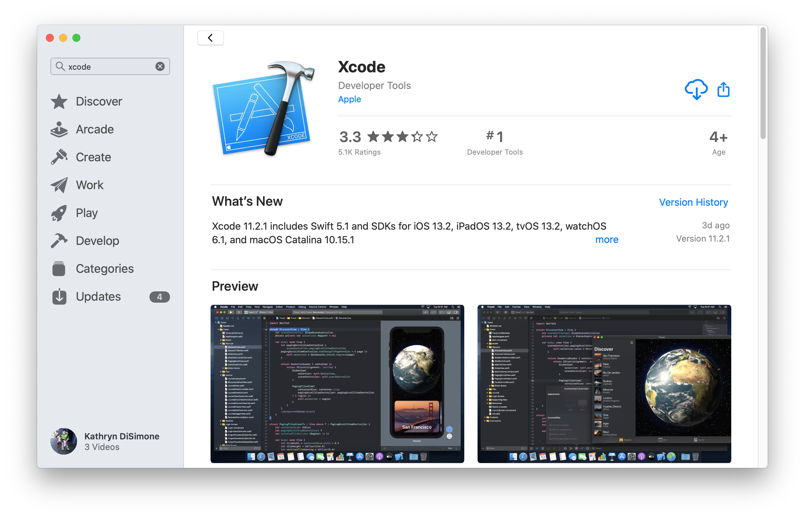

# Download Xcode

!!! info "Time Estimate"
    - 45 minutes to 2 hours, depending on internet connection...but you don't need to babysit the download.

!!! abstract "Summary"
    - Check iPhone/iPod iOS version
        - The iOS version determines minimum Xcode version
        - The minimum Xcode version determines minimum macOS version
            - To make it even more fun, the minimum macOS depends on whether your Mac uses M1 or is Intel-based (Mac or VM)
        - If necessary, update [macOS](step1.md#check-your-macos-version) first and then return to this step
    - Download Xcode from your computer's App Store application

!!! question "FAQs"
    - **"Why isn't my Xcode installing?"** The two most common reasons are:
        1. lack of internet connection or
        2. not enough free space on the computer hard drive
    - Xcode is a large download, and it needs space to properly unpack and install itself
    - After Xcode has finished downloading (looks like the progress bar is almost completed), it takes a long time to unpack and install, be patient
    - For a new Xcode installation, at least 50GB of free space on your hard drive is required
        - If you get low on free space, you may have installation failures
        - [Check the Space Available](step1.md#check-the-space-available)

Although the download takes a long time, the good news is you can walk away once the download starts. If your laptop goes to sleep when you close the lid or when the screen saver starts, disable the screen saver and leave the laptop open.

!!! question "Can I use an External Drive"
    Xcode needs to be on the Mac hard drive. But other things, like photos and documents can be moved to an external drive to make room for macOS and Xcode updates.

Xcode is a free application for Apple computers. Xcode will turn the Loop "raw" code into an iOS application and install it onto your iPhone/iPod. 

## Install Xcode

Please read this entire page.  First, choose a version of Xcode appropriate for your iOS device. Then, determine the minimum macOS version required for that Xcode version.  Update to at least that minimum macOS version.  Then follow the instructions to download and install Xcode or update an existing installation:

- Open your App Store in your computer and search for Xcode
- You will be downloading it brand new or updating an existing installation
- If the version number you need is bigger than what is shown in the App Store, you need to update [macOS](step1.md#check-your-macos-version) first
    - Do not rely on the version number in this graphic

{width="750"}
{align="center"}

## Version Relationship Overview

Have you turned off automatic updates on your iOS device?

!!! info "Loop and iOS Updates"

    **Please Read**: [Turn Off Automatic Updates](step2.md#turn-off-automatic-updates)

Before manually accepting an iOS update, be sure you have compatible versions of Xcode and MacOS.  

!!! info "Minimum Xcode Version"

    The **minimum** version of Xcode you need is dependent on your version of iOS.

    **Please Read**: [Minimum Version List](#how-do-all-the-minimum-versions-relate-to-each-other)

!!! warning "Can't find the required Xcode version"
    - If your computer is not running the required minimum macOS, the App Store won't show the required minimum Xcode version
    - You must use iOS to determine which Xcode, which determines which macOS
    - Update your computer to at least that minimum macOS first

    Don't be the person who posts for help saying, "I'm trying to update my Loop app but am getting errors." When asked what Xcode version they have and if they've updated, they respond, "I don't have any Xcode updates available in the App Store, so I must be running the most current version."

    Actually, they forgot to check for [macOS](step1.md#check-your-macos-version) updates and therefore cannot see the needed Xcode update yet.

### After Update - Reboot

After any update of macOS or Xcode, it is always a good idea to reboot.

## How do all the minimum versions relate to each other?

The list below is the **minimum** versions you'll need based on your iOS. The highlighted sections, coordinated by `color and linestyle` in the graphic below, tie together the operating system nomenclature in the following bullets. The graphic is not updated as frequently as the words.

**Newer** versions are always OK and should be used if your computer will accept the upgrade.

* For iOS 16 or greater, minimum [macOS](step1.md#check-your-macos-version) is 12.5
    * Minimum Xcode version is 14
* For iOS 15.4 to 15.7, minimum [macOS](step1.md#check-your-macos-version) is 12.0
    * For iOS 15.5 to 15.7, minimum Xcode version is 13.4.x
        * WARNING, first build to phone newly updated to iOS 15.7, cannot use Xcode 14.0; Xcode 13.4.1 and 14.0.1 (or greater) are fine
    * For iOS 15.4.x, minimum Xcode version is 13.3
* For iOS 15.0 to 15.2.x, minimum [macOS](step1.md#check-your-macos-version) is 11.3
    * For iOS 15.2.x, minimum Xcode version is 13.2
    * For iOS 15.0.x, minimum Xcode version is 13.0
* For iOS 14.5.x, minimum [macOS](step1.md#check-your-macos-version) is 11.0
    * For iOS 14.5.x, minimum Xcode version is 12.5
* If you built Loop using [Xcode 12.4 or earlier](../faqs/update-faqs.md#how-can-i-confirm-xcode-version-i-used)
    - **do NOT upgrade that phone to iOS 15** - the Loop app will immediately stop working
    - First upgrade macOS and Xcode and rebuild on phone, then upgrade the iOS
* For iOS 14.0 to 14.4.x, minimum [macOS](step1.md#check-your-macos-version) is 11.0 (M1/M2), 10.15.4 (Intel)
    * For iOS 14.4.x, minimum Xcode version is 12.4
    * For iOS 14.3.x, minimum Xcode version is 12.3
    * For iOS 14.2.x, minimum Xcode version is 12.2
    * For iOS 14.1.x, minimum Xcode version is 12.1
    * For iOS 14.0.x, minimum Xcode version is 12.0

### Wikipedia Chart for Apple Versions

This graphic (copied from Wikipedia and last updated March 2022) is not updated with every iOS update - use it as a map to read the minimum requirements.  Every attempt will be made to update the words in the [Minimum Version List](#how-do-all-the-minimum-versions-relate-to-each-other) promptly - that's much easier than updating a graphic.

Follow this link to [Wikipedia](https://en.wikipedia.org/wiki/Xcode) and scroll down to the the current version of this figure - the graphic shown below is a map of how to read the current version of this figure at Wikipedia.

{width="750"}
{align="center"}

## What happens if you try using too old of Xcode?

It isn't some catastrophic failure if you try to build with an outdated Xcode without realizing it. If the build fails, nothing happens to your phone (or Loop on your phone if you are rebuilding).  Nothing is copied from the computer to the phone until after you see the Build Succeeded message. You'll see a pretty obvious error message during your Loop build that says "Could not locate device support files." That messages is telling you that your iOS on the phone requires you to get a newer version of Xcode to be able to build Loop onto that phone.

{width="750"}
{align="center"}

So, if you see that error message, realize you may have to update your macOS to be able to see the newest Xcode version that you will need. Make sure to check that chart to see what your minimum versions are for the iOS you are running on your iPhone.

With Loop 3, there is a new error when the Xcode version does not support the phone iOS. You will see [Package.resolved file corrupted or malformed](build_errors.md#packageresolved-file-corrupted-or-malformed)

## Next Step: Xcode Preferences

Now you are ready to set up [Xcode Preferences](step9.md).
