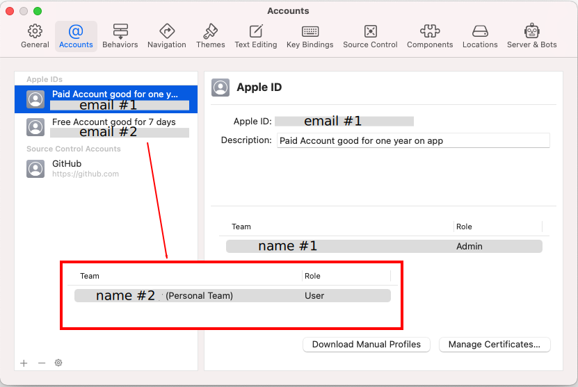

# Step 9: Xcode Preferences

!!! info "Time Estimate"
    - about 10-15 minutes to install the Command Line Tools
    - 5 minutes to add your Apple ID, assuming you remember your password

!!! abstract "Summary"
    - Open Xcode Preferences and add your Apple ID under the Accounts tab.
    - Verify that Command Line Tools has been properly installed under Xcode Preferences under the Locations tab.

!!! question "FAQs"
    - **"I still only see an account with `(personal team)` beside it even though I enrolled in the paid Developer Account program...what should I do?"** You should check your spam email box in case Apple sent you an email there. Make sure you've waited the 48 hours that Apple says it may take to get your account approved. If it's been 48 hours and you still don't see anything in your email, contact Apple support and ask them about the status of your enrollment. It may be held up by something on their end.

Since you've been working in order, you will now have Xcode installed on your computer from Step 8. You will also have enrolled in the Apple Developer program with a paid account, if that was your selection, in Step 6. Now we need to tell Xcode about your Developer Account. But first a few more steps.

**Did your computer reboot following the Xcode installation. If not, reboot now.**

Open Xcode from your Applications folder. If it offers to start a new project with you, just close that window.

## Command Line Tools

There may be a short delay the very first time you open Xcode because it will install a package of tools. Don't close that window out, let it finish. You need those Command Line Tools.

Helpful tip: When the Command Line Tools installation is done and the pop-up window closes, check that your Command Line Tools installed correctly. Open Xcode's Preferences by clicking on the word **`Xcode`** in the top menu bar (just to the right of the Apple icon in the upper-left corner) and selecting `Preferences` in the drop-down menu. Then select the `Locations` tab of Preferences window and you'll see the dropdown menu for Command Line Tools.

* Make sure the Xcode version listed matches what you just installed (not the version in this graphic)
* If it's blank, use the blue arrows to the right of the Command Line Tools row to select it

{width="750"}
{align="center"}

## Simulator Download

Starting with Xcode 12, the simulators were not being downloaded automatically; and you were required to download them yourself.

With Xcode 13, things changed again. You are no longer required to download simulators manually and with Xcode 13.2.1, they are no longer shown.

### For Xcode 12 ONLY

While still on the Xcode Preferences window, after adding command line tools using the Locations tab, click on the Components tab.  It should look similar to the first figure below.

Choose the iOS operating system closest to the one on your phone and click the down arrow to install it. (If your phone has iOS 14.4, and the biggest number simulator you see is iOS 14.3, download that one. If you phone has iOS 13.3, first we recommend updating, but if you choose not to, then select iOS 13.3 from the list.)

Then scroll down to find the watchOS lines and choose the operating system on your watch (or biggest number if you don't have a watch paired) and click the down arrow to install it.

Simulator download is now initiated and will continue in the background. You can keep going with the next steps, but let download complete before trying to build.

If you see no simulators in this window - you probably missed the note above - not needed for Xcode 13.

{width="750"}
{align="center"}

{width="750"}
{align="center"}

## Add Apple ID

Go to the Xcode Preferences window from above, click on the `Accounts` tab and then press the `+` in the lower-left corner to add an Apple ID account.

{width="750"}
{align="center"}

### Xcode Accounts Tab

The Xcode Accounts Tab, shown in the graphic (from Xcode 13) below allows you to have more than one account available to choose from when you sign your targets (another new term - don't worry about it - this will be explained later).  Normally, you would only have one.  In order to get the Paid (email #1, name #1) and Free developer options to generate this graphic and test building with a free account, a new Apple ID was associated with a different email.  This second account (email #2, name #2) does not have a paid developer account associated with it.

In the graphic, whichever item is selected on the left side (highlighted by Xcode in blue) shows up with more details on the right side of the display. If the Free account had been selected, the information shown in the red inset would have been displayed.

### Free Developer Account

If you want to use a free developer account, you will simply enter your Apple ID in this section and Xcode will automatically enroll your Apple ID in the free developer program. It will show up with the `(Personal Team)` and `User` indication.

### Paid Developer Account

If you enrolled in the paid account already and have confirmation that your account is active, enter the Apple ID of the paid developer account. It will show up with just your name and the `Admin` indication. If you have enrolled and are waiting, the `(Personal Team)` and `User` indication shows up until the paid account is confirmed by Apple.

!!! note "Description"
    The description line is initially empty. The added text about Paid and Free Account was added in an attempt to make the two types of accounts more obvious when making this graphic.  If you want, you can add your own description or just leave the line blank. When you put text in the decription line - it shows up in two places: To the left, just above the email address and to the right once that Apple ID is selected.

{width="750"}
{align="center"}

You are now done setting up Xcode.  Great job!  You will not need to redo the account setup steps on any subsequent builds or updates of your Loop app.  Xcode will remember these settings.

## Next Step: Test Settings

Now you are ready to move onto Step 10 to [Test Your Settings](step10.md).
