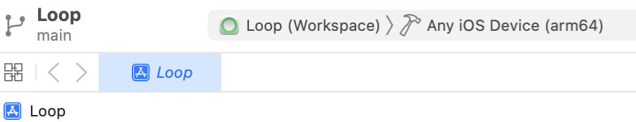
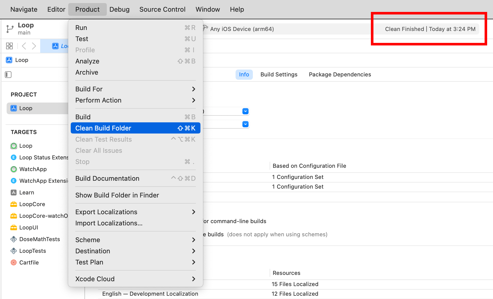
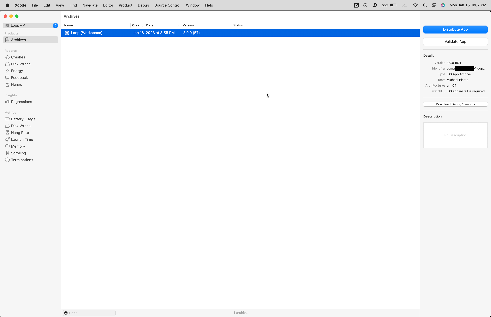
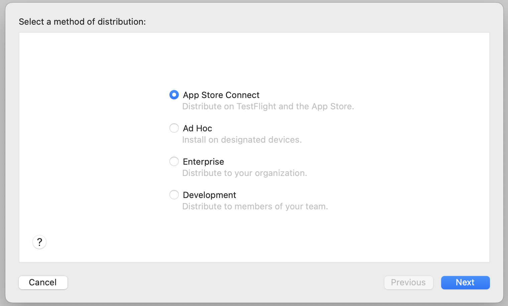
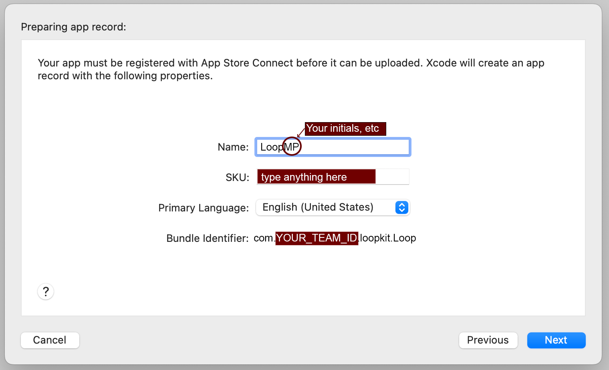
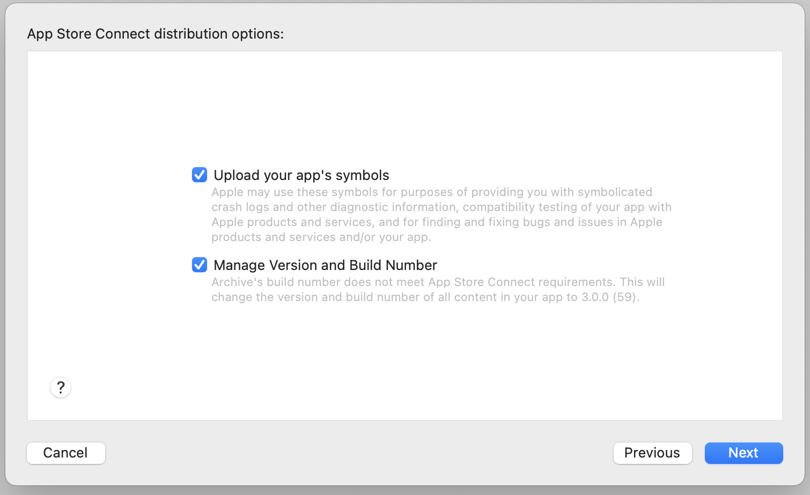
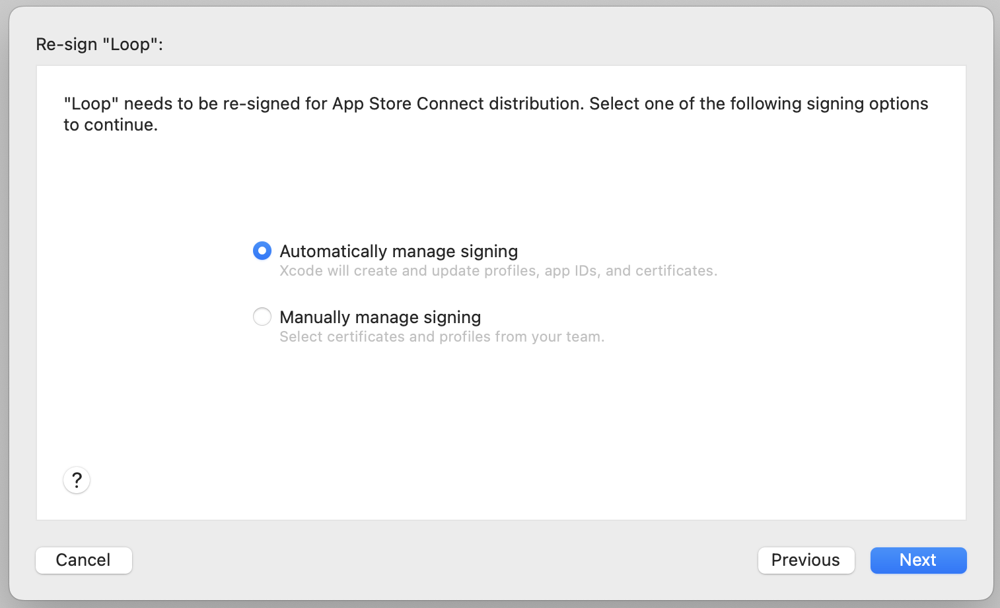
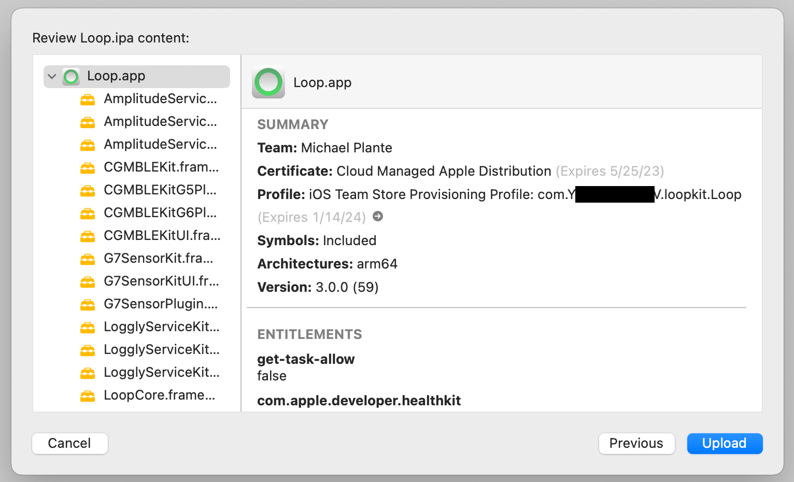
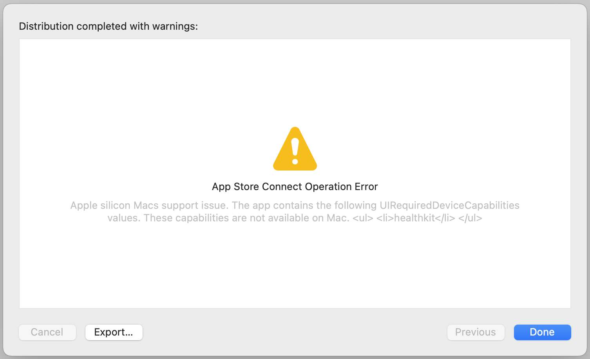
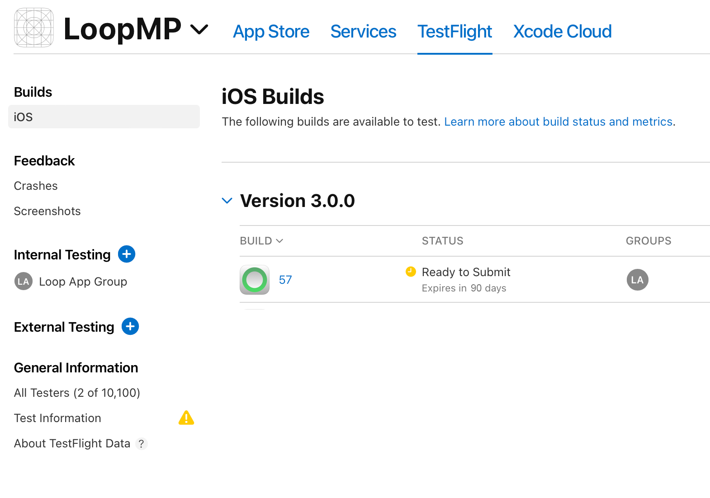

## Introduction

There are several different methods for making use of TestFlight:

* Test an app someone else is developing
* Use the [Build with Browser](../browser/bb-overview.md) method to build and distribute your Loop app to your iPhone or that of a family member
* Use *TestFlight* as a remote distribution (and backup) for an app you build using *Xcode*

This guide can also be followed to install other apps you build with *Xcode* via *TestFlight*. Examples include <code>LoopFollow</code>, <code>LoopCaregiver</code> and <code>xDrip4iOS</code>.

Some useful features of using TestFlight to install Loop:

* You don't need to plug your phone into your computer
* You can update Loop on your kid's phone while they're away at college
* Reinstalling Loop on the fly is quick and easy from your phone, even if you accidentally delete the app, see [Protect that App](build-app.md#protect-that-app), or need to install Loop on a brand new phone

Since apps built with TestFlight expire after 90 days, it is suggested you also setup a build using the [Build with Browser](../browser/bb-overview.md) method even if you don't plan on using it. The GitHub build can be updated in a few minutes from any browser and is an extra layer of protection in these scenarios if you do not have access to your Mac for a rebuild:

* Your Xcode built Loop in TestFlight expires
* An urgent update to Loop is released

In all cases, except accidental deletion of Loop or loss of phone, the Loop you install from TestFlight builds over your existing app and you keep all your settings including your pump.

## Build to TestFlight via Xcode

### Initial Steps

Before creating the app or uploading it to *TestFlight*, use the [Build with *Mac*](../build/overview.md) guide to [sign your targets](../build/build-free-loop.md#select-signing-capabilities-tab) and build Loop to a [simulator phone](../build/build-free-loop.md#build-to-a-simulator) in Xcode. This checks to ensure the app you upload to your TestFlight will work as expected.

### Archive the Project

Change the build target to from building to a simulated phone to **LoopWorkspace > Any iOS Device (arm64)** like the image below.

{width="700"}
    {align="center"}

Now go to the top menu and choose **Product > Clean Build Folder**. Once it's done, it should say "Clean Finished".

{width="700"}
    {align="center"}

Go back to the top menu and choose **Product > Archive**. This will build Loop into a file rather than a phone or simulator. It should take about the same amount of time as building to a phone or simulator does.

## Upload the Archive

Once the archive finishes building, it should automatically open the **Archives** window. If you want to open this window without re-archiving, click the following in the top menu: **Xcode > Window > Organizer**.

{width="700"}
    {align="center"}

Select the archive and click **Distribute App**. If you've archived the project before, be sure to select the archive you intend to upload - most likely the one with the most recent **Creation Date**. 

On the next screen, **App Store Connect** is selected by default. Click **Next**.

{width="700"}
    {align="center"}

On the next screen, **Upload** is selected by default. Click **Next**.

{width="700"}
    {align="center"}

### First-Time Archive Upload

If you have already created a TestFlight for Loop via Xcode or the GitHub Build method, the next screen will not be shown, so skip ahead to [Subsequent Archive Upload](#subsequent-archive-upload).

If this is the first time you're creating a TestFlight for Loop, enter the following on the next screen and click **Next**:

* **Name:** Enter a name that is unique. Most people just use "Loop" followed by their initials, so James Kirk would use "LoopJK". If he gets an error that the name is already taken, he might try something like "LoopJTK" or "Loop_JTK_1701".
* **SKU:** This can be anything, but it can't be the same SKU that you've used for a different app that you've created a TestFlight for. Ideally, just leave it as the autofilled bundle id.
* **Primary Language:** Set this to your primary language.
* **Bundle Identifier:** This should already be autofilled. If it's not, it should be "com.YOUR_TEAM_ID.loopkit.Loop". Make sure you replace YOUR_TEAM_ID with your actual TEAM ID, which you can find at [developer.apple.com/account](https://developer.apple.com/account).

{width="700"}
    {align="center"}

### Subsequent Archive Upload

On the next screen, leave everything checked and click **Next**.

{width="700"}
    {align="center"}

On the next screen, leave it set to **Automatically manage signing** and click **Next**. You will see a few messages as it performs some tasks. Be patient.

{width="700"}
    {align="center"}

When you see the next screen, click **Upload**.

{width="700"}
    {align="center"}

Wait until uploading is finished. Don't be alarmed if you see the following screen, just click **Done**.

{width="700"}
    {align="center"}

## Deploy App

Now that it's uploaded to TestFlight, it will take a little bit before it finishes processing and becomes available for installation on your iPhone. You can check [appstoreconnect.apple.com/apps](https://appstoreconnect.apple.com/apps) to find it's progress by clicking **Test Flight** and then **iOS** under **Builds** in the upper left. Once it no longer says "Processing" and instead says "Ready to Submit" next to the build's number, it should be available and ready to install on your iPhone.

{width="700"}
    {align="center"}

To install Loop from TestFlight onto your iPhone, follow the instructions on the [GitHub Deploy](../browser/phone-install.md) page.

## Update App

Apps installed via TestFlight are only valid for a maximum of 90 days, so you must upload a new build to TestFlight at least every 90 days.

To update, simply repeat all the steps on this page.

!!! warning "Add a Calendar Reminder"
    Note that the built-in Loop Notification for expiration has not been modified to read TestFlight expiration, yet.

    So, please add a calendar reminder.
