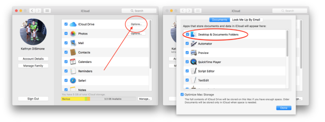

# Updating Loop

When a new version of Loop is released, you can click [HERE](https://github.com/LoopKit/Loop/releases) to read what features or fixes were a part of the new release.

The process to update is very similar to the original building of Loop app, except you get to skip a couple of the early steps.  The update steps are:

1. Update macOS, Xcode, iOS, and/or watchOS
2. Download updated Loop code
3. Open in Xcode, sign targets
4. Add optional code customizations
5. Build onto your iPhone
6. Resolve Build Errors

You do not have to delete your existing app. The new app update will simply overwrite the old app and save all your old settings and information.

## When to Update

You will have to rebuild your Loop app at a minimum once every 12 months. The apps built and signed by you in Xcode with a paid developer account will only last for 12 months before they expire and need rebuilding. So, at least once per year you will have to rebuild your app and go through this update process.

Under ordinary circumstances, you do not *have to* update your Loop app until you are ready to grab new features. However, we encourage regular updates when a new version is released because they often contain bug fixes or improvements which may increase operational stability.

## Step 1: Update macOS and Xcode

!!!info "Omnipod and iOS 12.2 users"
    If you are going to use either Omnipod-testing branch, Dev branch, or iOS 12.2, you will need to update to macOS 10.14.3 (Mojave) at a minimum. After you update your macOS, make sure you grab updated Xcode of 10.2 at a minimum. **Both those updates are required.**

!!!info "Update to Homebrew and Carthage"
    For people who have already built Loop before, there's an extra step needed for your first update since the recent round of updates. We need you to update Homebrew and Carthage, but this is quick and easy. Please open Terminal app and copy & paste the following `brew update && brew upgrade carthage`. When the update finishes, you should have carthage 0.33.0 installed. All done! 

Between Loop app builds, there's a high liklihood that Apple has updated one or more of the systems involved in your Loop app. <u>If you miss macOS or Xcode updates, you may run into build problems. Do not skip these steps before updating Loop.</u> 

* update your macOS by clicking on your apple icon in the computer's upper left corner and then selecting "Software Update" button. If your macOS needs an update, this will lead you there. **You MUST use macOS 10.14.3 (Mojave) at a minimum, if:**

    * You want to use omnipod or Loop-dev branches, and/or
    * Your iPhone or iPod touch is using iOS 12.2 or newer  

    (You can only use macOS 10.13.6 High Sierra if you are building with Loop master branch <u>and</u> have iOS 12 or 12.1. The next version of Loop will require Mojave at a minimum, so keep that in your planning for the future.)

* update your Xcode by opening the App Store application in your computer and selecting the "Updates" from the left-hand column. If an Xcode update is available, install the update before moving on with Loop updates.  You need Xcode 10.2 at a minimum if you are building with Omnipod-testing, dev, or iOS 12.2.

* update your iPhone's iOS. To check if an iOS update is available, click on your iPhone's Settings, General, Software Update and then click on "install update" button if one is available. You need iOS 12 at a minimum.

* update your Apple Watch's watchOS. To check if a watchOS update is available, click on your Watch App in your paired iPhone and then go to Settings, General, Software Update and then click on "install update" if one is available. You need watchOS 4.1 at a minimum, but watchOS 5 or later is recommended.

## Step 2: Download Updated Loop Code

After you've finished the updates to your devices listed above, you can move onto downloading updated Loop code. You will not be simply using your old downloaded Loop code (and in fact, you can delete those old folders now if you want). Click on **ONE** of the links below to download an updated versions of Loop code:
  

[Loop: Master branch source code](https://github.com/LoopKit/Loop/archive/master.zip)

 

**OR**  
[Loop: Dev branch source code](https://github.com/LoopKit/Loop/archive/dev.zip)

 

**OR**  
[Loop: Omnipod-testing branch source code](https://github.com/LoopKit/Loop/archive/omnipod-testing.zip) <---not live yet, don't freak out

 

!!!info "Reminder"
    Best practice is to leave your Loop code in your Downloads folder.  If you store your Loop code a different folder than Downloads (such as your Documents folder or Desktop), make sure the specified folder is **not** an iCloud drive.  Storing your Loop code in an iCloud drive folder will prevent Loop from building successfully.  How do you know if a folder is an iCloud drive?  Check your System Preferences.  If your System Preferences for iCloud is set as shown below, your Documents and Desktop folders are iCloud drives and **NOT** appropriate places to save your Loop download.
    

    
    
 
    Depending on your browser and settings, your Loop download may or may not automatically unzip.  If it does not unzip automatically, you can right-click on the zip file and choose to "Open With" Archive Utility.  This will create a blue folder called `Loop-master`.  HOWEVER, if you already have an existing `Loop-master` folder from a previous download, the name of the next download will be something like `Loop-master (1)`.  The problem with that folder name is that it contains a space...and spaces in the name will cause your Loop build to fail.  So, either delete old copies of Loop before downloading/unzipping or rename the folder(s) to ensure that NO SPACES are in the folder name.
    

    
    

## Step 3: Open in Xcode, Sign Targets

Double click the Loop folder in your Downloads folder, and then double click the `Loop.xcodeproj` to open the Loop project in Xcode. Navigate, as you did when you originally built the app, to the four target areas. Sign the four targets with your developer team name. Remember that the "(personal team)" in the signing team's name indicates that is a free account and the app will only last for 7 days if you sign with that team name.

## Step 3: Add Code Customizations

Add or redo any code customizations, if needed.  These will not be carried over automatically from the old app.  Be sure to read up in the [code customizations section](https://loopkit.github.io/loopdocs/build/code_customization/) before building, as there may be new customizations available since the previous build.

If you are building with a free account, you will have to remove the Siri capabilities in order to build.

## Step 4: Build to your iPhone

Plug your iPhone into the computer, unlock it so that the phone does not fall asleep during the build process.  You can find this setting under Settings, Display & Brightness, Auto-Lock, set to "Never". You can return to your normal lock settings after the build is done.  

Select your iPhone from the top of the device list near Loop's window's upper left area, and then press the triangle "build" button similar to how you did your original Loop build.

**NOW BE PATIENT.**  Loop will take a long time to build; between 25-45 minutes depending on your computer.  The Loop build process will appear to stall or hang a very long time on one build step in particular. Do not worry. This is normal. One step will take a significant amount of time relative to all the other steps. Once that long step is done, the rest will fly by fairly quickly.

At the end of all the steps, you will either get a Build Succeeded or Build Failed message.

* If your build suceeded, you can unplug your phone and move on with Looping. Your new Loop version will be displayed in the top of your Loop Settings screen.  
* If your build failed, you will need to go to Step 5 below.

## Step 5: Resolve Build Errors

**If you get any red build errors or a "Loop Build Failed" message, please check [this section](https://loopkit.github.io/loopdocs/build/build_errors/) for fixes.**

