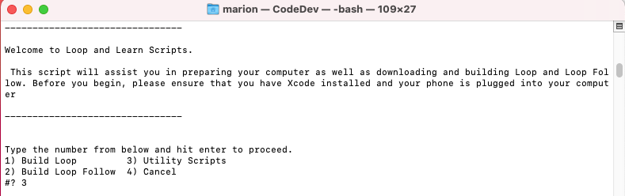
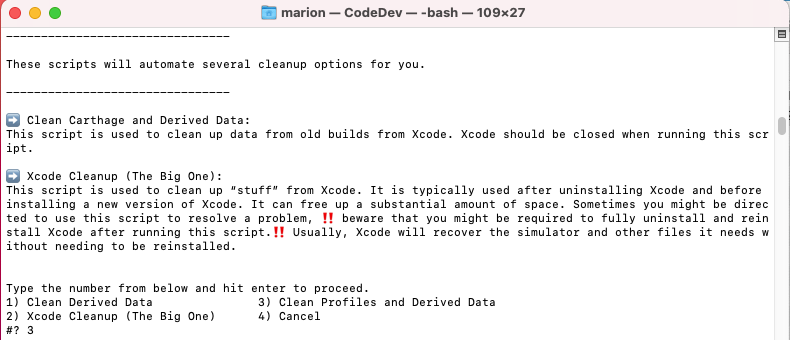
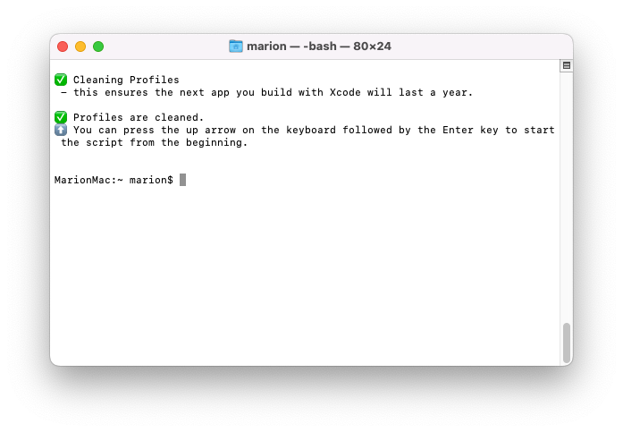
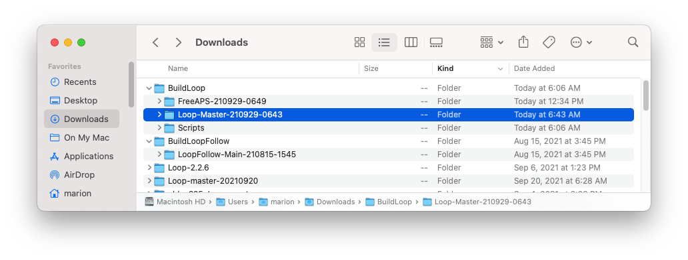
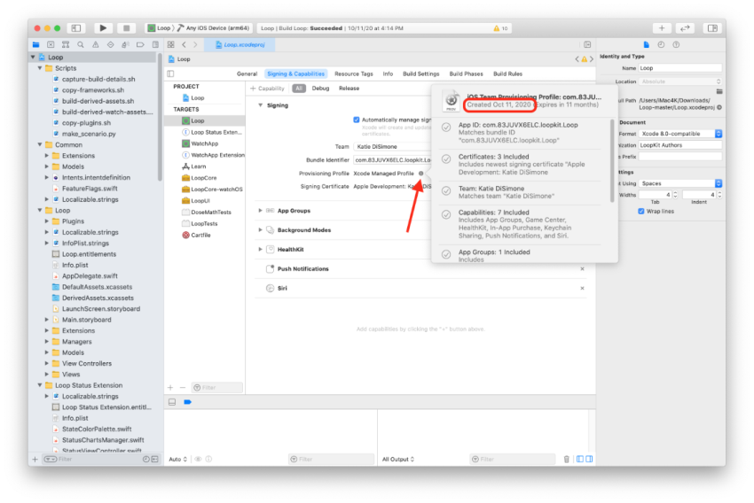
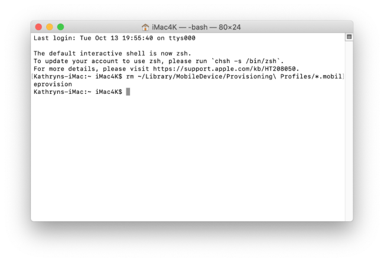
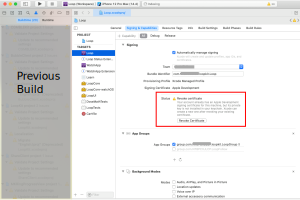
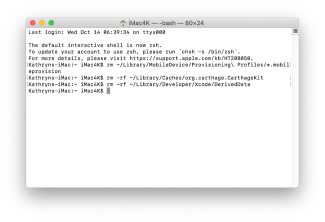

# Updating Loop

!!! info "Time Estimate"

    - 25 minutes, if already have updates done
    - 40-90 minutes, if need to install Apple update(s)

!!! abstract "Summary"

    * Step 1: Install macOS and Xcode updates based on your phone iOS
    * Step 2: Check your Developer Account
    * Step 4a and 4b: Delete provisioning profiles and derived data
    * Step 3: Download Updated Loop code and Build Loop
        * Follow the link to Step 14

!!! question "FAQs"

    - **"What is an update?"** Anytime you want to change versions, add or change a customization, follow the instructions on this page.
    - **"Do I delete my old Loop app first?"** Definitely **not**! If you keep your Loop app on your phone, your Loop settings (and existing pod) will continue to work the same after the update. Seamless.
    - **"Do I need to start a new pod when I update?"** No. Your existing pod session will continue seamlessly if you are using the same Developer Account to sign the Loop app targets as you did the last time you built.
    - **"What if I'm using a new/different developer account?"** If you aren't building with the same developer account used when your existing app was built (this includes going from free to paid), then you will be installing a brand new (second) Loop app on your phone. Your existing pod won't work with the new app, so you might want to time this transition when you are due to change pods. Delete the old app once you get the new one all set up.
    - **"What if it is a new computer but the same developer account?"** No big deal...repeat Build Steps 1, 8 and 9 with your new computer.

## When to Update Loop

Under ordinary circumstances, you do not *have to* update your Loop app until it expires (1 year for a paid account). However, we encourage regular updates when a new version of iOS, or of Loop, is released because they often contain bug fixes or improvements which may increase operational stability.

!!! abstract "Best Practice"

    It is good practice to first check if your computer (macOS or Xcode) will require an update to support building Loop to your phone BEFORE applying an iOS update to your Looping phone. This [page](https://loopandlearn.org/version-updates) is a good reference to check for each iOS version to provide an all clear.

    Follow these "safe Looping" steps:

    1. [Update macOS / Xcode](step1.md#macos) if needed
    1. Check [Loop Release](../faqs/release-faqs.md#loop-release) status - if there is new code, you should download it
    1. Build app to your iPhone
    1. Then update your iPhone iOS

[Loop Releases](../faqs/release-faqs.md#loop-releases) provides information about current and previous Loop versions.

The apps built and signed by you in Xcode with a paid developer account will only last for 12 months before they expire and need rebuilding. So, at least once per year you will have to rebuild your app and go through this update process. If you do not update and the "provisioning profile" on your phone expires, you will see this message:

### "Loop" is No Longer Available

When you see "Loop" is No Longer Available on your phone, the only solution is to rebuild the app.  All of your settings are still present on your phone, but your "provisioning profile" expired and you need to generate a new one. Once you build Loop on your phone, following the instructions on this page, all your settings will be maintained - assuming you build with the same [Apple Developers ID](../faqs/FAQs.md#what-happens-when-i-switch-apple-developer-id) that was used initially.

!!! warning "iOS 15 Warning - Check Before You Update"

    Any Loop app built with Xcode version prior to Xcode 12.5 may immediately stop working when the phone is updated to iOS 15. If you last built Loop with Catalina do not install iOS 15 on your phone without an update.

    Follow this link, [Xcode version](../faqs/update-faqs.md#how-can-i-confirm-xcode-version-i-used), for instructions to determine what version was used when building the Loop app currently on your phone.

    DO NOT INSTALL iOS 15 on your phone without first [updating](#when-to-update-loop) Loop if the Xcode version used to build your Loop app is 12D or earlier - the Loop app will stop working and you will have to rebuild Loop.

## Step 1: Install macOS and Xcode updates

### Verify / Update macOS

Between Loop app builds, there's a high likelihood that Apple has updated one or more of the systems involved in your Loop app. If you don't have the minimum macOS required for your phone iOS, you cannot build on that phone.

- The information for which macOS is required is found by following this link to the correct section of [Build Step 1](step1.md#macos)
* After you've reviewed that section, hit the back button on your browser to return here

Minimum means you need to have at least that version - newer versions build just fine.

### Verify / Update Xcode

Now that you have updated your macOS, you should have the ability to see the most recent version of Xcode in the App Store.

* The information for which Xcode is required is found by following this link to the correct section [Build Step 8](step8.md#how-do-all-the-minimum-versions-relate-to-each-other).
* If you see that you need to update (and you probably do), then keep following instruction on that page and the next one (Build Step 9) and then return to this page

If you are finding installation of Xcode from the App Store incredibly slow, try the alternate method of [Direct Download of Xcode](#direct-download-of-xcode). Note that once you have used direct download, Xcode will not show up in the App Store for download or updates - read the information at the link. If you find those instructions confusing, perhaps you should set up the download/update from the App Store a day early and let your computer work in the background.

!!! warning "Missing Xcode or Command Line Tools"

    If you fail to have [Xcode](step8.md) or [Xcode Command Line Tools](step9.md) installed, you will get one of these error when you attempt to run the build-select script (or something similar):

    * xcrun: error: invalid active developer path (/Library/Developer/CommandLineTools), missing xcrun at: /Library/Developer/CommandLineTools/usr/bin/xcrun
    * xcrun: error: active developer path ("/Applications/Xcode.app/Contents/Developer") does not exist
    * xcode-select: Failed to locate 'git', requesting installation of command line developer tools
    * xcode-select: error: tool 'xed' requires Xcode
    * Scripting Bridge could not launch application . . .


!!! abstract "Follow Build Step 9 after updating Xcode"

        Make sure to restart your computer after updating Xcode and follow the instructions in Build Step 9. There's a known issue that happens often enough to be frustrating if you skip those steps. Either a build error about missing simulators or a "device not connected" (even when phone is connected). It's not always required...but this is a good easy ounce of problem prevention.


If you think you are immune from needing to update and want to skip Step 1 on this page, at least review the compatibility chart in Build Step 8 to make sure your macOS and Xcode meet their minimums based on your device's iOS before proceeding.  Many people try to build without meeting the minimum versions - don't be that person.

## Step 2: Check your Developer Account

Apple updates its License Agreement for the Developer Program frequently. You need to login to your [developer account](https://developer.apple.com/account/) to manually check if there is a new agreeement to accept.  If you see a big red or orange banner across the top of your Developer Account announcing a new license agreement like shown below...please read and accept it before building Loop.


## Step 4a: Delete old provisioning profiles

!!! info ""

    Yes - we do know how to count - but we've changed the order of steps. A lot of links are used historically, so we try not to change the names of headers (and thus the links) unless it is absolutely necessary.

    **Steps 4a and 4b** are completed with this new method.

In order to ensure a full year of use for your Loop app, you need to delete any existing provisioning profile(s) from your computer. If you want to know more information before executing this step - or if you want to do it manually, read the [Background Information](#background-information).

The easiest way to delete the old provisioning profiles and clean up derived data uses the same build-select script that you will use for building.

### Open Terminal

Go to the Finder app, click on Applications, then open the Utilities folder.  Locate the Terminal app and double-click Terminal to open a terminal window. (Folks with M1 computer, make sure you [configured the terminal app for rosetta](step1.md#configure-terminal-app-for-rosetta-on-m1-computer) first. This only has to be done one time.) The terminal window is very plain looking when you open it. That is normal.

If you happen to have Xcode open, go on and quit out of Xcode now.

### Load the Paste Buffer

There is a copy button located by hovering on the right-hand side of the text block below. Click on it, all the words in the block are copied into your paste buffer, and then paste the words into the terminal and hit the Enter key.

This starts the script, but you will need to read the messages and answer the questions.

``` title="Run the Build-Select script to Clean Profiles & Derived Data"
/bin/bash -c "$(curl -fsSL https://raw.githubusercontent.com/loopnlearn/LoopBuildScripts/main/BuildLoop.sh)"
```

!!! note ""
    If you've used the build-select script before and think the command looks a little different, you are correct.  Copy and paste the command as shown.  This uses a more explicit path to the script.

The expected script responses are shown in the list and graphics below.  Each graphic shows the number you are instructed to type to proceed - the words on this page also tell you what to type.  

- If you do not have Xcode and Xcode command line tools installed - you will get errors.
- If you have Xcode open, you may get errors.

{width="750"}
{align="center"}

Type 1 and hit Enter to acknowledge the warning.

{width="750"}
{align="center"}

Type 3 and hit Enter to select `Utilities`.

{width="750"}
{align="center"}

Type 3 and hit Enter to select  `Clean Profiles & Derived Data`. 

Once this completes, you should see this in your terminal.

{width="750"}
{align="center"}

As long as there are no errors, you are now ready to proceed to [Download and Build Loop Code](step14.md#download-and-prepare-to-build)

If instead, you saw something like:

* `rm: /Users/marion/Library/Developer/Xcode/DerivedData: Directory not empty`

Please quit out of Xcode and repeat the steps.

## Step 3: Download Updated Loop Code

After you've finished the updates to your devices listed above, you can move onto downloading updated Loop code. You will not be simply using your old downloaded Loop code (and in fact, you can delete those old folder(s) now if you want).

!!! abstract "Where is the old folder?"

    Maybe you don't remember where you put the folder. Both the older zip-download method and the new build-select-script method make folders in your download folder as shown in the graphic below. If you are tight on space, all of these folders can be deleted.  Or, if you are paranoid, download fresh and build Loop; and then go back and delete all but the most recent copy.  The nice thing about the build-select script is it automatically generates the folder name with the date and time of the download.

    

At this point the steps to download code and build Loop are the same ones as the initial build. Click on [Build Step 14: Download and Prepare to Build](step14.md#download-and-prepare-to-build) to continue.

---


## Background Information

The rest of this page is kept for historical reasons (and to maintain saved links).  If you followed the steps above, you do not need the rest of this page.

Older versions of Xcode used to automatically create a new "provisioning profile" as part of the Loop building process. That provisioning profile, among other things, sets the expiration date for your app. If you sign with a paid team, that profile is set to expire in 12 months. If you sign with a free team, that profile is set to expire in 7 days.

You can always check the expiration date immediately after a successful build of your loop app by clicking the little "i" icon next the "Provisioning Profile" line in the target signing area. Add 12 months to the "created" date (paid account), or 7 days (free account), and you'll have your app's date of future spontaneous death, which you can record in your calendar.

{width="850"}
{align="center"}

Here's what started happening about September 2019 with Xcode 11, the provisioning profiles were being reused so the date was not updated each time you built. This change resulted in many people's apps expiring unexpectedly (and therefore dying suddenly) starting in September 2020 despite having updated/rebuilt recently and having current developer accounts (either manually renewed or automatically renewed, doesn't matter).

Once you follow the steps in the orange box below, Xcode will have no memory of the old provisioning profiles and will be forced to create a brand new one with the next Loop build. Therefore, you'll get a brand spanking new "created" date that will match the build date.  Simple and straight-forward. (Leave Terminal app open to do Step 4b afterwards too.)

### Delete Profiles

- This process deletes the provisioning profiles on your computer to force Xcode to generate new ones with your next build
- This does not affect the provisioning profiles currently on your phone


!!! question "How to delete old provisioning profiles"
    - Find your Terminal app (in Applications under Utilities)
    - Open your Terminal app
    - Hover to right of text, click copy to clipboard, then paste it into the Terminal prompt and hit enter

    ``` title="Delete Provisioning Profiles"
    rm ~/Library/MobileDevice/Provisioning\ Profiles/*.mobileprovision
    ```

    * No response will be shown in the terminal if you have Provisioning Profiles stored on this computer
    * If you do not have Provisioning Profiles stored on this computer, the message be similar to this one:
        * rm: /Users/marion/Library/MobileDevice/Provisioning Profiles/*.mobileprovision: No such file or directory

    {width="650"}
    {align="center"}

### Infrequent Builder, App Expires soon

If your app will expire soon or you build infrequently, then [Delete Profiles](updating.md#delete-profiles). Not sure when your app expires? Here are instructions to check your [Loop Expiration Date](https://www.loopandlearn.org/loop-expiration-date/).

### Frequent Builder

If you build frequently, you do not need to delete the profiles every time. One user reported deleting profiles gave a [Revoke Certificate](updating.md#revoke-certificate-issue) message - follow the link to see other reasons why that might happen.

### Revoke Certificate Issue

What does it look like if you run into the Revoke Certificate message? When you prepare to Sign the Targets with Xcode, you'll see the message highlighted in the figure below.  

<br/>
{width="850"}
{align="center"}

More information is shown in the orange box below.

!!! warning "Revoke certificate"
    The important part of this message is:

    * ". . . signing certificate . . . private key is not installed in your keychain . . ."

    **WAIT - You might not need to revoke your certificate**

    1. You might get this if you logged in as a different user, have a new computer or if your computer had to undergo a factory reset
        * You can transfer your keychain to your new computer (or just revoke and keep going)
        * To transfer your keychain, check this [Apple Documentation Link](https://help.apple.com/xcode/mac/current/#/dev8a2822e0b)
    1. Your version of Xcode is way out-of-date
        * Mentors have seen this with people trying to build with Xcode 11.4 or earlier
        * Update [Xcode](step8.md) to the most recent version

    **If you revoke and keep going:**

    * If you do hit Revoke Certificate, you'll be given a new one
    * Even with the new certificate, your Apple Developer ID is not affected
    * You can re-build on the existing Loop app on your device(s) and maintain all your settings with the new certificate.

    Be aware that you will have to rebuild to every device that used the certificate you just revoked and if you have other apps built with this certificate, they will stop working too.


### Step 4b: Clean cache and derived data

This may not be necessary, but it is one of the first steps to try if you do get a build error. Since you already have Terminal app open, you can prevent one of the possible sources of build errors in advance by cleaning out straggler data from previous Loop builds.

!!! abstract "Clean cache and derived data"

    Using Terminal app that should still be open from Step 4a, hover to right of text, click copy to clipboard, then paste it into the Terminal prompt and hit enter.

    ``` title="Clean cache and derived data"
    rm -rf ~/Library/Caches/org.carthage.CarthageKit
    rm -rf ~/Library/Developer/Xcode/DerivedData
    ```

    * No response will be shown in the terminal if Xcode is closed or you have never built from this folder
    * If you have previously built the app from this folder AND Xcode is open, you will get message(s) similar to this
        * rm: /Users/marion/Library/Developer/Xcode/DerivedData/ModuleCache.noindex: Directory not empty
        * rm: /Users/marion/Library/Developer/Xcode/DerivedData: Directory not empty


    {width="650"}
    {align="center"}

### Step 5: Build like normal

You are ready to proceed to [Download and Build Loop Code](step14.md#download-and-prepare-to-build).

!!! info "Add a Calendar Reminder"

    - It is good practice to add a reminder to your calendar when the app will expire (7 days or 1 year).
    - Be sure to add an alert to that reminder so you have enough time to do all the [Loop Updating](updating.md) steps to build the app again before it expires


!!! abstract "Double check expiration date"

    If you want to make sure that step 4 above (deleting the provisioning profiles) went well, check the "created" date on your provisioning profile after you sign your Loop target for this rebuild. It should have the current date as the "created" date and your Loop app, if you successfully build, will function for 12 more months (for paid accounts) so long as you keep your developer account paid/automatically renewed.

    To find out expiration date later, read [Loop App Expiration Date](../operation/features/notifications.md#loop-app-expiration-date).


### Step 6: Resolve Build Errors if needed

!!! danger "Check Build Errors Page"

    If you get a build error, check the [Build Errors page](build_errors.md). You might be able to resolve it yourself.

    Even if your exact error isn't there, the information you need to provide when asking for help is listed on that page. And that information is critical to allow mentors to help troubleshoot your build error.

## Direct Download of Xcode

Many people find updating Xcode from the App Store to be incredibly slow - especially when a new version has just been released.  This method still takes time and enough space on your disk, but is faster than going through the App Store.  Depending on your internet speed, this download can be done in about an hour. Then once it is downloaded, expect another fifteen minutes to several hours (depending on the speed of your computer) for the "xip" file to "expand".

The instructions do not hold your hand.

* Your macOS must be at the minimum verion (or newer) to support the version of Xcode you're about the download
* You need to know how to log into your Apple Developer account and navigate those menus
* You need to know how to use Finder to navigate to Downloads
* You need to know how to drag the Xcode icon into your Applications folder (after download and expand completes)
* After you have done a direct download, the App Store will not show you updates
    - Either repeat the Direct Download or
    - Delete Xcode from Applications folder
        - Open the App Store and search for Xcode
        - Install fresh
        - After you use the App Store for a download, then Updates will show in the future

Here are the different steps you need to follow doing the Direct Download instead of the App Store method:

1. [Login to your Apple developer account](https://developer.apple.com/account)
    - Examine the menus (on my computer there are buttons on the left hand side)
    - Click on Downloads (under Additional Resources)
    - Look at menu items (on my computer there are buttons at the top) that say Beta, Release, Profiles and Logs, and More
    - Click on More
    - Scroll down until you find the item you want (for example, Xcode 13)
    - Click on View Details and click on the Download button for the "xip" file
1. Wait for Download to complete
1. Expand the file by clicking on it in Finder
1. Move the Xcode icon to Applications after the expansion completes
1. Check the [Command Line Tools](step9.md#command-line-tools) setting under Xcode->Preferences
    - The selection cannot be blank or Build-Script will fail to open Xcode automatically
    - It should be the same version as your Xcode
1. Reboot the computer
