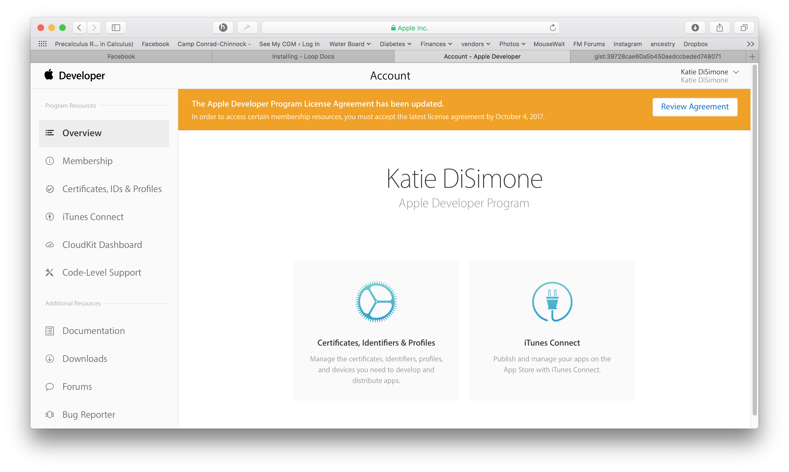

# Updating Loop

!!! green "Time Estimate"

    - 25 minutes, if already have updates done
    - 40-90 minutes, if need to install Apple update(s)

!!! info "Summary"

    1. Install macOS and Xcode updates based on your phone iOS
    2. Check your Developer Account
    3. Download Updated Loop code
    4. Recommended Actions 
        a. Delete old provisioning profiles 
        b. Clean cache and derived data 
    5. Build like normal
    6. Resolve Build Errors if needed

!!! faqs "FAQs"

    - **"What is an update?"** Anytime you want to change branches, add or change a customizations, or grab updates to the same branch you built before...that is an **update** of your Loop app.
    - **"Do I delete my old Loop app first?"** Definitely **not**! If you keep your Loop app on your phone, your Loop settings (and existing pod) will continue to work the same after the update. Seamless.
    - **"Do I need to start a new pod when I update?"** No. Your existing pod session will continue seamlessly if you are using the same Developer Account to sign the Loop app targets as you did the last time you built.
    - **"What if I'm using a new/different developer account?"** If you aren't building with the same developer account used when your existing app was built (this includes going from free to paid), then you will be installing a brand new (second) Loop app on your phone. Your existing pod won't work with the new app, so you might want to time this transition when you are due to change pods. Delete the old app once you get the new one all set up.
    - **"What if it is a new computer but the same developer account?"** No big deal...repeat Build Steps 1, 8 and 9 with your new computer.

## When to Update Loop

The apps built and signed by you in Xcode with a paid developer account will only last for 12 months before they expire and need rebuilding. So, at least once per year you will have to rebuild your app and go through this update process.

Under ordinary circumstances, you do not *have to* update your Loop app until you are ready to grab new features. However, we encourage regular updates when a new version is released because they often contain bug fixes or improvements which may increase operational stability. Also, if you have updated your phone iOS since the last build, you should download a new copy of the code.

The Loop Developers strongly encourage you to update to Loop v2.2.6 (released Sep 6, 2021) as soon as possible. Please check out [Branch FAQs for v2.2.6](../faqs/branch-faqs.md#loop-v226)

## Step 1: Install macOS and Xcode updates

!!! warning "Verify macOS"

    Between Loop app builds, there's a high likelihood that Apple has updated one or more of the systems involved in your Loop app. If you don't have the minimum macOS, you cannot build on that phone. (Note, the current macOS will build the Loop app for all these iOS versions.)

    - For iOS 14.5 and higher, minimum is macOS 11.x (Big Sur)
    - For iOS 14.0 to 14.4.x, minimum is macOS 10.15.4 (Catalina)
    - For iOS 13.4 through 13.7, minimum is macOS 10.15.2 (Catalina)
    - For iOS 13.0 through 13.2, minimum is macOS 10.14.4 (Mojave)
    - For iOS 12.4, minimum is macOS 10.14.3 (Mojave)

!!! green "Verify Xcode"

    Now that you have updated your macOS, you should have the ability to see the most recent version of Xcode. The information for which Xcode is required is found in [Build Step 8](step8.md#how-do-all-the-minimum-versions-relate-to-each-other).  (It's not repeated because that way we only have to update it on one page.  In the time of rapid iOS changes, that's the best way to keep the information accurate.)

    If you see that you need to update (and you probably do), then keep following instruction on that page and the next one (Build Step 9) and then return to this page.

!!! info "Follow Build Step 9 after updating Xcode"

        Make sure to restart your computer after updating Xcode and follow the instructions in Build Step 9. There's a known issue that happens often enough to be frustrating if you skip those steps. Either a build error about missing simulators or a "device not connected" (even when phone is connected). It's not always required...but this is a good easy ounce of problem prevention.

If you think you are immune from needing to update and want to skip Step 1 on this page, at least review the compatibility chart in Build Step 8 to make sure your macOS and Xcode meet their minimums based on your device's iOS before proceeding.  Many people try to build without meeting the minimum versions - don't be that person.

## Step 2: Check your Developer Account

Apple updates its License Agreement for the Developer Program frequently. You need to login to your [developer account](https://developer.apple.com/account/) to manually check if there is a new agreeement to accept.  If you see a big red or orange banner across the top of your Developer Account announcing a new license agreement like shown below...please read and accept it before building Loop.

## Step 3: Download Updated Loop Code

After you've finished the updates to your devices listed above, you can move onto downloading updated Loop code. You will not be simply using your old downloaded Loop code (and in fact, you can delete those old folder(s) now if you want).

!!! info "Where is the old folder?"

    It may have been almost a year since your last download and maybe you don't remember where you put the folder. You might not have followed these [directions](step13.md#store-and-name-your-download-properly), but it may help you to find the old folder(s).

    It is always best to do a fresh download. Some people prefer to rename the last build folder old-Loop until the new one is working, and then delete it.

There is a fast and easy menu-driven script available to build Loop that works once you've updated your macOS and Xcode to versions compatible with your iPhone iOS.  It works for the latest release of master (v2.2.6). The [Build Select Script](https://www.loopandlearn.org/build-select/) webpage has instructions on how to use the script. That script allows you to perform the rest of the steps on this page with a menu-driven interface. Before you head over there, finish reading this page so you understand all the steps that are needed. The steps are explained again over there, but not in quite so much detail.

!!! info "Build Select Folders"

    If you used the build select method last time, the folders will be in a slightly different place.  The build select script uses a folder in Downloads call BuildLoop.  Underneath BuildLoop there will be one or more folders with the name of the Loop branch/fork you built and a date.  For example: Downloads/BuildLoop/Loop-master-210822-2203 is the name of my folder from August 22, 2021 at 10:03 pm local time.  If I wanted to discard that download, I would delete the entire Loop-master-210822-2203 folder.

If you prefer the zip download method, follow the links from [Build Step 13](step13.md#download-loop), then return to this page.

## Step 4a: Delete old provisioning profiles

### Infrequent Builder, App Expires soon

If your app will expire soon or you build infrequently, then [Delete Profiles](updating.md#delete-profiles). Not sure when your app expires? Here are instructions to check your [Loop Expiration Date](https://www.loopandlearn.org/loop-expiration-date/).

### Frequent Builder

If you build frequently, you do not need to delete the profiles every time. One user reported deleting profiles gave a [Revoke Certificate](updating.md#revoke-certificate-issue) message - follow the link to see other reasons why that might happen.

### Background Information

Older versions of Xcode used to automatically create a new "provisioning profile" as part of the Loop building process. That provisioning profile, among other things, sets the expiration date for your app. If you sign with a paid team, that profile is set to expire in 12 months. If you sign with a free team, that profile is set to expire in 7 days.

You can always check the expiration date immediately after a successful build of your loop app by clicking the little "i" icon next the "Provisioning Profile" line in the target signing area. Add 12 months to the "created" date (paid account), or 7 days (free account), and you'll have your app's date of future spontaneous death, which you can record in your calendar.

{width="850"}
{align="center"}

Here's what started happening about September 2019 with Xcode 11, the provisioning profiles were being reused so the date was not updated each time you built. This change resulted in many people's apps expiring unexpectedly (and therefore dying suddenly) starting in September 2020 despite having updated/rebuilt recently and having current developer accounts (either manually renewed or automatically renewed, doesn't matter).

Once you follow the steps in the orange box below, Xcode will have no memory of the old provisioning profiles and will be forced to create a brand new one with the next Loop build. Therefore, you'll get a brand spanking new "created" date that will match the build date.  Simple and straight-forward. (Leave Terminal app open to do Step 4b afterwards too.)

### Delete Profiles

!!! warning "How to delete old provisioning profiles"
    - Find your Terminal app (search in Applications)
    - Open your Terminal app
    - Copy and paste the line in the little grey box below into the Terminal prompt. Press enter after you paste it.

    `rm ~/Library/MobileDevice/Provisioning\ Profiles/*.mobileprovision`
      You won't see anything special after you enter the command...your Terminal screen should look as boring as shown below when successful.

    {width="650"}
    {align="center"}

### Revoke Certificate Issue

What does it look like if you run into the Revoke Certificate message? When you prepare to Sign the Targets with Xcode, you'll see the message highlighted in the figure below.  

 
{width="850"}
{align="center"}

More information is shown in the orange box below.

!!! warning "Revoke certificate"
    The important part of this message is:

    * ". . . signing certificate . . . private key is not installed in your keychain . . ."

    **WAIT - You might not need to revoke your certificate**

    1. You might get this if you logged in as a different user, have a new computer or if your computer had to undergo a factory reset
        * You can transfer your keychain to your new computer (or just revoke and keep going)
        * To transfer your keychain, check this [Apple Documentation Link](https://help.apple.com/xcode/mac/current/#/dev8a2822e0b)
    1. Your version of Xcode is way out-of-date
        * Mentors have seen this with people trying to build with Xcode 11.4 or earlier
        * Update [Xcode](step8.md) to the most recent version

    **If you revoke and keep going:**

    * If you do hit Revoke Certificate, you'll be given a new one
    * Even with the new certificate, your Apple Developer ID is not affected
    * You can re-build on the existing Loop app on your device(s) and maintain all your settings with the new certificate.

    Be aware that you will have to rebuild to every device that used the certificate you just revoked and if you have other apps built with this certificate, they will stop working too.

## Step 4b: Clean cache and derived data

This may not be necessary, but it is one of the first steps to try if you do get a build error. Since you already have Terminal app open, you can prevent one of the possible sources of build errors in advance by cleaning out straggler data from previous Loop builds.

!!! green "Clean cache and derived data"

    Using Terminal app that should still be open from Step 4a

    1. Copy and paste this command and press return: `rm -rf ~/Library/Caches/org.carthage.CarthageKit` Note: you won't see any message back if the command runs successfully.  
    2. Copy and paste this command and press return: `rm -rf ~/Library/Developer/Xcode/DerivedData` Note: you won't see any message back if the command runs successfully.
      You won't see anything special after you enter the commands...your Terminal screen should look as boring as it did in the previous step 4a.

    {width="650"}
    {align="center"}

## Step 5: Build like normal

From here, go straight to [Step 14 Build Loop app](step14.md) and do just like you did the first time. Open the new Loop code that you just downloaded a couple steps above, plug in the phone, select your phone, sign four targets, code customizations (if wanted), and then build button. Easy peasy.

!!! danger "Add a Calendar Reminder"

    - It is good practice to add a reminder to your calendar when the app will expire (7 days or 1 year).
    - Be sure to add an alert to that reminder so you have enough time to do all the [Loop Updating](updating.md) steps to build the app again before it expires

!!! info "Double check expiration date"

    If you want to make sure that step 4 above (deleting the provisioning profiles) went well, check the "created" date on your provisioning profile after you sign your Loop target for this rebuild. It should have the current date as the "created" date and your Loop app, if you successfully build, will function for 12 more months (for paid accounts) so long as you keep your developer account paid/automatically renewed.

    To find out expiration date later, read [Loop App Expiration Date](../operation/features/notifications.md#loop-app-expiration-date).

## Step 6: Resolve Build Errors if needed

!!! green "Check Build Errors Page"

    If you get a build error, check the [Build Errors page](build_errors.md). You might be able to resolve it yourself.

    Even if your exact error isn't there, the information you need to provide when asking for help is listed on that page. And that information is critical to allow mentors to help troubleshoot your build error.
