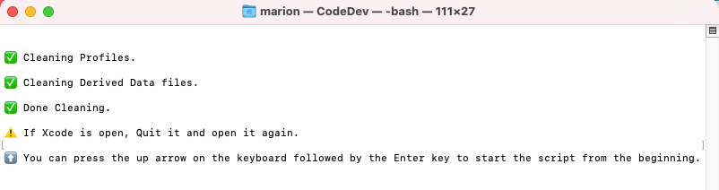

# Updating Loop

!!! info "Time Estimate"

    - 25 minutes, if Xcode and macOS are already updated to support the current or desired iOS
    - up to 2 days, if need to install macOS and / or Xcode update(s)

!!! abstract "Summary"

    Summary of tasks to prepare for and update your app:

    * Determine required macOS and Xcode version based on your phone iOS
        * If necessary, update first macOS and then Xcode
    * Check your Developer Account
    * Delete provisioning profiles (ensure a year)
    * Download Updated Loop code and Build Loop

    In each of the sections below, follow links to sections of other build pages then hit the back button on your browser to return to this page.

!!! question "FAQs"

    - **"What is an update?"** Anytime you want to change versions or if the app is about to expire, follow the instructions on this page.
    - **"Do I delete my old Loop app first?"** Definitely **not**! If you keep your Loop app on your phone, your Loop settings (and existing pod) will continue to work the same after the update. Seamless.
    - **"Do I need to start a new pod when I update?"** No. Your existing pod session will continue seamlessly if you are using the same Developer Account to sign the Loop app targets as you did the last time you built.
    - **"What if I'm using a new/different developer account?"** If you aren't building with the same developer account used when your existing app was built (this includes going from free to paid), then you will be installing a brand new (second) Loop app on your phone. Your existing pod won't work with the new app, so you might want to time this transition when you are due to change pods. Delete the old app once you get the new one all set up.
    - **"What if it is a new computer but the same developer account?"** No big deal...use the Updating Steps to check that your new computer has the required compatible versions and then build your app. This will include installing Xcode, configuring Xcode preferences, and adding your Developer ID to Xcode: refer to [What about a New Computer?](#what-about-a-new-computer). There is no need to delete provisioning profiles on a brand new computer, but no harm comes from following the instruction. And if your computer uses an M1 or M2 chip, follow the instructions [Configure Terminal App for Rosetta](step1.md#configure-terminal-app-for-rosetta).

## When to Update Loop

Under ordinary circumstances, you do not *have to* update your Loop app until it expires (1 year for a paid account). However, we encourage regular updates when a new version of iOS, or of Loop, is released because they often contain bug fixes or improvements which may increase operational stability.

### iOS Updates

Under ordinary circumstance, updating the iOS on your phone does not require a rebuild of the app on your phone. However, it's important to be prepared in case of an emergency, such as a lost phone.

!!! abstract "Best Practice"

    It is good practice to first check if your computer (macOS or Xcode) will require an update to support building Loop to your phone BEFORE applying an iOS update to your Looping phone.

    Follow these "safe Looping" steps for updating your iOS:

    1. Check which [version of macOS and Xcode](step8.md#how-do-all-the-minimum-versions-relate-to-each-other) is required for the phone iOS you intend to install.
    1. [Update macOS / Xcode if needed](#macos-and-xcode-versions)
    1. Check [Loop: Current Release](../version/releases.md#current-release) status - if there is new code, you should download it
    1. Build app to your iPhone
    1. Then update your iPhone iOS

[Loop Releases](../version/releases.md#loop-releases) provides information about current and previous Loop versions.

Updating to iOS 16 (watchOS 9) requires enabling [Developer Mode](step14.md#developer-mode). Your existing app will not open until you take this step. Once enabled, the app opens again. A rebuild is **not** required.

!!! warning "iOS 15 Warning - Check Before You Update"

    DO NOT INSTALL iOS 15 on your phone without first [updating](#when-to-update-loop) Loop if the Xcode version used to build your Loop app is 12D or earlier - the Loop app will stop working and you will have to rebuild Loop.

    Follow this link, [Xcode version](../faqs/update-faqs.md#how-can-i-confirm-xcode-version-i-used), for instructions to determine what version was used when building the Loop app currently on your phone.

### "Loop" is No Longer Available

The apps built and signed by you in Xcode with a paid developer account will last for 12 months; then they expire and must be rebuilt. At least once per year you will have to rebuild your app and go through this update process. If you do not update and the "provisioning profile" on your phone expires, you will see the "Loop" is No Longer Available message. You will be given multiple [Loop App Expiration Notifications](../operation/features/notifications.md#loop-app-expiration-notification) on the Loop phone, but might miss them if you are a caregiver.

When you see "Loop" is No Longer Available on your phone, the only solution is to rebuild the app.  All of your settings are still present on your phone, but your "provisioning profile" expired and you need to generate a new one. Once you build Loop on your phone, following the instructions on this page, all your settings will be maintained - assuming you build with the same [Apple Developers ID](../faqs/FAQs.md#what-happens-when-i-switch-apple-developer-id) that was used initially.

!!! warning "Provisioning Profiles"
    Be aware that if you build an app using Xcode without first deleting provisioning profiles, you might not have one year on that app. It is the expiration date of the provisioning profile on your computer that determines when the app expires.

## Build Video

The Loop and Learn team prepared this [YouTube video](https://youtu.be/gddhljzsNkM) showing how to prepare for an update and build Loop Master. We recommend reading the written directions below before (and while) watching the video.

## macOS and Xcode Versions

### Determine Required Xcode and macOS Versions

Between Loop app builds, there's a high likelihood that Apple has updated one or more of the systems involved in your Loop app. If you don't have the minimum Xcode version required for your phone iOS, you cannot build on that phone. Sometimes you must also update the macOS version to allow you to use the required Xcode version.

Based on the iOS on your phone, or the iOS you plan to install on your phone, determine the required macOS and Xcode versions. Click on this  link [versions for iOS, macOS and Xcode](step8.md#how-do-all-the-minimum-versions-relate-to-each-other) to determine the versions needed and then hit the back button in your browser to finish the steps on this updating page.

!!! warning "First macOS and Then Xcode"
    Your macOS must meet the minimum requirement for the Xcode version you need to support your current iOS as detailed in that link above.

    * If the macOS is too old, the Xcode version will not appear in the App Store
    * You might think you don't need to update Xcode (but you do)
    * Your build will fail and mentors might need to help you

    Don't be that person. Follow the directions.

Minimum means you need to have at least that version - newer versions build just fine.

### Verify / Update macOS

* Click on this link [Check your macOS Version](step1.md#check-your-macos-version) and follow the instructions on that page if an update is required.
* After you've reviewed that section, hit the back button on your browser to return here

### Verify / Update Xcode

Click on this link [Check your Xcode Version](step9.md#xcode-version) to find your Xcode version number.

If you need to update your Xcode, follow the instructions at this link [Install Xcode](step8.md#install-xcode) and continue through [Xcode Preferences](step9.md).

Advanced users: If you are finding installation of Xcode from the App Store incredibly slow, try the alternate method of [Direct Download of Xcode](#direct-download-of-xcode).

!!! warning "Direct Download"

    - If you previously did a direct download of Xcode, it might not show up in the App Store.
    - Either do another direct download or follow these directions in the Direct Download section to reconfigure so it will show up in the App Store.
        - [Direct Download of Xcode](updating.md#direct-download-of-xcode)

#### What about a New Computer?

Make sure your new computer has the macOS and Xcode required by your phone iOS. Be sure Xcode [Command Line Tools](step9.md#command-line-tools) are installed and that you [Add Apple ID](step9.md#add-apple-id) to Xcode.

If your computer uses an M1 or M2 chip, follow the instructions [Configure Terminal App for Rosetta](step1.md#configure-terminal-app-for-rosetta).

#### Missing Xcode or Command Line Tools

!!! warning "WARNING"

    If you fail to have [Xcode](step8.md) or [Xcode Command Line Tools](step9.md) installed, you will get one of these errors (or something similar) when you attempt to run the Build Select Script:

    * xcrun: error: invalid active developer path (/Library/Developer/CommandLineTools), missing xcrun at: /Library/Developer/CommandLineTools/usr/bin/xcrun
    * xcrun: error: active developer path ("/Applications/Xcode.app/Contents/Developer") does not exist
    * xcode-select: Failed to locate 'git', requesting installation of command line developer tools
    * xcode-select: error: tool 'xed' requires Xcode
    * Scripting Bridge could not launch application . . .

!!! abstract "Follow Xcode Preferences page after updating Xcode"

        Make sure to restart your computer after updating Xcode and follow the instructions on the Xcode Preferences page. There's a known issue that happens often enough to be frustrating if you skip those steps. It's not always required...but this is a good easy ounce of prevention step.

## Check your Developer Account

Apple updates its License Agreement for the Developer Program frequently. You need to login to your [developer account](https://developer.apple.com/account/) to manually check if there is a new agreeement to accept.  If you see a big red or orange banner across the top of your Developer Account announcing a new license agreement like shown below...please read and accept it before building Loop.


## Delete Provisioning Profiles

In order to ensure a full year of use for your Loop app, you need to delete any existing provisioning profile(s) from your computer. It is the expiration date of the provisioning profile on your computer that determines when the app expires.

!!! tip "Manual Delete of Provisioning Profiles"

    If you are comfortable pasting commands into the terminal, you can delete the provisioning profiles by copying and pasting this command into a terminal window.

    ``` title="Copy and Paste to remove Provisioning Profiles"
    rm ~/Library/MobileDevice/Provisioning\ Profiles/*.mobileprovision
    ```

    If you did the manual delete, skip ahead to [Ready To Build Loop](#ready-to-build-loop).

### Build Select Utilities

You can delete the old provisioning profiles with the same Build Select Script you will use to download and build new code.

#### Open Terminal

Go to the Finder app, click on Applications, then open the Utilities folder.  Locate the Terminal app and double-click Terminal to open a terminal window. The terminal window is very plain looking when you open it. That is normal.

#### Load the Paste Buffer

Copy the line below that starts with `/bin/bash` by hovering the mouse near the bottom right side of the text and clicking the copy icon (should say Copy to Clipboard when you hover over it). When you click the icon, a message that says “Copied to Clipboard” will appear on your screen.

``` title="Run the Build Select script to Clean Profiles & Derived Data"
/bin/bash -c "$(curl -fsSL https://raw.githubusercontent.com/loopnlearn/LoopBuildScripts/main/BuildLoop.sh)"
```

Paste the line of text into Terminal. Be sure to click anywhere in the terminal before trying to paste. (Ways to paste: CMD-V; or CNTL-click and select from menu or Edit-Paste at top of Mac screen.) Once the line is pasted, hit return to execute the script.

#### Utilities

Each graphic below shows the number you are instructed to type to proceed through the script and reach the utility menu. The words on this page also tell you what to type. Note there are several options in Utilities, you only need to use one to delete provisioning profiles. See the [Loop and Learn: Build Select Script](https://www.loopandlearn.org/build-select) webpage for additional information.

When running this script:

- If you do not have Xcode and Xcode command line tools installed - you will get errors.
- If you have Xcode open, you may get errors.

Read the screen (shown below).  Type 1 and return if you understand the warning and agree.

{width="700"}
{align="center"}

* Please read what is on the screen as you progress.
* Adjust font size as directed if you have difficulty seeing the directions.

Next you will see an introduction to the Build Select script.  Please read this.  To run the Utilities, you will type 3 (as shown in the graphic below) and return.

{width="700"}
{align="center"}

Next you are asked which Utility option you want to run.  You may need to scroll up to see the entire message shown in the graphic below. Type 3 to select Clean Profiles.

{width="700"}
{align="center"}

Once this completes, you should see this in your terminal.

{width="750"}
{align="center"}

## Ready to Build Loop

As long as there are no errors, you are now ready to proceed to one of these pages:

* Released Loop Code: [Build the Loop App: Developer Mode](step14.md#developer-mode)
* Development Loop Code: [Loop-dev](step13.md)

After building the new app, you may choose to return to this page and follow the instructions to [Delete Old Copies](#delete-old-copies). This is optional, but cleans up space on your computer.

## Delete Old Copies

This step is optional, but if your computer is low on space, it helps to clean up old downloads your are no longer using.

When you update, you no longer need to keep old copies of the code on your computer. If you want to clean up space, you can delete those old folder(s) now if you want.

!!! abstract "Where is the old folder?"

    Assuming you used the Build Select Script, your downloads are in the ~/Downloads/BuildLoop folder as shown in the graphic below. If you are tight on space, the older folders can be deleted.  Best practice, download fresh and build Loop; and then go back and delete all but the most recent copy.  The nice thing about the Build Select script is it automatically generates the folder name with the date and time of the download. Delete each unwanted folder, one at a time.

    If you see a file (not a folder) in ~/Downloads/BuildLoop called LoopConfigOverride.xcconfig, keep that around. If you delete it, you'll need to recover it from the trash, regenerate it (if you know how) or sign your targets manually for your current download.

    The Scripts folder can also be left alone, but if you delete it, it is regenerated with the next use of the Build Select Script.

    

## Background Information

New Loopers do not need to read the rest of this page.

Experienced Loopers may wonder what happened to deleting derived data.

* Each workspace folder has a unique folder for storing derived data
* Deleting derived data across all Xcode workspaces and projects for a brand new download is not required to ensure a year for a given build
* The Clean Derived Data option in the Utilities menu can be required for some special cases, but you probably won't need it

#### Infrequent Builder, App Expires soon

If your app will expire soon or you build infrequently, then delete provisioning profiles every time you build. Not sure when your app expires? Here are instructions to check your [Loop Expiration Date](https://www.loopandlearn.org/loop-expiration-date/).

#### Frequent Builder

If you build frequently, you do not need to delete the profiles every time. One user reported deleting profiles gave a [Revoke Certificate](updating.md#revoke-certificate-issue) message - follow the link to see other reasons why that might happen.

#### Revoke Certificate Issue

What does it look like if you run into the Revoke Certificate message? When you prepare to Sign the Targets with Xcode, you'll see the message highlighted in the figure below.

<br/>
{width="850"}
{align="center"}

More information is shown in the orange box below.

!!! warning "Revoke certificate"
    The important part of this message is:

    * ". . . signing certificate . . . private key is not installed in your keychain . . ."

    **WAIT - You might not need to revoke your certificate**

    1. You might get this if you logged in as a different user, have a new computer or if your computer had to undergo a factory reset
        * You can transfer your keychain to your new computer (or just revoke and keep going)
        * To transfer your keychain, check this [Apple Documentation Link](https://help.apple.com/xcode/mac/current/#/dev8a2822e0b)
    1. Your version of Xcode is way out-of-date
        * Mentors have seen this with people trying to build with Xcode 11.4 or earlier
        * Update [Xcode](step8.md) to the most recent version

    **If you revoke and keep going:**

    * If you do hit Revoke Certificate, you'll be given a new one
    * Even with the new certificate, your Apple Developer ID is not affected
    * You can re-build on the existing Loop app on your device(s) and maintain all your settings with the new certificate.

    Be aware that you will have to rebuild to every device that used the certificate you just revoked and if you have other apps built with this certificate, they will stop working too.


## Direct Download of Xcode

Many people find updating Xcode from the App Store to be incredibly slow - especially when a new version has just been released.  This method still takes time and enough space on your disk, but is faster than going through the App Store.  Depending on your internet speed, this download can be done in about an hour. Then once it is downloaded, expect another fifteen minutes to several hours (depending on the speed of your computer) for the "xip" file to "expand".

The instructions do not hold your hand.

* Your macOS must be at the minimum verion (or newer) to support the version of Xcode you're about the download
* You need to know how to log into your Apple Developer account and navigate those menus
* You need to know how to use Finder to navigate to Downloads
* You need to know how to drag the Xcode icon into your Applications folder (after download and expand completes)
* After you have done a direct download, the App Store will not show you updates
    - Either repeat the Direct Download or
    - Delete Xcode from Applications folder
        - Open the App Store and search for Xcode
        - Install fresh
        - After you use the App Store for a download, then Updates will show in the future

Here are the different steps you need to follow doing the Direct Download instead of the App Store method:

1. [Login to your Apple developer account](https://developer.apple.com/account)
    - Examine the menus (on my computer there are buttons on the left hand side)
    - Click on Downloads (under Additional Resources)
    - Look at menu items (on my computer there are buttons at the top) that say Beta, Release, Profiles and Logs, and More
    - Click on More
    - Scroll down until you find the item you want (for example, Xcode 13)
    - Click on View Details and click on the Download button for the "xip" file
1. Wait for Download to complete
1. Expand the file by clicking on it in Finder
1. Move the Xcode icon to Applications after the expansion completes
1. Check the [Command Line Tools](step9.md#command-line-tools) setting under Xcode->Preferences
    - The selection cannot be blank or Build-Script will fail to open Xcode automatically
    - It should be the same version as your Xcode
1. Reboot the computer
